```{r setup, include=FALSE}
knitr::opts_chunk$set(echo = TRUE)
```

<style>
slides > slide { overflow: scroll; }
slides > slide:not(.nobackground):after {
  content: '';
}
</style>

## Chapter Overview

This chapter covers:

- Foundation for the rest of the book.
- Write your first search algorithm (binary search).
- Learn about the running time of an algorithm (Big O notation).

## Introduction

- An algorithm is a set of instructions for accomplishing a task.
- Algorithms chosen in this book (for inclusion) because they're fast, or they solve interesting problems, or both.
- The good news is, an implementation of every algorithm in this book is probably available in your favorite language, so you don’t have to write each algorithm yourself! 
- But, those implementations are useless if you don’t understand the trade-offs. 
- In this book, you’ll learn to compare trade-offs between different algorithms

## Binary Search [1/2]
 
- Suppose you’re searching for a word in a dictionary, and it starts with K.
- You could start at the beginning and keep flipping pages until you get to the Ks. 
- But you’re more likely to start at a page in the middle, because you know the Ks are going to be near the middle of the dictionary.


## Binary Search [2/2]

- This is a search problem.
- Binary search is an algorithm; its input is a **sorted** list of elements. 
- If an element you’re looking for is in that list, binary search returns the position where it’s located. Otherwise, binary search returns ``null``.

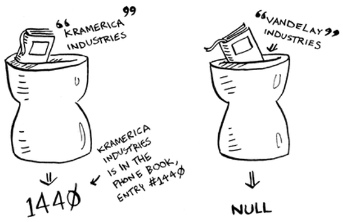

## A Simpler Search (Problem) Example


- I’m thinking of a number between 1 and 100.
- You have to try to guess my number in the fewest tries possible. 
- With every guess, I’ll tell you if your guess is too low, too high, or correct.

## Simple Search Way

- Suppose you start guessing like this: 1, 2, 3, 4 .... 
- Here’s how it would go.

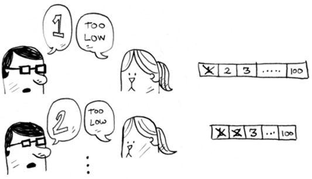
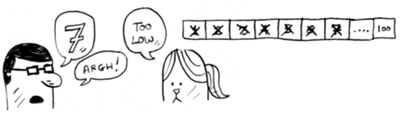

- This is simple search (maybe stupid search would be a better term). 
- With each guess, you’re eliminating only one number. 
- If my number was 99, it could take you 99 guesses to get there!

## A Better Way to Search (Binary Search)

- Here’s a better technique. 
- Start with 50.

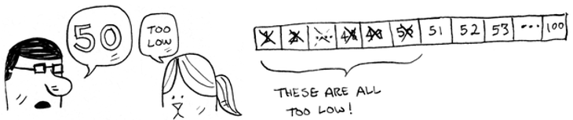

- Too low, but you just eliminated half the numbers! 
- Now you know that 1–50 are all too low. Next guess: 75.

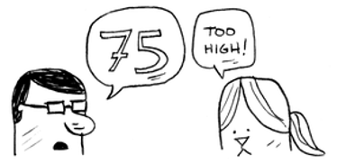

- Too high, but again you cut down half the remaining numbers! 
- **With binary search, you guess the middle number and eliminate half the remaining numbers every time.**
- Next is 63 (halfway between 50 and 75).

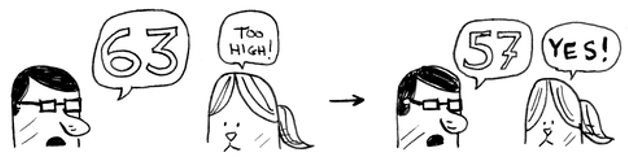

## Binary Search Performance Explained [1/3]

- This is binary search. You just learned your first algorithm! 
- Here’s how many numbers you can eliminate every time.

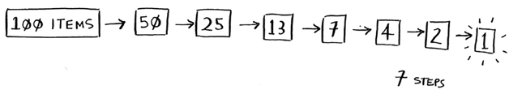

- Eliminate half the numbers every time with binary search.
- Whatever number I’m thinking of, you can guess in a maximum of seven guesses—because you eliminate so many numbers with every guess!

## Binary Search Performance Explained [2/3]

- Suppose you’re looking for a word in the dictionary. The dictionary has 240,000 words. 
- In the worst case, how many steps do you think each search will take?

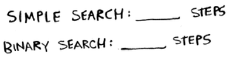

## Binary Search Performance Explained [3/3]

- Simple search could take 240,000 steps if the word you’re looking for is the very last one in the book. 
- With each step of binary search, you cut the number of words in half until you’re left with only one word.

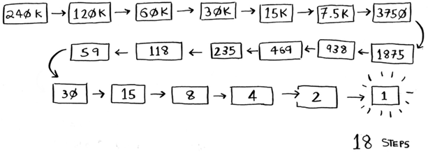

- So binary search will take 18 steps—a big difference! 
- In general, for any list of $n$, binary search will take $\log_2 n$ steps to run in the worst case, whereas simple search will take $n$ steps.


## Logarithms [1/2]

- Logs are the flip of exponentials.

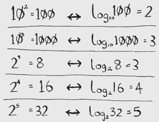

- In this book, when I talk about running time in Big O notation (explained a little later), $\log$ always means $\log_2$. 

## Logarithms [2/2]

- When you search for an element using simple search, in the worst case you might have to look at every single element. 
- So for a list of 8 numbers, you’d have to check 8 numbers at most.
- For binary search, you have to check $\log n$ elements in the worst case. 
- For a list of 8 elements, $\log 8 = 3$, because $2^3 = 8$. So for a list of 8 numbers, you would have to check 3 numbers at most. 
- For a list of 1,024 elements, $\log 1,024 = 10$, because $2^{10} == 1,024$. So for a list of 1,024 numbers, you’d have to check 10 numbers at most.

## Notes

- I’ll talk about log time a lot in this book, so you should understand the concept of logarithms. If you don’t, **Khan Academy** ([khanacademy.org](https://www.khanacademy.org/)) has a nice video that makes it clear.
- Binary search only works when your list is in **sorted order**. For example, the names in a phone book are sorted in alphabetical order, so you can use binary search to look for a name.

## Binary Search in Python [1/2]

- Let’s see how to write binary search in Python. 
- The code sample here uses arrays.
- You can store a sequence of elements in a row of consecutive buckets called an array.
- The buckets are numbered starting with 0: the first bucket is at position #0, the second is #1, the third is #2, and so on.
- The binary_search function takes a **sorted array** and an item. If the item is in the array, the function returns its position. 
- You’ll keep track of what part of the array you have to search through. 
- At the beginning, this is the entire array:

```{python, eval=FALSE}
low = 0
high = len(list) - 1
```
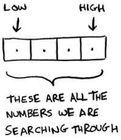

- Each time, you check the middle element:

```{python, eval=FALSE}
mid = (low + high) / 2
guess = list[mid]
```
- ``mid`` is rounded down by Python automatically if ``(low + high)`` isn’t an even number.
- If the guess is too low, you update ``low`` accordingly:

```{python, eval=FALSE}
if guess < item:
  low = mid + 1
```

- And if the guess is too high, you update ``high``.

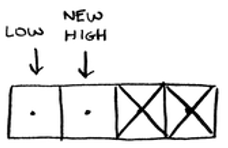

## Binary Search in Python [2/2]

- The book uses **Python 2** whereas in the class we use **Python 3**. There are few differences in the code.
- Here’s the full code:

```{python, eval=TRUE}
def binary_search(list, item):
  low = 0
  high = len(list)-1
  
  while low <= high:
    mid = (low + high) // 2
    guess = list[mid]
    if guess == item:
      return mid
    if guess > item:
      high = mid - 1
    else:
      low = mid + 1
  return None
  
  
my_list = [1, 3, 5, 7, 9]
print(binary_search(my_list, 3)) # => 1
print(binary_search(my_list, -1)) # => None
```

## Exercises (Binary Search)

Please refer to **page 9** of the textbook for exercises

## Running Time [1/2]

- Generally you want to choose the most efficient algorithm; whether you’re trying to optimize for time or space.
- Back to binary search. How much time do you save by using it? 
- Well, the first approach was to check each number, one by one. If this is a list of 100 numbers, it takes up to 100 guesses. If it’s a list of 4 billion numbers, it takes up to 4 billion guesses. 
- So the maximum number of guesses is the same as the size of the list. This is called **linear time**.
- Binary search is different. If the list is 100 items long, it takes at most 7 guesses. If the list is 4 billion items, it takes at most 32 guesses.
- Binary search runs in **logarithmic time** (or log time, as the natives call it). 

## Running Time [2/2]

Run times for search algorithms

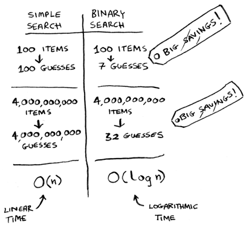

## Big O Notation

- Big O notation is special notation that tells you how fast an algorithm is.
- Who cares? Well, it turns out that you’ll use other people’s algorithms often—and when you do, it’s nice to understand how fast or slow they are. 
- In this section, I’ll explain what Big O notation is and give you a list of the most common running times for algorithms using it.

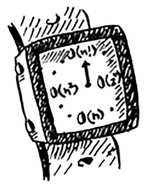

## Algorithm running times grow at different rates [1/6]

- Bob is writing a search algorithm for NASA. 
- His algorithm will kick in when a rocket is about to land on the Moon, and it will help calculate where to land.
- And Bob has only 10 seconds to figure out where to land.


## Algorithm running times grow at different rates [2/6]

- Bob is trying to decide between simple search and binary search. 
- The algorithm needs to be both fast and correct. 
- On one hand, binary search is faster. 
- On the other hand, simple search is easier to write, and there is less chance of bugs being introduced. And Bob really doesn’t want bugs in the code to land a rocket!

## Algorithm running times grow at different rates [3/6]

- Let’s assume it takes 1 millisecond to check one element.
- To be extra careful, Bob decides to time both algorithms with a list of 100 elements.
- With simple search, Bob has to check 100 elements, so the search takes 100 ms to run. 
- On the other hand, he only has to check 7 elements with binary search ($\log_2 100$ is roughly 7), so that search takes 7 ms to run.

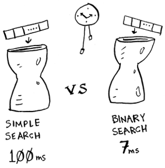

## Algorithm running times grow at different rates [4/6]

- But realistically, the list will have more like a billion elements.
- Bob runs binary search with 1 billion elements, and it takes 30 ms ($\log_2 1,000,000,000$ is roughly 30). 
- “Binary search is about 15 times faster than simple search, because simple search took 100 ms with 100 elements, and binary search took 7 ms. 
- So simple search will take 30 × 15 = 450 ms, right? Way under my threshold of 10 seconds.” 
- Bob decides to go with simple search. 
- **Is that the right choice?**

## Algorithm running times grow at different rates [5/6]

- No. Turns out, Bob is wrong. Dead wrong. 
- The run time for simple search with 1 billion items will be 1 billion ms, which is 11 days! 
- The problem is, the run times for binary search and simple search **don’t grow at the same rate**.

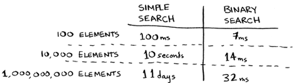

## Algorithm running times grow at different rates [6/6]

- As the number of items increases, binary search takes a little more time to run. But simple search takes a lot more time to run. 
- So as the list of numbers gets bigger, binary search suddenly becomes a lot faster than simple search.

- That’s why it’s not enough to know how long an algorithm takes to run—you need to know how the running time increases as the list size increases. 
- That’s where Big O notation comes in.

## Big O Notation Explained [1/2]

- Big O notation tells you how fast an algorithm is. 
- For example, suppose you have a list of size $n$. 
- Simple search needs to check each element, so it will take $n$ operations. The run time in Big O notation is $O(n)$. 
- Big O **doesn’t tell you the speed in seconds**. Big O notation lets you compare the number of operations. It tells you **how fast the algorithm grows**.


## Big O Notation Explained [2/2]

- Binary search needs log n operations to check a list of size $n$.
- What’s the running time in Big O notation? It’s $O_{(\log n)}$.
- In general, Big O notation is written as follows.

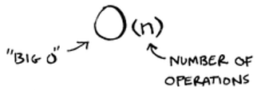

- This tells you the number of operations an algorithm will make. 
- It’s called Big O notation because you put a “big O” in front of the number of operations (it sounds like a joke, but it’s true!).

## Visualizing different Big O run times (another simple case study)

- Here’s a practical example you can follow at home with a few pieces of paper and a pencil.
- Suppose you have to draw a grid of 16 boxes.

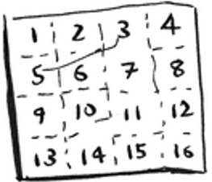

## Algorithm 1

- One way to do it is to draw 16 boxes, one at a time. 
- Remember, Big O notation counts the number of operations. 
- In this example, drawing one box is one operation. You have to draw 16 boxes. 
- How many operations will it take, drawing one box at a time?


- It takes 16 steps to draw 16 boxes. What’s the running time for this algorithm?

## Algorithm 2 [1/3]

- Try this algorithm instead. Fold the paper.


- In this example, folding the paper once is an operation. 
- You just made two boxes with that operation!

## Algorithm 2 [2/3]

- Fold the paper again, and again, and again.


- Unfold it after four folds, and you’ll have a beautiful grid! 


## Algorithm 2 [3/3]

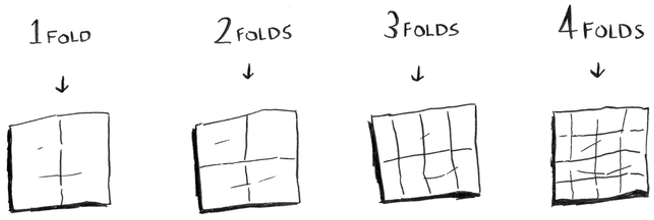


- Every fold doubles the number of boxes. You made 16 boxes with 4 operations!
- You can “draw” twice as many boxes with every fold, so you can draw 16 boxes in 4 steps. 
- What’s the running time for this algorithm? 
- Come up with running times for both algorithms before moving on.
- Answers: Algorithm 1 takes $O(n)$ time, and algorithm 2 takes $O(\log n)$ time.

## Big O establishes a worst-case run time [1/2]

- Suppose you’re using simple search to look for a person in the phone book. 
- You know that simple search takes $O(n)$ time to run, which means in the worst case, you’ll have to look through every single entry in your phone book. 
- In this case, you’re looking for Adit. This guy is the first entry in your phone book. So you didn’t have to look at every entry—you found it on the first try. 
- Did this algorithm take $O(n)$ time? Or did it take $O(1)$ time because you found the person on the first try?

## Big O establishes a worst-case run time [2/2]

- Simple search still takes $O(n)$ time. 
- In this case, you found what you were looking for instantly.  That’s the best-case scenario. 
- But **Big O notation** is about **the worst-case scenario**. 
- So you can say that, in the worst case, you’ll have to look at every entry in the phone book once. That’s $O(n)$ time. 
- It’s a reassurance—you know that simple search will never be slower than $O(n)$ time.

## Some common Big O run times [1/4]

Here are five Big O run times that you’ll encounter a lot, sorted from fastest to slowest:

- $O(\log n)$, also known as log time. Example: Binary search.
- $O(n)$, also known as linear time. Example: Simple search.
- $O(n * \log n)$. Example: A fast sorting algorithm, like quicksort (coming up in chapter 4).
- $O(n^2 )$. Example: A slow sorting algorithm, like selection sort (coming up in chapter 2).
- $O(n!)$. Example: A really slow algorithm, like the traveling sales person (coming up next!).

## Some common Big O run times [2/4]

- Suppose you’re drawing a grid of 16 boxes again, and you can choose from 5 different algorithms to do so. 
- You can do 10 operations per second.
- If you use the first algorithm, it will take you $O(\log n)$ time to draw the grid.  
- With O(log n) time, it will take you 4 operations to draw a grid of 16 boxes (log 16 is 4). So it will take you 0.4 seconds to draw the grid. 
- What if you have to draw 1,024 boxes? It will take you $\log 1,024 = 10$ operations, or 1 second to draw a grid of 1,024 boxes.
- These numbers are using the first algorithm.

## Some common Big O run times [3/4]

- The second algorithm is slower: it takes O(n) time. 
- It will take 16 operations to draw 16 boxes, and it will take 1,024 operations to draw 1,024 boxes. 
- How much time is that in seconds?

## Some common Big O run times [4/4]

- Here’s how long it would take to draw a grid for the rest of the algorithms, from fastest to slowest:

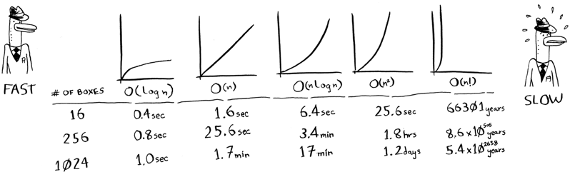

- There are other run times, too, but these are the five most common.
- This is a simplification. In reality you can’t convert from a Big O run time to a number of operations this neatly, but this is good enough for now.

## Big O Notation (recap)

For now, the main takeaways are as follows:

- Algorithm speed isn’t measured in seconds, but in growth of the number of operations.
- Instead, we talk about how quickly the run time of an algorithm increases as the size of the input increases.
- Run time of algorithms is expressed in Big O notation.
- $O(\log n)$ is faster than $O(n)$, but it gets a lot faster as the list of items you’re searching grows.

## Exercises (Big O Notation)

Please refer to **page 17** of the textbook for exercises

## The Traveling Salesperson Problem [1/6]

- You might have read that last section and thought, “There’s no way I’ll ever run into an algorithm that takes O(n!) time.” 
- Well, let me try to prove you wrong! 
- Here’s an example of an algorithm with a really bad running time. 
- This is a famous problem in computer science, because its growth is appalling and some very smart people think it can’t be improved. 
- It’s called **the traveling salesperson problem**.

## The Traveling Salesperson Problem [2/6]

You have a salesperson


## The Traveling Salesperson Problem [3/6]

The salesperson has to go to five cities

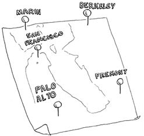

## The Traveling Salesperson Problem [4/6]

- This salesperson, whom I’ll call Opus, wants to hit all five cities while traveling the minimum distance. 
- Here’s one way to do that: look at every possible order in which he could travel to the cities.

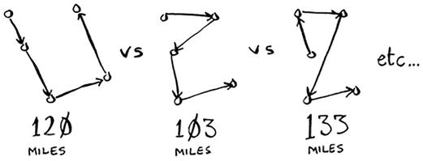

## The Traveling Salesperson Problem [5/6]

- He adds up the total distance and then picks the path with the lowest distance. 
- There are 120 permutations with 5 cities, so it will take 120 operations to solve the problem for 5 cities. 
- For 6 cities, it will take 720 operations (there are 720 permutations). 
- For 7 cities, it will take 5,040 operations!

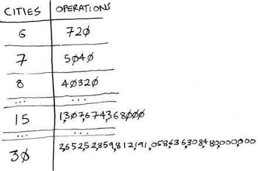

## The Traveling Salesperson Problem [6/6]

- In general, for $n$ items, it will take $n!$ ($n$ factorial) operations to compute the result. 
- So this is $O(n!)$ time, or factorial time. 
- It takes a lot of operations for everything except the smallest numbers. 
- Once you’re dealing with 100+ cities, it’s impossible to calculate the answer in time.
- This is a terrible algorithm! Opus should use a different one, right? 
- But he can’t. This is one of the unsolved problems in computer science.
- There’s no fast known algorithm for it, and smart people think it’s impossible to have a smart algorithm for this problem. 
- The best we can do is come up with an approximate solution.

## Recap

- Binary search is a lot faster than simple search.
- $O(\log n)$ is faster than $O(n)$, but it gets a lot faster once the list of items you’re searching through grows.
- Algorithm speed isn’t measured in seconds.
- Algorithm times are measured in terms of growth of an algorithm.
- Algorithm times are written in Big O notation.

