```{r setup, include=FALSE}
knitr::opts_chunk$set(echo = TRUE)
```

<style>
slides > slide { overflow: scroll; }
slides > slide:not(.nobackground):after {
  content: '';
}
</style>


## Chapter Overview

This chapter covers:

- Learn about arrays and linked lists; two of the most basic data structures.
- Learn your first sorting algorithm: selection sort

## How memory works [1/4]

- Imagine you go to a show and need to check your things
- A chest of drawers is available.

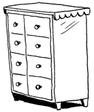

## How memory works [2/4]

- Each drawer can hold one element. 
- You want to store two things, so you ask for two drawers.

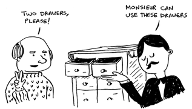

## How memory works [3/4]

- You store your two things here.

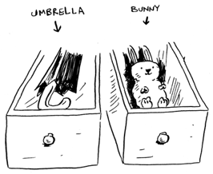

## How memory works [4/4]

- This is basically how your computer’s memory works. 
- Your computer looks like a giant set of drawers, and each drawer has an address.

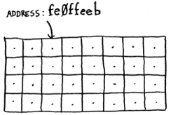

- Each time you want to store an item in memory, you ask the computer for some space, and it gives you an address where you can store your item.

## Arrays [1/4]

- Sometimes you need to store a list of elements in memory. 
- Suppose you’re writing an app to manage your todos. 
- You’ll want to store the todos as a list in memory.


## Arrays [2/4]

- Let’s store the todos in an array.
- Using an array means all your tasks are stored contiguously (right next to each other) in memory.

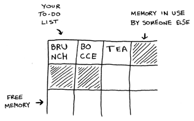

## Arrays [3/4]

- Now suppose you want to add a fourth task. But the next drawer is taken up by someone else’s stuff!

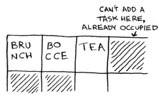

- You have to move to a new spot where you all fit. 
- In this case, you need to ask your computer for a different chunk of memory that can fit four tasks. Then you need to move all your tasks there.

## Arrays [4/4]

- Adding new items to an array can be a big pain. 
- If you’re out of space and need to move to a new spot in memory every time, adding a new item will be really slow.
- One easy fix is to “hold seats”: even if you have only 3 items in your task list, you can ask the computer for 10 slots, just in case. Then you can add 10 items to your task list without having to move.
- But you should be aware of a couple of downsides:
    + You may not need the extra slots; that memory will be wasted. You aren’t using it, but no one else can use it either.
    + You may add more than 10 items to your task list and have to move anyway.
    
## Linked lists [1/2]

- With linked lists, your items can be anywhere in memory.

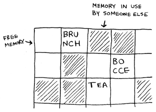

## Linked lists [2/2]

- Each item stores the address of the next item in the list. 

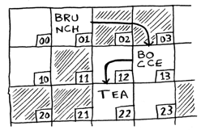

- Adding an item to a linked list is easy: you stick it anywhere in memory and store the address with the previous item.
- With linked lists, you never have to move your items.

## Arrays v.s. Linked List [1/2]

- Suppose you want to read the last item in a linked list. 
- You can’t just read it, because you don’t know what address it’s at. Instead, you have to go to item #1 to get the address for item #2. Then you have to go to item #2 to get the address for item #3. And so on, until you get to the last item. 
- Linked lists are great if you’re going to read all the items one at a time: you can read one item, follow the address to the next item, and so on. 
- But if you’re going to keep jumping around, linked lists are terrible.

## Arrays v.s. Linked List [2/2]

- Arrays are different. You know the address for every item in your array.
- Suppose your array contains five items, and you know it starts at address 00. 
- What is the address of item #5? Simple math tells you: it’s 04.

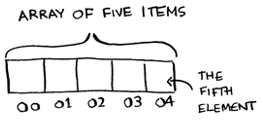

- Arrays are great if you want to read random elements, because you can look up any element in your array instantly. 
- With a linked list, the elements aren’t next to each other, so you can’t instantly calculate the position of the fifth element in memory.

## Terminology

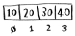

- The position of an element is called its index. 
- So instead of saying, "20 is at position 1", the correct terminology is, "20 is at index 1". 
- I’ll use index to mean position throughout this book.

## Exercises (Arrays and Linked Lists)

Please refer to **page 28** of the textbook for exercises

## Inserting into the middle of a list [1/4]

- Suppose you want your todo list to work more like a calendar. 
- Earlier, you were adding things to the end of the list.
- Now you want to add them in the order in which they should be done.

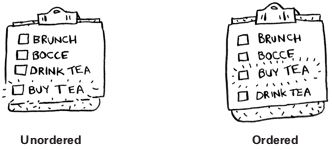

## Inserting into the middle of a list [2/4]

- What’s better if you want to insert elements in the middle: arrays or lists? 
- With lists, it’s as easy as changing what the previous element points to.

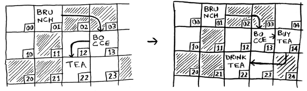

## Inserting into the middle of a list [3/4]

- But for arrays, you have to shift all the rest of the elements down.
- And if there’s no space, you might have to copy everything to a new location! 
- Lists are better if you want to insert elements into the middle.

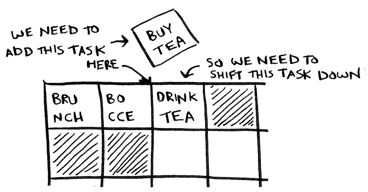

## Inserting into the middle of a list [4/4]

Here are the run times for insertion on arrays and lists.

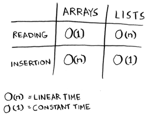


## Deletions [1/2]

- What if you want to delete an element? 
- Lists are better, because you just need to change what the previous element points to. 
- With arrays, everything needs to be moved up when you delete an element.
- Unlike insertions, deletions will always work. 
- Insertions can fail sometimes when there’s no space left in memory. But you can always delete an element.

## Deletions [2/2]

- Here are the run times for deletion on arrays and linked lists.

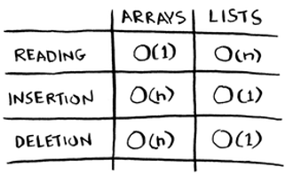

- It’s worth mentioning that insertions and deletions are $O_{(1)}$ time only if you can instantly access the element to be deleted. 
- It’s a common practice to keep track of the first and last items in a linked list, so it would take only $O_{(1)}$ time to delete those.

## Two different types of access

- There are two different types of access: random access and sequential access.
- Sequential access means reading the elements one by one, starting at the first element. 
- Linked lists can only do sequential access. If you want to read the 10th element of a linked list, you have to read the first 9 elements and follow the links to the 10th element.
- Random access means you can jump directly to the specific element. 
- Arrays are faster at reads. This is because they provide random access. 

## Exercises (common operations on arrays and linked lists)

Please refer to **page 31** of the textbook for exercises

## Selection Sort [1/4]

- Suppose you have a bunch of music on your computer.
- For each artist, you have a play count.

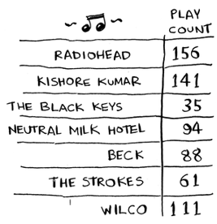

- You want to sort this list from most to least played, so that you can rank your favorite artists. 
- How can you do it?

## Selection Sort [2/4]

- One way is to go through the list and find the most-played artist. 
- Add that artist to a new list.

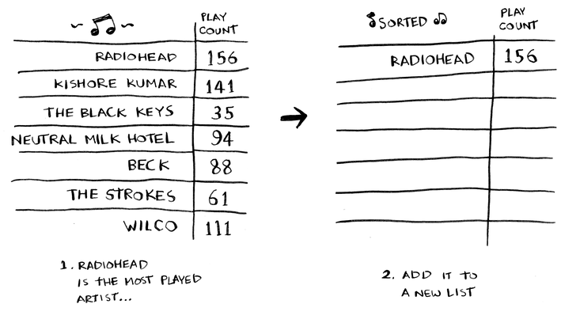

## Selection Sort [3/4]

- Do it again to find the next-most-played artist.

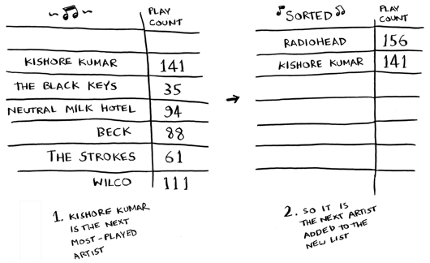

## Selection Sort [4/4]

- Keep doing this, and you’ll end up with a sorted list.

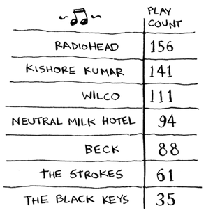


## Selection Sort (run times) [1/3]

- Remember that $O_{(n)}$ time means you touch every element in a list once. 
- For example, running simple search over the list of artists means looking at each artist once.

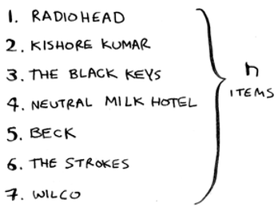

## Selection Sort (run times) [2/3]

- To find the artist with the highest play count, you have to check each item in the list. 
- This takes $O_{(n)}$ time, as you just saw. 
- So you have an operation that takes $O_{(n)}$ time, and you have to do that $n$ times:

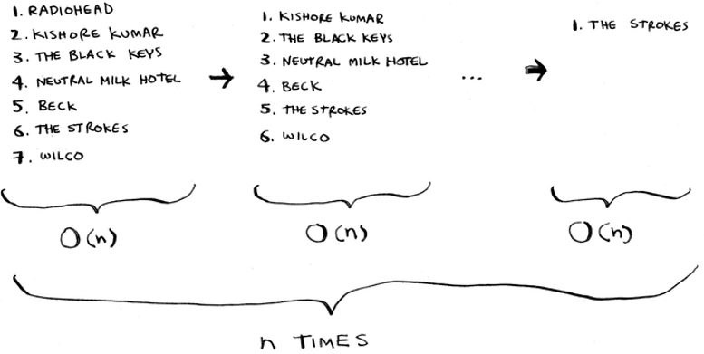

## Selection Sort (run times) [3/3]

- This takes $O_{(n \times n)}$ time or $O_{(n^2)}$ time.
- Selection sort is a neat algorithm, but it’s not very fast. 
- Quicksort is a faster sorting algorithm that only takes $O_{(n \log n)}$ time. It’s coming up in the next chapter!

## Checking fewer elements each time

- Maybe you’re wondering: as you go through the operations, the number of elements you have to check keeps decreasing.
- So how can the run time still be $O_{(n^2)}$? 
- That’s a good question, and the answer has to do with constants in Big O notation.
- You check n elements, then $n – 1$, $n - 2$, ... $2$, $1$. 
- On average, you check a list that has $\frac{1}{2} \times n$ elements. The runtime is $O_{(n \times \frac{1}{2} \times n)}$. 
- But constants like $\frac{1}{2}$ are ignored in Big O notation, so you just write $O_{(n \times n)}$ or $O_{(n^2)}$.

## Example Code Listing

```{python, eval=TRUE}
def findSmallest(arr):
  smallest = arr[0]
  smallest_index = 0
  for i in range(1, len(arr)):
    if arr[i] < smallest:
      smallest = arr[i]
      smallest_index = i
  return smallest_index
  
def selectionSort(arr):
  newArr = []
  for i in range(len(arr)):
    smallest = findSmallest(arr)
    newArr.append(arr.pop(smallest)) 
  return newArr
  
print(selectionSort([5, 3, 6, 2, 10]))
```

## Recap

- Your computer’s memory is like a giant set of drawers.
- When you want to store multiple elements, use an array or a list.
- With an array, all your elements are stored right next to each other.
- With a list, elements are strewn all over, and one element stores the address of the next one.
- Arrays allow fast reads.
- Linked lists allow fast inserts and deletes.
- All elements in the array should be the same type (all ints, all doubles, and so on).