```{r setup, include=FALSE}
knitr::opts_chunk$set(echo = TRUE)
```

<style>
slides > slide { overflow: scroll; }
slides > slide:not(.nobackground):after {
  content: '';
}
</style>


## Chapter Overview

- You learn about divide-and-conquer.
- You learn about quicksort, an elegant sorting algorithm that’s often used in practice. Quicksort uses divide-and-conquer.

## Divide & Conquer

- D&C can take some time to grasp.


## Case Study [1/2]

- Suppose you’re a farmer with a plot of land.

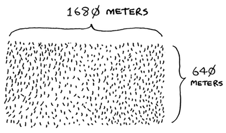

## Case Study [2/2]

- You want to divide this farm evenly into square plots.
- You want the plots to be as big as possible.
- So none of these will work.

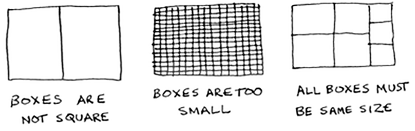

- How do you figure out the largest square size you can use for a plot of land?

## D&C Strategy [1/9]

- Use the D&C strategy!
- D&C algorithms are recursive algorithms.
- To solve a problem using D&C, there are two steps:
    + Figure out the base case. This should be the simplest possible case.
    + Divide or decrease your problem until it becomes the base case.

## D&C Strategy [2/9]

- First, figure out the base case.
- The easiest case would be if one side was a multiple of the other side.

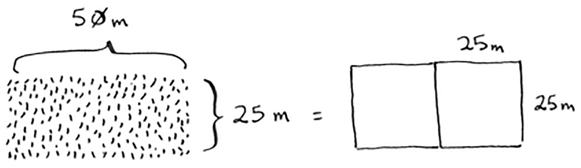

- Suppose one side is 25 meters (m) and the other side is 50 m.
- Then the largest box you can use is 25 m × 25 m.
- You need two of those boxes to divide up the land.

## D&C Strategy [3/9]

- Now you need to figure out the recursive case.
- According to D&C, with every recursive call, you have to reduce your problem.
- How do you reduce the problem here? Let’s start by marking out the biggest boxes you can use.

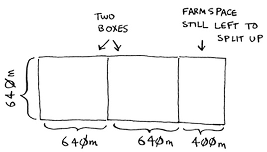

- You can fit two 640 × 640 boxes in there, and there’s some land still left to be divided.

## D&C Strategy [4/9]

- Now here comes the “Aha!” moment.
- There’s a farm segment left to divide.
- Why don’t you apply the same algorithm to this segment?

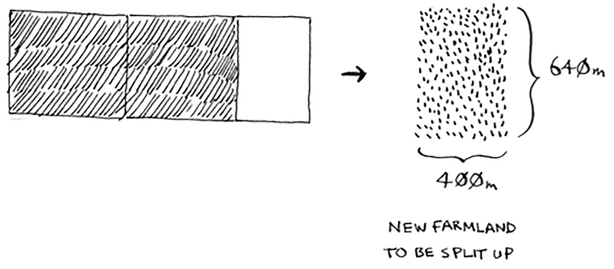

## D&C Strategy [5/9]

- So you started out with a 1680 × 640 farm that needed to be split up.
- But now you need to split up a smaller segment, 640 × 400.
- If you find the biggest box that will work for this size, that will be the biggest box that will work for the entire farm.
- You just reduced the problem from a 1680 × 640 farm to a 640 × 400 farm!

## Note: Euclid’s algorithm

- "If you find the biggest box that will work for this size, that will be the biggest box that will work for the entire farm."
- If it’s not obvious to you why this statement is true, don’t worry. It isn’t obvious.
- Unfortunately, the proof for why it works is a little too long to include in this book.
- If you want to understand the proof, look up Euclid’s algorithm.
- The Khan academy has a good explanation [here](https://www.khanacademy.org/computing/computer-science/cryptography/modarithmetic/a/the-euclidean-algorithm).

## D&C Strategy [6/9]

- Let’s apply the same algorithm again.
- Starting with a 640 × 400m farm, the biggest box you can create is 400 × 400 m.

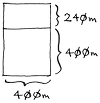

## D&C Strategy [7/9]

- And that leaves you with a smaller segment, 400 × 240 m.

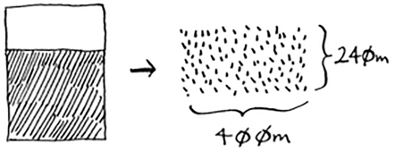

- And you can draw a box on that to get an even smaller segment, 240 × 160 m.

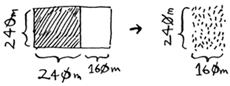

## D&C Strategy [8/9]

- And then you draw a box on that to get an even smaller segment.

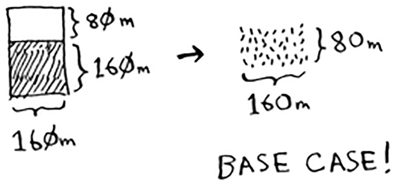

- Hey, you’re at the base case: 80 is a factor of 160. If you split up this segment using boxes, you don’t have anything left over!

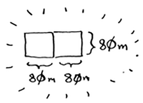

## D&C Strategy [9/9]

- So, for the original farm, the biggest plot size you can use is 80 × 80 m.

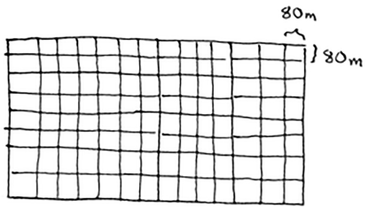

## D&C Recap

- To recap, here’s how D&C works:
    + Figure out a simple case as the base case.
    + Figure out how to reduce your problem and get to the base case.

## Another D&C Example [1/7]

- D&C isn’t a simple algorithm that you can apply to a problem.
- Instead, it’s a way to think about a problem. Let’s do one more example.
- You’re given an array of numbers.

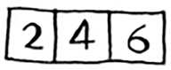

- You have to add up all the numbers and return the total.

## Another D&C Example [2/7]

- It’s pretty easy to do this with a loop:

```{python, eval=TRUE}
def sum(arr):
  total = 0
  for x in arr:
    total += x
  return total

print(sum([1, 2, 3, 4]))
```

- But how would you do this with a recursive function?

## Another D&C Example [3/7]

- **Step 1: Figure out the base case.**
- What’s the simplest array you could get? Think about the simplest case, and then read on.
- If you get an array with 0 or 1 element, that’s pretty easy to sum up.

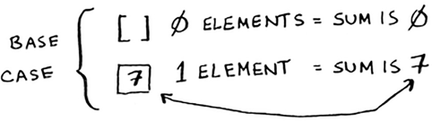

- So that will be the base case.

## Another D&C Example [4/7]

- **Step 2: You need to move closer to an empty array with every recursive call.**
- How do you reduce your problem size? Here’s one way.


- It’s the same as this.

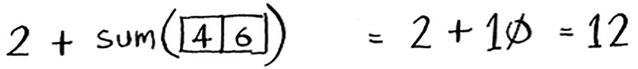

- In either case, the result is 12.
- But in the second version, you’re passing a *smaller* array into the sum function. That is, you *decreased* the size of your problem!

## Another D&C Example [5/7]

- Your sum function could work like this.

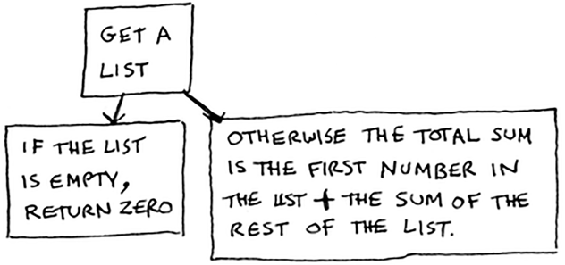

## Another D&C Example [6/7]

- Here it is in action.

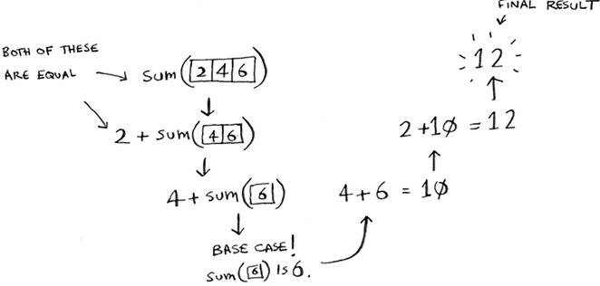

## Another D&C Example [7/7]

- Remember, recursion keeps track of the state.

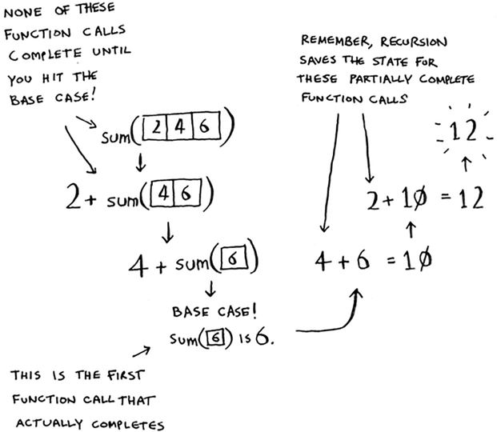

## Sneak peak at functional programming

- "Why would I do this recursively if I can do it easily with a loop?" you may be thinking.
- Well, this is a sneak peek into **functional programming**!
- Functional programming languages like **Haskell** don’t have loops, so you have to use recursion to write functions like this.
- If you have a good understanding of recursion, functional languages will be easier to learn.

## Exercises (D&C)

Please refer to **page 59** of the textbook for exercises

## Quicksort [1/13]

- Quicksort is a sorting algorithm. It’s much faster than selection sort and is frequently used in real life.
- Quicksort also uses D&C.
- Let’s use quicksort to sort an array.
- What’s the simplest array that a sorting algorithm can handle (remember my tip from the previous section)?
- Well, some arrays don’t need to be sorted at all.

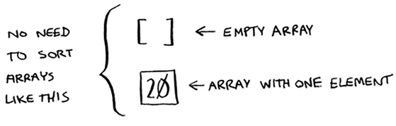

## Quicksort [2/13]

- Empty arrays and arrays with just one element will be the base case.
- You can just return those arrays as is—there’s nothing to sort:

```{python, eval=TRUE}
def quicksort(array):
  if len(array) < 2:
    return array
```

## Quicksort [3/13]

- Let’s look at bigger arrays.
- An array with two elements is pretty easy to sort, too.

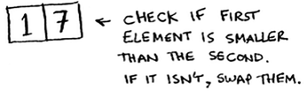

- What about an array of three elements?

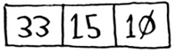

## Quicksort [4/13]

- Remember, you’re using D&C. So you want to break down this array until you’re at the base case. Here’s how quicksort works.
- First, pick an element from the array. This element is called the **pivot**.
- We’ll talk about how to pick a good pivot later. For now, let’s say the first item in the array is the pivot.

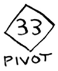

## Quicksort [5/13]

- Now find the elements smaller than the pivot and the elements larger than the pivot.

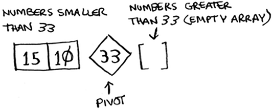

- This is called partitioning. Now you have:
    + A sub-array of all the numbers less than the pivot
    + The pivot
    + A sub-array of all the numbers greater than the pivot

## Quicksort [6/13]

- The two sub-arrays aren’t sorted. They’re just partitioned.
- But if they were sorted, then sorting the whole array would be pretty easy.
- If the sub-arrays are sorted, then you can combine the whole thing like this ``left array + pivot + right array`` and you get a sorted array.
- In this case, it’s $[10, 15] + [33] + [] = [10, 15, 33]$ , which is a sorted array.

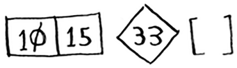

## Quicksort [7/13]

- How do you sort the sub-arrays? Well, the quicksort base case already knows how to sort arrays of two elements (the left sub-array) and empty arrays (the right sub-array).
- So if you call quicksort on the two sub-arrays and then combine the results, you get a sorted array!

```
quicksort([15, 10]) + [33] + quicksort([])
> [10, 15, 33]
```

## Quicksort [8/13]

- This will work with any pivot. Suppose you choose 15 as the pivot instead.

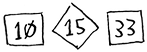

- Both sub-arrays have only one element, and you know how to sort those.
- So now you know how to sort an array of three elements. Here are the steps:
    + Pick a pivot.
    + Partition the array into two sub-arrays: elements less than the pivot and elements greater than the pivot.
    + Call quicksort recursively on the two sub-arrays.

## Quicksort [9/13]

- What about an array of four elements?

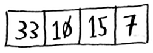

- Suppose you choose 33 as the pivot again.

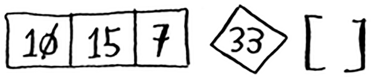

- The array on the left has three elements. You already know how to sort an array of three elements: call quicksort on it recursively.

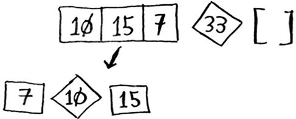

## Quicksort [10/13]

- So you can sort an array of four elements.
- And if you can sort an array of four elements, you can sort an array of five elements.
- Suppose you have this array of five elements.

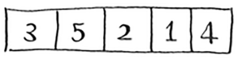

- Here are all the ways you can partition this array, depending on what pivot you choose.

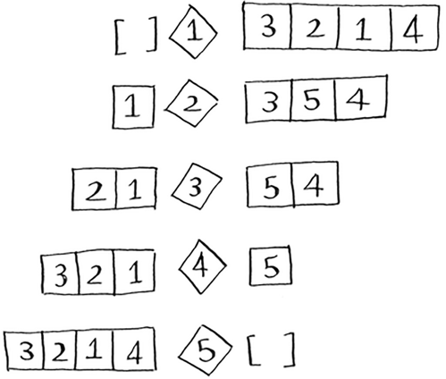

- Notice that all of these sub-arrays have somewhere between 0 and 4 elements.
- And you already know how to sort an array of 0 to 4 elements using quicksort!
- So no matter what pivot you pick, you can call quicksort recursively on the two sub-arrays.

## Quicksort [11/13]

- For example, suppose you pick 3 as the pivot. You call quicksort on the sub-arrays.

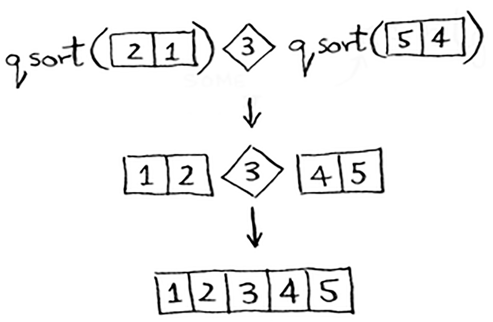

## Quicksort [12/13]

- The sub-arrays get sorted, and then you combine the whole thing to get a sorted array.
- This works even if you choose 5 as the pivot.

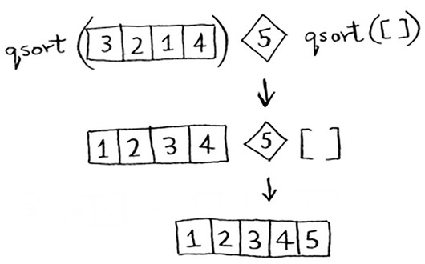

- This works with any element as the pivot. So you can sort an array of five elements.
- Using the same logic, you can sort an array of six elements, and so on.

## Quicksort [13/13]

- Here’s the code for quicksort:

```{python, eval=TRUE}
def quicksort(array):
  if len(array) < 2:
    # Base case: arrays with 0 or 1 element are already “sorted.”
    return array  
  else:
    # Recursive case
    pivot = array[0]  

    # Sub-array of all the elements less than the pivot
    less = [i for i in array[1:] if i <= pivot]   

    # Sub-array of all the elements greater than the pivot
    greater = [i for i in array[1:] if i > pivot]

    return quicksort(less) + [pivot] + quicksort(greater)

print(quicksort([10, 5, 2, 3]))
```

## Big O notation revisited [1/2]

- Quicksort is unique because its speed depends on the pivot you choose.
- Before I talk about quicksort, let’s look at the most common Big O run times again.

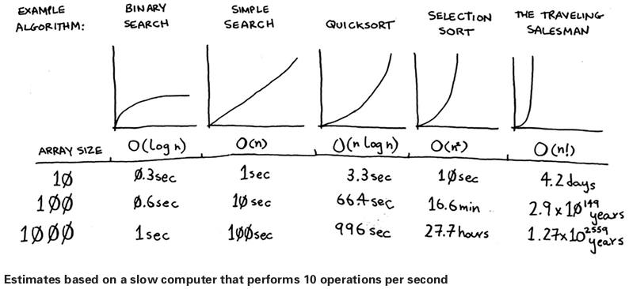

## Big O notation revisited [2/2]

- There’s another sorting algorithm called merge sort, which is $O(n \log n)$. Much faster!
- Quicksort is a tricky case. In the worst case, quicksort takes $O(n^2)$ time.
- It’s as slow as selection sort! But that’s the worst case. In the average case, quicksort takes $O(n \log n)$ time.
- So you might be wondering:
    + What do worst case and average case mean here?
    + If quicksort is $O(n \log n)$ on average, but merge sort is $O(n \log n)$ always, why not use merge sort? Isn’t it faster?

## Recap

- D&C works by breaking a problem down into smaller and smaller pieces. If you’re using D&C on a list, the base case is probably an empty array or an array with one element.
- If you’re implementing quicksort, choose a random element as the pivot. The average runtime of quicksort is $O(n \log n)$!
- The constant in Big O notation can matter sometimes. That’s why quicksort is faster than merge sort.
- The constant almost never matters for simple search versus binary search, because $O(\log n)$ is so much faster than $O(n)$ when your list gets big.

