```{r setup, include=FALSE}
knitr::opts_chunk$set(echo = TRUE)
```

<style>
slides > slide { overflow: scroll; }
slides > slide:not(.nobackground):after {
  content: '';
}
</style>


## Chapter Overview

- You learn about hash tables, one of the most useful basic data structures.
- You learn about the internals of hash tables: implementation, collisions, and hash functions.

## Introduction [1/7]

- Suppose you work at a grocery store. 
- When a customer buys produce, you have to look up the price in a book. 
- If the book is unalphabetized, it can take you a long time to look through every single line for apple. You’d be doing simple search from chapter 1, where you have to look at every line. Do you remember how long that would take? $O(n)$ time.
- If the book is alphabetized, you could run binary search to find the price of an apple. That would only take $O(\log n)$ time.


## Introduction [2/7]

- As a reminder, there’s a big difference between $O(n)$ and $O(\log n)$ time!

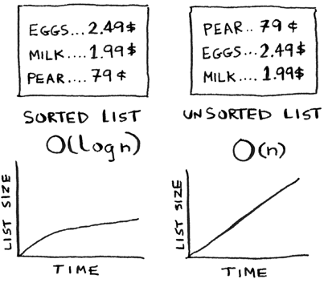

## Introduction [3/7]

- As a reminder, there’s a big difference between $O(n)$ and $O(\log n)$ time!
- Suppose you could look through 10 lines of the book per second. 
- Here’s how long simple search and binary search would take you.

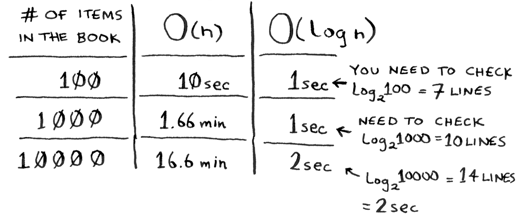

## Introduction [4/7]

- You already know that binary search is darn fast. 
- But as a cashier, looking things up in a book is a pain, even if the book is sorted. 
- You can feel the customer steaming up as you search for items in the book. 
- What you really need is a buddy who has all the names and prices memorized.
- Then you don’t need to look up anything: you ask her, and she tells you the answer instantly.

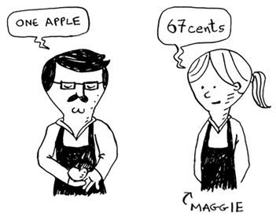

## Introduction [5/7]

- Your buddy Maggie can give you the price in $O(1)$ time for any item, no matter how big the book is. 
- She’s even faster than binary search.

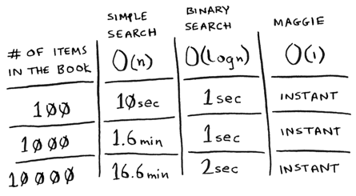

## Introduction [6/7]

- Let’s put on our data structure hats. 
- You know two data structures so far: arrays and lists (I won’t talk about stacks because you can’t really “search” for something in a stack). 
- You could implement this book as an array.

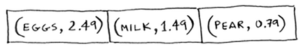

## Introduction [7/7]

- Each item in the array is really two items: one is the name of a kind of produce, and the other is the price. 
- If you sort this array by name, you can run binary search on it to find the price of an item. 
- So you can find items in $O(\log n)$ time. But you want to find items in $O(1)$ time. 
- That is, you want to make a “Maggie.” That’s where hash functions come in.

## Hash functions [1/7]

- A hash function is a function where you put in a string 1 and you get back a number.

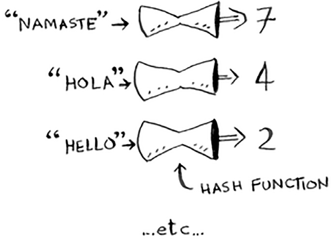

## Hash functions [2/7]

- In technical terminology, we’d say that a hash function “maps strings to numbers.” 
- You might think there’s no discernable pattern to what number you get out when you put a string in. 
- But there are some requirements for a hash function:
    + **It needs to be consistent**. For example, suppose you put in “apple” and get back “4”. Every time you put in “apple”, you should get “4” back. Without this, your hash table won’t work.
    + **It should map different words to different numbers**. For example, a hash function is no good if it always returns “1” for any word you put in. In the best case, every different word should map to a different number.

## Hash functions [3/7]

- So a hash function maps strings to numbers. What is that good for?
- Well, you can use it to make your “Maggie”!
- Start with an empty array:

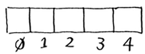

## Hash functions [4/7]

- You’ll store all of your prices in this array. Let’s add the price of an apple.
- Feed “apple” into the hash function.

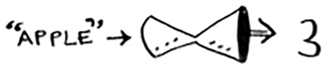

- The hash function outputs “3”. So let’s store the price of an apple at index 3 in the array.

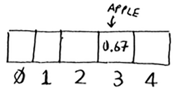

## Hash functions [5/7]

- Let’s add milk. Feed “milk” into the hash function.

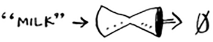

- The hash function says “0”. Let’s store the price of milk at index 0.

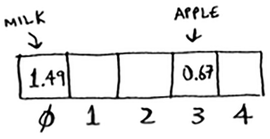

## Hash functions [6/7]

- Keep going, and eventually the whole array will be full of prices.

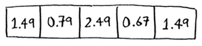

- Now you ask, “Hey, what’s the price of an avocado?” You don’t need to search for it in the array. Just feed “avocado” into the hash function.

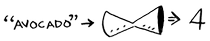

- It tells you that the price is stored at index 4. And sure enough, there it is.

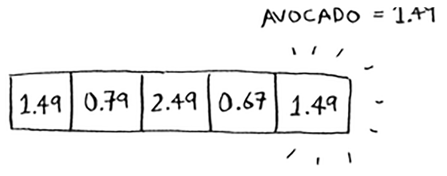

## Hash functions [7/7]

The hash function tells you exactly where the price is stored, so you don’t have to search at all! This works because:

- **The hash function consistently maps a name to the same index**. Every time you put in “avocado”, you’ll get the same number back. So you can use it the first time to find where to store the price of an avocado, and then you can use it to find where you stored that price.
- **The hash function maps different strings to different indexes**. “Avocado” maps to index 4. “Milk” maps to index 0. Everything maps to a different slot in the array where you can store its price.
- **The hash function knows how big your array is and only returns valid indexes**. So if your array is 5 items, the hash function doesn’t return 100; that wouldn’t be a valid index in the array.

## Hash function + array = hash table [1/2]

- Put a hash function and an array together, and you get a data structure called a **hash table**. 
- A hash table is the first data structure you’ll learn that has some extra logic behind it. 
- Arrays and lists map straight to memory, but hash tables are smarter. They use a hash function to intelligently figure out where to store elements.
- They’re also known as **hash maps**, **maps**, **dictionaries**, and **associative arrays**. 
- And hash tables are fast! Hash tables use an array to store the data, so they’re equally fast.

## Hash function + array = hash table [2/2]

- You’ll probably never have to implement hash tables yourself. 
- Any good language will have an implementation for hash tables. 
- Python has hash tables; they’re called dictionaries.

```{python, eval=TRUE}
book = dict()
book['apple'] = 0.67 # An apple costs 67 cents.
book['milk'] = 1.49  # Milk costs $1.49.
book['avocado'] = 1.49
print(book)
print(book['avocado'])
```

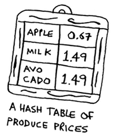

## Exercises (hash function)

Please refer to **page 79** of the textbook for exercises

## Using hash tables for lookups [1/4]

- Suppose you want to build a phone book. 
- You’re mapping people’s names to phone numbers. 


## Using hash tables for lookups [2/4]

Your phone book needs to have this functionality:

- Add a person’s name and the phone number associated with that person.
- Enter a person’s name, and get the phone number associated with that name.

This is a perfect use case for hash tables! Hash tables are great when you want to:

- Create a mapping from one thing to another thing
- Look something up

## Using hash tables for lookups [3/4]

- Building a phone book is pretty easy. First, make a new hash table.
- By the way, Python has a shortcut for making a new hash table. You can use two curly braces:

```{python, eval=TRUE}
phone_book = {}  # Same as phone_book = dict()
phone_book['jenny'] = 8675309
phone_book['emergency'] = 911
print(phone_book['jenny'])
```

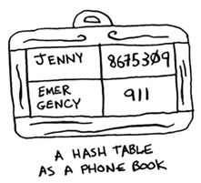

## Using hash tables for lookups [4/4]

- Hash tables make it easy to model a relationship from one item to another.
- Hash tables are used for lookups on a much larger scale. 
- For example, suppose you go to a website like http://adit.io. Your computer has to translate adit.io to an *IP address*.

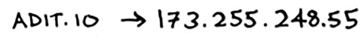

- For any website you go to, the address has to be translated to an IP address.
- Wow, mapping a web address to an IP address? Sounds like a perfect use case for hash tables! This process is called **DNS resolution**. 
- Hash tables are one way to provide this functionality.

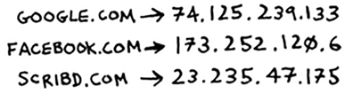

## Preventing duplicate entries [1/5]

- Suppose you’re running a voting booth. 
- Naturally, every person can vote just once. 
- How do you make sure they haven’t voted before? 
- When someone comes in to vote, you ask for their full name. Then you check it against the list of people who have voted.


## Preventing duplicate entries [2/5]

- If their name is on the list, this person has already voted—kick them out! 
- Otherwise, you add their name to the list and let them vote. 
- Now suppose a lot of people have come in to vote, and the list of people who have voted is really long.


## Preventing duplicate entries [3/5]

- Each time someone new comes in to vote, you have to scan this giant list to see if they’ve already voted. 
- But there’s a better way: use a hash!
- First, make a hash to keep track of the people who have voted:

```{python, eval=FALSE}
voted = {}
```

- When someone new comes in to vote, check if they’re already in the hash:

```{python, eval=FALSE}
value = voted.get('tom')
```

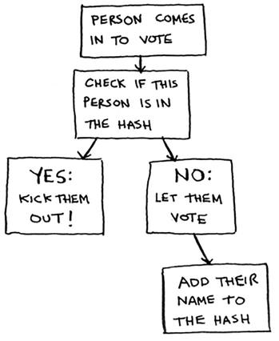

## Preventing duplicate entries [4/5]

```{python, eval=TRUE}
voted = {}

def check_voter(name):
  if voted.get(name):
    print('kick them out!')
  else:
    voted[name] = True
    print('let them vote!')
    
check_voter('tom')
check_voter('mike')
check_voter('tom')
```

## Preventing duplicate entries [5/5]

- Remember, if you were storing these names in a list of people who have voted, this function would eventually become really slow, because it would have to run a simple search over the entire list. 
- But you’re storing their names in a hash table instead, and a hash table instantly tells you whether this person’s name is in the hash table or not. 
- Checking for duplicates is very fast with a hash table.

## Using hash tables as a cache [1/7]

- If you work on a website, you may have heard of caching before as a good thing to do.
- Here’s the idea. Suppose you visit facebook.com:

    + You make a request to Facebook’s server.
    + The server thinks for a second and comes up with the web page to send to you.
    + You get a web page.


## Using hash tables as a cache [2/7]

- Suppose you have a niece who keeps asking you about planets. 
- “How far is Mars from Earth?” “How far is the Moon?” “How far is Jupiter?” 
- Each time, you have to do a Google search and give her an answer. It takes a couple of minutes. 
- Now, suppose she always asked, “How far is the Moon?” Pretty soon, you’d memorize that the Moon is 238,900 miles away. 
- You wouldn’t have to look it up on Google; you’d just remember and answer. 
- This is how caching works: websites remember the data instead of recalculating it.

## Using hash tables as a cache [3/7]

- If you’re logged in to Facebook, all the content you see is tailored just for you. 
- Each time you go to facebook.com, its servers have to think about what content you’re interested in. 
- But if you’re not logged in to Facebook, you see the login page. Everyone sees the same login page.
- Facebook is asked the same thing over and over: “Give me the home page when I’m logged out.” 
- So it stops making the server do work to figure out what the home page looks like. 
- Instead, it memorizes what the home page looks like and sends it to you.

## Using hash tables as a cache [4/7]

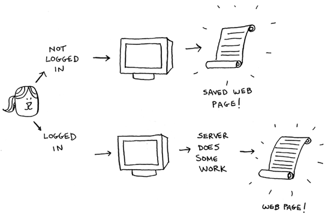

## Using hash tables as a cache [5/7]

- This is called **caching**. It has two advantages:
    + You get the web page **a lot faster**, just like when you memorized the distance from Earth to the Moon. The next time your niece asks you, you won’t have to Google it. You can answer instantly.
    + Facebook has to do **less work**. 
    
- Caching is a common way to make things faster. 
- All big websites use caching. And that data is cached in a hash!

## Using hash tables as a cache [6/7]

When you visit a page on Facebook, it first checks whether the page is stored in the hash.

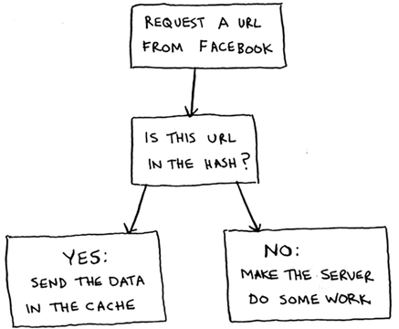

## Using hash tables as a cache [7/7]

```{python, eval=TRUE}
cache = {}

def get_page(url):
  if cache.get(url):
    return cache[url] # Returns cached data
  else:
    data = get_data_from_server(url)
    cache[url] = data # Saves this data in your cache first
    return data
```


## Recap (Hash Table)

To recap, hashes are good for

- Modeling relationships from one thing to another thing
- Filtering out duplicates
- Caching/memorizing data instead of making your server do work

## Collisions [1/7]

- To understand the performance of hash tables, you first need to understand what collisions are. 
- The next two sections cover collisions and performance.
- First, I’ve been telling you a white lie. I told you that a hash function always maps different keys to different slots in the array.

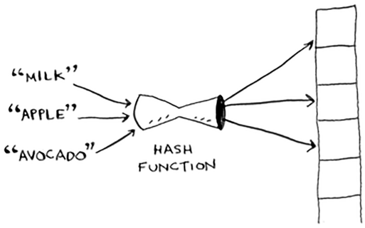

## Collisions [2/7]

- In reality, it’s almost impossible to write a hash function that does this.
- Let’s take a simple example. Suppose your array contains 26 slots.

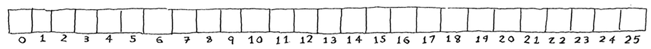

- And your hash function is really simple: it assigns a spot in the array alphabetically.

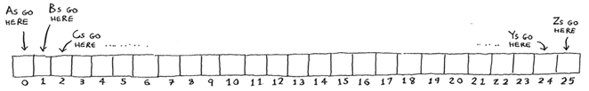

## Collisions [3/7]

- Maybe you can already see the problem. You want to put the price of apples in your hash.
- You get assigned the first slot.

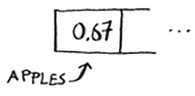

- Then you want to put the price of bananas in the hash. You get assigned the second slot.

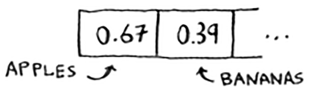

- Everything is going so well! But now you want to put the price of avocados in your hash. You get assigned the first slot again.

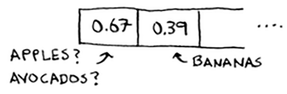

## Collisions [4/7]

- Oh no! Apples have that slot already! What to do? 
- This is called a **collision**: two keys have been assigned the same slot. This is a problem.
- If you store the price of avocados at that slot, you’ll overwrite the price of apples. Then the next time someone asks for the price of apples, they will get the price of avocados instead! 
- Collisions are bad, and you need to work around them. 
- There are many different ways to deal with collisions. 

## Collisions [5/7]

- The simplest one is this: if multiple keys map to the same slot, start a **linked list** at that slot.

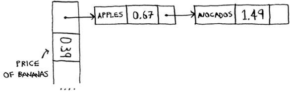

- If you need to know the price of bananas, it’s still quick. 
- If you need to know the price of apples, it’s a little slower. You have to search through this linked list to find “apple”. 
- If the linked list is small, no big deal — you have to search through three or four elements.

## Collisions [6/7]

- But suppose you work at a grocery store where you only sell produce that starts with the letter A.

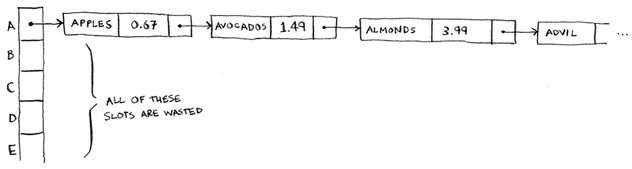

- The entire hash table is totally empty except for one slot. And that slot has a giant linked list! 
- Every single element in this hash table is in the linked list. 
- That’s as bad as putting everything in a linked list to begin with. It’s going to slow down your hash table.

## Collisions [7/7]

- There are two lessons here:
    + Hash functions are important. 
    + A good hash function will give you very few collisions.

## Performance [1/5]

- In the average case, hash tables take $O(1)$ for everything. 
- $O(1)$ is called **constant time**. 
- You haven’t seen constant time before. It doesn’t mean instant. 
- It means the time taken will stay the same, regardless of how big the hash table is. 

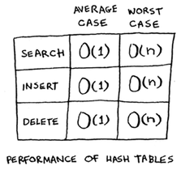

## Performance [2/5]

- For example, you know that simple search takes linear time.

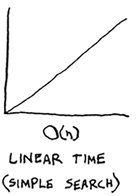

- Binary search is faster—it takes $\log$ time:

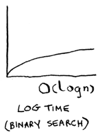

- Looking something up in a hash table takes constant time.

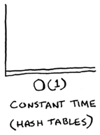

## Performance [3/5]

- See how it’s a flat line? That means it doesn’t matter whether your hash table has 1 element or 1 billion elements—getting something out of a hash table will take the same amount of time. 
- Actually, you’ve seen constant time before. Getting an item out of an array takes constant time. It doesn’t matter how big your array is; it takes the same amount of time to get an element. 

## Performance [4/5]

- In the average case, hash tables are really fast.
- In the worst case, a hash table takes $O(n)$—linear time—for everything, which is really slow. 
- Let’s compare hash tables to arrays and lists.

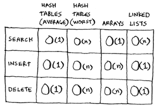

## Performance [5/5]

- Look at the average case for hash tables. 
- Hash tables are as fast as arrays at searching (getting a value at an index). 
- And they’re as fast as linked lists at inserts and deletes. It’s the best of both worlds! 
- But in the worst case, hash tables are slow at all of those. 
- So it’s important that you don’t hit worst-case performance with hash tables. 
- And to do that, you need to avoid collisions. To avoid collisions, you need:
    + A low load factor
    + A good hash function

## Load factor [1/6]

- The load factor of a hash table is easy to calculate.

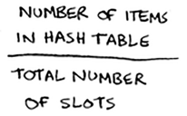

- Hash tables use an array for storage, so you count the number of occupied slots in an array. 
- For example, this hash table has a load factor of $\frac{2}{5}$ , or 0.4.

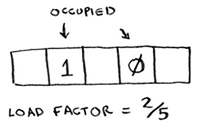


## Load factor [2/6]

- What’s the load factor of this hash table?

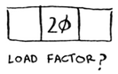

- If you said $\frac{1}{3}$, you’re right. 
- Load factor measures how many empty slots remain in your hash table.

## Load factor [3/6]

- Suppose you need to store the price of 100 produce items in your hash table, and your hash table has 100 slots. 
- In the best case, each item will get its own slot.

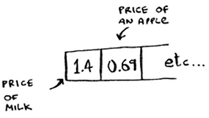

- This hash table has a load factor of 1. 
- What if your hash table has only 50 slots? 
- Then it has a load factor of 2. 

## Load factor [4/6]

- There’s no way each item will get its own slot, because there aren’t enough slots! 
- Having a load factor greater than 1 means you have more items than slots in your array.
- Once the load factor starts to grow, you need to add more slots to your hash table. This is called **resizing**. 
- For example, suppose you have this hash table that is getting pretty full.

## Load factor [5/6]


- You need to resize this hash table. First you create a new array that’s bigger. 
- The rule of thumb is to make an array that is twice the size.

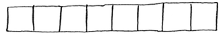

- Now you need to re-insert all of those items into this new hash table using the hash function:

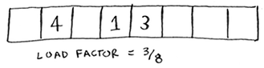

- This new table has a load factor of $\frac{3}{8}$. Much better! 

## Load factor [6/6]

- With a lower load factor, you’ll have fewer collisions, and your table will perform better. 
- A good rule of thumb is, resize when your load factor is greater than 0.7.
- You might be thinking, “This resizing business takes a lot of time!” 
- And you’re right. Resizing is expensive, and you don’t want to resize too often. 
- But averaged out, hash tables take $O(1)$ even with resizing.

## A good hash function [1/2]

- A good hash function distributes values in the array evenly.

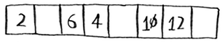

- A bad hash function groups values together and produces a lot of collisions.

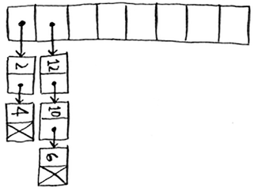

## A good hash function [2/2]

- What is a good hash function? That’s something you’ll never have to worry about—old men (and women) with big beards sit in dark rooms and worry about that. 
- If you’re really curious, look up the SHA function (there’s a short description of it in the last chapter). 
- You could use that as your hash function.

## Exercises (hash table)

Please refer to **page 93** of the textbook for exercises

## Recap

- You can make a hash table by combining a hash function with an array.
- Collisions are bad. You need a hash function that minimizes collisions.
- Hash tables have really fast search, insert, and delete.
- Hash tables are good for modeling relationships from one item to another item.
- Once your load factor is greater than 0.7, it’s time to resize your hash table.
- Hash tables are used for caching data (for example, with a web server).
- Hash tables are great for catching duplicates.

