```{r setup, include=FALSE}
knitr::opts_chunk$set(echo = TRUE)
```

<style>
slides > slide { overflow: scroll; }
slides > slide:not(.nobackground):after {
  content: '';
}
</style>


## Chapter Overview

- You learn how to model a network using a new, abstract data structure: graphs.
- You learn breadth-first search, an algorithm you can run on graphs to answer questions like, “What’s the shortest path to go to X?”
- You learn about directed versus undirected graphs.

## Introduction to graphs [1/6] 

- Suppose you’re in San Francisco, and you want to go from Twin Peaks to the Golden Gate Bridge. 
- You want to get there by bus, with the minimum number of transfers. Here are your options.

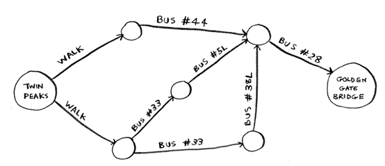

## Introduction to graphs [2/6] 

- What’s your algorithm to find the path with the fewest steps?
- Well, can you get there in one step? Here are all the places you can get to in one step.

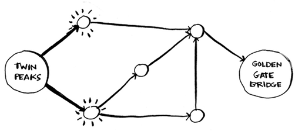

- The bridge isn’t highlighted; you can’t get there in one step. 

## Introduction to graphs [3/6] 

- Can you get there in two steps?

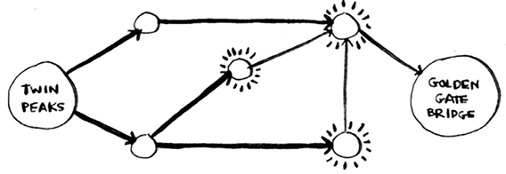

- Again, the bridge isn’t there, so you can’t get to the bridge in two steps.

## Introduction to graphs [4/6] 

- What about three steps?

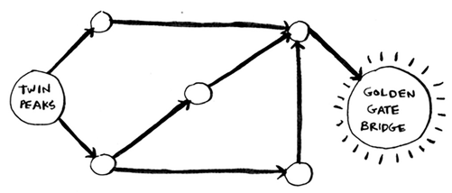

- Aha! Now the Golden Gate Bridge shows up. 

## Introduction to graphs [5/6] 

- So it takes three steps to get from Twin Peaks to the bridge using this route.

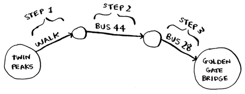

- There are other routes that will get you to the bridge too, but they’re longer (four steps).

## Introduction to graphs [6/6] 

- The algorithm found that the shortest route to the bridge is three steps long. This type of problem is called a *shortest-path problem*.
- The algorithm to solve a shortest-path problem is called *breadth-first search*.
- To figure out how to get from Twin Peaks to the Golden Gate Bridge, there are two steps:
    + Model the problem as a graph.
    + Solve the problem using breadth-first search.

## What is a graph? [1/3]

- A graph models a set of connections. 
- Suppose you and your friends are playing poker, 

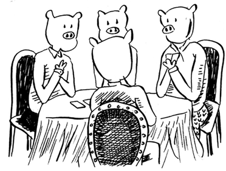

## What is a graph? [2/3]

- You want to model who owes whom money. 
- Here’s how you could say, “Alex owes Rama money.”

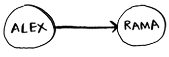

- The full graph could look something like this.

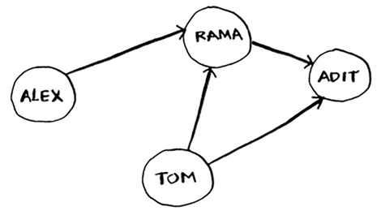

- Alex owes Rama money, Tom owes Adit money, and so on.

## What is a graph? [3/3]

- Each graph is made up of *nodes* and *edges.*

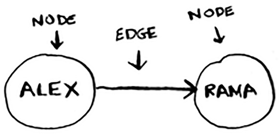

- A node can be directly connected to many other nodes. 
- Those nodes are called its neighbors. 
- In this graph, Rama is Alex’s neighbor. Adit isn’t Alex’s neighbor, because they aren’t directly connected. But Adit is Rama’s and Tom’s neighbor.
- Graphs are a way to model how different things are connected to one another.

## Breadth-first search [1/6]

- We looked at a search algorithm in chapter 1: binary search. 
- Breadth-first search is a different kind of search algorithm: one that runs on graphs. 
- It can help answer two types of questions:
    + Question type 1: Is there a path from node A to node B?
    + Question type 2: What is the shortest path from node A to node B?
    
## Breadth-first search [2/6]

- You already saw breadth-first search once, when you calculated the shortest route from Twin Peaks to the Golden Gate Bridge. 
- That was a question of type 2: “What is the shortest path?” 
- Now let’s look at the algorithm in more detail. You’ll ask a question of type 1: “Is there a path?”

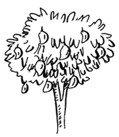

- Suppose you’re the proud owner of a mango farm. You’re looking for a mango seller who can sell your mangoes.

## Breadth-first search [3/6]

- Are you connected to a mango seller on Facebook? Well, you can search through your friends.

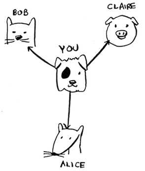

## Breadth-first search [4/6] 

- This search is pretty straightforward.
- First, make a list of friends to search.

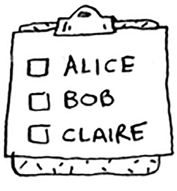

- Now, go to each person in the list and check whether that person sells mangoes.

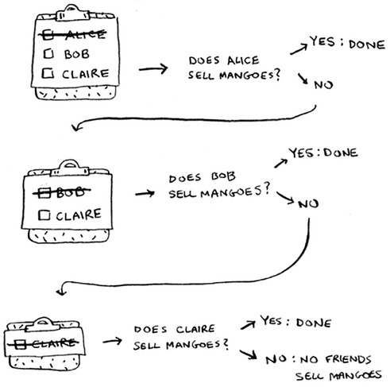

## Breadth-first search [5/6] 

- Suppose none of your friends are mango sellers. Now you have to search through your friends’ friends.

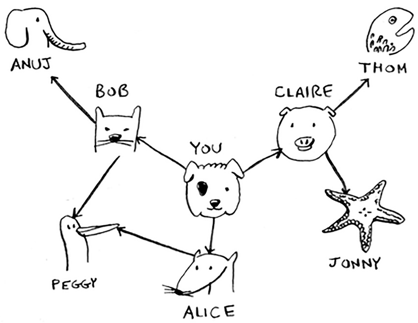

## Breadth-first search [6/6] 

- Each time you search for someone from the list, add all of their friends to the list.

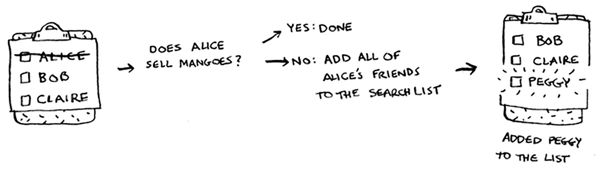

- This way, you not only search your friends, but you search their friends, too. 
- Remember, the goal is to find one mango seller in your network.
- So if Alice isn’t a mango seller, you add her friends to the list, too. That means you’ll eventually search her friends—and then their friends, and so on. 
- With this algorithm, you’ll search your entire network until you come across a mango seller. 
- This algorithm is breadth-first search.

## Finding the shortest path [1/3]

- As a recap, these are the two questions that breadth-first search can answer for you:
    + Question type 1: Is there a path from node A to node B? (Is there a mango seller in your network?)
    + Question type 2: What is the shortest path from node A to node B? (Who is the closest mango seller?)
- You saw how to answer question 1; now let’s try to answer question 2. Can you find the closest mango seller? 
- For example, your friends are first-degree connections, and their friends are second-degree connections.

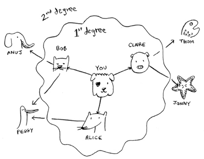

## Finding the shortest path [2/3]

- You’d prefer a first-degree connection to a second-degree connection, and a second-degree connection to a third-degree connection, and so on. 
- So you shouldn’t search any second-degree connections before you make sure you don’t have a first-degree connection who is a mango seller. 
- Breadth-first search already does this! The way breadth-first search works, the search radiates out from the starting point. 
- So you’ll check first-degree connections before second-degree connections. 

## Finding the shortest path [3/3]

- Another way to see this is, first-degree connections are added to the search list before second-degree connections.
- You just go down the list and check people to see whether each one is a mango seller. 
- The first-degree connections will be searched before the second-degree connections, so you’ll find the mango seller closest to you. 
- Breadth-first search not only finds a path from A to B, it also finds the shortest path.

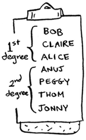

## Queues [1/3]

- Suppose you and your friend are queueing up at the bus stop. 
- If you’re before him in the queue, you get on the bus first. A queue works the same way.

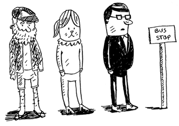

- Queues are similar to stacks. You can’t access random elements in the queue.
- Instead, there are two only operations, *enqueue* and *dequeue*.

## Queues [2/3]

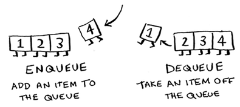

- If you enqueue two items to the list, the first item you added will be dequeued before the second item. 
- You can use this for your search list!
- People who are added to the list first will be dequeued and searched first.

## Queues [3/3]

- The queue is called a **FIFO** data structure: *First In, First Out*. 
- In contrast, a stack is a **LIFO** data structure: *Last In, First Out*.

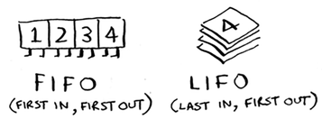

## Exercises (breadth-first search)

Please refer to **page 104** of the textbook for exercises

## Implementing the graph [1/6]

- A graph consists of several nodes. And each node is connected to neighboring nodes.

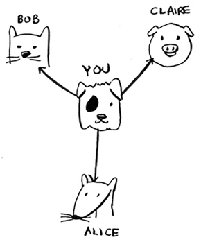

## Implementing the graph [2/6] 

- How do you express a relationship like “you -> bob”?
- Luckily, you know a data structure that lets you express relationships: a *hash table*!
- Remember, a hash table allows you to map a key to a value. In this case, you want to map a node to all of its neighbors.

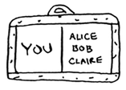

## Implementing the graph [3/6] 

- Here’s how you’d write it in Python:

```{python, eval=TRUE}
graph = {}
graph['you'] = ['alice', 'bob', 'claire']
```

- Notice that 'you' is mapped to an array. 
- So ``graph['you']`` will give you an array of all the neighbors of 'you'.

## Implementing the graph [4/6] 

- A graph is just a bunch of nodes and edges, so this is all you need to have a graph in Python. 
- What about a bigger graph, like this one?


## Implementing the graph [5/6] 

- Here it is as Python code:

```{python, eval=TRUE}
graph = {}
graph['you'] = ['alice', 'bob', 'claire']
graph['bob'] = ['anuj', 'peggy']
graph['alice'] = ['peggy']
graph['claire'] = ['thom', 'jonny']
graph['anuj'] = []
graph['peggy'] = []
graph['thom'] = []
graph['jonny'] = []
```

- Hash tables have no ordering, so it doesn’t matter what order you add key/value pairs in.

## Implementing the graph [6/6] 

- Anuj, Peggy, Thom, and Jonny don’t have any neighbors. 
- They have arrows pointing to them, but no arrows from them to someone else.
- This is called a *directed graph* — the relationship is only one way. 
- So Anuj is Bob’s neighbor, but Bob isn’t Anuj’s neighbor. 
- An *undirected graph* doesn’t have any arrows, and both nodes are each other’s neighbors. 
- For example, both of these graphs are equal.

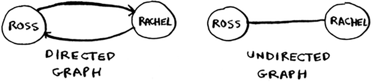

## Implementing the algorithm [1/8]

- To recap, here’s how the implementation will work.

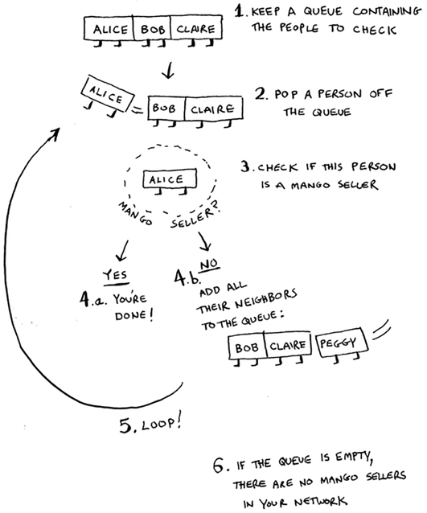

## Implementing the algorithm [2/8]

- Make a queue to start. In Python, you use the *double-ended queue* (*deque*) function for this:

```{python, eval=TRUE}
from collections import deque
search_queue = deque()  # Creates a new queue
# Adds all of your neighbors to the search queue
search_queue += graph['you']  
```

- Remember, ``graph['you']`` will give you a list of all your neighbors, like ``['alice', 'bob', 'claire']``. 
- Those all get added to the search queue.

## Implementing the algorithm [3/8]

- Let’s see the rest:

```{python, eval=FALSE}
while search_queue:
  person = search_queue.popleft()
  if person_is_seller(person):
    print(person + ' is a mango seller!')
    return True
  else:
    search_queue += graph[person]
  return False
```

- One final thing: you still need a ``person_is_seller`` function to tell you when someone is a mango seller. Here’s one:

```{python, eval=TRUE}
def person_is_seller(name):
  return name[-1] == 'm'
```

- This function checks whether the person’s name ends with the letter ``m``.
- If it does, they’re a mango seller. Kind of a silly way to do it, but it’ll do for this example.

## Implementing the algorithm [4/8]

- Now let’s see the breadth-first search in action.

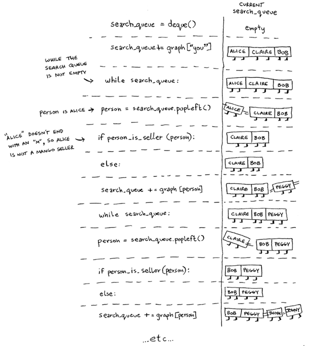

- And so on. The algorithm will keep going until either:
    + A mango seller is found, or
    + The queue becomes empty, in which case there is no mango seller.
    
## Implementing the algorithm [5/8]    
    
- Alice and Bob share a friend: Peggy. 
- So Peggy will be added to the queue twice: once when you add Alice’s friends, and again when you add Bob’s friends. 
- You’ll end up with two Peggys in the search queue.    


- But you only need to check Peggy once to see whether she’s a mango seller. 
- If you check her twice, you’re doing unnecessary, extra work. 

## Implementing the algorithm [6/8]    

- So once you search a person, you should mark that person as searched and not search them again.
- If you don’t do this, you could also end up in an infinite loop. Suppose the mango seller graph looked like this.

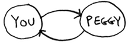

- This will be an infinite loop, because the search queue will keep going from you to Peggy.

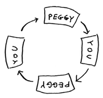

## Implementing the algorithm [7/8]

- Before checking a person, it’s important to make sure they haven’t been checked already. 
- To do that, you’ll keep a list of people you’ve already checked.


## Implementing the algorithm [8/8]

- Here’s the final code for breadth-first search, taking that into account:

```{python, eval=TRUE}
def person_is_seller(name):
  return name[-1] == 'm'
```

```{python, eval=TRUE}
from collections import deque

def search(name):
  search_queue = deque()
  search_queue += graph[name]
  searched = []
  
  while search_queue:
    person = search_queue.popleft()
    if not person in searched:
      if person_is_seller(person):
        print(person + ' is a mango seller!')
        return True
      else:
        search_queue += graph[person]
        searched.append(person)
  return False
```

```{python, eval=TRUE}
graph = {}
graph['you'] = ['alice', 'bob', 'claire']
graph['bob'] = ['anuj', 'peggy']
graph['alice'] = ['peggy']
graph['claire'] = ['thom', 'jonny']
graph['anuj'] = []
graph['peggy'] = []
graph['thom'] = []
graph['jonny'] = []

search('you')
```

## Running time 

- If you search your entire network for a mango seller, that means you’ll follow each edge (remember, an edge is the arrow or connection from one person to another). 
- So the running time is at least O(number of edges).
- You also keep a queue of every person to search. 
- Adding one person to the queue takes constant time: O(1). Doing this for every person will take O(number of people) total. 
- Breadth-first search takes O(number of people + number of edges), and it’s more commonly written as $O(V+E)$ (V for number of *vertices*, E for number of *edges*).

## Exercises (breadth-first search)

Please refer to **page 111** of the textbook for exercises

## Recap

- Breadth-first search tells you if there’s a path from A to B.
- If there’s a path, breadth-first search will find the shortest path.
- If you have a problem like “find the shortest X,” try modeling your problem as a graph, and use breadth-first search to solve.
- A *directed graph* has arrows, and the relationship follows the direction of the arrow (rama -> adit means “rama owes adit money”).
- *Undirected graphs* don’t have arrows, and the relationship goes both ways (ross - rachel means “ross dated rachel and rachel dated ross”).
- *Queues* are *FIFO* (*First In, First Out*).
- *Stacks* are *LIFO* (*Last In, First Out*).
- You need to check people in the order they were added to the search list, so the search list needs to be a queue. Otherwise, you won’t get the shortest path.
- Once you check someone, make sure you don’t check them again. Otherwise, you might end up in an infinite loop.
