```{r setup, include=FALSE}
knitr::opts_chunk$set(echo = TRUE)
```

<style>
slides > slide { overflow: scroll; }
slides > slide:not(.nobackground):after {
  content: '';
}
</style>


## Chapter Overview

- You learn how to tackle the impossible: problems that have no fast algorithmic solution (NP-complete problems).
- You learn how to identify such problems when you see them, so you don’t waste time trying to find a fast algorithm for them.
- You learn about approximation algorithms, which you can use to find an approximate solution to an NP-complete problem quickly.
- You learn about the greedy strategy, a very simple problem-solving strategy.

## The classroom scheduling problem [1/7]

- Suppose you have a classroom and want to hold as many classes here as possible. 
- You get a list of classes.

     

## The classroom scheduling problem [2/7]

- You can’t hold all of these classes in there, because some of them overlap.

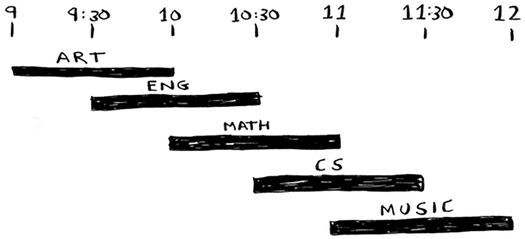

- You want to hold as many classes as possible in this classroom. 
- How do you pick what set of classes to hold, so that you get the biggest set of classes possible?

## The classroom scheduling problem [3/7]

- Sounds like a hard problem, right? 
- Actually, the algorithm is so easy, it might surprise you. Here’s how it works:

    - Pick the class that ends the soonest. This is the first class you’ll hold in this classroom.
    - Now, you have to pick a class that starts after the first class. Again, pick the class that ends the soonest. This is the second class you’ll hold.

- Keep doing this, and you’ll end up with the answer! 
- Let’s try it out.

## The classroom scheduling problem [4/7]

- Art ends the soonest, at 10:00 a.m., so that’s one of the classes you pick.

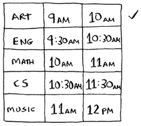

## The classroom scheduling problem [5/7]

- Now you need the next class that starts after 10:00 a.m. and ends the soonest.
- English is out because it conflicts with Art, but Math works.

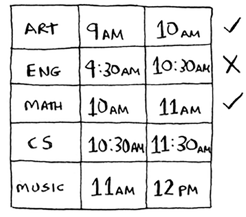

## The classroom scheduling problem [6/7]

- Finally, CS conflicts with Math, but Music works.

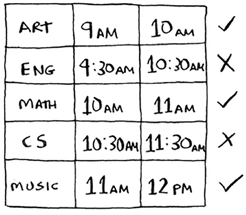

- So these are the three classes you’ll hold in this classroom.

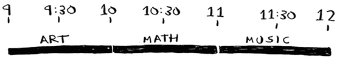

## The classroom scheduling problem [7/7]

- This is the beauty of greedy algorithms: they’re easy! 
- A greedy algorithm is simple: at each step, pick the optimal move.
- In this case, each time you pick a class, you pick the class that ends the soonest. 
- In technical terms: at each step you pick the locally optimal solution, and in the end you’re left with the globally optimal solution.
- Obviously, greedy algorithms don’t always work. But they’re simple to write! Let’s look at another example.

## The knapsack problem [1/6]

- Suppose you’re a greedy thief. 
- You’re in a store with a knapsack, and there are all these items you can steal.


## The knapsack problem [2/6]

- But you can only take what you can fit in your knapsack.
- The knapsack can hold 35 pounds.


## The knapsack problem [3/6]

- You’re trying to maximize the value of the items you put in your knapsack. 
- What algorithm do you use?
- Again, the greedy strategy is pretty simple: 
    
    - Pick the most expensive thing that will fit in your knapsack.
    - Pick the next most expensive thing that will fit in your knapsack. And so on.

- Except this time, it doesn’t work!

## The knapsack problem [4/6]

- For example, suppose there are three items you can steal.

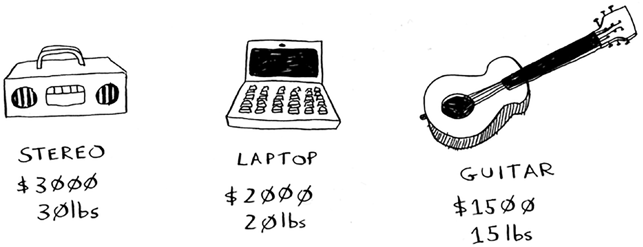

- Your knapsack can hold 35 pounds of items. 
- The stereo system is the most expensive, so you steal that. 

## The knapsack problem [5/6] 

- You got $3,000 worth of goods but you don’t have space for anything else.

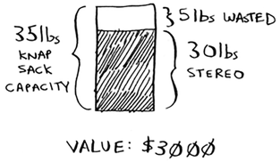

- But wait! If you’d picked the laptop and the guitar instead, you could have had $3,500 worth of loot!

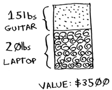

## The knapsack problem [6/6] 

- Clearly, the greedy strategy doesn’t give you the optimal solution here.
- But it gets you pretty close. 
- In the next chapter, I’ll explain how to calculate the correct solution. 
- But if you’re a thief in a shopping center, you don’t care about perfect. “Pretty good” is good enough.
- Here’s the takeaway from this second example: sometimes, perfect is the enemy of good. Sometimes all you need is an algorithm that solves the problem pretty well. 
- And that’s where greedy algorithms shine, because they’re simple to write and usually get pretty close.

## Exercises (Greedy Algorithm)

Please refer to **page 145** of the textbook for exercises

## The set-covering problem [1/4] 

- Suppose you’re starting a radio show. 
- You want to reach listeners in all 50 states. 
- You have to decide what stations to play on to reach all those listeners. 
- It costs money to be on each station, so you’re trying to minimize the number of stations you play on. 

## The set-covering problem [2/4] 

- You have a list of stations.
- Each station covers a region, and there’s overlap.

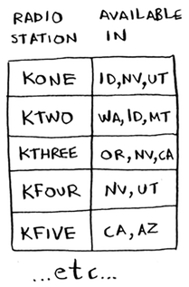   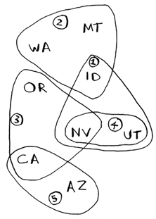

- How do you figure out the smallest set of stations you can play on to cover all 50 states? 

## The set-covering problem [3/4] 

- Sounds easy, doesn’t it? 
- Turns out it’s extremely hard.
- Here’s how to do it:
    
    - List every possible subset of stations. This is called the power set. There are $2^n$ possible subsets.
    - From these, pick the set with the smallest number of stations that covers all 50 states.

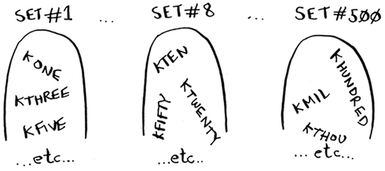

## The set-covering problem [4/4] 

- The problem is, it takes a long time to calculate every possible subset of stations. 
- It takes $O(2^n)$ time, because there are $2^n$ subsets. 
- It’s possible to do if you have a small set of 5 to 10 stations. 
- It takes much longer if you have more stations. 
- Suppose you can calculate 10 subsets per second.

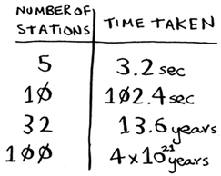

- There’s no algorithm that solves it fast enough! What can you do?

## Approximation algorithms [1/2]

- Greedy algorithms to the rescue! Here’s a greedy algorithm that comes pretty close:
    
    - Pick the station that covers the most states that haven’t been covered yet. It’s OK if the station covers some states that have been covered already.
    - Repeat until all the states are covered.

- This is called an approximation algorithm. 

## Approximation algorithms [2/2]

- When calculating the exact solution will take too much time, an approximation algorithm will work. 
- Approximation algorithms are judged by:
    
    - How fast they are
    - How close they are to the optimal solution
    
- Greedy algorithms are a good choice because not only are they simple to come up with, but that simplicity means they usually run fast, too.


## Code for setup [1/4]

- For this example, I’m going to use a subset of the states and the stations to keep things simple.
- First, make a list of the states you want to cover:

```{python, eval=TRUE}
states_needed = set(['mt', 'wa', 'or', 'id', 'nv', 'ut', 'ca', 'az'])
```

- I used a set for this. A set is like a list, except that each item can show up only once in a set. 

## Code for setup [2/4]

- Sets can’t have duplicates. For example, suppose you had this list:

```{bash, eval=FALSE}
>>> arr = [1, 2, 2, 3, 3, 3]
```

- And you converted it to a set:

```{bash, eval=FALSE}
>>> set(arr)
set([1, 2, 3])
```

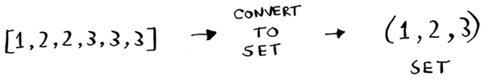

## Code for setup [3/4]

- You also need the list of stations that you’re choosing from. I chose to use a hash for this:

```{python, eval=TRUE}
stations = {}
stations['kone'] = set(['id', 'nv', 'ut'])
stations['ktwo'] = set(['wa', 'id', 'mt'])
stations['kthree'] = set(['or', 'nv', 'ca'])
stations['kfour'] = set(['nv', 'ut'])
stations['kfive'] = set(['ca', 'az'])
```

- The keys are station names, and the values are the states they cover.
- So in this example, the kone station covers Idaho, Nevada, and Utah.
- All the values are sets, too. Making everything a set will make your life easier, as you’ll see soon.

## Code for setup [4/4]

- Finally, you need something to hold the final set of stations you’ll use:

```{python, eval=TRUE}
final_stations = set()
```

## Calculating the answer [1/2]

- Now you need to calculate what stations you’ll use. 
- Take a look at the image, and see if you can predict what stations you should use.


## Calculating the answer [2/2]

- There can be more than one correct solution. 
- You need to go through every station and pick the one that covers the most uncovered states. 
- I’ll call this ``best_station``:

```{python, eval=TRUE}
best_station = None
states_covered = set()
for station, states_for_station in stations.items():
  covered = states_needed & states_for_station
  if len(covered) > len(states_covered):
    best_station = station
    states_covered = covered
```

- ``states_covered`` is a set of all the states this station covers that haven’t been covered yet. 
- The for loop allows you to loop over every station to see which one is the best station.
- There’s a funny-looking line here:

```{python, eval=TRUE}
covered = states_needed & states_for_station
```
- What’s going on?

## Sets [1/5]

- Suppose you have a set of fruits.


- You also have a set of vegetables.


- When you have two sets, you can do some fun things with them.

## Sets [2/5]

- Here are some things you can do with sets.

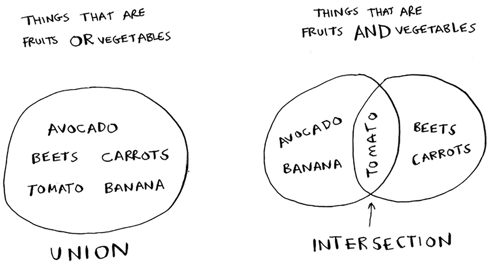

- A set union means “combine both sets.”
- A set intersection means “find the items that show up in both sets” (in this case, just the tomato).

## Sets [3/5]

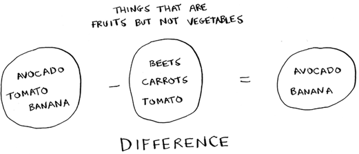

- A set difference means “subtract the items in one set from the items in the other set.”

## Sets [4/5]

```{bash, eval=FALSE}
>>> fruits = set(['avocado', 'tomato', 'banana'])
>>> vegetables = set(['beets', 'carrots', 'tomato'])
```

- This is a set union.

```{bash, eval=FALSE}
>>> fruits | vegetables
set(['avocado', 'beets', 'carrots', 'tomato', 'banana'])
```

- This is a set intersection.

```{bash, eval=FALSE}
>>> fruits & vegetables
set(['tomato'])
```

- This is a set difference.

```{bash, eval=FALSE}
>>> fruits – vegetables
set(['avocado', 'banana'])
>>> vegetables – fruits
set(['beets', 'carrots'])
```

## Sets [5/5]

To recap:

- Sets are like lists, except sets can’t have duplicates.
- You can do some interesting operations on sets, like union, intersection, and difference.

## Back to the code [1/4]

- Let’s get back to the original example.

```{python, eval=TRUE}
covered = states_needed & states_for_station
```

- ``covered`` is a set of states that were in both ``states_needed`` and ``states_for_station``. 
- So ``covered`` is the set of uncovered states that this station covers! 

## Back to the code [2/4]

- Next you check whether this station covers more states than the current ``best_station``:

```{python, eval=TRUE}
if len(covered) > len(states_covered):
  best_station = station
  states_covered = covered
```

- If so, this station is the new ``best_station``. 
- Finally, after the for loop is over, you add ``best_station`` to the final list of stations:

```{python, eval=TRUE}
final_stations.add(best_station)
```

## Back to the code [3/4]

- You also need to update ``states_needed``. Because this station covers some states, those states aren’t needed anymore:

```{python, eval=TRUE}
states_needed -= states_covered
```

- And you loop until states_needed is empty. Here’s the full code for the loop:

```{python, eval=TRUE}
while states_needed:
  best_station = None
  states_covered = set()
  
  for station, states_for_station in stations.items():
    covered = states_needed & states_for_station
    if len(covered) > len(states_covered):
      best_station = station
      states_covered = covered
      
  states_needed -= states_covered
  final_stations.add(best_station)
```

- Finally, you can print ``final_stations``, and you should see this:

```{python, eval=TRUE}
print(final_stations)
```

## Back to the code [4/4]

- Is that what you expected? Instead of stations 1, 2, 3, and 5, you could have chosen stations 2, 3, 4, and 5. 
- Let’s compare the run time of the greedy algorithm to the exact algorithm.

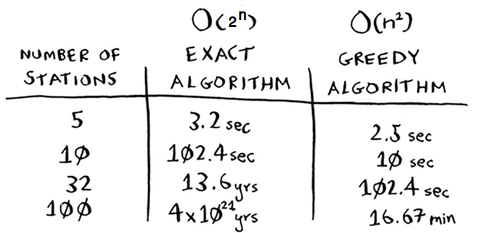

## Exercises (Greedy Algorithm)

Please refer to **page 152** of the textbook for exercises

## NP-complete problems [1/3]

- To solve the set-covering problem, you had to calculate every possible set.


## NP-complete problems [2/3]

- Maybe you were reminded of the traveling salesperson problem from chapter 1. 
- In this problem, a salesperson has to visit five different cities.


## NP-complete problems [3/3]

- And he’s trying to figure out the shortest route that will take him to all five cities. 
- To find the shortest route, you first have to calculate every possible route.

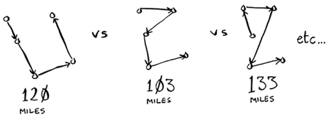

- How many routes do you have to calculate for five cities?

## Traveling salesperson, step by step [1/9]

- Let’s start small. 
- Suppose you only have two cities. There are two routes to choose from.

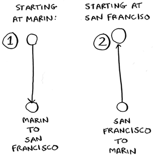

## Traveling salesperson, step by step [2/9]

- You may think this should be the same route. After all, isn’t SF > Marin the same distance as Marin > SF? 
- Not necessarily. 
- Some cities (like San Francisco) have a lot of one-way streets, so you can’t go back the way you came. 
- You might also have to go 1 or 2 miles out of the way to find an on-ramp to a highway. 
- So these two routes aren’t necessarily the same.

## Traveling salesperson, step by step [3/9]

- Now suppose you add one more city. How many possible routes are there?
- If you start at Berkeley, you have two more cities to visit.

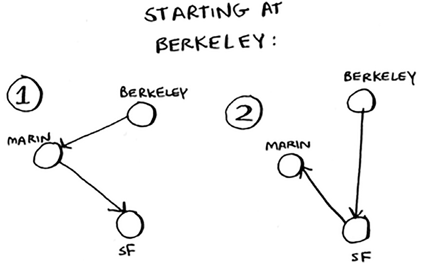

## Traveling salesperson, step by step [4/9]

- There are six total routes, two for each city you can start at.

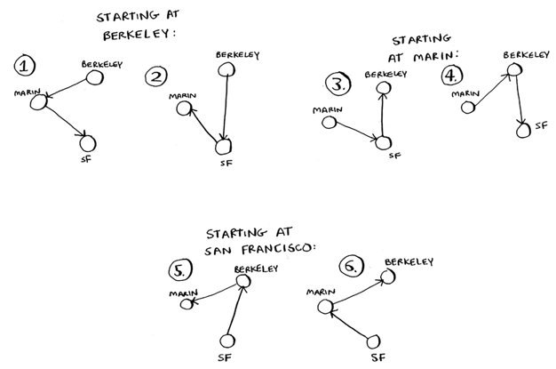

- So three cities = six possible routes.

## Traveling salesperson, step by step [5/9]

- Let’s add another city, Fremont. Now suppose you start at Fremont.

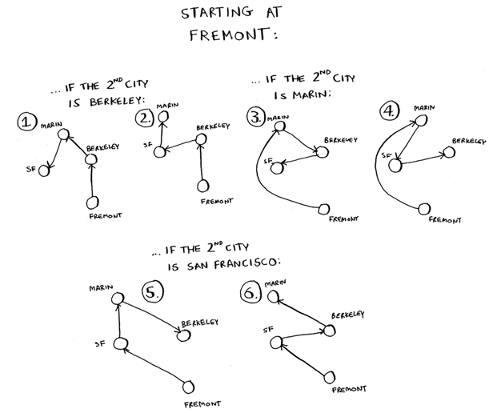

## Traveling salesperson, step by step [6/9]

- There are six possible routes starting from Fremont. 
- There’s a pattern here. 
- Suppose you have four cities, and you pick a start city, Fremont. There are three cities left. And you know that if there are three cities, there are six different routes for getting between those cities.
- If you start at Fremont, there are six possible routes. You could also start at one of the other cities.

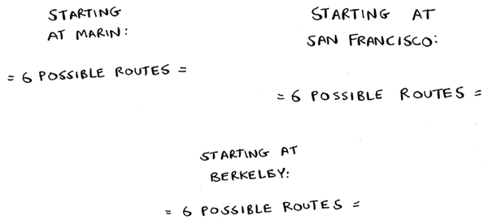

## Traveling salesperson, step by step [7/9]

- Four possible start cities, with six possible routes for each start ``city = 4 * 6 = 24`` possible routes.
- Do you see a pattern? 
- Every time you add a new city, you’re increasing the number of routes you have to calculate.

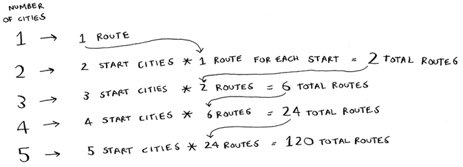

## Traveling salesperson, step by step [8/9]

- This is called the factorial function (remember reading about this in chapter 3?). 
- So ``5! = 120``. 
- Suppose you have 10 cities. How many possible routes are there? ``10! = 3,628,800``. 
- You have to calculate over 3 million possible routes for 10 cities. 
- As you can see, the number of possible routes becomes big very fast! 

## Traveling salesperson, step by step [9/9]

- The traveling-salesperson problem and the set-covering problem both have something in common: you calculate every possible solution and pick the smallest/shortest one. 
- Both of these problems are **NP-complete**.
- Here’s the short explanation of NP-completeness: some problems are famously hard to solve. The traveling salesperson and the set-covering problem are two examples. 
- A lot of smart people think that it’s not possible to write an algorithm that will solve these problems quickly.

## Approximating

- What’s a good approximation algorithm for the traveling salesperson?
- Something simple that finds a short path. 
- Here’s how I would do it: arbitrarily pick a start city. 
- Then, each time the salesperson has to pick the next city to visit, they pick the closest unvisited city. 
- Suppose they start in Marin.

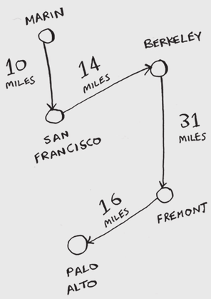

- Total distance: 71 miles. Maybe it’s not the shortest path, but it’s still pretty short.

## How do you tell if a problem is NP-complete? [1/6]

- Jonah is picking players for his fantasy football team. 
- He has a list of abilities he wants: good quarterback, good running back, good in rain, good under pressure, and so on. 
- He has a list of players, where each player fulfills some abilities.

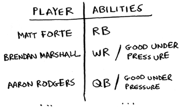    

## How do you tell if a problem is NP-complete? [2/6]

- Jonah needs a team that fulfills all his abilities, and the team size is limited. 
- “Wait a second,” Jonah realizes. “This is a set-covering problem!”

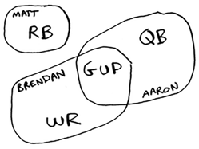

## How do you tell if a problem is NP-complete? [3/6]

Jonah can use the same approximation algorithm to create his team:

- Find the player who fulfills the most abilities that haven’t been fulfilled yet.
- Repeat until the team fulfills all abilities (or you run out of space on the team).

## How do you tell if a problem is NP-complete? [4/6]

- NP-complete problems show up everywhere! 
- It’s nice to know if the problem you’re trying to solve is NP-complete. 
- At that point, you can stop trying to solve it perfectly, and solve it using an approximation algorithm instead. 
- But it’s hard to tell if a problem you’re working on is NP-complete. 

## How do you tell if a problem is NP-complete? [5/6]

- Usually there’s a very small difference between a problem that’s easy to solve and an NP-complete problem. 
- For example, in the previous chapters, I talked a lot about shortest paths. 
- You know how to calculate the shortest way to get from point A to point B.

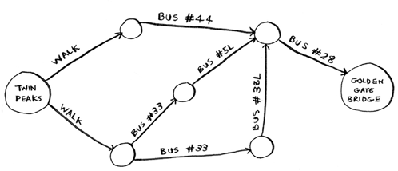

## How do you tell if a problem is NP-complete? [6/6]

- But if you want to find the shortest path that connects several points, that’s the traveling-salesperson problem, which is NP-complete. 
- The short answer: there’s no easy way to tell if the problem you’re working on is NP-complete. 

## Exercises (Greedy Algorithm)

Please refer to **page 159** of the textbook for exercises

## Recap

- Greedy algorithms optimize locally, hoping to end up with a global optimum.
- NP-complete problems have no known fast solution.
- If you have an NP-complete problem, your best bet is to use an approximation algorithm.
- Greedy algorithms are easy to write and fast to run, so they make good approximation algorithms.


