```{r setup, include=FALSE}
knitr::opts_chunk$set(echo = TRUE)
```

<style>
slides > slide { overflow: scroll; }
slides > slide:not(.nobackground):after {
  content: '';
}
</style>


## Chapter Overview

- You learn dynamic programming, a technique to solve a hard problem by breaking it up into subproblems and solving those subproblems first.
- Using examples, you learn to how to come up with a dynamic programming solution to a new problem.

## The knapsack problem [1/2]

- Let’s revisit the knapsack problem from chapter 8.
- You’re a thief with a knapsack that can carry 4 lb of goods.


## The knapsack problem [2/2]

- You have three items that you can put into the knapsack.

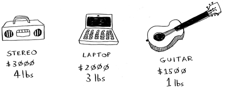

- What items should you steal so that you steal the maximum money’s worth of goods?

## The simple solution [1/3]

- The simplest algorithm is this: you try every possible set of goods and find the set that gives you the most value.

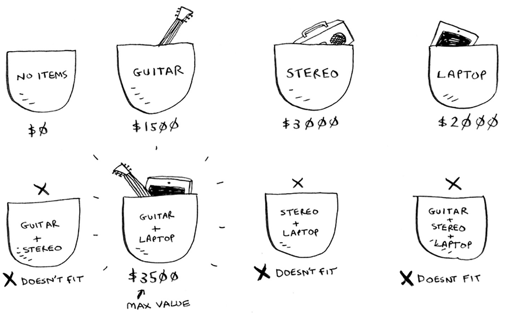

## The simple solution [2/3]

- This works, but it’s really slow. For 3 items, you have to calculate 8 possible sets.
- For 4 items, you have to calculate 16 sets. With every item you add, the number of sets you have to calculate doubles!
- This algorithm takes $O(2^n)$ time, which is very, very slow.

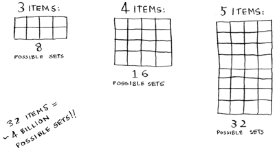

## The simple solution [3/3]

- That’s impractical for any reasonable number of goods.
- In chapter 8, you saw how to calculate an approximate solution.
- That solution will be close to the optimal solution, but it may not be the optimal solution.
- So how do you calculate the optimal solution?

## Dynamic programming [1/3]

- Answer: With dynamic programming!
- Dynamic programming starts by solving subproblems and builds up to solving the big problem.
- For the knapsack problem, you’ll start by solving the problem for smaller knapsacks (or “sub-knapsacks”) and then work up to solving the original problem.

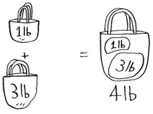

## Dynamic programming [2/3]

- Dynamic programming is a hard concept, so don’t worry if you don’t get it right away. We’re going to look at a lot of examples.
- I’ll start by showing you the algorithm in action first.
- After you’ve seen it in action once, you’ll have a lot of questions!
- I’ll do my best to address every question.

## Dynamic programming [3/3]

- Every dynamic-programming algorithm starts with a grid. Here’s a grid for the knapsack problem.

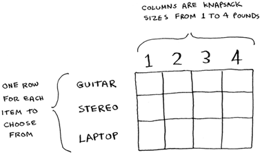

- The rows of the grid are the items, and the columns are knapsack weights from 1 lb to 4 lb.
- You need all of those columns because they will help you calculate the values of the sub-knapsacks.
- The grid starts out empty. You’re going to fill in each cell of the grid.
- Once the grid is filled in, you’ll have your answer to this problem!
- Please follow along. Make your own grid, and we’ll fill it out together.

## The guitar row [1/6]

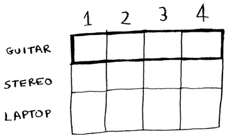

- This is the guitar row, which means you’re trying to fit the guitar into the knapsack.
- At each cell, there’s a simple decision: do you steal the guitar or not?
- Remember, you’re trying to find the set of items to steal that will give you the most value.

## The guitar row [2/6]

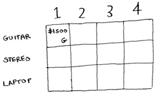

- The first cell has a knapsack of capacity 1 lb. The guitar is also 1 lb, which means it fits into the knapsack!
- So the value of this cell is $1,500, and it contains a guitar.
- Like this, each cell in the grid will contain a list of all the items that fit into the knapsack at that point.

## The guitar row [3/6]

- Let’s look at the next cell.
- Here you have a knapsack of capacity 2 lb.
- Well, the guitar will definitely fit in there!


## The guitar row [4/6]

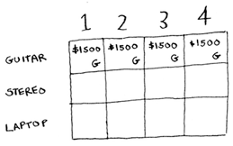

- The same for the rest of the cells in this row.
- Remember, this is the first row, so you have only the guitar to choose from.
- You’re pretending that the other two items aren’t available to steal right now.

## The guitar row [5/6]

- At this point, you’re probably confused.
- Why are you doing this for knapsacks with a capacity of 1 lb, 2 lb, and so on, when the problem talks about a 4 lb knapsack?
- Remember how I told you that dynamic programming starts with a small problem and builds up to the big problem?
- You’re solving subproblems here that will help you to solve the big problem.
- Read on, and things will become clearer.

## The guitar row [6/6]

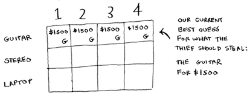

- Remember, you’re trying to maximize the value of the knapsack.
- This row represents the current best guess for this max.
- So right now, according to this row, if you had a knapsack of capacity 4 lb, the max value you could put in there would be $1,500.
- You know that’s not the final solution. As we go through the algorithm,
you’ll refine your estimate.


## The stereo row [1/4]

- Let’s do the next row. This one is for the stereo.
- Now that you’re on the second row, you can steal the stereo or the guitar.
- At every row, you can steal the item at that row or the items in the rows above it.
- So you can’t choose to steal the laptop right now, but you can steal the stereo and/or the guitar.
- Let’s start with the first cell, a knapsack of capacity 1 lb.
- The current max value you can fit into a knapsack of 1 lb is $1,500.

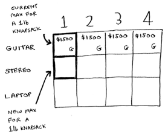

## The stereo row [2/4]

- Should you steal the stereo or not?
- You have a knapsack of capacity 1 lb.
- Will the stereo fit in there? Nope, it’s too heavy!
- Because you can’t fit the stereo, $1,500 remains the max guess for a 1 lb knapsack.

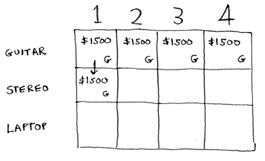

## The stereo row [3/4]

- Same thing for the next two cells.
- These knapsacks have a capacity of 2 lb and 3 lb. The old max value for both was $1,500.

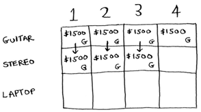

- The stereo still doesn’t fit, so your guesses remain unchanged.

## The stereo row [4/4]

- What if you have a knapsack of capacity 4 lb? Aha: the stereo finally fits!
- The old max value was \$1,500, but if you put the stereo in there instead, the value is \$3,000! Let’s take the stereo.
- You just updated your estimate!
- If you have a 4 lb knapsack, you can fit at least $3,000 worth of goods in it.
- You can see from the grid that you’re incrementally updating your estimate.

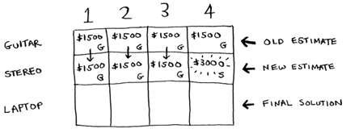

## The laptop row [1/7]

- Let’s do the same thing with the laptop!
- The laptop weighs 3 lb, so it won’t fit into a 1 lb or a 2 lb knapsack.
- The estimate for the first two cells stays at $1,500.

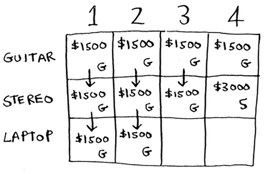

## The laptop row [2/7]

- At 3 lb, the old estimate was \$1,500.
- But you can choose the laptop instead, and that’s worth \$2,000. So the new max estimate is \$2,000!

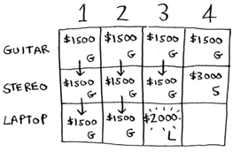

## The laptop row [3/7]

- At 4 lb, things get really interesting. This is an important part.
- The current estimate is $3,000.
- You can put the laptop in the knapsack, but it’s only worth $2,000.


## The laptop row [4/7]

- Hmm, that’s not as good as the old estimate. But wait!
- The laptop weighs only 3 lb, so you have 1 lb free!
- You could put something in this 1 lb.

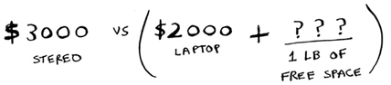


## The laptop row [5/7]

- What’s the maximum value you can fit into 1 lb of space? Well, you’ve been calculating it all along.

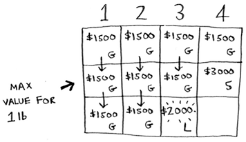

## The laptop row [6/7]

- According to the last best estimate, you can fit the guitar into that 1 lb space, and that’s worth $1,500.
- So the real comparison is as follows.

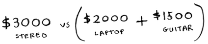


- You might have been wondering why you were calculating max values for smaller knapsacks.
- I hope now it makes sense!
- When you have space left over, you can use the answers to those subproblems to figure out what will fit in that space.
- It’s better to take the laptop + the guitar for $3,500.

## The laptop row [7/7]

- There’s the answer: the maximum value that will fit in the knapsack is $3,500, made up of a guitar and a laptop!

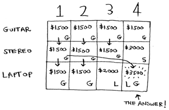

## The formula [1/2]

- Maybe you think that I used a different formula to calculate the value of that last cell.
- That’s because I skipped some unnecessary complexity when filling in the values of the earlier cells.
- Each cell’s value gets calculated with the same formula. Here it is:

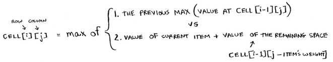

## The formula [2/2]

- You can use this formula with every cell in this grid, and you should end up with the same grid I did.
- Remember how I talked about solving subproblems?
- You combined the solutions to two subproblems to solve the bigger problem.

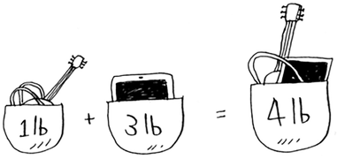


## What happens if you add an item? [1/8]

- Suppose you realize there’s a fourth item you can steal that you didn’t notice before!
- You can also steal an iPhone.

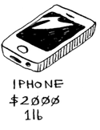

## What happens if you add an item? [2/8]

- Do you have to recalculate everything to account for this new item?
- Nope. Remember, dynamic programming keeps progressively building on your estimate.
- So far, these are the max values.

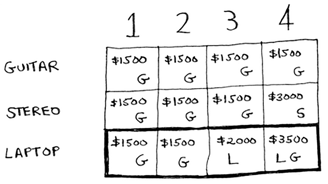

## What happens if you add an item? [3/8]

- That means for a 4 lb knapsack, you can steal $3,500 worth of goods.
- You thought that was the final max value.
- But let’s add a row for the iPhone.


## What happens if you add an item? [4/8]

- Turns out you have a new max value! Try to fill in this new row before reading on.
- Let’s start with the first cell. The iPhone fits into the 1 lb knapsack.
- The old max was \$1,500, but the iPhone is worth \$2,000.
- Let’s take the iPhone instead.

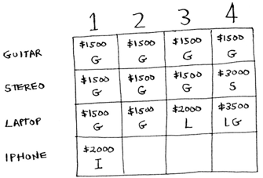

## What happens if you add an item? [5/8]

- In the next cell, you can fit the iPhone and the guitar.

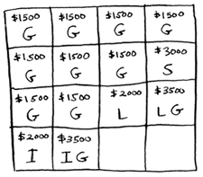

- For cell 3, you can’t do better than take the iPhone and the guitar again, so leave it as is.

## What happens if you add an item? [6/8]

- For the last cell, things get interesting.
- The current max is $3,500.
- You can steal the iPhone instead, and you have 3 lb of space left over.

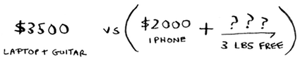

- Those 3 lb are worth $2,000!
- \$2,000 from the iPhone + \$2,000 from the old subproblem: that’s $4,000. A new max!

## What happens if you add an item? [7/8]

- Here’s the new final grid.


## What happens if you add an item? [8/8]

- Question: Would the value of a column ever go down? Is this possible?


- Think of an answer before reading on.
- Answer: No. At every iteration, you’re storing the current max estimate. The estimate can never get worse than it was before!


## Exercises (Dynamic Programming)

Please refer to **page 173** of the textbook for exercises

## What happens if you change the order of the rows? [1/2]

- Does the answer change?
- Suppose you fill the rows in this order: stereo, laptop, guitar.
- What does the grid look like?
- Fill out the grid for yourself before moving on.

## What happens if you change the order of the rows? [2/2]

- Here’s what the grid looks like.

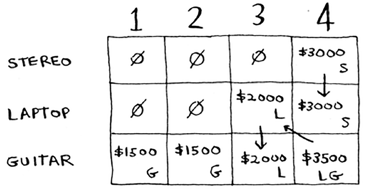

- The answer doesn’t change. The order of the rows doesn’t matter.

## What happens if you add a smaller item? [1/2]

- Suppose you can steal a necklace.
- It weighs 0.5 lb, and it’s worth $1,000.
- So far, your grid assumes that all weights are integers.
- Now you decide to steal the necklace.
- You have 3.5 lb left over. What’s the max value you can fit in 3.5 lb?
- You don’t know! You only calculated values for 1 lb, 2 lb, 3 lb, and 4 lb knapsacks.
- You need to know the value of a 3.5 lb knapsack.

## What happens if you add a smaller item? [2/2]

- Because of the necklace, you have to account for finer granularity, so the grid has to change.

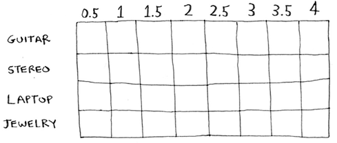

## Can you steal fractions of an item? [1/3]

- Suppose you’re a thief in a grocery store. You can steal bags of lentils and rice.
- If a whole bag doesn’t fit, you can open it and take as much as you can carry.
- So now it’s not all or nothing—you can take a fraction of an item.
- How do you handle this using dynamic programming?
- Answer: You can’t. With the dynamic-programming solution, you either take the item or not.
- There’s no way for it to figure out that you should take half an item.

## Can you steal fractions of an item? [2/3]

- But this case is also easily solved using a greedy algorithm!
- First, take as much as you can of the most valuable item.
- When that runs out, take as much as you can of the next most valuable item, and so on.
- For example, suppose you have these items to choose from.

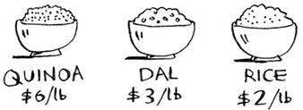

## Can you steal fractions of an item? [3/3]

- Quinoa is more expensive per pound than anything else.
- So, take all the quinoa you can carry! If that fills your knapsack, that’s the best you can do.
- If the quinoa runs out and you still have space in your knapsack, take the next most valuable item, and so on.

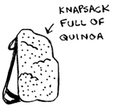

## Optimizing your travel itinerary [1/3]

- Suppose you’re going to London for a nice vacation.
- You have two days there and a lot of things you want to do.
- You can’t do everything, so you make a list.
- For each thing you want to see, you write down how long it will take and rate how much you want to see it.
- Can you figure out what you should see, based on this list?

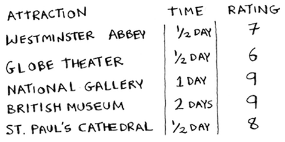

## Optimizing your travel itinerary [2/3]

- It’s the knapsack problem again! Instead of a knapsack, you have a limited amount of time.
- And instead of stereos and laptops, you have a list of places you want to go.
- Draw the dynamic-programming grid for this list before moving on.
- Here’s what the grid looks like.

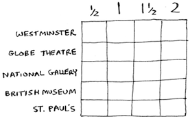

## Optimizing your travel itinerary [3/3]

- Did you get it right? Fill in the grid.
- What places should you end up seeing? Here’s the answer.

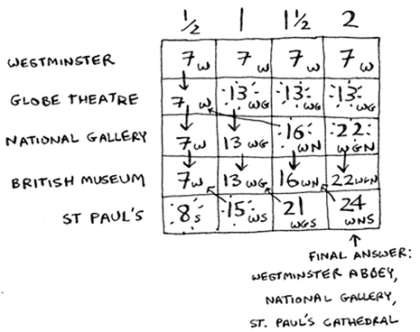


## Handling items that depend on each other [1/3]

- Suppose you want to go to Paris, so you add a couple of items on the list.

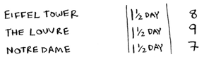

- These places take a lot of time, because first you have to travel from London to Paris.
- That takes half a day.
- If you want to do all three items, it will take four and a half days.

## Handling items that depend on each other [2/3]

- Wait, that’s not right. You don’t have to travel to Paris for each item.
- Once you’re in Paris, each item should only take a day.
- So it should be one day per item + half a day of travel = 3.5 days, not 4.5 days.
- If you put the Eiffel Tower in your knapsack, then the Louvre becomes “cheaper”—it will only cost you a day instead of 1.5 days.
- How do you model this in dynamic programming?

## Handling items that depend on each other [3/3]

- You can’t.
- Dynamic programming is powerful because it can solve subproblems and use those answers to solve the big problem.
- Dynamic programming only works when each subproblem is discrete—when it doesn’t depend on other subproblems.
- That means there’s no way to account for Paris using the dynamic-programming algorithm.

## Is it possible that the solution will require more than two sub-knapsacks? [skip]

- It’s possible that the best solution involves stealing more than two items.
- The way the algorithm is set up, you’re combining two knapsacks at most—you’ll never have more than two sub-knapsacks.
- But it’s possible for those sub-knapsacks to have their own sub-knapsacks.

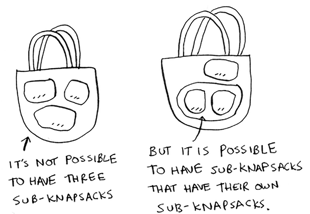

## Is it possible that the best solution doesn’t fill the knapsack completely?

- Yes. Suppose you could also steal a diamond.
- This is a big diamond: it weighs 3.5 pounds.
- It’s worth a million dollars, way more than anything else. You should definitely steal it!
- But there’s half a pound of space left, and nothing will fit in that space.

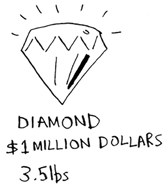

## Exercises (Dynamic Programming)

Please refer to **page 178** of the textbook for exercises

## Dynamic programming so far [1/2]

You’ve seen one dynamic programming problem so far. What are the takeaways?

- Dynamic programming is useful when you’re trying to optimize something given a constraint. In the knapsack problem, you had to maximize the value of the goods you stole, constrained by the size of the knapsack.
- You can use dynamic programming when the problem can be broken into discrete subproblems, and they don’t depend on each other.

## Dynamic programming so far [2/2]

It can be hard to come up with a dynamic-programming solution. That’s what we’ll focus on in this section. Some general tips follow:

- Every dynamic-programming solution involves a grid.
- The values in the cells are usually what you’re trying to optimize. For the knapsack problem, the values were the value of the goods.
- Each cell is a subproblem, so think about how you can divide your problem into subproblems. That will help you figure out what the axes are.

## Longest common substring [1/2]

- Let’s look at another example. Suppose you run dictionary.com.
- Someone types in a word, and you give them the definition.
- But if someone mis-spells a word, you want to be able to guess what word they meant.
- Alex is searching for **fish**, but he accidentally put in **hish**.
- That’s not a word in your dictionary, but you have a list of words that are similar.


## Longest common substring [2/2]

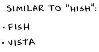

- This is a toy example, so you’ll limit your list to two words.
- In reality, this list would probably be thousands of words.
- Alex typed **hish**. Which word did Alex mean to type: **fish** or **vista**?

## Making the grid [1/3]

- What does the grid for this problem look like? You need to answer these questions:

    - What are the values of the cells?
    - How do you divide this problem into subproblems?
    - What are the axes of the grid?

- In dynamic programming, you’re trying to maximize something.
- In this case, you’re trying to find the longest substring that two words have in common.
- What substring do **hish** and **fish** have in common?
- How about **hish** and **vista**?
- That’s what you want to calculate.    

## Making the grid [2/3]

- Remember, the values for the cells are usually what you’re trying to optimize.
- In this case, the values will probably be a number: the length of the longest substring that the two strings have in common.
- Instead of comparing hish and fish, you could compare *his* and *fis* first.
- Each cell will contain the length of the longest substring that two substrings have in common.
- This also gives you a clue that the axes will probably be the two words.

## Making the grid [3/3]

- So the grid probably looks like this.

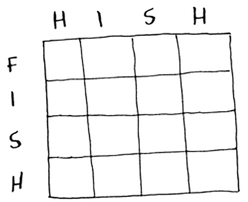

- If this seems like black magic to you, don’t worry.
- This is hard stuff, that’s why I’m teaching it so late in the book!
- Later, I’ll give you an exercise so you can practice dynamic programming yourself.

## Filling in the grid [1/4]

- Computer scientists sometimes joke about using the Feynman algorithm.
- The Feynman algorithm is named after the famous physicist Richard Feynman, and it works like this:

    - Write down the problem.
    - Think real hard.
    - Write down the solution.

## Filling in the grid [2/4]

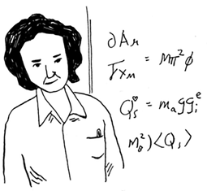

- Computer scientists are a fun bunch!

## Filling in the grid [3/4]

- The truth is, there’s no easy way to calculate the formula here.
- You have to experiment and try to find something that works.
- Sometimes algorithms aren’t an exact recipe.
- They’re a framework that you build your idea on top of.
- Try to come up with a solution to this problem yourself.

## Filling in the grid [4/4]

- I’ll give you a hint, part of the grid looks like this.

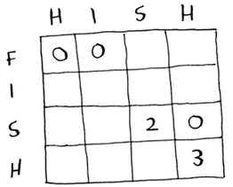

- What are the other values? Remember that each cell is the value of a subproblem.
- Why does cell (3, 3) have a value of 2? Why does cell (3, 4) have a value of 0?
- Read on after you’ve tried to come up with a formula yourself.
- Even if you don’t get it right, my explanation will make a lot more sense.

## The solution [1/5]

- Here’s the final grid.

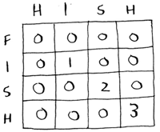

## The solution [2/5]

- Here’s my formula for filling in each cell.

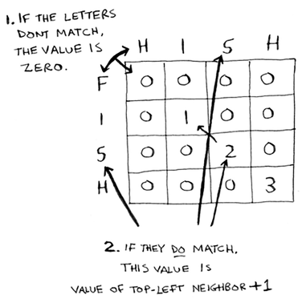

## The solution [3/5]

- Here’s how the formula looks in pseudocode:

```{python, eval=FALSE}
if word_a[i] == word_b[j]:
    cell[i][j] = cell[i-1][j-1] + 1
else:
    cell[i][j] = 0
```

## The solution [4/5]

- Here’s the grid for **hish** vs. **vista**.

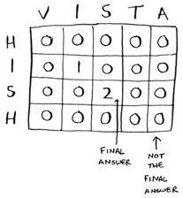


## The solution [5/5]

- One thing to note: for this problem, the final solution may not be in the last cell!
- For the knapsack problem, this last cell always had the final solution.
- But for the longest common substring, the solution is the largest number in the grid—and it may not be the last cell.
- Let’s go back to the original question: which string has more in common with **hish**?
- **hish** and **fish** have a substring of three letters in common.
- **hish** and **vista** have a substring of two letters in common.
- Alex probably meant to type **fish**.

## Longest common subsequence [1/3]

- Suppose Alex accidentally searched for fosh. 
- Which word did he mean: **fish** or **fort**?
- Let’s compare them using the longest-common-substring formula.

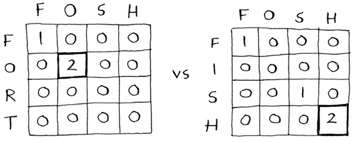

## Longest common subsequence [2/3]

- They’re both the same: two letters! But **fosh** is closer to **fish**.

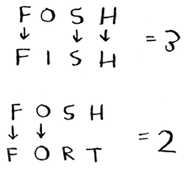

- You’re comparing the longest common **substring**, but you really need to compare the longest common **subsequence**: the number of letters in a sequence that the two words have in common. 
- How do you calculate the longest common subsequence?

## Longest common subsequence [3/3]

- Here’s the partial grid for **fish** and **fosh**.

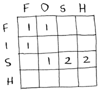

- Can you figure out the formula for this grid? 
- The longest common subsequence is very similar to the longest common substring, and the formulas are pretty similar, too.

## Longest common subsequence - solution [1/3]

- Here’s the final grid.

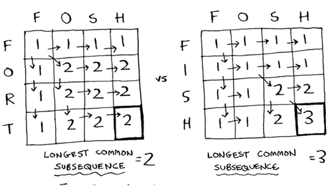

## Longest common subsequence - solution [2/3]

- Here’s my formula for filling in each cell.

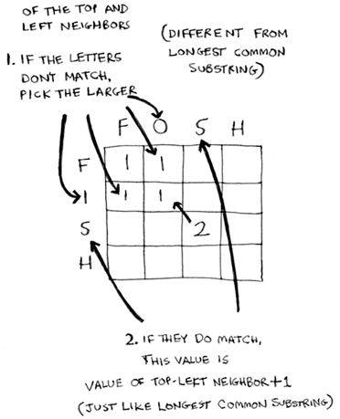

## Longest common subsequence - solution [3/3]

- And here it is in pseudocode:

```{python, eval=FALSE}
if word_a[i] == word_b[j]:
  cell[i][j] = cell[i-1][j-1] + 1
else:
  cell[i][j] = max(cell[i-1][j], cell[i][j-1])
```

## We did it :) 

Whew—you did it! This is definitely one of the toughest chapters in the book. So is dynamic programming ever really used? Yes:

- Biologists use the longest common subsequence to find similarities in DNA strands. They can use this to tell how similar two animals or two diseases are. The longest common subsequence is being used to find a cure for multiple sclerosis.
- Have you ever used diff (like ``git diff``)? Diff tells you the differences between two files, and it uses dynamic programming to do so.
- We talked about string similarity. Levenshtein distance measures how similar two strings are, and it uses dynamic programming. Levenshtein distance is used for everything from spell-check to figuring out whether a user is uploading copyrighted data.
- Have you ever used an app that does word wrap, like Microsoft Word? How does it figure out where to wrap so that the line length stays consistent? Dynamic programming!

## Exercises (Dynamic Programming)

Please refer to **page 186** of the textbook for exercises

## Recap

- Dynamic programming is useful when you’re trying to optimize something given a constraint.
- You can use dynamic programming when the problem can be broken into discrete subproblems.
- Every dynamic-programming solution involves a grid.
- The values in the cells are usually what you’re trying to optimize.
- Each cell is a subproblem, so think about how you can divide your problem into subproblems.
- There’s no single formula for calculating a dynamic-programming solution.


