```{r setup, include=FALSE}
knitr::opts_chunk$set(echo = TRUE)
```

<style>
slides > slide { overflow: scroll; }
slides > slide:not(.nobackground):after {
  content: '';
}
</style>


## Chapter Overview

- You learn to build a classification system using the k-nearest neighbors algorithm.
- You learn about feature extraction.
- You learn about regression: predicting a number, like the value of a stock tomorrow, or how much a user will enjoy a movie.
- You learn about the use cases and limitations of k-nearest neighbors.

## Classifying oranges vs. grapefruit [1/5]

- Look at this fruit. Is it an orange or a grapefruit?
- Well, I know that grapefruits are generally bigger and redder.


## Classifying oranges vs. grapefruit [2/5]

- My thought process is something like this: I have a graph in my mind.

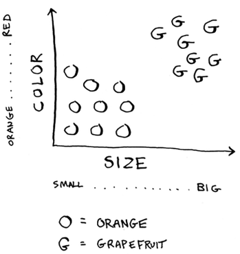

- Generally speaking, the bigger, redder fruit are grapefruits. 
- This fruit is big and red, so it’s probably a grapefruit.

## Classifying oranges vs. grapefruit [3/5]

- But what if you get a fruit like this?

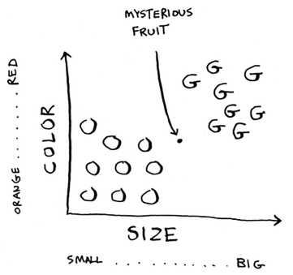

- How would you classify this fruit? 
- One way is to look at the neighbors of this spot. 
- Take a look at the three closest neighbors of this spot.

## Classifying oranges vs. grapefruit [4/5]

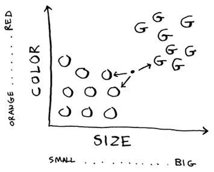

- More neighbors are oranges than grapefruit. 
- So this fruit is probably an orange. 
- Congratulations: You just used the **k-nearest neighbors (KNN)** algorithm for classification! 

## Classifying oranges vs. grapefruit [5/5]

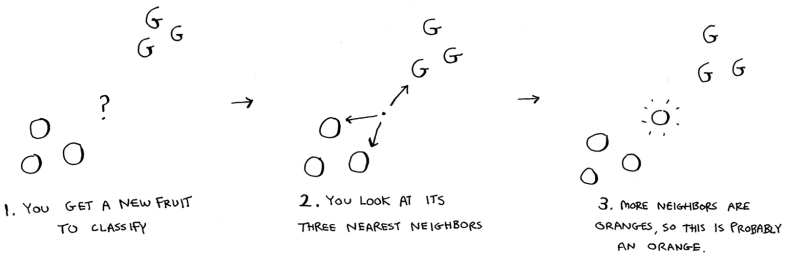

- The KNN algorithm is simple but useful! 
- If you’re trying to classify something, you might want to try KNN first. 
- Let’s look at a more real-world example.

## Building a recommendations system [1/3]

- Suppose you’re Netflix, and you want to build a movie recommendations system for your users. 
- On a high level, this is similar to the grapefruit problem!
- You can plot every user on a graph.


## Building a recommendations system [2/3]

- These users are plotted by similarity, so users with similar taste are plotted closer together. 
- Suppose you want to recommend movies for Priyanka. 
- Find the five users closest to her.

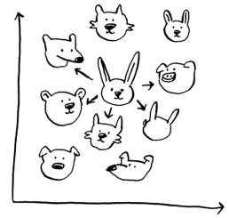

- Justin, JC, Joey, Lance, and Chris all have similar taste in movies. 
- So whatever movies they like, Priyanka will probably like too!

## Building a recommendations system [3/3]

- Once you have this graph, building a recommendations system is easy.
- If Justin likes a movie, recommend it to Priyanka.

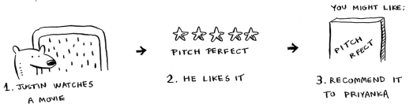

- But there’s still a big piece missing. 
- You graphed the users by similarity.
- How do you figure out how similar two users are?

## Feature extraction [1/10]

- In the grapefruit example, you compared fruit based on **how big** they are and **how red** they are. 
- **Size** and **color** are the **features** you’re comparing. 
- Now suppose you have three fruit. You can extract the features.

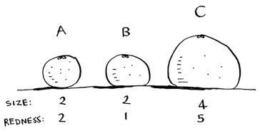

## Feature extraction [2/10]

- Then you can graph the three fruit.

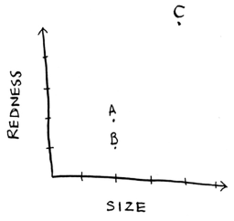

- From the graph, you can tell visually that fruits A and B are similar.

## Feature extraction [3/10]

- Let’s measure how close they are. 
- To find the distance between two points, you use the Pythagorean formula.

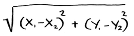

- Here’s the distance between A and B, for example.

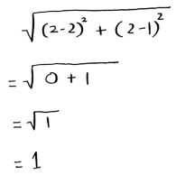

## Feature extraction [4/10]

- The distance between A and B is 1. 
- You can find the rest of the distances, too.

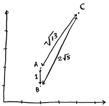

- The distance formula confirms what you saw visually: fruits A and B are similar.

## Feature extraction [5/10]

- Suppose you’re comparing Netflix users, instead. 
- You need some way to graph the users. 
- So, you need to convert each user to a set of coordinates, just as you did for fruit.

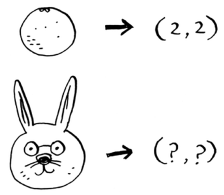

- Once you can graph users, you can measure the distance between them.

## Feature extraction [6/10]

- Here’s how you can convert users into a set of numbers. 
- When users sign up for Netflix, have them rate some categories of movies based on how much they like those categories. 
- For each user, you now have a set of ratings!

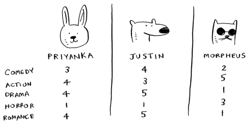

- Priyanka and Justin like Romance and hate Horror. 
- Morpheus likes Action but hates Romance (he hates when a good action movie gets ruined by a cheesy romantic scene).

## Feature extraction [7/10]

- Remember how in oranges versus grapefruit, each fruit was represented by a set of two numbers? 
- Here, each user is represented by a set of five numbers.

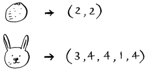

- A mathematician would say, instead of calculating the distance in two dimensions, you’re now calculating the distance in five dimensions. But the distance formula remains the same.

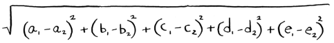

- It just involves a set of five numbers instead of a set of two numbers.

## Feature extraction [8/10]

- The distance formula is flexible: you could have a set of a million numbers and still use the same old distance formula to find the distance. 
- Maybe you’re wondering, “What does distance mean when you have five numbers?” 
- The distance tells you how similar those sets of numbers are.

## Feature extraction [9/10]

- Here’s the distance between Priyanka and Justin.

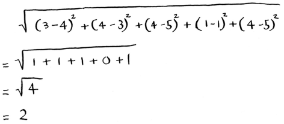

- Priyanka and Justin are pretty similar. 
- What’s the difference between Priyanka and Morpheus? Calculate the distance before moving on.
- Did you get it right? Priyanka and Morpheus are 24 apart. 
- The distance tells you that Priyanka’s tastes are more like Justin’s than Morpheus’s.

## Feature extraction [10/10]

- Great! Now recommending movies to Priyanka is easy: if Justin likes a movie, recommend it to Priyanka, and vice versa. 
- You just built a movie recommendations system!
- If you’re a Netflix user, Netflix will keep telling you, “Please rate more movies. The more movies you rate, the better your recommendations will be.” 
- Now you know why. The more movies you rate, the more accurately Netflix can see what other users you’re similar to.

## Exercises (K-Nearest Neighbors)

Please refer to **page 195** of the textbook for exercises

## Regression [1/5]

- Suppose you want to do more than just recommend a movie: you want to guess how Priyanka will rate this movie. 
- Take the five people closest to her.
- By the way, I keep talking about the closest five people. 
- There’s nothing special about the number 5: you could do the closest 2, or 10, or 10,000.
- That’s why the algorithm is called k-nearest neighbors and not five-nearest neighbors!

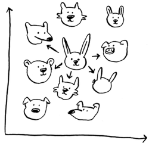

## Regression [2/5]

- Suppose you’re trying to guess a rating for Pitch Perfect. 
- Well, how did Justin, JC, Joey, Lance, and Chris rate it?

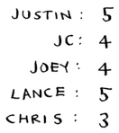

- You could take the average of their ratings and get 4.2 stars. That’s called **regression**. 
- These are the two basic things you’ll do with KNN:

  - Classification = categorization into a group
  - Regression = predicting a response (like a number)
  
## Regression [3/5]

- Regression is very useful. 
- Suppose you run a small bakery in Berkeley, and you make fresh bread every day. 
- You’re trying to predict how many loaves to make for today. You have a set of features:

  - Weather on a scale of 1 to 5 (1 = bad, 5 = great).
  - Weekend or holiday? (1 if it’s a weekend or a holiday, 0 otherwise.)
  - Is there a game on? (1 if yes, 0 if no.)
  


## Regression [4/5]

- And you know how many loaves of bread you’ve sold in the past for different sets of features.

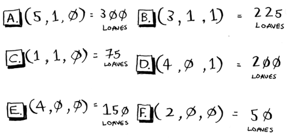

## Regression [5/5]

- Today is a weekend day with good weather. 
- Based on the data you just saw, how many loaves will you sell? 
- Let’s use KNN, where K = 4. 
- First, figure out the four nearest neighbors for this point.

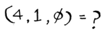

- Here are the distances. 

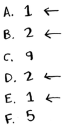

- A, B, D, and E are the closest.
- Take an average of the loaves sold on those days, and you get 218.75.
- That’s how many loaves you should make for today!

## Cosine similarity

- So far, you’ve been using the distance formula to compare the distance between two users. 
- Is this the best formula to use? 
- A common one used in practice is cosine similarity. Suppose two users are similar, but one of them is more conservative in their ratings. 
- They both loved Manmohan Desai’s Amar Akbar Anthony. Paul rated it 5 stars, but Rowan rated it 4 stars. 
- If you keep using the distance formula, these two users might not be each other’s neighbors, even though they have similar taste.
- Cosine similarity doesn’t measure the distance between two vectors.
- Instead, it compares the angles of the two vectors. 
- It’s better at dealing with cases like this. 
- Cosine similarity is out of the scope of this book, but look it up if you use KNN!

## Picking good features [1/4]

- To figure out recommendations, you had users rate categories of movies. 
- What if you had them rate pictures of cats instead?


- Then you’d find users who rated those pictures similarly. 
- This would probably be a worse recommendations engine, because the “features” don’t have a lot to do with taste in movies!
- Or suppose you ask users to rate movies so you can give them recommendations—but you only ask them to rate Toy Story, Toy Story 2, and Toy Story 3. 
- This won’t tell you a lot about the users’ movie tastes!

## Picking good features [2/4]

- When you’re working with KNN, it’s really important to pick the right features to compare against. 
- Picking the right features means:

  - Features that directly correlate to the movies you’re trying to recommend
  - Features that don’t have a bias (for example, if you ask the users to only rate comedy movies, that doesn’t tell you whether they like action movies)
  
## Picking good features [3/4]

- Do you think ratings are a good way to recommend movies? 
- Maybe I rated The Wire more highly than House Hunters, but I actually spend more time watching House Hunters. 
- How would you improve this Netflix recommendations system?

## Picking good features [4/4]

- Going back to the bakery: can you think of two good and two bad features you could have picked for the bakery? 
- Maybe you need to make more loaves after you advertise in the paper. 
- Or maybe you need to make more loaves on Mondays.

- There’s no one right answer when it comes to picking good features. 
- You have to think about all the different things you need to consider.  
  
## Exercises (K-Nearest Neighbors)

Please refer to **page 198** of the textbook for exercises

## Introduction to machine learning

- KNN is a really useful algorithm, and it’s your introduction to the magical world of **machine learning**! 
- **Machine learning** is all about making your computer more intelligent. 
- You already saw one example of machine learning: building a recommendations system. 
- Let’s look at some other examples.

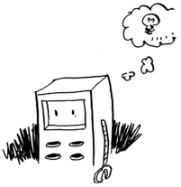

## OCR [1/3]

- OCR stands for **optical character recognition**. 
- It means you can take a photo of a page of text, and your computer will automatically read the text for you. 
- Google uses OCR to digitize books. How does OCR work?
- For example, consider this number.

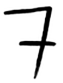

- How would you automatically figure out what number this is? 

## OCR [2/3]

- You can use KNN for this:

  - Go through a lot of images of numbers, and extract features of those numbers.
  - When you get a new image, extract the features of that image, and see what its nearest neighbors are!

- It’s the same problem as oranges versus grapefruit. 
- Generally speaking, OCR algorithms measure lines, points, and curves.

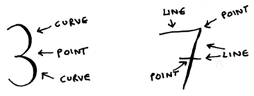

- Then, when you get a new character, you can extract the same features from it.

## OCR [3/3]

- Feature extraction is a lot more complicated in OCR than the fruit example. 
- But it’s important to understand that even complex technologies build on simple ideas, like KNN. 
- You could use the same ideas for speech recognition or face recognition. 
- When you upload a photo to Facebook, sometimes it’s smart enough to tag people in the photo automatically. 
- That’s **machine learning** in action!
- The first step of OCR, where you go through images of numbers and extract features, is called **training**. 
- Most machine learning algorithms have a training step: before your computer can do the task, it must be trained. 

## Building a spam filter [1/3]

- Spam filters use another simple algorithm called the **Naive Bayes** classifier. 
- First, you train your **Naive Bayes** classifier on some data.

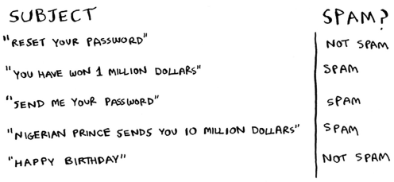

## Building a spam filter [2/3]

- Suppose you get an email with the subject “collect your million dollars now!” Is it spam? 
- You can break this sentence into words. 
- Then, for each word, see what the probability is for that word to show up in a spam email. 
- For example, in this very simple model, the word million only appears in spam emails. 
- Naive Bayes figures out the probability that something is likely to be spam. 

## Building a spam filter [3/3]

- Naive Bayes has applications similar to KNN.
- For example, you could use Naive Bayes to categorize fruit: you have a fruit that’s big and red. What’s the probability that it’s a grapefruit?
It’s another simple algorithm that’s fairly effective. We love those algorithms!

## Predicting the stock market

- Here’s something that’s hard to do with machine learning: really predicting whether the stock market will go up or down. 
- How do you pick good features in a stock market? 
- Suppose you say that if the stock went up yesterday, it will go up today. 
- Is that a good feature? Or suppose you say that the stock will always go down in May. Will that work? 
- There’s no guaranteed way to use past numbers to predict future performance. 
- Predicting the future is hard, and it’s almost impossible when there are so many variables involved.

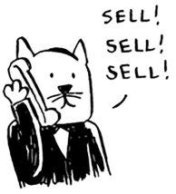

## Recap

- KNN is used for classification and regression and involves looking at the k-nearest neighbors.
- Classification = categorization into a group.
- Regression = predicting a response (like a number).
- Feature extraction means converting an item (like a fruit or a user) into a list of numbers that can be compared.
- Picking good features is an important part of a successful KNN algorithm.