```{r setup, include=FALSE}
knitr::opts_chunk$set(echo = TRUE)
```

<style>
slides > slide { overflow: scroll; }
slides > slide:not(.nobackground):after {
  content: '';
}
</style>


## Chapter Overview

- You get a brief overview of 10 algorithms (including data structures) that weren’t covered in this book, and why they’re useful.
- You get pointers on what to read next, depending on what your interests are.

## Trees [1/9]

- Let’s go back to the binary search example.
- When a user logs in to Facebook, Facebook has to look through a big array to see if the username exists. 
- We said the fastest way to search through this array is to run binary search. 
- But there’s a problem: every time a new user signs up, you insert their username into the array. 
- Then you have to re-sort the array, because binary search only works with sorted arrays. 


## Trees [2/9]

- Wouldn’t it be nice if you could insert the username into the right slot in the array right away, so you don’t have to sort the array afterward? 
- That’s the idea behind the **binary search tree** data structure.
- A binary search tree looks like this.

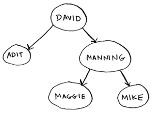

## Trees [3/9]

- For every node, the nodes to its **left** are **smaller** in value, and the nodes to the **right** are **larger** in value.

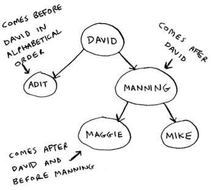

## Trees [4/9]

- Suppose you’re searching for Maggie. 
- You start at the root node.

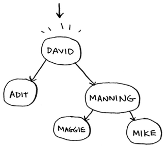

## Trees [5/9]

- Maggie comes after David, so go toward the right.

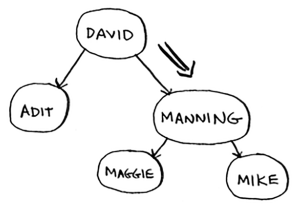

- Maggie comes before Manning, so go to the left.

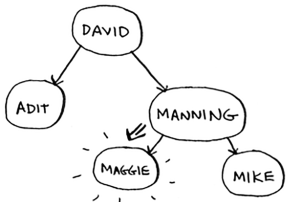

- You found Maggie! 

## Trees [6/9]

- It’s almost like running a binary search! 
- Searching for an element in a binary search tree takes $O(\log n)$ time on average and $O(n)$ time in the worst case. 
- Searching a sorted array takes $O(\log n)$ time in the worst case, so you might think a sorted array is better. 
- But a binary search tree is a lot faster for insertions and deletions on average.

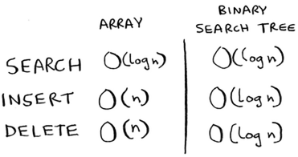

## Trees [7/9]

- Binary search trees have some downsides too: for one thing, you don’t get random access. 
- You can’t say, “Give me the fifth element of this tree.” 
- Those performance times are also on average and rely on the tree being balanced. 

## Trees [8/9]

- Suppose you have an imbalanced tree.

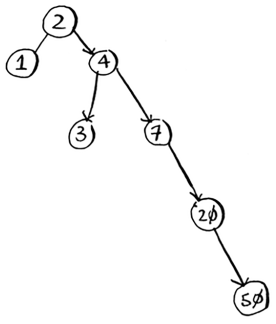

- See how it’s leaning to the right? 
- This tree doesn’t have very good performance, because it isn’t balanced. 
- There are special binary search trees that balance themselves. One example is the **red-black tree**.

## Trees [9/9]

- So when are binary search trees used? 
- **B-trees**, a special type of binary tree, are commonly used to store data in databases.
- If you’re interested in databases or more-advanced data structures, check these out:

    - B-trees
    - Red-black trees
    - Heaps
    - Splay trees

## Inverted indexes [1/3]

- Here’s a very simplified version of how a search engine works. 
- Suppose you have three web pages with this simple content.


## Inverted indexes [2/3]

- Let’s build a hash table from this content.

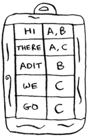

- The keys of the hash table are the words, and the values tell you what pages each word appears on.

## Inverted indexes [3/3]

- Now suppose a user searches for hi. 
- Let’s see what pages hi shows up on.


- Aha: It appears on pages A and B. Let’s show the user those pages as the result. 
- Or suppose the user searches for **there**.  Well, you know that it shows up on pages A and C. 
- Pretty easy, huh? This is a useful data structure: a hash that maps words to places where they appear. 
- This data structure is called an **inverted index**, and it’s commonly used to build search engines. 
- If you’re interested in search, this is a good place to start.

## The Fourier transform [1/3]

- The Fourier transform is one of those rare algorithms: brilliant, elegant, and with a million use cases. 
- The best analogy for the Fourier transform comes from [**Better Explained**](https://betterexplained.com/articles/an-interactive-guide-to-the-fourier-transform/) (a great website that explains math simply): given a smoothie, the Fourier transform will tell you the ingredients in the smoothie. 
- Or, to put it another way, given a song, the transform can separate it into individual frequencies.

## The Fourier transform [2/3]

- It turns out that this simple idea has a lot of use cases. 
- For example, if you can separate a song into frequencies, you can boost the ones you care about. You could boost the bass and hide the treble. 
- The Fourier transform is great for processing signals. 
- You can also use it to compress music. First you break an audio file down into its ingredient notes. The Fourier transform tells you exactly how much each note contributes to the overall song. 
- So you can just get rid of the notes that aren’t important. That’s how the **MP3** format works!
- Music isn’t the only type of digital signal. The **JPG** format is another compressed format, and it works the same way. 

## The Fourier transform [3/3]

- People use the Fourier transform to try to predict upcoming earthquakes and analyze DNA.
- You can use it to build an app like [Shazam](https://www.shazam.com/), which guesses what song is playing. 
- The Fourier transform has a lot of uses. Chances are high that you’ll run into it!

## Parallel algorithms [1/3]

- The next three topics are about scalability and working with a lot of data. 
- Back in the day, computers kept getting faster and faster. 
- If you wanted to make your algorithm faster, you could wait a few months, and the computers themselves would become faster. 
- But we’re near the end of that period. Instead, laptops and computers ship with multiple cores. 
- To make your algorithms faster, you need to change them to run in parallel across all the cores at once!

## Parallel algorithms [2/3]

- Here’s a simple example. The best you can do with a sorting algorithm is roughly $O(n \log n)$. 
- It’s well known that you can’t sort an array in $O(n)$ time, unless you use a parallel algorithm! 
- There’s a parallel version of quicksort that will sort an array in $O(n)$ time.

## Parallel algorithms [3/3]

- Parallel algorithms are hard to design. And it’s also hard to make sure they work correctly and to figure out what type of speed boost you’ll see. 
- One thing is for sure—the time gains aren’t linear. 
- So if you have two cores in your laptop instead of one, that almost never means your algorithm will magically run twice as fast. 
- There are a couple of reasons for this:

    - **Overhead of managing the parallelism**. Suppose you have to sort an array of 1,000 items. How do you divide this task among the two cores? Do you give each core 500 items to sort and then merge the two sorted arrays into one big sorted array? Merging the two arrays takes time.
    - **Load balancing**. Suppose you have 10 tasks to do, so you give each core 5 tasks. But core A gets all the easy tasks, so it’s done in 10 seconds, whereas core B gets all the hard tasks, so it takes a minute. That means core A was sitting idle for 50 seconds while core B was doing all the work! How do you distribute the work evenly so both cores are working equally hard?

## MapReduce [1/2]

- There’s a special type of parallel algorithm that is becoming increasingly popular: the distributed algorithm. 
- It’s fine to run a parallel algorithm on your laptop if you need two to four cores, but what if you need hundreds of cores? 
- Then you can write your algorithm to run across multiple machines. 
- The **MapReduce** algorithm is a popular distributed algorithm. You can use it through the popular open source tool **Apache Hadoop**.

## MapReduce [2/2]

- Suppose you have a table with billions or trillions of rows, and you want to run a complicated SQL query on it. 
- You can’t run it on MySQL, because it struggles after a few billion rows. Use MapReduce through Hadoop!
- Distributed algorithms are great when you have a lot of work to do and want to speed up the time required to do it.
- **MapReduce** in particular is built up from two simple ideas: the **map function** and the **reduce function**.

## The map function [1/2]

- The map function is simple: it takes an array and applies the same function to each item in the array. 
- For example, here we’re doubling every item in the array:

```{python, eval=TRUE}
arr1 = [1, 2, 3, 4, 5]
arr2 = map(lambda x: 2 * x, arr1)
print(list(arr2))
```

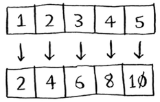

- ``arr2`` now contains ``[2, 4, 6, 8, 10]``, every element in ``arr1`` was doubled!

## The map function [2/2]

- Doubling an element is pretty fast. But suppose you apply a function that takes more time to process. 
- Look at this pseudocode:

```{python, eval=FALSE}
arr1 = [url1, url2, url3] # A list of URLs
arr2 = map(download_page, arr1)
```

- Here you have a list of URLs, and you want to download each page and store the contents in arr2 . This could take a couple of seconds for each URL. 
- If you had 1,000 URLs, this might take a couple of hours! 
- Wouldn’t it be great if you had 100 machines, and map could automatically spread out the work across all of them? Then you would be downloading 100 pages at a time, and the work would go a lot faster!
- This is the idea behind the “map” in MapReduce.

## The reduce function [1/3]

- The reduce function confuses people sometimes. The idea is that you “reduce” a whole list of items down to one item. 
- With ``map``, you go from one array to another.


- With ``reduce``, you transform an array to a single item.

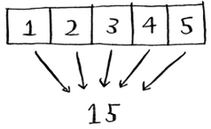


## The reduce function [2/3]

- Here’s an example:

```{python, eval=FALSE}
arr1 = [1, 2, 3, 4, 5]
reduce(lambda x,y: x+y, arr1)
```

- In this case, you sum up all the elements in the array: 1 + 2 + 3 + 4 + 5 = 15
- I won’t explain reduce in more detail here, because there are plenty of tutorials online.

## The reduce function [3/3]

- MapReduce uses these two simple concepts to run queries about data across multiple machines. 
- When you have a large dataset (billions of rows), MapReduce can give you an answer in minutes where a traditional database might take hours.

## Bloom filters and HyperLogLog [1/4]

- Suppose you’re running Reddit. When someone posts a link, you want to see if it’s been posted before. Stories that haven’t been posted before are considered more valuable. So you need to figure out whether this link has been posted before.
- Or suppose you’re Google, and you’re crawling web pages. You only want to crawl a web page if you haven’t crawled it already. So you need to figure out whether this page has been crawled before.
- Or suppose you’re running bit.ly, which is a URL shortener. You don’t want to redirect users to malicious websites. You have a set of URLs that are considered malicious. Now you need to figure out whether you’re redirecting the user to a URL in that set.
- All of these examples have the same problem. You have a very large set.


## Bloom filters and HyperLogLog [2/4]

- Now you have a new item, and you want to see whether it belongs in that set. 
- You could do this quickly with a hash. 
- For example, suppose Google has a big hash in which the keys are all the pages it has crawled.


## Bloom filters and HyperLogLog [3/4]

- You want to see whether you’ve already crawled ``adit.io``. Look it up in the hash.


- ``adit.io`` is a key in the hash, so you’ve already crawled it. 
- The average lookup time for hash tables is $O(1)$. 
- ``adit.io`` is in the hash, so you’ve already crawled it. You found that out in constant time. Pretty good!

## Bloom filters and HyperLogLog [4/4]

- Except that this hash needs to be huge. 
- Google indexes trillions of web pages. 
- If this hash has all the URLs that Google has indexed, it will take up a lot of space. 
- Reddit and bit.ly have the same space problem. 
- When you have so much data, you need to get creative!

## Bloom filters [1/2]

- **Bloom filters** offer a solution. **Bloom filters** are **probabilistic data structures**. 
- They give you an answer that could be wrong but is probably correct. 
- Instead of a hash, you can ask your bloom filter if you’ve crawled this URL before. 
- A hash table would give you an accurate answer. A bloom filter will give you an answer that’s probably correct:

    - **False positives** are possible. Google might say, “You’ve already crawled this site,” even though you haven’t.
    - **False negatives** aren’t possible. If the bloom filter says, “You haven’t crawled this site,” then you definitely haven’t crawled this site.

## Bloom filters [2/2]

- Bloom filters are great because they take up very little space. 
- A hash table would have to store every URL crawled by Google, but a bloom filter doesn’t have to do that. 
- They’re great when you don’t need an exact answer, as in all of these examples. 
- It’s okay for bit.ly to say, “We think this site might be malicious, so be extra careful.”

## HyperLogLog [1/2]

- Along the same lines is another algorithm called **HyperLogLog**.
- Suppose Google wants to count the number of unique searches performed by its users. Or suppose Amazon wants to count the number of unique items that users looked at today. 
- Answering these questions takes a lot of space! 
- With Google, you’d have to keep a log of all the unique searches. When a user searches for something, you have to see
whether it’s already in the log. If not, you have to add it to the log. 
- Even for a single day, this log would be massive!

## HyperLogLog [2/2]

- **HyperLogLog** approximates the number of unique elements in a set.
- Just like bloom filters, it won’t give you an exact answer, but it comes very close and uses only a fraction of the memory a task like this would otherwise take.
- If you have a lot of data and are satisfied with approximate answers, check out **probabilistic algorithms**!

## The SHA algorithms [1/2]

- Do you remember hashing from chapter 5? 
- Just to recap, suppose you have a key, and you want to put the associated value in an array.

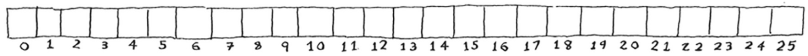

- You use a hash function to tell you what slot to put the value in.

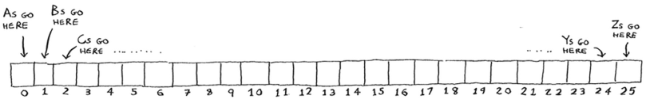

- And you put the value in that slot.

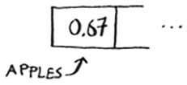

## The SHA algorithms [2/2]

- This allows you to do constant-time lookups. 
- When you want to know the value for a key, you can use the hash function again, and it will tell you in $O(1)$ time what slot to check.
- In this case, you want the hash function to give you a good distribution.
- So a hash function takes a string and gives you back the slot number for that string.

## Comparing files [1/3]

- Another hash function is a secure hash algorithm (SHA) function.
- Given a string, SHA gives you a hash for that string.


- The terminology can be a little confusing here. 
- SHA is a hash function. It generates a hash, which is just a short string. 
- The hash function for **hash tables** went **from string to array index**, whereas **SHA** goes **from string to string**.

## Comparing files [2/3]

- SHA generates a different hash for every string.

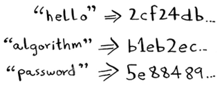

- You can use SHA to tell whether two files are the same. 
- This is useful when you have very large files. 

## Comparing files [3/3]

- Suppose you have a 4 GB file. You want to check whether your friend has the same large file. You don’t have to try to email them your large file. 
- Instead, you can both calculate the SHA hash and compare it.

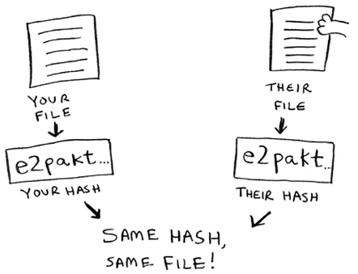

## Checking passwords [1/3]

- SHA is also useful when you want to compare strings without revealing what the original string was. 
- For example, suppose Gmail gets hacked, and the attacker steals all the passwords! 
- Is your password out in the open? No, it isn’t. 
- Google doesn’t store the original password, only the SHA hash of the password! 
- When you type in your password, Google hashes it and checks it against the hash in its database.

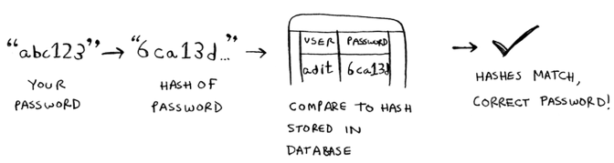

## Checking passwords [2/3]

- So it’s only comparing hashes—it doesn’t have to store your password!
- SHA is used very commonly to hash passwords like this. It’s a one-way hash. You can get the hash of a string.

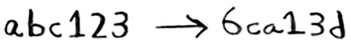

- But you can’t get the original string from the hash.

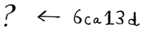

- That means if an attacker gets the SHA hashes from Gmail, they can’t convert those hashes back to the original passwords! 
- You can convert a password to a hash, but not vice versa.

## Checking passwords [3/3]

- SHA is actually a family of algorithms: SHA-0, SHA-1, SHA-2, and SHA-3. 
- As of this writing, SHA-0 and SHA-1 have some weaknesses.
- If you’re using an SHA algorithm for password hashing, use SHA-2 or SHA-3. 
- The gold standard for password-hashing functions is currently **bcrypt** (though nothing is foolproof).

## Locality-sensitive hashing [1/2] 

- **SHA** has another important feature: it’s **locality insensitive**. 
- Suppose you have a string, and you generate a hash for it.

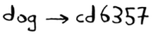

- If you change just one character of the string and regenerate the hash, it’s totally different!


- This is good because an attacker can’t compare hashes to see whether they’re close to cracking a password.

## Locality-sensitive hashing [2/2] 

- Sometimes, you want the opposite: you want a **locality-sensitive** hash function. 
- That’s where **Simhash** comes in. 
- If you make a small change to a string, **Simhash** generates a hash that’s only a little different. 
- This allows you to compare hashes and see how similar two strings are, which is pretty useful!

    - Google uses Simhash to detect duplicates while crawling the web.
    - A teacher could use Simhash to see whether a student was copying an essay from the web.
    - Scribd allows users to upload documents or books to share with others. But Scribd doesn’t want users uploading copyrighted content! The site could use Simhash to check whether an upload is similar to a Harry Potter book and, if so, reject it automatically.
    
- **Simhash** is useful when you want to check for similar items.
    
## Diffie-Hellman key exchange [1/5]

- The Diffie-Hellman algorithm deserves a mention here, because it solves an age-old problem in an elegant way. 
- How do you encrypt a message so it can only be read by the person you sent the message to?
- The easiest way is to come up with a cipher, like a = 1, b = 2, and so on.
- Then if I send you the message “4,15,7”, you can translate it to “d,o,g”.

## Diffie-Hellman key exchange [2/5]

- But for this to work, we both have to agree on the cipher. 
- We can’t agree over email, because someone might hack into your email, figure out the cipher, and decode our messages. 
- Heck, even if we meet in person, someone might guess the cipher—it’s not complicated. 
- So we should change it every day. But then we have to meet in person to change it every day!

## Diffie-Hellman key exchange [3/5]

- Even if we did manage to change it every day, a simple cipher like this is easy to crack with a brute-force attack. 
- Suppose I see the message “9,6,13,13,16 24,16,19,13,5”. 
- I’ll guess that this uses a = 1, b = 2, and so on.

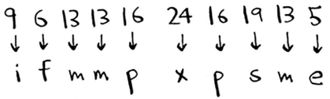

- That’s gibberish. Let’s try a = 2, b = 3, and so on.

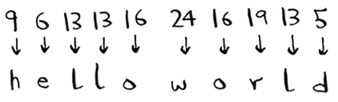

- That worked! A simple cipher like this is easy to break. 
- The Germans used a much more complicated cipher in WWII, but it was still cracked.

## Diffie-Hellman key exchange [4/5]

- Diffie-Hellman solves both problems:

    - Both parties don’t need to know the cipher. So we don’t have to meet and agree to what the cipher should be.
    - The encrypted messages are extremely hard to decode.
  
- Diffie-Hellman has two keys: a public key and a private key. 
- The public key is exactly that: public. You can post it on your website, email it to friends, or do anything you want with it. You don’t have to hide it.
- When someone wants to send you a message, they encrypt it using the public key. 
- An encrypted message can only be decrypted using the private key. As long as you’re the only person with the private key, only you will be able to decrypt this message!

## Diffie-Hellman key exchange [5/5]

- The Diffie-Hellman algorithm is still used in practice, along with its successor, RSA. 
- If you’re interested in cryptography, Diffie-Hellman is a good place to start: it’s elegant and not too hard to follow.

## Linear programming [1/3]

- Linear programming is used to maximize something given some constraints. 
- For example, suppose your company makes two products, shirts and totes. Shirts need 1 meter of fabric and 5 buttons. Totes need 2 meters of fabric and 2 buttons. You have 11 meters of fabric and 20 buttons. You make \$2 per shirt and \$3 per tote.
-How many shirts and totes should you make to maximize your profit?
- Here you’re trying to maximize profit, and you’re constrained by the amount of materials you have.

## Linear programming [2/3]

- Another example: you’re a politician, and you want to maximize the number of votes you get. 
- Your research has shown that it takes an average of an hour of work (marketing, research, and so on) for each vote from a San Franciscan or 1.5 hours/vote from a Chicagoan. 
- You need at least 500 San Franciscans and at least 300 Chicagoans. 
- You have 50 days. 
- It also costs you \$2/San Franciscan versus \$1/Chicagoan. Your total budget is $1,500. 
- What’s the maximum number of total votes you can get (San Francisco + Chicago)?
- Here you’re trying to maximize votes, and you’re constrained by time and money.

## Linear programming [3/3]

- You might be thinking, “You’ve talked about a lot of optimization topics in this book. 
- How are they related to linear programming?” 
- All the graph algorithms can be done through linear programming instead.
- Linear programming is a much more general framework, and graph problems are a subset of that. I hope your mind is blown!
- Linear programming uses the **Simplex** algorithm. It’s a complex algorithm, which is why I didn’t include it in this book. 
- If you’re interested in optimization, look up linear programming!

## Epilogue

- I hope this quick tour of 10 algorithms showed you how much more is left to discover. 
- I think the best way to learn is to find something you’re interested in and dive in. 
- This book gave you a solid foundation to do just that.


