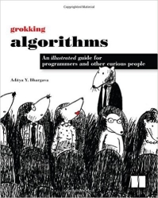
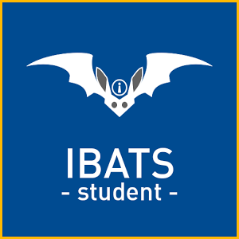

```{r setup, include=FALSE}
knitr::opts_chunk$set(echo = FALSE)
```

## Welcome
Welcome to Algorithms class :)

## Lecturer
- This class will be delivered by [Setia Budi](https://www.linkedin.com/in/boedybios)
- Feel free to call me Mbah Boedy :)
- Consultation time is provided for the students to discuss any matter realated to the class
- Consultation time: Wednesday from 3:00 to 5:00 pm at GWM lv.8
- Email: Setia.Budi@it.maranatha.edu

## Textbook


- The lecture in this class will be delivered based on a textbook
- Title: [Grokking Algorithms](https://www.manning.com/books/grokking-algorithms)
- Authors: Aditya Y. Bhargava  
- Publisher: Manning, 2016

## Softwares
- Operating Systems: Windows / MacOS / Linux
- Text Editor: [Atom](https://atom.io/)
- Python 3 distribution: [Anaconda](https://www.continuum.io/downloads)
- Web Browser: [Firefox](https://www.mozilla.org/en-US/firefox/new/) or [Chrome](https://www.google.com/chrome/browser/desktop/index.html)

## Grading
- KAT [50%]: 
  - Attendance (25%) 
  - Engagement (25%)
- UTS [25%]: Written Exam
- UAS [25%]: Written Exam

## Engagement Slip
- Each engagement in the class is entitled for an engagement mark.
- Please prepare a small piece of paper for engagement slip.
- Engagement slip should contain: **student ID**, **full name**, **date**, **week of lecture**.
- Hand in your engagement slip as a record for your engagement.
- Maximum one engagement mark per week.

## Communication and Discussion
- We are going to use [Slack](https://slack.com/) as a platform for communication and discussion
- Follow this [link](https://join.slack.com/t/boedy-class/shared_invite/enQtMjkzNDM4MDMzNzc3LWEyMjY1NDViMTQzZmNiMWQ5MDVkM2FiOWVmMTMxOTdkZmU0YTI5OWQwN2YyYzk2Y2RmOWE0M2U1ZTkyYjMxOTI) to signup to **Boedy Class** workspace.
- Slack can also be installed on [Windows](https://slack.com/downloads/windows), 
[Mac OS](https://slack.com/downloads/osx), 
[Linux](https://slack.com/downloads/linux), 
[Android](https://slack.com/downloads/android), or 
[IoS](https://slack.com/downloads/ios).


## Introducing IBAtS

- IBAtS is an Image Based Attendance System to record students attendance in a class.
- We are going to use IBAtS in this class (on top of the conventional attendance system).
- Please download it to your Android device via [PlayStore](https://play.google.com/store/apps/details?id=iBatsForStudent.Android).



## General Rules
- Be punctual, the lecture will start on time.
- Be respectful to others, no bullying in this class.
- Don't be hasitate to ask question if you have any difficulty in the class.
- Asking question and discussion are part of learning process.
- Being confused in the begining is a good indication that you are actually` learning something new, but don't leave it too long.
- Please study the textbook before and after the class.
- A study group could be a good way to learn from each other.
- Enjoy the class :)

