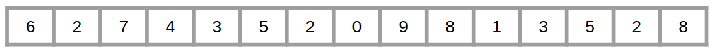
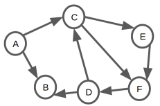

---
title: "Ujian Tengah Semester"
subtitle: Jurusan Sistem Informasi, Tahun Akademik 2017/2018
output:
          unilur::examen_pdf:
            id: no
            unilur::examen_pdf_solution:
            id: no
            ---
```{r setup, include=FALSE}
knitr::opts_chunk$set(echo = TRUE)
```

--------------  ----------------------------------------  --------------
Mata kuliah     BS204 / Algoritma                           Pengesahan

Semester        Genap                                        Kaprodi

Sifat Ujian     Closed Book

Hari / Tanggal  Rabu / 07.03.2018

Waktu           120 menit

Soal            Tidak Dibawa Pulang                        (__________)

Pengajar        Setia Budi                                 NIK:________
--------------  ----------------------------------------  --------------

<p>**Kerjakan soal-soal berikut secara berurutan.**</p>
<p>**Soal ujian ini disusun dengan mengacu pada Grokking Algorithms chapter 01 - chapter 06.**</p>
<p>**Setiap soal memiliki bobot nilai 4.**</p>

-----------------------------CHAPTER 01-----------------------------

##### Anda diminta untuk menebak sebuah angka dari sekumpulan angka terurut sejumlah 150 angka. Anda sudah menebak 3 kali dengan *Binary Search* dan gagal; dua tebakan pertama terlalu kecil dan tebakan ketiga terlalu besar. Untuk tebakan keempat, di manakah posisi index low, mid, dan high? Sertakan ilustrasi gambar untuk memperjelas jawaban!
```{asis, solution=FALSE, response.space=0.5}
<p>[Chapter 01]</p>
- tebakan 1: lo=0, mi=74, hi=149
    - tebakan 2: lo=75, mi=112, hi=149
    - tebakan 3: lo=113, mi=131, hi=149
    - tebakan 4: lo=113, mi=121, hi=130
```

##### Anda diminta melakukan pencarian data dari sekumpulan data berjumlah 512 element. Sebutkan jumlah langkah terbanyak yang dibutuhkan untuk melakukan pencarian dengan *simple search* dan *binary search*! Jelaskan!
```{asis, solution=FALSE, response.space=0.5}
<p>[Chapter 01]</p>
- Simple search memiliki running time $O(n)$ sehingga membutuhkan 512 langkah.
    - Binary search memiliki running time $O(\log n)$ sehingga membutuhkan 9 langkah.
```

##### Jelaskan apa yang dimaksud dengan *Big O* notation!
```{asis, solution=FALSE, response.space=0.5}
<p>[Chapter 01]</p>
Big O adalah notasi yang digunakan untuk mendeskripsikan kecepatan dari suatu algoritma terhadap ukuran data yang ditanganinya.
Secara umum Big O akan mengadopsi kondisi terburuk dalam mendeskripsikan kecepatan algoritma.
```

##### Anda diminta memilih salah satu dari dua algoritma untuk menyelesaikan permasalahan yang sama. Algoritma pertama memiliki running time *linear* dan algoritma kedua memiliki running time *logaritmic*. Algoritma manakah yang akan Anda pilih dengan mempertimbangkan efisiensi kecepatan? Beri penjelasan!
```{asis, solution=FALSE, response.space=0.5}
<p>[Chapter 01]</p>
Algoritma dengan running time logaritmic akan jauh lebih cepat dibandingkan algoritma dengan running time linear.
Untuk menangani data berukuran 512, algoritma dengan running time linear akan membutuhkan 512 langkah sedangkan algoritma dengan running time logaritmic hanya membutuhkan 9 langkah untuk menyelesaikan permasalahan yang sama.
```

-----------------------------CHAPTER 02-----------------------------

##### Jelaskan perbedaan mendasar antara *array* dan *linked-list* terkait mekanisme penyimpanan data di memory!
```{asis, solution=FALSE, response.space=0.5}
<p>[Chapter 02]</p>
Array akan menyimpan sekumpulan data di memory tepat bersebelahan antara data yang satu dengan lainnya.
Sedangkan linked-list dapat menyimpan data di mana pun di memory. Henya saja untuk setiap data yang tersimpan, linked-list perlu menyimpan informasi alamat memory dari data selanjutnya.
```

##### Sebut dan jelaskan dua mekanisme untuk mengakses data yang tersimpan di dalam memory!
```{asis, solution=FALSE, response.space=0.5}
<p>[Chapter 02]</p>
- Sequential access: Adalah mekanisme akses data secara terurut di mana data ke n hanya dapat diakses setelah melakukan akses terhadap data ke n-1. Hal ini dikarenakan alamat dari data ke n disimpan pada data ke n-1. Mekanisme semacam ini didapati pada linked-list.
    - Random access: Adalah mekanisme akses data secara acak di mana data ke n dapat diakses kapan pun tanpa perlu melakukan akses terhadap data sebelumnya. Hal ini dimungkinkan karena sekumpulan data disimpan tepat bersebelahan. Mekanisme semacam ini ditemui pada array.
```

##### Sebut dan jelaskan kondisi terburuk dari penerapan array terkait penambahan data baru!
```{asis, solution=FALSE, response.space=0.5}
<p>[Chapter 02]</p>
Kondisi terburuk dari array terkait penambahan data baru adalah ketika alamat memory untuk menempatkan data baru tersebut sudah ditempati data lain.
Untuk mengatasi kondisi ini, akan dilakukan pencarian alokasi memory baru yang dapat digunakan untuk menampung keseluruhan data array, termasuk data array yang baru.
Setelah ditemukan, seluruh data array akan dipindahkan dari alokasi memory yang lama ke alokasi memory yang baru.
```

-----------------------------CHAPTER 03-----------------------------

##### Sebut dan jelaskan dua komponen utama pada recursion!
```{asis, solution=FALSE, response.space=0.5}
<p>[Chapter 03]</p>
- Recursive case: adalah bagian ketika sebuah function memanggil dirinya sendiri sehingga memungkinkan terjadinya proses perulangan atau looping.
    - Base case: adalah kondisi yang menjadikan sebuah recursion berhenti memanggil dirinya sendiri. Base case dibutuhkan untuk mencegah terjadinya infinite-loop.
```

##### Sebut dan jelaskan dua operasi dasar pada *stack*!
```{asis, solution=FALSE, response.space=0.5}
<p>[Chapter 03]</p>
- Push: adalah proses penambahan data pada sebuah stack, di mana data baru akan ditempatkan di posisi paling atas dari stack.
    - Pop: adalah proses pengambilan data dari suatu stack, di mana data yang diambil adalah data yang berada pada posisi paling atas.
```

##### Jelaskan apa yang dimaksud dengan *call stack*!
```{asis, solution=FALSE, response.space=0.5}
<p>[Chapter 03]</p>
Call stack adalah data structure yang digunakan untuk menangani setiap pemanggilan function.
```


-----------------------------CHAPTER 04-----------------------------

##### Bila anda memiliki lahan berukuran 1680 meter x 1024 meter, berapakah ukuran tiap petak yang dihasilkan dengan menerapkan *Algoritma Euclid* untuk membagi lahan tersebut? Sertakan ilustrasi gambar untuk memperjelas jawaban:
        ```{asis, solution=FALSE, response.space=0.5}
        <p>[Chapter 04]</p>
        - GCF(1680, 1024) = 16
    - 1680 ÷ 1024 = 1 R 656    (1680 = 1 × 1024 + 656)
    - 1024 ÷ 656 = 1 R 368    (1024 = 1 × 656 + 368)
    - 656 ÷ 368 = 1 R 288    (656 = 1 × 368 + 288)
    - 368 ÷ 288 = 1 R 80    (368 = 1 × 288 + 80)
    - 288 ÷ 80 = 3 R 48    (288 = 3 × 80 + 48)
    - 80 ÷ 48 = 1 R 32    (80 = 1 × 48 + 32)
    - 48 ÷ 32 = 1 R 16    (48 = 1 × 32 + 16)
    - 32 ÷ 16 = 2 R 0    (32 = 2 × 16 + 0)
```

##### Sebutkan salah satu karakteristik dari *functional programming*:
        ```{asis, solution=FALSE, response.space=0.5}
        <p>[Chapter 04]</p>
        Bahasa pemrograman yang menerapkan functional programming tidak memiliki kemampuan untuk melakukan looping secara eksplisit.
        Looping dalam functional programming akan bergantung pada recursion.
```

##### Urutkan kumpulan data berikut ini mengggunakan *Quicksort* dengan menggunakan data paling *kiri* sebagai *pivot*! Sertakan ilustrasi gambar untuk memperjelas jawaban!

```{asis, solution=FALSE, response.space=0.5}
<p>[Chapter 04]</p>
left pivot
```

##### Urutkan kumpulan data berikut ini mengggunakan *Quicksort* dengan menggunakan data paling *kanan* sebagai *pivot*! Sertakan ilustrasi gambar untuk memperjelas jawaban!

```{asis, solution=FALSE, response.space=0.5}
<p>[Chapter 04]</p>
right pivot
```

##### Urutkan kumpulan data berikut ini mengggunakan *Quicksort* dengan menggunakan data posisi *tengah* sebagai *pivot*! Sertakan ilustrasi gambar untuk memperjelas jawaban!

```{asis, solution=FALSE, response.space=0.5}
<p>[Chapter 04]</p>
middle pivot
```

-----------------------------CHAPTER 05-----------------------------

##### Jelaskan apa yang dimaksud dengan *Hash Function*!
```{asis, solution=FALSE, response.space=0.5}
<p>[Chapter 05]</p>
Hash function adalah function yang digunakan untuk melakukan mapping dari suatu string (key) ke suatu nilai numerik (alokasi memory) tertentu
```

##### Sebutkan dua syarat utama *hash function*!
```{asis, solution=FALSE, response.space=0.5}
<p>[Chapter 05]</p>
- Konsisten dalam melakukan mapping suatu key ke value tertentu.
    - Setiap key yang berbeda akan selalu dimapping ke value yang berbeda.
```

##### Jelaskan apakah yang dimaksud dengan *hash table*!
```{asis, solution=FALSE, response.space=0.5}
<p>[Chapter 05]</p>
Hash table adalah data structure yang menggabungkan penggunaan array dan hash function.
```

##### Jelaskan apakah yang dimaksud dengan *colission* pada *hash table*!
```{asis, solution=FALSE, response.space=0.5}
<p>[Chapter 05]</p>
Colission pada hash table adalah kondisi di mana dua atau lebih keys ditranslasikan/dimapping oleh suatu hash function pada alokasi slot memory yang sama.
```

##### Jelaskan apakah yang dimaksud dengan *load factor* pada *hash table*!
```{asis, solution=FALSE, response.space=0.5}
<p>[Chapter 05]</p>
Load factor adalah perbandingan antara jumlah alokasi memory yang sudah terpakai terhadap total jumlah alokasi memory yang tersedia.
Pada hash table, load factor 0.7 umum digunakan sebagai treshold untuk melakukan resizing.
```

-----------------------------CHAPTER 06-----------------------------

##### Jelaskan perbedaan antara *directed graph* dan *undirected graph*!
```{asis, solution=FALSE, response.space=0.5}
<p>[Chapter 06]</p>
Directed graph digunakan untuk memetakan hubungan satu arah sedangkan undirected digunakan untuk memetakan hubungan dua arah.
```

##### Sebutkan dua jenis pertanyaan yang dapat dijawab dengan menerapkan *Breadth-first search*!
```{asis, solution=FALSE, response.space=0.5}
<p>[Chapter 06]</p>
- Dalam suatu graph, apakah node A terhubung dengan node B?
    - Bila node A terhubung dengan node B, manakah jalur terpendek yang menghubungkan node A ke node B?
```

##### Sebut dan jelaskan operasi dasar pada *Queue*!
```{asis, solution=FALSE, response.space=0.5}
<p>[Chapter 06]</p>
- Enqueue: operasi penambahan data pada queue di mana data ditambahkan pada bagian belakang queue.
    - Dequeue: operasi pengambilan data dari suatu queue, di mana data terdepan yang akan diambil.
```

##### Jelaskan perbedaan antara LIFO dan FIFO!
```{asis, solution=FALSE, response.space=0.5}
<p>[Chapter 06]</p>
- LIFO: Last In First Out, adalah mekanisme kerja pada data structure di mana data yang terakhir kali dimasukkan akan menjadi data yang pertama kali dikeluarkan.
    - FIFO: First In First Out, adalah mekanisme kerja pada data structure di mana data yang pertama kali dimasukkan akan menjadi data yang pertama kali dikeluarkan.
```

##### Sebutkan seluruh node beserta neighbours dari tiap node pada graph berikut ini:
        
        ```{asis, solution=FALSE, response.space=0.5}
        <p>[Chapter 06]</p>
        - A: [C, B]
    - B: []
    - C: [E, F]
    - D: [C, B]
    - E: [F]
    - F: [D]
```


