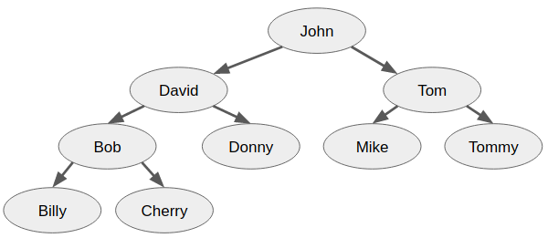

```{r setup, include=FALSE}
knitr::opts_chunk$set(echo = TRUE)
```

--------------  ----------------------------------------  --------------
Mata kuliah     BS204 / Algoritma                           Pengesahan

Semester        Genap                                        Kaprodi

Sifat Ujian     Closed Book

Hari / Tanggal  Kamis / 31.05.2018

Waktu           120 menit

Soal            Tidak Dibawa Pulang                        (__________)

Pengajar        Setia Budi                                 NIK:________ 
--------------  ----------------------------------------  --------------

<p>**Kerjakan soal-soal berikut secara berurutan.**</p>
<p>**Soal ujian ini disusun dengan mengacu pada Grokking Algorithms chapter 01 - chapter 11.**</p>
<p>**Setiap soal memiliki bobot nilai 4.**</p>

-----------------------------CHAPTER 01-----------------------------

##### Anda diminta untuk menebak sebuah angka dari sekumpulan angka terurut sejumlah 150 angka. Anda sudah menebak 3 kali dengan *Binary Search* dan gagal; dua tebakan pertama terlalu kecil dan tebakan ketiga terlalu besar. Untuk tebakan keempat, di manakah posisi index low, mid, dan high? Sertakan ilustrasi gambar untuk memperjelas jawaban!
```{asis, solution=FALSE, response.space=0.5}
<p>[Chapter 01]</p>
- tebakan 1: lo=0, mi=74, hi=149
- tebakan 2: lo=75, mi=112, hi=149
- tebakan 3: lo=113, mi=131, hi=149
- tebakan 4: lo=113, mi=121, hi=130
```

##### Anda diminta melakukan pencarian data dari sekumpulan data berjumlah 512 element. Sebutkan jumlah langkah terbanyak yang dibutuhkan untuk melakukan pencarian dengan *simple search* dan *binary search*! Jelaskan!
```{asis, solution=FALSE, response.space=0.5}
<p>[Chapter 01]</p>
- Simple search memiliki running time $O(n)$ sehingga membutuhkan 512 langkah.
- Binary search memiliki running time $O(\log n)$ sehingga membutuhkan 9 langkah.
```

-----------------------------CHAPTER 02-----------------------------

##### Jelaskan perbedaan mendasar antara *array* dan *linked-list* terkait mekanisme penyimpanan data di memory!
```{asis, solution=FALSE, response.space=0.5}
<p>[Chapter 02]</p>
Array akan menyimpan sekumpulan data di memory tepat bersebelahan antara data yang satu dengan lainnya.
Sedangkan linked-list dapat menyimpan data di mana pun di memory. Henya saja untuk setiap data yang tersimpan, linked-list perlu menyimpan informasi alamat memory dari data selanjutnya.
```

##### Sebut dan jelaskan dua mekanisme untuk mengakses data yang tersimpan di dalam memory!
```{asis, solution=FALSE, response.space=0.5}
<p>[Chapter 02]</p>
- Sequential access: Adalah mekanisme akses data secara terurut di mana data ke n hanya dapat diakses setelah melakukan akses terhadap data ke n-1. Hal ini dikarenakan alamat dari data ke n disimpan pada data ke n-1. Mekanisme semacam ini didapati pada linked-list.
- Random access: Adalah mekanisme akses data secara acak di mana data ke n dapat diakses kapan pun tanpa perlu melakukan akses terhadap data sebelumnya. Hal ini dimungkinkan karena sekumpulan data disimpan tepat bersebelahan. Mekanisme semacam ini ditemui pada array.
```

-----------------------------CHAPTER 03-----------------------------

##### Sebut dan jelaskan dua komponen utama pada recursion!
```{asis, solution=FALSE, response.space=0.5}
<p>[Chapter 03]</p>
- Recursive case: adalah bagian ketika sebuah function memanggil dirinya sendiri sehingga memungkinkan terjadinya proses perulangan atau looping.
- Base case: adalah kondisi yang menjadikan sebuah recursion berhenti memanggil dirinya sendiri. Base case dibutuhkan untuk mencegah terjadinya infinite-loop.
```

##### Sebut dan jelaskan dua operasi dasar pada *stack*!
```{asis, solution=FALSE, response.space=0.5}
<p>[Chapter 03]</p>
- Push: adalah proses penambahan data pada sebuah stack, di mana data baru akan ditempatkan di posisi paling atas dari stack.
- Pop: adalah proses pengambilan data dari suatu stack, di mana data yang diambil adalah data yang berada pada posisi paling atas.
```

-----------------------------CHAPTER 04-----------------------------

##### Bila anda memiliki lahan berukuran 1680 meter x 1024 meter, berapakah ukuran tiap petak yang dihasilkan dengan menerapkan *Algoritma Euclid* untuk membagi lahan tersebut? Sertakan ilustrasi gambar untuk memperjelas jawaban:
```{asis, solution=FALSE, response.space=0.5}
<p>[Chapter 04]</p>
- GCF(1680, 1024) = 16
- 1680 ÷ 1024 = 1 R 656    (1680 = 1 × 1024 + 656)
- 1024 ÷ 656 = 1 R 368    (1024 = 1 × 656 + 368)
- 656 ÷ 368 = 1 R 288    (656 = 1 × 368 + 288)
- 368 ÷ 288 = 1 R 80    (368 = 1 × 288 + 80)
- 288 ÷ 80 = 3 R 48    (288 = 3 × 80 + 48)
- 80 ÷ 48 = 1 R 32    (80 = 1 × 48 + 32)
- 48 ÷ 32 = 1 R 16    (48 = 1 × 32 + 16)
- 32 ÷ 16 = 2 R 0    (32 = 2 × 16 + 0)
```

##### Urutkan kumpulan data berikut ini mengggunakan *Quicksort* dengan menggunakan data paling *kiri* sebagai *pivot*! Sertakan ilustrasi gambar untuk memperjelas jawaban!

```{asis, solution=FALSE, response.space=0.5}
<p>[Chapter 04]</p>
left pivot
```

-----------------------------CHAPTER 05-----------------------------

##### Jelaskan apa yang dimaksud dengan *Hash Function*!
```{asis, solution=FALSE, response.space=0.5}
<p>[Chapter 05]</p>
Hash function adalah function yang digunakan untuk melakukan mapping dari suatu string (key) ke suatu nilai numerik (alokasi memory) tertentu
```

##### Jelaskan apakah yang dimaksud dengan *hash table*!
```{asis, solution=FALSE, response.space=0.5}
<p>[Chapter 05]</p>
Hash table adalah data structure yang menggabungkan penggunaan array dan hash function.
```

-----------------------------CHAPTER 06-----------------------------

##### Jelaskan perbedaan antara LIFO dan FIFO!
```{asis, solution=FALSE, response.space=0.5}
<p>[Chapter 06]</p>
- LIFO: Last In First Out, adalah mekanisme kerja pada data structure di mana data yang terakhir kali dimasukkan akan menjadi data yang pertama kali dikeluarkan.
- FIFO: First In First Out, adalah mekanisme kerja pada data structure di mana data yang pertama kali dimasukkan akan menjadi data yang pertama kali dikeluarkan.
```

##### Sebutkan seluruh node beserta neighbours dari tiap node pada graph berikut ini:

```{asis, solution=FALSE, response.space=0.5}
<p>[Chapter 06]</p>
- A: [C, B]
- B: []
- C: [E, F]
- D: [C, B]
- E: [F]
- F: [D]
```

-----------------------------CHAPTER 07-----------------------------

##### Carilah jalur terpendek dari graph berikut ini dengan menggunakan Djikstra's algorithm! Sertakan juga tabel yang menjelaskan proses yang berjalan!

```{asis, solution=FALSE, response.space=0.5}
<p>[Chapter 07]</p>
| Parent        | Node    | Cost                      |
|---------------|:-------:|--------------------------:|
| -             | A       | 0                         |
| A             | B       | ~~$\infty$~~ 2            |
| ~~A~~ ~~B~~ D | C       | ~~$\infty$~~ ~~6~~ ~~5~~ 4|
| A             | D       | ~~$\infty$~~ 3            |
| ~~B~~ ~~D~~ C | E       | ~~$\infty$~~ ~~8~~ ~~7~~ 6|

A -> D -> C -> E
```

##### Jelaskan perbedaan mendasar antara Breadth First Search dan Djikstra's algorithm dalam menentukan jalur terpendek (shortest path)!
```{asis, solution=FALSE, response.space=0.5}
<p>[Chapter 07]</p>
Breadth First Search memilih jalur terpendek berdasarkan total jumlah segment terkecil sedangkan Djikstra algorithm memilih jalur terpendek berdasarkan total jumlah weight/cost terkecil.
```

-----------------------------CHAPTER 08-----------------------------

##### Anda diminta untuk melakukan alokasi penjadwalan mata pelajaran berikut ini ke dalam satu ruang kelas. Gunakan Greedy Algorithm dan perhatikan urutan sewaktu melakukan pengalokasian mata pelajaran!

- CS: 10:30-11:00
- Physic: 10:00-10:30
- Art: 9:00-10:30
- Math: 9:30-10:00
- Eng: 10:00-11:00
- Music: 11:00-12:00

```{asis, solution=FALSE, response.space=0.5}
<p>[Chapter 08]</p>
Math, Physic, CS, Music. 
Greedy algorithm pada classroom scheduling problem akan memprioritaskan kelas yang berakhir paling awal yang masih bisa menempati alokasi kelas yang tersedia.
```

##### Anda diminta untuk mengambil sejumlah barang berikut ini dan memasukkannya ke dalam sebuah knapsack/tas berkapasitas maksimal 35lbs. Bila Anda berniat untuk memaksimalkan nilai perolehan dari barang yang akan dimasukkan, barang apa sajakah yang akan diambil? Gunakan Greedy Algorithm untuk menyelesaikan permasalahan ini dan perhatikan urutan pemasukkan barang!

- Keyboard: $15, 10lbs
- Monitor: $50, 30lbs
- Laptop: $80, 20lbs
- Mouse: $5, 5lbs
- Smartphone: $70, 10lbs

```{asis, solution=FALSE, response.space=0.5}
<p>[Chapter 08]</p>
Laptop, Smartphone, Mouse. Greedy algorithm pada Knapsack Problem akan memprioritaskan barang dengan nilai perolehan tertinggi yang masih dapat menempati sisa kapasitas knapsack yang tersedia.
```

##### Anda diminta untuk memilih sejumlah stasiun radio dari daftar stasiun radio di bawah ini. Setiap stasiun radio menjangkau sejumlah daerah tertentu, sebagai contoh, stasiun radio K1 akan menjangkau wilayah ID dan MT. Apabila Anda menargetkan untuk menjangkau delapan daerah berikut ini: MT, NV, AZ, CA, UT, OR, ID, WA; gunakan Greedy Algorithm untuk menentukan stasiun radio yang akan dipilih! Perhatikan urutan pemilihan!

- K1: ID, MT
- K2: NV, AZ, MT
- K3: UT, CA, OR, ID
- K4: CA, WA
- K5: MT, CA, AZ

```{asis, solution=FALSE, response.space=0.5}
<p>[Chapter 08]</p>
K3, K2, K4. Greedy algorithm pada Set Covering Problem akan memprioritaskan station dengan jangkauan terluas yang masih belum terjangkau.
```

-----------------------------CHAPTER 09-----------------------------

##### Anda diminta untuk mengambil sejumlah barang berikut ini dan memasukkannya ke dalam sebuah knapsack/tas berkapasitas maksimal 35lbs. Bila Anda berniat untuk memaksimalkan nilai perolehan dari barang yang akan dimasukkan, barang apa sajakah yang akan diambil? Gunakan Dynamic Programming untuk menyelesaikan permasalahan ini! Anda dapat menggunakan keterangan jenis barang ataupun total harga barang (pilih salah satu) di tiap cell dari grid yang dibuat.

- Keyboard: $15, 10 lbs
- Monitor: $50, 30 lbs
- Mouse: $5, 5 lbs
- Smartphone: $70, 10 lbs
- Laptop: $80, 20 lbs

```{asis, solution=FALSE, response.space=0.5}
<p>[Chapter 09]</p>
| Item        | 5 lbs | 10 lbs | 15 lbs | 20 lbs | 25 lbs | 30 lbs | 35 lbs |
|-------------|:-----:|-------:|-------:|-------:|-------:|-------:|-------:|
| Keyboard    | $0    | $15    | $15    | $15    | $15    | $15    | $15    |
| Monitor     | $0    | $15    | $15    | $15    | $15    | $50    | $50    |
| Mouse       | $5    | $15    | $20    | $20    | $20    | $50    | $55    |
| Smartphone  | $5    | $70    | $75    | $85    | $90    | $90    | $90    |
| Laptop      | $5    | $70    | $5     | $85    | $90    | $150   | $155   |
```

##### Tentukan the longest common substring dari "SPORE" dan "SPARE". Selesaikan dengan Dynamic Programming.

```{asis, solution=FALSE, response.space=0.5}
<p>[Chapter 09]</p>
|   | S | P | A | R | E |
|---|:-:|--:|--:|--:|--:|
| S | 1 | 0 | 0 | 0 | 0 |
| P | 0 | 2 | 0 | 0 | 0 |
| O | 0 | 0 | 0 | 0 | 0 |
| R | 0 | 0 | 0 | 1 | 0 |
| E | 0 | 0 | 0 | 0 | 2 |
```

##### Tentukan the longest common subsequence dari "SPORE" dan "SPARE". Selesaikan dengan Dynamic Programming.

```{asis, solution=FALSE, response.space=0.5}
<p>[Chapter 09]</p>
|   | S | P | A | R | E |
|---|:-:|--:|--:|--:|--:|
| S | 1 | 1 | 1 | 1 | 1 |
| P | 1 | 2 | 2 | 2 | 2 |
| O | 1 | 2 | 2 | 2 | 2 |
| R | 1 | 2 | 2 | 3 | 3 |
| E | 1 | 2 | 2 | 3 | 4 |
```

-----------------------------CHAPTER 10-----------------------------

##### Sebutkan dan jelaskan dua pemanfaatan dari K-Nearest Neighbours!

```{asis, solution=FALSE, response.space=0.5}
<p>[Chapter 10]</p>
- Classification: Melakukan pengelompokkan berdasarkan kedekatan dengan tetangga sekitarnya.
- Regression: Melakukan prediksi atau estimasi nilai tertentu berdasarkan rata-rata nilai dari tetangga terdekatnya.
```

##### Gunakan K Nearest Neighbour dengan K=3 untuk menentukan neighbour dari Roti X dan Roti Y untuk kasus berikut ini!
<p>Sebuah toko roti memproduksi lima jenis roti berbeda: Roti A, Roti B, Roti C, Roti D, Roti E.</p>
<p> Roti A dibuat dengan kompisisi gula 3 gram, pengembang 4 gram, dan pewarna 2 gram.</p>
<p>Roti B dibuat dengan kompisisi gula 4 gram, pengembang 3 gram, dan pewarna 5 gram.</p>
<p>Roti C dibuat dengan kompisisi gula 4 gram, pengembang 5 gram, dan pewarna 1 gram.</p>
<p>Roti D dibuat dengan kompisisi gula 1 gram, pengembang 1 gram, dan pewarna 3 gram.</p>
<p>Roti E dibuat dengan kompisisi gula 4 gram, pengembang 5 gram, dan pewarna 4 gram.</p>

<p>Tiap harinya, toko tersebut rata-rata berhasil menjual Roti A sebanyak 300 potong, Roti B 225 potong, Roti C 75 potong, Roti D 200 potong, dan Roti E 150 potong.</p>

<p>Toko roti ini sedang mempersiapkan dua buah roti baru dengan komposisi sebagai berikut:</p>
<p>Roti X: gula 3 gram, pengembang 3 gram, dan pewarna 3 gram.</p>
<p>Roti Y: gula 5 gram, pengembang 5 gram, dan pewarna 5 gram.</p>

```{asis, solution=FALSE, response.space=0.5}
<p>[Chapter 10]</p>

|         | Gula | Pengembang | Pewarna | Penjualan | 
|---------|:----:|-----------:|--------:|----------:|
| Roti A  | 3 | 4 | 2 | 300 |
| Roti B  | 4 | 3 | 5 | 225 |
| Roti C  | 4 | 5 | 1 | 75  |
| Roti D  | 1 | 1 | 3 | 200 |
| Roti E  | 4 | 5 | 4 | 150 |
| Roti X  | 3 | 3 | 3 | ?   |
| Roti Y  | 5 | 5 | 5 | ?   |
  
  
| distance| Roti A | Roti B | Roti C | Roti D | Roti E | 
|---------|:------:|:------:|:------:|:------:|:------:|
| Roti X  | $\sqrt{2}$ | $\sqrt{5}$ | $\sqrt{9}$ | $\sqrt{8}$ | $\sqrt{6}$ |
| Roti Y  | $\sqrt{14}$| $\sqrt{5}$ | $\sqrt{17}$| $\sqrt{36}$| $\sqrt{2}$ |  
  
<p>K = 3</p>
<p>Neighbour Roti X: Roti A, B, E</p>
<p>Neighbour Roti Y: Roti E, B, A</p>
```

##### Dengan menggunakan kasus serupa pada soal sebelumnya, gunakan K Nearest Neighbour dengan K=2 untuk melakukan estimassi penjualan perhari untuk Roti X dan Roti Y!

```{asis, solution=FALSE, response.space=0.5}
<p>[Chapter 10]</p>
<p>K = 2</p>
<p>Neighbour Roti X: Roti A, B. Estimasi penjualan: 262.5</p>
<p>Neighbour Roti Y: Roti E, B. Estimasi penjualan: 187.5</p>
```

-----------------------------CHAPTER 11-----------------------------

##### Gambarkan Binary Search Tree yang terbentuk dengan urutan pemasukan data sebagai berikut: John, Tom, David, Tommy, Mike, Donny, Bob, Cherry, Billy!

```{asis, solution=FALSE, response.space=0.5}
<p>[Chapter 11]</p>

```

##### Jelaskan perbedaan antara locality-sensitive hash dan locality-insensitive hash! Sertakan juga contoh penerapan dari keduanya!

```{asis, solution=FALSE, response.space=0.5}
<p>[Chapter 11]</p>
<p>Pada locality-sensitive hash, perubahan kecil pada suatu string akan menghasilkan nilai hash yang tidak jauh berbeda. 
Contoh penerapan pada SimHash yang digunakan dalam plagiarism check dan web page similarity.</p>
<p>Pada locality-insensitive hash, perubahan kecil pada suatu string akan menghasilkan nilai hash yang jauh berbeda. 
Contoh penerapan pada SHA yang digunakan untuk memeriksa apakah dua buah file adalah file yang identik, untuk mekanisme penyimpanan dan pengecekan password.</p>
```
