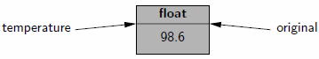
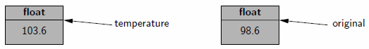
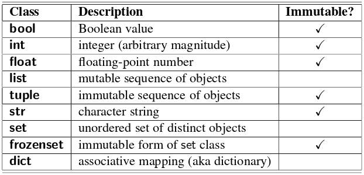
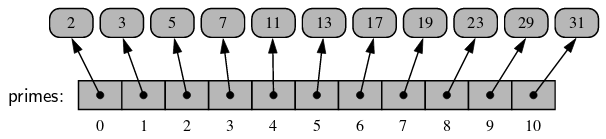
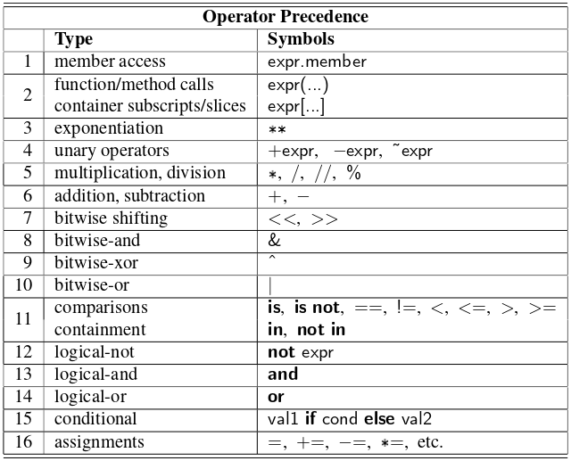
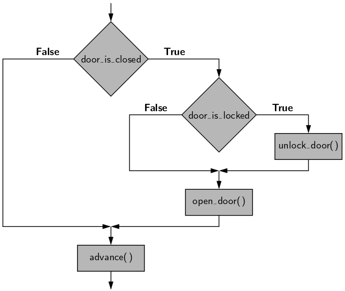
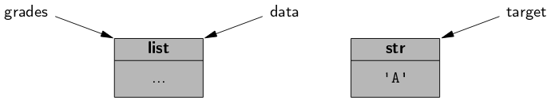

```{r setup, include=FALSE}
knitr::opts_chunk$set(echo=TRUE)
```

## Python Overview

- Python is a **programming language** developed by Guido van Rossum (early 1990s).
- Release: Python 2 (2000), Python 3 (2008).
- Python 2 and Python 3 are incompatible.
- We are using Python 3 in this class.

## The Python Interpreter

- Python is an **interpreted language**.
- Python script is conventionally stored in a file named with **.py** suffix (e.g., demo.py).
- In this class, Anaconda will be used as Python distribution.
- Atom will be used as a text editor in conjunction with Jupyter Notebook.
- Notebook file will be stored in a file named with **.ipynb** suffix.

## Preview of a Python Program

```{python, eval=FALSE}
print('Hello World') #print on screen
first_name = 'John'
is_morning = False
if is_morning:
  print('Good Morning', first_name)
else:
  print('Good Day', first_name)
```

- Individual statements are concluded with a **newline character**.
- A block of code is **indented** to designate it as the body of a control.
- Comment is based on use of the `#` character.
- Please see other sample code in page 3.
- Try it on Jupyter Notebook.

## Objects in Python
- Python is an **object-oriented** language.
- Classes form the basis for all data types.

## Assignment Statement

```{python, eval=FALSE}
temperature = 98.6
```

- The statement establishes *temperature* as an **identifier** (also known as name or variable).
- The identifier is then associated with a floating-point **object** with value *98.6*.
- Python identifiers are **case-sensitive**; *temperature* and *Temperature* are distinct.
- Python identifier cannot begin with a numeral.
- There are 33 reserved words that cannot be used as identifiers (see page 4).

## Objects in Python

- Python is a **dynamically typed** language, no advance declration associating an identifier with a particular data type.
- An identifier can be associated with any type of object, and it can later be reassigned to another object of the same (or different) type.
- **Alias** can be established by assigning a second identifier to an existing object (see page 5).

## Alias

```{python, eval=FALSE}
temperature = 98.6
original = temperature
temperature = temperature + 5.0
```
- 
- 

## Creating and Using Objects

- Creating a new instance of a class is known as **instantiation**.
- The general syntax for instantiating an object is to invoke the **constructor** of a class.
- Some built-in classes support a **literal** form for designating new instances (see page 7 for list of Python built-in classes).

```{python, eval=FALSE}
w = Widget()
temperature = 98.6
```

## Calling Methods

- Methods also known as **member functions**.
- Methods which return information about the state of an object but do not change that state are known as **accessors**.
- Methods which change the state of an object are known as **mutators** or **update methods**.
- See page 6 for detail information.

## Python's Built-In Classes



- A class is **immutable** if each object of that class has a fixed value upon instantiation that cannot subsequently be changed (see page 7).

## The bool Class

- The `bool` class is used to manipulate logical (Boolean) values.
- There are only two instances of that class and can be expressed as the literals `True` and `False`.

```{python, eval=FALSE}
my_bool = True
my_bool = False
```

## The int Class

- The `int` and `float` classes are the primary numeric types in Python.
- The `int` class is designed to represent integer values.

```{python, eval=FALSE}
my_int = 13
my_int = int(13)
a = int(3.14)
b = int(-3.9)
c = int('137')
d = int('hello')
```

- Try it on Jupyter Notebook.

## The float Class

- The `float` class is designed  to  represent  floating-point values respectively.

```{python, eval=FALSE}
my_float = 3.14
a = float(2)
b = float(-3)
c = float('3.14')
d = float('hello')
```

- Try it on Jupyter Notebook.

## Sequence Types: The list, tuple, and str Classes

- The `list`, `tuple`, and `str` classes are **sequence** types in Python, representing a **collection of values** in which the **order** is significant.
- The `list` class is the most general, representing a sequence of arbitrary objects (akin to an **“array”** in other languages).
- The `tuple` class is an **immutable** version of the list class.
- The `str` class is designed for representing an immutable sequence of **text characters**.

## The list Class

- A list instance stores **a sequence of objects**.
- A list is a **referential** structure, as it technically  stores a sequence  of references to its elements.
- Elements of a list may be **arbitrary objects**.
- Lists are **array-based** sequences and are **zero-indexed**.

```{python, eval=FALSE}
primes = [2,3,5,7,11,13,17,19,23,29,31]
my_list = ['h','e','l','l','o']
my_other_list = [9, 'a', 3.7, 'world']
```



## The tuple Class

- The `tuple` class provides an **immutable** version of a sequence.

```{python, eval=FALSE}
my_list = [2, 3, 5, 7]
my_tuple = (2, 3, 5, 7)
my_one_element_tuple = (17,)

my_list[0] = 13
my_tuple[0] = 13
```

## The str Class

- The `str` class is specifically designed to represent an **immutable** sequence of characters.
- String literals can be enclosed in single quotes or double quotes.
- See page 10 for detail information.

```{python, eval=FALSE}
my_str = 'Hello'
my_other_str = "World"
my_longer_str = """Welcome to
Data Structure Class.
I hope you enjoy the class."""
```

## The set and frozenset Classes

- The `set` class is designed to represent a **collection of elements**, **without duplicates**, and **without an inherent order** to those elements.
- The `set` does not maintain the elements in any particular order.
- Only instances of immutable types can be added to a `set`.
- The `frozenset` class is an **immutable** form of the `set` type.

```{python, eval=FALSE}
my_set = {'red','green','blue'}
my_set.add('yellow')
my_set.add('red')
print(my_set)
```

- Try it on Jupyter Notebook

## The dict Class
- The `dict` class represents a **dictionary**, or **mapping**, from a set of distinct **keys** to associated **values** (see page 11).

```{python, eval=FALSE}
my_dict = {'ga':'Irish', 'de':'German', 'id':'Indonesia'}
language = my_dict['de']
print(language)

pairs = [ ('ga','Irish'), ('de','German'), ('id','Indonesia') ]
my_other_dict = dict(pairs)
print(my_other_dict['id'])
```

- Try it on Jupyter Notebook.

## Logical Operators

Python supports the following keyword operators for Boolean values:

- `not`: unary negation
- `and`: conditional and
- `or`: conditional or

## Equality Operators

Python supports the following operators to test two notions of equality:

- `is`    : same identity
- `is not`: different identity
- `==`    : equivalent
- `!=`    : not equivalent

```{python, eval=FALSE}
a = [2, 3]
b = a
c = [2, 3]
print(a is b, a is c)
print(a == b, a == c)
```

- Try it on Jupyter Notebook.

## Comparison Operators

Data types may define a natural order via the following operators:

- `<` : less than
- `<=`: less than or equal to
- `>` : greater than
- `>=`: greater than or equal to

## Arithmetic Operators

Python supports the following arithmetic operators (see page 13):

- `+`: addition
- `-`: subtraction
- `*`: multiplication
- `/`: true division
- `//`: integer division
- `%`: the modulo operator

## Sequence Operators [1/2]

Each of Python’s built-in sequence types (**str**, **tuple**, and **list**) support the following operator syntaxes (see page 14):

- `s[j]` element at index j.
- `s[start:stop]` slice starting from and including index **start** up to but not including index **stop**.
- `s[start:stop:step]` slice including indices **start**, start + step, start + 2 step, ..., up to but not including index **stop**.
- `s + t` concatenation of sequences .
- `k * s` shorthand for s+s+s+...(k times).
- `val in s` containment check.
- `val not in s` non-containment check.

## Sequence Operators [2/2]

```{python, eval=FALSE}
my_str = 'maranatha'
my_other_str = 'university'
print(my_str[2])
print(my_str[-2])

print(my_str[3:6])
print(my_str[3:])
print(my_str[0:5:2])
print(my_str[0::2])

print(my_str + my_other_str)
print(my_str * 5)

print('a' in my_str)
print('a' not in my_str)
```
- Try it on Jupyter Notebook.

## dict Operators [1/2]

- `d[key]` value associated with given key
- `d[key] = value` set (or reset) the value associated with given key
- `del d[key]` remove key and its associated value from dictionary
- `key in d` containment check
- `key not in d` non-containment check
- `d1 == d2` d1 is equivalent to d2
- `d1 != d2` d1 is not equivalent to d2

## dict Operators [2/2]

```{python, eval=FALSE}
my_dict = {'ga':'Irish', 'de':'German'}
my_dict['id'] = 'Indonesia'
del my_dict['ga']
print(my_dict)

print('de' in my_dict)
print('de' not in my_dict)

my_other_dict = {'en':'English', 'sp':'Spanish'}
print(my_dict == my_other_dict)
print(my_dict != my_other_dict)
```
- Try it on Jupyter Notebook.

## Extended Assignment Operators

```{python, eval=FALSE}
count = 0
count += 5
count = count + 5
print(count)
```

```{python, eval=FALSE}
alpha = [1, 2, 3]
beta = alpha # an alias for alpha

# extends the original list with two more elements
beta += [4, 5]

# reassigns beta to a new list [1, 2, 3, 4, 5, 6, 7]
beta = beta + [6, 7]
print(alpha) # will be[1,2,3,4,5]
```
- Try it on Jupyter Notebook

## Operator Precedence



- See page 17

## Chained Assignment

- Python allows a chained assignment, to assign multiple identifiers to the rightmost value.

```{python, eval=FALSE}
x = y = 0
x += 7
print(x, y)

x = y = [1, 2, 3]
x += [4, 5]
print(x, y)
```

- Try it on Jupyter Notebook

## Chaining of Comparison

- Python also allows the chaining of comparison operators.

```{python, eval=FALSE}
x=2; y=5
print(1 <= x+y <= 10)
print( (1 <= x+y) and (x+y <= 10) )
```

- Without computing the inter-mediate value x+y twice.
- Try it on Jupyter Notebook

## Control Flow

- The colon character is used to delimit the beginning of a block of code that acts as a body for a control structure.
- Python relies on the indentation level to designate the extent of that block of code, or any nested blocks of code within.

```{python, eval=FALSE}
if 3<8:
  print('Hurray!!!')
  print("I'm learning something new!!!")
```

- Try it on Jupyter Notebook

## Conditionals [1/4]

```{python, eval=FALSE}
if first_condition:
  first_body
elif second_condition:
  second_body
elif third_condition:
  third_body
else:
  fourth_body
```

## Conditionals [2/4]

```{python, eval=FALSE}
def advance():
  print('advancing')

def open_door():
  print('open the door')

def unlock_door():
  print('unlock the door')

door_is_closed = True
if door_is_closed:
  open_door()
advance()
```

## Conditionals [3/4]

```{python, eval=FALSE}
# continuing from the previous code
door_is_locked = False
if door_is_closed:
  if door_is_locked:
    unlock_door( )
  open_door( )
advance( )
```

- Try it on Jupyter Notebook.

## Conditionals [4/4]



## While Loops

```{python, eval=FALSE}
while condition:
  body
```
```{python, eval=FALSE}
data=['Z','Y','X','H','I','J']
j=0
while j<len(data) and data[j]!='X':
  j+=1
print(j)
```
- See page 20.
- Try it on Jupyter Notebook

## For Loops [1/2]

- The semantics of Python’s for loop is similar to the “for each” loop style introduced in Java.

```{python, eval=FALSE}
for element in iterable:
  body
```
```{python, eval=FALSE}
data=[2,3,5,7]
total=0

for val in data:
  total+=val

print(total)
```

- See page 21.
- Try it on Jupyter Notebook

## For Loops [2/2]

```{python, eval=FALSE}
data=[3,2,7,5]
biggest=data[0]

for val in data:
  if val>biggest:
    biggest=val

print(biggest)
```

- Try it on Jupyter Notebook.

## Index-Based For Loops

```{python, eval=FALSE}
data = [4, 7, 3, 9, 5]

big_index = 0
for j in range(len(data)):
  if data[j] > data[big_index]:
    big_index = j

print(big_index)
```

- See page 22.
- Try it on Jupyter Notebook.

## Break and Continue Statements

- Break statement immediately terminate a while or for loop when executed  within its body.
- Continue statement that causes the current iteration of a loop body to stop, but with subsequent passes of the loop proceeding as expected.

```{python, eval=FALSE}
data=[3,2,7,5]
target=7; found=False
for item in data:
  if item == target:
    found=True
    break
print(found)
```

- See page 22.
- Try it on Jupyter Notebook.

## Functions

- Keyword **def**, serves as the function’s **signature** which establishes a new identifier as the name of the function (i.e., count).

```{python, eval=FALSE}
def count(data, target):
  n=0
  for item in data:
    if item == target: #found a match
      n+=1
  return n

data=[5,2,5,5]
print(count(data,5))
```

- See page 23.

## Return Statement

- A return statement is used within the body of a function to indicate that the function should immediately **cease** execution, and that an expressed value should be **returned** to the caller.
- If a return statement is executed without an explicit argument, the **None** value is automatically returned.

```{python, eval=FALSE}
def contains(data, target):
  for item in data: # mistake on the textbook
    if item == target: # found a match
      return True
  return False

data=[2,3,5,7]
print(contains(data,5))
```

- See page 24.

## Information Passing [1/2]

- The identifiers used to describe the expected parameters are known as **formal parameters** (i.e., data, target).
- The objects sent by the caller when invoking the function are known as **actual parameters** (i.e., grade, 'A').

```{python, eval=FALSE}
def count(data, target):
  n=0
  for item in data:
    if item == target: #found a match
      n+=1
  return n

grades = ['A','B','A','C']
prizes = count(grades,'A')
print(prizes)
```

## Information Passing [2/2]



- An advantage to Python’s mechanism for passing information to and from a function is that objects are not copied (see page 25).
- This ensures that the invocation of a function is efficient, even in a case where a parameter or return value is a complex object.

## Mutable Parameters

- The formal parameter is an alias for the actual parameter (see page 25).
- The body of the function may interact with the object in ways that change its state.
- Reassigning a new value to a formal parameter with a function body does not alter the actual parameter; such a reassignment simply breaks the alias.

```{python, eval=FALSE}
def scale(data, factor):
  # data = [9,7,5,3]
  for j in range(len(data)):
    data[j]*=factor

my_data=[2,3,5,7]
my_factor=2
scale(my_data,my_factor)
print(my_data)
```

## Default Parameter Values

- Function in Python is **polymorphic**, it supports more than one possible calling signature (see page 26).
- Functions can declare one or more default values for parameters, thereby allowing the caller to invoke a function with varying numbers of actual parameters.
- if a default parameter value is present for one parameter, it must be present for all further parameters

```{python, eval=FALSE}
def foo(a,b=15,c=27):
  return a+b+c

print(foo(3))
print(foo(3,5))
print(foo(4,12,8))
```

## Keyword Parameters

- A  keyword  argument  is specified  by  explicitly assigning an actual parameter to a formal parameter by name (see page 27).

```{python, eval=FALSE}
def foo(a=3,b=5,c=7):
  return a+b+c

print(foo(b=2))
print(foo(c=1,b=3))
print(foo(b=1,c=9,a=10))
```

## Python's Bult-in Functions

- See page 29 for commonly used built-in functions in Python.

## The print Function

- Used to generate standard output to the console (see page 30).
- **space** is the default separator between each pair of arguments.
- **newline** is the default trailing string after the final argument.

```{python, eval=FALSE}
print('maroon',5)
print('data','structure','in','python',sep=':')
print('data',end='')
print('structure')
```

- Try it on Jupyter Notebook.

## The input Function

- Displays a prompt, if given as an optional parameter, and then waits until the user enters some sequence of characters followed by the return key.
- Return value of the function is the **string of characters** that were entered strictly before the return key.

{python, eval=FALSE }
name=input('Who are you? ')
print('Good day', name)

born=int(input('In what year were you born? '))
from datetime import date
age=date.today().year-born
print('You are',age,'years old.')
```

- Try it on Jupyter Notebook

## Files

{python, eval=FALSE }
fp=open('my_file','w')
fp.write('my first line\n')
fp.write('second line\n')
fp.close()
```
{python, eval=FALSE }
fp=open('my_file','a')
fp.write('adding third line\n')
fp.close()
```
{python, eval=FALSE }
fp=open('my_file','r')
print(fp.readlines())
fp.close()
```

## Exception Handling

- Exceptions are unexpected events that occur during the execution of a program.
- An exception might result from a logical error or an unanticipated situation.
- **Exceptions** (also known as **errors**) are objects that are **raised** (or **thrown**) by code that encounters an unexpected circumstance.
- A raised error may be **caught** by a surrounding context that “handles” the exception in an appropriate fashion.
- If **uncaught**, an exception causes the interpreter to **stop** executing the program and to report an appropriate message to the console.

## Common Exception Types

- See page 33 for list of common exception classes in Python.
- The **Exception** class serves as a base class for most other error types.
- **TypeError** is raised when sending the wrong number, type, or value of parameters to a function.
- **ValueError** is raised when the correct number and type of parameters are sent, but a value is illegitimate for the context of the function.

{python, eval=FALSE }
abs('python')
```
{python, eval=FALSE }
int('3.14')
```
{python, eval=FALSE }
int('hello')
```

## Raising an Exception [1/3]

- An exception is thrown by executing the `raise` statement.

{python, eval=FALSE }
def sqrt(x):
  if not isinstance(x, (int, float)):
    raise TypeError('x must be numeric')
  elif x < 0:
    raise ValueError('x cannot be negative')
  # do the real work here...
```

- `isinstance(obj, cls)` returns `True` if object, `obj`, is an instance of class, `cls`, or any subclass of that type.

## Raising an Exception [2/3]

- Checking the type and value of each parameter demands additional execution time and, if taken to an extreme, seems counter to the nature of Python.

{python, eval=FALSE }
def sum(values):
  if not isinstance(values, collections.Iterable):
    raise TypeError('parameter must be an iterable type')
  total = 0
  for v in values:
    if not isinstance(v, (int, float)):
      raise TypeError('elements must be numeric')
    total = total + v
  return total
```

## Raising an Exception [3/3]

- Even without the explicit checks, appropriate exceptions are raised naturally by the code.
- If values is not an iterable type, the attempt to use the for-loop syntax raises a TypeError reporting that the object is not iterable.

{python, eval=FALSE }
def sum(values):
  total = 0
  for v in values:
    total = total + v
  return total
```

## Catching an Exception [1/5]

- One philosophy for managing exceptional cases is to **“look before you leap.”**
- The goal is to entirely avoid the possibility of an exception being raised through the use of a proactive conditional test (see page 36).

{python, eval=FALSE }
if y != 0:
  ratio = x / y
else:
  pass
  # do something else
```

## Catching an Exception [2/5]

- A second philosophy, often embraced by Python programmers, is that **“it is easier to ask for forgiveness than it is to get permission.”**
- We don't need to spend extra execution time safeguarding against every possible exceptional case, as long as there is a mechanism for coping with a problem after it
arises.
- In Python, this philosophy is implemented using a **try-except** control structure.

{python, eval=FALSE }
try:
  ratio = x / y
except ZeroDivisionError:
  pass
  # do something else
```

## Catching an Exception [3/5]

- The **“try”** block is the primary code to be executed.
- Following the try-block are one or more **“except”** cases, each with an identified error type and an indented block of code that should be executed if the designated error is raised within the try-block.
- The relative advantage of using a try-except structure is that the non-exceptional case runs efficiently, without extraneous checks for the exceptional condition
- However, handling the exceptional case requires slightly more time when using a try-except structure than with a standard conditional statement.
- The try-except clause is best used when there is reason to believe that the exceptional
case is relatively unlikely, or when it is prohibitively expensive to proactively evaluate a condition to avoid the exception.

## Catching an Exception [4/5]

{python, eval=FALSE }
try:
  fp = open('sample.txt')
except IOError as e:
  print('Unable to open the file:', e)
```

- In this case, `e` denotes the instance of the exception that was thrown, and printing it causes a detailed error message to be displayed (e.g., “file not found”).

## Catching an Exception [5/5]

{python, eval=FALSE }
age = -1
while age <= 0:
  try:
    age = int(input('Enter your age in years: '))
    if age <= 0:
      print('Your age must be positive')
  except (ValueError, EOFError):
    print('Invalid response')
```

- This implementation catches either error (`ValueError` or `EOFError`), print a response, and continue with another pass of the enclosing while loop.
- When an error is raised within the try-block, the remainder of that body is immediately skipped.

## Iterators [1/2]

- An iterator is an object that manages an iteration through a series of values (see page 39).
- An iterable is an object, `obj`, that produces an iterator via the syntax `iter(obj)`.
- An instance of a list is an iterable,  but not itself an iterator.

{python, eval=FALSE }
data = [1, 2, 4, 8]
print(next(data)) # not legal to call
```
{python, eval=FALSE }
data = [1, 2, 4, 8]
i = iter(data)
print(next(i), next(i))
```

## Iterators [2/2]

- Iterators typically maintain their state with indirect reference back to the original collection of elements.
- If the contents of the original list are modified after the iterator is constructed, but before the iteration is complete, the iterator will be reporting the updated contents of the list.
- Python also supports functions and classes that produce an implicit iterable series of values (e.g., range())

{python, eval=FALSE }
data = [1, 2, 4, 8]
i = iter(data)
print(next(i))
data[1] = 7
print(next(i), next(i))
```

## Generators [1/3]

- A generator is implemented with a syntax that is very similar to a function,  but instead of returning values, a `yield` statement is executed to indicate each element of the series (see page 40).

{python, eval=FALSE }
def factors(n):
  results = []
  for k in range(1,n+1):
    if n%k==0:
      results.append(k)
  return results

print(factors(100))
 ```

## Generators [2/3]
{python, eval=FALSE }
def factors(n):
  for k in range(1,n+1):
    if n%k==0:
      yield k

my_factors = factors(100)
print(my_factors)
print(list(my_factors))
```

## Generators [3/3]

{python, eval=FALSE }
def factors(n):
  k=1
  while k*k < n:
    if n%k == 0:
      yield k
      yield n//k
    k+=1
  if k*k == n:
    yield k

my_factors = factors(100)
print(my_factors)
print(list(my_factors))
```

## Conditional Expressions [1/3]

- Python supports a conditional expression syntax that can replace a simple control structure (see page 42).
- *expr1* `if` *condition* `else` *expr2*

{python, eval=FALSE }
def foo(param):
  print('foo is called with',param,'as parameter')
n = -50
param = 20

if n>=0:
  param = n
else:
  param = -n
  foo(param)
```

## Conditional Expressions [2/3]

{python, eval=FALSE }
def foo(param):
  print('foo is called with',param,'as parameter')
n = -50
param = 20

param = n if n>=0 else -n
foo(param)
```

## Conditional Expressions [3/3]

{python, eval=FALSE }
def foo(param):
  print('foo is called with',param,'as parameter')
n = -50
param = 20

foo(n if n>=0 else -n)
```

## Comprehension Syntax [1/2]

- **Comprehensiom Syntax** is used in Python to produce one series of values based upon the processing of another series.

{python, eval=FALSE }
squares=[]; n=7

for k in range(1, n+1):
  squares.append(k*k)
print(squares)
```

{python, eval=FALSE }
n=7
squares = [k*k for k in range(1, n+1)]
print(squares)
```

## Comprehension Syntax [2/2]

```{python, eval=FALSE}
n=5
[k*k for k in range(1, n+1)] #list comprehension
{k*k for k in range(1, n+1)} #set comprehension
(k*k for k in range(1, n+1)) #generator comprehension
{k:k*k for k in range(1, n+1)} #dictionary comprehension
```

## Packing and Unpacking of Sequences [1/2]

- If a series of comma-separated expressions are given in a larger context, they will be treated as a single tuple, even if no enclosing parentheses are provided (known as **automatic packing**).

```{python, eval=FALSE}
data=2,4,6,8
print(data)
```
```{python, eval=FALSE}
a, b, c, d = range(7, 11)
print(a,c)
```

## Packing and Unpacking of Sequences [2/2]

```{python, eval=FALSE}
def for_fun():
  return 'hello', 25

a=for_fun()
x,y=for_fun()
print(a,x,y)
```
```{python, eval=FALSE}
quotient,remainder=divmod(5,2)
print(quotient, remainder)
```
```{python, eval=FALSE}
for x, y in [ (7,2),(5,8),(6,4) ]:
  print(x,y)
```

- Try it on Jupyter Notebook

## Simultaneous Assignments [1/2]

- **Simultaneous assignment** explicitly assigns a series of values to a series of identifiers (combination of automatic packing and unpacking).
```{python, eval=FALSE}
x, y, z = 6, 2, 5
print(y,z,x)
```

- **Simultaneous assignment** enables swapping the values associated with two variables.

```{python, eval=FALSE}
j,k = 10,20
temp=j; j=k; k=temp
print(j,k)
```
```{python, eval=FALSE}
j,k = 10,20
j,k = k,j
print(j,k)
```

## Simultaneous Assignments [2/2]

- The unnamed tuple representing the packed values on the right-hand side implicitly serves as the temporary variable when performing such a swap.

```{python, eval=FALSE}
def fibonacci(x):
  a, b = 0, 1
  while a<=x:
    yield a
    a, b = b, a+b

my_fibo = fibonacci(20)
print(my_fibo)
print(list(my_fibo))
```

## Scopes and Namespaces

- The process of determining the value associated with an identifier is known as **name resolution**.
- Whenever  an identifier  is assigned  to a value,  that definition is made with a specific **scope**.
- Top-level assignments are typically made in what is known as **global scope**.
- Assignments made within the body of a function typically have scope that is **local** to that function call.
- Each **distinct scope** in Python is represented using an abstraction known as a **namespace**.

## First-Class Objects

- **first-class objects** are instances of a type that can be assigned to an identifier, passed as a parameter, or returned by a function.
- In Python, functions and classes are also treated as first-class objects.

```{python, eval=FALSE}
scream=print
scream('Hello World')
```
```{python, eval=FALSE}
a,b=5,-10
print(max(a,b))
print(max(a,b,key=abs))
```

## Modules and the Import Statement

- Beyond the built-in definitions, Python includes other values, functions, and classes organized as **modules** (see page 48).
- `import` statement is used to load definitions from a module into current namespace.

```{python, eval=FALSE}
from math import pi,sqrt
print(pi)
```
```{python, eval=FALSE}
from math import *
print(pi)
```
```{python, eval=FALSE}
import math
print(math.pi)
```

## Creating a New Module

- Creating a new module can be done by putting the relevant definitions in a file named with a **.py** suffix.
- Those definitions can be **imported** from any other .py file within the same project directory.

## Existing Modules

- The following table provides a list of some existing modules in Python.


## Exercises

- There are three categories of exercises on the textbook:

    + Reinforcement
    + Creativity
    + Projects

- Hints for Chapter 01 exercises are available via this [link](http://bcs.wiley.com/he-bcs/Books?action=chapter&bcsId=8029&itemId=1118290275&chapterId=88981).

# End of Chapter 01
