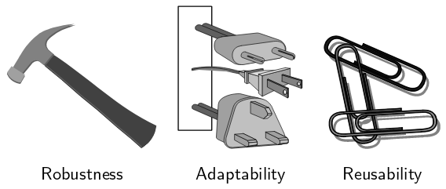
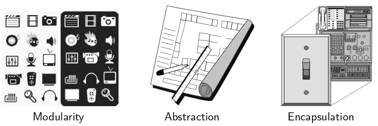
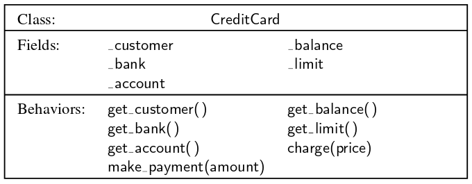
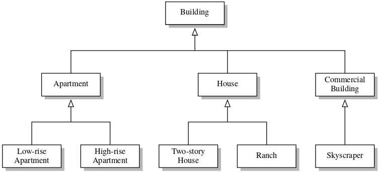
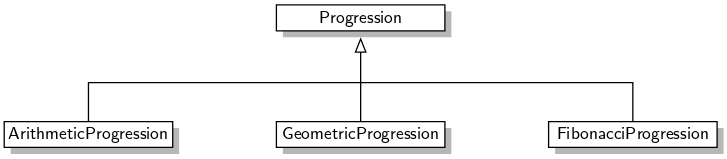
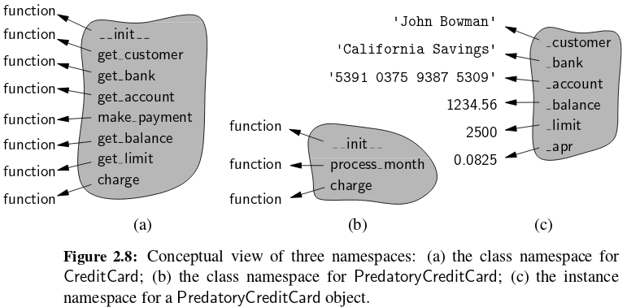
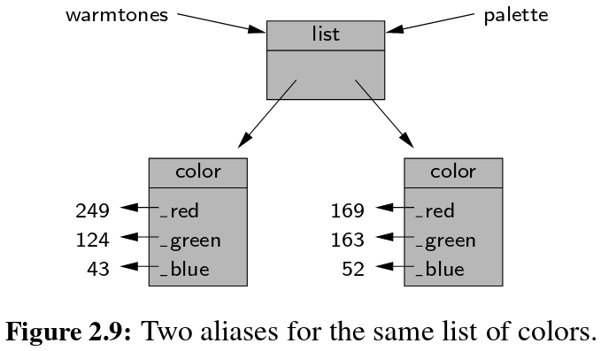
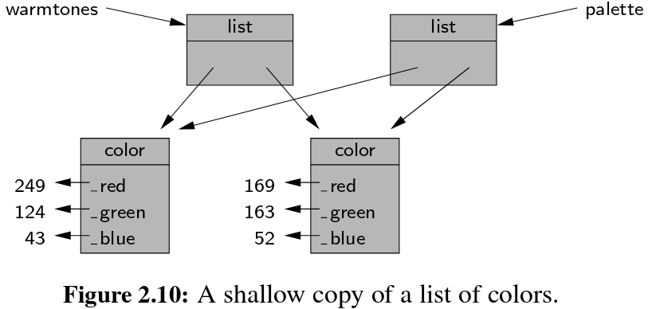
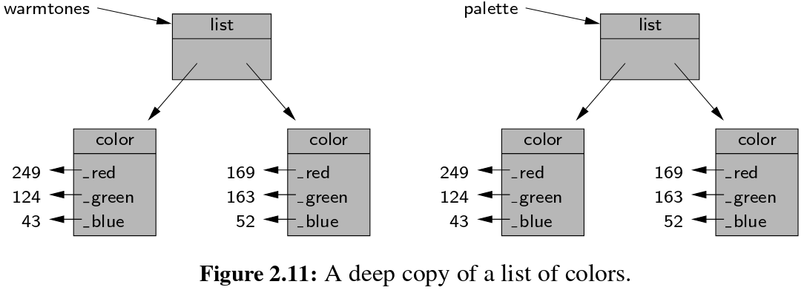

```{r setup, include=FALSE}
knitr::opts_chunk$set(echo = TRUE)
```

## Goals, Principles, and Patterns

- Each **object** is an instance of a **class**.
- The class definition typically specifies:
    + **instance variables** (i.e., **data members**) that the object contains.
    + **methods** (i.e., **member functions**) that the object can execute. 
  
## Object-Oriented Design Goals

Software implementations should achieve **robustness**, **adaptability**, and **reusability**.



## Robustness

- **Robust** means capable of handling unexpected inputs that are not explicitly defined for its application.
- See page 57 for examples

## Adaptability

- **Adaptable** (i.e., evolvable) means capable to evolve over time in response to changing conditions in its environment.
- **Portability** is the ability of software to run with minimal change on different hardware and operating system platforms.  

## Reusability

- **Reusable** means the same code should be usable as a component of different systems in various applications.

## Object-Oriented Design Principles

Chief principles in object-oriented design are **modularity**, **abstraction**, and **encapsulation**.



## Modularity

- **Modularity** refers to an organizing principle in which different components of a software system are divided into separate functional units.
- In Python, modularity could be achived through **module**.
- A **module** is a collection of closely related functions and classes that are defined together in a single file of source code. 
- Modularity promotes **robustness** as it is easier to test and debug separate components before they are integrated into a larger software system. 
- The structure imposed by modularity also helps enable software **reusability**.

## Abstraction

- The notion of abstraction is to distill a complicated system down to its most fundamental parts. 
- Applying the abstraction paradigm to the design of data structures gives rise to **abstract data types (ADTs)**. 
- An ADT is a mathematical model of a data structure that specifies the type of data stored, the operations supported on them, and the types of parameters of the operations.  
- An ADT specifies **what** each operation  does,  but not **how** it does it.
- A collective set of behaviors supported by an ADT could be referred as its **public interface**.

## Encapsulation

- **Encapsulation** implies different components of a software system should not reveal the internal details of their respective implementations.
- Encapsulation yields **robustness** and **adaptability**, for it allows the implementation details of parts of a program to change without adversely affecting other parts, thereby making it easier to fix bugs or add new functionality with relatively local changes to a component.
- Python provides only **loose** support for encapsulation. 
- By convention, names of members of a class (both **data members** and **member functions**) that start with a single **underscore** character (e.g., `_secret`) are assumed  to be nonpublic  and should  not be relied upon.  

## Design Patterns [1/2]

- **Design pattern** describes a solution to a “typical” software design problem. 
- A pattern provides a general **template** for a solution that can be applied in many different situations. 
- Design pattern consists of:
    + A **name** which identifies the pattern.
    + A **context** which describes the scenarios for which this pattern can be applied.
    + A **template** which describes how the pattern is applied.
    + A **result** which describes and analyzes what the pattern produces.

## Design Patterns [2/2]    

- Design patterns could be classified into two groups:
    + Patterns for solving **algorithm design** problems.
    + Patterns for solving **software engineering** problems.
- See page 61 for examples.


## Software Development

Three major steps in software development are:

- Design
- Implementation
- Testing and Debugging

## Design [1/2]

- Defining the classes, together with their instance variables and methods, are key to the design of an object-oriented  program.
- **UML** (**Unified Modeling Language**) diagrams are a standard visual notation to express object-oriented  software  designs. 



## Design [2/2]

Some rules of thumb to design classes:

- **Responsibilities**: Divide the work into different **actors**, each with a different responsibility. 
- **Independence**: Define the work for each class to be as independent from other classes as possible.  
- **Behaviors**: Define the behaviors for each class carefully and precisely, so that the consequences of each action performed by a class will be well understood by other classes that interact with it.

## Pseudo-Code

- Pseudo-code is not a computer program, but is more structured than usual prose.   
- It is a mixture of natural language and high-level programming constructs that describe the main ideas behind a generic implementation of a data structure or algorithm. 

## Coding Style and Documentation [1/4]

- Programs should be made **easy** to read and understand. 
- Good programmers should be mindful of their coding style, and develop a style that communicates the important aspects of a program’s design for both humans and computers.
- Official Style Guide for Python Code is available online at [http://www.python.org/dev/peps/pep-0008/](http://www.python.org/dev/peps/pep-0008/)

## Coding Style and Documentation [2/4]

Some of the main style principles in Python code are:

- Python code blocks are typically indented by 4 spaces.
- Use meaningful names for identifiers. 
- Use comments that add meaning to a program and explain ambiguous or confusing constructs. 

## Coding Style and Documentation [3/4]

Naming style principles in Python:

- **Class** name should be:
    + **Singular noun** and **capitalized** (e.g., `Date` rather than date or Dates). 
    + Multiple words should be **CamelCased** (e.g., `CreditCard`).
- **Function** or **member function** name should be:
    + **Lowercase** and typically a **verb** that describes its affect. 
    + Multiple words should be separated  by **under-scores** (e.g., `make_payment`).  
    + If the only purpose is to return a value, the name may be a noun that describes the value (e.g., `sqrt` rather than calculate_sqrt).

## Coding Style and Documentation [4/4]

- Names that identify an individual object (e.g., a parameter, instance variable, or local variable) should be a **lowercase noun** (e.g., `price`).
- Identifiers that represent a **constant value** are identified using **all capital letters** and with **underscores** to separate words (e.g., `MAX_SIZE`).

## Documentation [1/3]

- Python provides integrated support for embedding formal documentation directly in source code using **docstring**. 
- **Triple-quoted** string is used as delimiter in docstring.

```{python, eval=FALSE}
def scale(data, factor):
  """Multiply all entries of numeric data list by the given factor."""
  for j in range(len(data)):
    data[j]*=factor
```

## Documentation [2/3]

- More detailed docstrings should begin with a single line that summarizes the purpose, followed by a blank line, and then further details.

```{python, eval=FALSE}
def scale(data, factor):
  """Multiply all entries of numeric data list by the given factor.

  data    sequence of numeric elements
  factor  multiplicative scaling factor 
  """
  for j in range(len(data)):
    data[j]*=factor
```

## Documentation [3/3]

- A docstring  is stored as a field of the module, function, or class in which it is declared.  
- It serves as documentation and can be retrieved in a variety of ways.

```{python, eval=FALSE}
from my_module import scale
help(scale)
```

- **pydoc** is distributed with Python and can be used to generate formal documentation as text or as a Web page.  
- Guidelines for authoring useful docstrings are available at: [http://www.python.org/dev/peps/pep-0257/](http://www.python.org/dev/peps/pep-0257/)

```{bash, eval=FALSE}
pydoc -w my_module 
```

## Testing and Debugging

- Testing is the process of experimentally checking the correctness of a program.
- Debugging is the process of tracking the execution of a program and discovering the errors in it.
- Testing and debugging are often the most time-consuming activity in the development of a program.

## Testing [1/3]

- A careful testing plan is an essential part of writing a program. 
- Verifying the correctness of a program over all possible inputs is usually infeasible, we should
aim at executing the program on a representative subset of inputs. 
- Programs often tend to fail on special cases of the input. Such cases need to be carefully identified and tested. See page 67 for examples.

## Testing [2/3]

- The **dependencies** among the classes and functions of a program induce a **hierarchy**. A component **A** is above  a component **B** in the hierarchy  if **A** depends upon **B**, such as when function **A** calls function **B**, or function **A** relies on a parameter that is an instance of class **B**.
- **Top-down** testing proceeds from the top to the bottom of the program hierarchy.
- Top-down testing involve **stubbing**, a boot-strapping technique that replaces a lower-level component with a **stub** (i.e., a replacement  for the component that simulates  the functionality  of the original).

## Testing [3/3]

- **Bottom-up** testing proceeds from lower-level components to higher-level components.
- Functions which do not invoke other functions, are tested first, followed by functions that call only bottom-level functions, and so on.
- This testing is known as **unit testing**, as the functionality of a specific component is tested in isolation of the larger software project. 
- This strategy better isolates the cause of errors, as lower-level components upon which it relies should have already been thoroughly tested.
- As software is maintained, the act of **regression testing** is used, whereby all previous tests are re-executed to ensure that changes to the software do not introduce new bugs in previously tested components.

## Debugging

- The simplest debugging technique consists of using **print statements** to track the values of variables during the execution of the program.
- A better approach is to run the program within a debugger (i.e., a specialized environment for controlling and monitoring the execution of a program).  
- The basic functionality provided by a debugger is the insertion of breakpoints within the code.
- When the program is executed within the debugger, it stops at each breakpoint and the current value of variables can be inspected.

## Class Definitions

- A class provides a set of **behaviors** in the form of **member functions** (i.e., **methods**), with implementations that are common to all instances of that class.
- A class also serves as a **blueprint** for its instances, effectively determining the way that **state** information for each instance is represented in the form of **attributes** (i.e., **fields**, **instance variables**, or **data members**).
- Class definition begins with the keyword, **class**, followed by the name of the class, a colon, and then an indented block of code that serves as the body of the class. See page 70.

## The self Identifier

- The body includes definitions for all methods of the class. These methods are defined as
functions with a special parameter, named **self**, that serves to identify the particular instance upon which a member is invoked.
- Pay attention to the difference between the method signature as declared within the class versus that used by a caller.

```{python, eval=FALSE}
class Student:
  def greet(self, friend='friend'):
    print('Hello', friend)

student = Student()
student.greet('Tom')
```

## The Constructor 

- In Python, a special method named ```__init__``` serves as constructor of a class.
- Its primary responsibility is to establish the **state** of a newly created object with appropriate instance variables. 

```{python, eval=FALSE}
class Student:
  def __init__(self, student_id, name):
    self._student_id = student_id
    self._name = name
    
  def get_student_id(self):
    return self._student_id
    
  def get_name(self):
    return self._name

student = Student('1234', 'John Doe')
print(student.get_name())
```

## Encapsulation

- a single leading underscore in the name of a data member (e.g., _balance) implies that it is intended as **nonpublic**.
- Users of a class should not directly access such members.
- Treating all data members as nonpublic allows us to better enforce a consistent state for all instances.

## Operator Overloading and Python's Special Methods [1/4]

- Python’s built-in classes provide natural semantics for many operators.

```{python, eval=FALSE}
print(2 + 5)
print('Hello' + 'World')
print([2,5] + [3,7,9])
```

- By default, the ``+`` operator is undefined for a new class.  The author of a class may provide a definition using a technique known as **operator overloading** (by implementing a **specially named method**). 
- See page 75 for list of **special methods**.
- The ``+`` operator is overloaded by implementing a method named ``__add__``.

## Operator Overloading and Python's Special Methods [2/4]

```{python, eval=FALSE}
class Voucher:
  def __init__(self, credit):
    self._credit = credit
  
  def get_credit(self):
    return self._credit
  
  def __add__(self, other_voucher):
    return Voucher(self._credit + other_voucher.get_credit())
    
a = Voucher(50)
b = Voucher(25)
c = a+b
print(c.get_credit())
```

## Operator Overloading and Python's Special Methods [3/4]

- When a binary operator is applied to two instances of different types, Python gives deference to the class of the **left** operand. 

```{python, eval=FALSE}
print( 3 * 'hello'  )
```

- Python checks the class definition for the right-hand operand, in the form of a special method named ``__rmul__`` (i.e., “right multiply”). 
- This enables a new class to support mixed operations that involve an instance of an existing class.


## Operator Overloading and Python's Special Methods [4/4]

```{python, eval=FALSE}
class Voucher:
  def __init__(self, credit):
    self._credit = credit
  
  def get_credit(self):
    return self._credit
  
  def __add__(self, other_voucher):
    return self._credit + other_voucher.get_credit()
  
  def __radd__(self, x):
    return self._credit + x
    
a = Voucher(50)
print(7+a)
```

## Non-Operator Overloads [1/2]

- In addition to operator overloading,  Python uses **specially named methods** to control the behavior of various other functionality, when applied to user-defined classes. 

```{python, eval=FALSE}
class Voucher:
  def __init__(self, credit):
    self._credit = credit
  
  def __str__(self):
    return 'This voucher has ' + str(self._credit) + ' credits.'
  
  def __bool__(self):
    return True if self._credit>0 else False
    
a = Voucher(50)
print(a)
print('Has credit' if a else 'Has no credit')
```

## Non-Operator Overloads [2/2]

```{python, eval=FALSE}
class Voucher:
  def __init__(self, credit):
    self._credit = credit
  
  def get_credit(self):
    return self._credit
  
  def __len__(self):
    return self._credit
  
  def __eq__(self, other_voucher):
    return True if self._credit == other_voucher.get_credit() else False
    
a = Voucher(50)
b = Voucher(50)
print(a is b)
print(a == b)
```

## Example: Multidimensional Vector Class

- To better understand on both **operator** and **non-operator overloads** in Python, please refer to the example provided on page 77 and 78.
- Highlight the **polymorphism** in special method ``__add__`` in the example.

## Iterators [1/2]

- An iterator for a collection provides support for a special method named ``__next__`` which returns the next element of the collection, if any, or raises a ``StopIteration`` exception if there is no more element.
- Fortunately, it is rare to have to directly implement an iterator class.
- It is preferably to use **generator** syntax which automatically produces an iterator of **yielded** values (covered in Chapter01).
- Python also provides an automatic iterator implementation for any class that defines both ``__len__`` and ``__getitem__``. 

## Iterators [2/2]
```{python, eval=FALSE}
class Student:
  def __init__(self, name, grades=[0,0,0]):
    self._name = name
    self._grades = grades
  
  def __len__(self):
    return len(self._grades)
    
  def __getitem__(self, i):
    return self._grades[i]
  
tom=Student('Tom', (70,50,60))  
for grade in tom:
  print(grade)
```

## Example: Range Class

- To better understand **iterators** in Python, please refer to the example provided on page 80 and 81.

## Inheritance [1/3]

- A natural way to organize various structural components of a software package is in a **hierarchical** fashion.
- Similar abstract definitions grouped together in a level-by-level manner that goes from specific to more general as one traverses up the hierarchy. 



## Inheritance [2/3]

- The set of houses is a **subset** of the set of buildings, but a **superset** of the set of ranches. 
- The correspondence between levels is often referred to as an **"is a" relationship**, as a house is a building, and a ranch is a house.
- In object-oriented programming, the mechanism for a modular and hierarchical organization is a technique known as **inheritance**.
- This allows a new class to be defined based upon an existing class as the starting point.  
- In object-oriented terminology, the existing class is typically described as the **base class**, **parent class**,or **super-class**, while the newly defined class is known as the **subclass** or **child class**.

## Inheritance [3/3]

- There are two  ways in which a subclass can differentiate itself from its superclass.  
- A subclass may **specialize** an existing behavior by providing a new implementation that **overrides** an existing  method.   
- A subclass may also **extend** its superclass by providing brand new methods.

## Extending CreditCard Class [1/3]

- Complete code is provided on page 85.


## Extending CreditCard Class [2/3]

```{python, eval=FALSE}
class CreditCard:
  def __init__(self, customer, bank, acnt, limit):
    self._customer = customer
    self._bank = bank
    self._account = acnt
    self._limit = limit
    self._balance = 0
    
  def charge(self,price):
    if price+self._balance > self._limit:
      return False
    else:
      self._balance += price
      return True
      
  def make_payment(self,amount):
    self._balance -= amount
```

## Extending CreditCard Class [3/3]

```{python, eval=FALSE}
class PredatoryCreditCard(CreditCard):
  def __init__(self,customer,bank,acnt,limit,apr):
    super().__init__(customer,bank,acnt,limit)
    self._apr = apr
  
  def charge(self,price):
    success = super().charge(price)
    if not success:
      self._balance += 5
    return success
    
  def process_month(self):
    if self._balance > 0:
      monthly_factor = pow(1 + self._apr, 1/12)
      self._balance *= monthly_factor
```

## Protected Members

- Several object-oriented languages (e.g., Java, C++) draw a distinction for nonpublic members, allowing declarations of **protected** or **private** access modes. 
- Members that are declared as protected are accessible to subclasses,  but not to the general public, while members that are declared as private are not accessible to either.  
- Python does not support formal access control, but names beginning with a **single underscore** are conventionally akin to **protected**, while names beginning with a **double underscore** (other than special methods) are akin to **private**.

## Hierarchy of Numeric Progressions [1/4]

- A **numeric progression** is a sequence of numbers, where each number depends on one or more of the previous numbers.
- An **arithmetic progression** determines the next number by adding a fixed constant to the previous  value.
- A **geometric  progression** determines  the next number by multiplying  the previous value by a fixed constant.
- In general, a progression requires a first value, and a way of identifying a new value based on one or more previous values.

## Hierarchy of Numeric Progressions [2/4]



## Hierarchy of Numeric Progressions [3/4]

```{python, eval=TRUE}
class Progression:
  def __init__(self,start=0):
    self._current = start
    
  def _advance(self):
    self._current += 1
    
  def __next__(self):
    if self._current is None:
      raise StopIteration( )
    else:
      answer = self._current
      self._advance()
      return answer
  
  def print_progression(self,n):
    print(' '.join(str(next(self)) for j in range(n)))
```

## Hierarchy of Numeric Progressions [4/4]

```{python, eval=FALSE}
print('Default progression:')
Progression().print_progression(10)
```


## An Arithmetic Progression Class

```{python, eval=FALSE}
class ArithmeticProgression(Progression): # inherit from Progression
  def __init__(self, increment=1, start=0):
    super().__init__(start) # initialize base class
    self._increment = increment
    
  def _advance(self): # override inherited version
    self._current += self._increment
```

```{python, eval=FALSE}
print('Arithmetic progression with increment 5:')
ArithmeticProgression(5).print_progression(10)
print('Arithmetic progression with increment 5 and start 2:')
ArithmeticProgression(5, 2).print_progression(10)
```

## A Geometric Progression Class

```{python, eval=FALSE}
class GeometricProgression(Progression): # inherit from Progression
  def __init__(self, base=2, start=1):
    super().__init__(start)
    self._base = base
    
  def _advance(self): # override inherited version
    self._current *= self._base
```

```{python, eval=FALSE}
print('Geometric progression with default base:')
GeometricProgression( ).print_progression(10)
print('Geometric progression with base 3:')
GeometricProgression(3).print_progression(10)
```

## A Fibonacci Progression Class

```{python, eval=FALSE}
class FibonacciProgression(Progression): # inherit from Progression
  def __init__(self, first=0, second=1):
    super().__init__(first)
    self._prev = second - first
    
  def _advance(self): # override inherited version
    self._prev, self._current = self._current, self._prev + self._current
```

```{python, eval=FALSE}
print('Fibonacci progression with default start values:')
FibonacciProgression( ).print_progression(10)
print('Fibonacci progression with start values 4 and 6:')
FibonacciProgression(4, 6).print_progression(10)
```

## Abstract Base Classes [1/4]

- In classic object-oriented terminology, we say a class is an **abstract base class** if its only purpose is to serve as a base class through inheritance.  
- More formally, an **abstract base class** is one that cannot be directly instantiated, while a **concrete class** is one that can be instantiated.   
- By this definition, our Progression class is technically concrete, although we essentially designed it as an abstract base class.
- In statically typed languages such as Java and C++, an abstract base class serves as a formal type that may guarantee one or more abstract methods.
- There no strong tradition of defining abstract base classes in Python, although Python’s abc module provides support for defining a formal abstract base class.

## Abstract Base Classes [2/4]

- Complete code is available on page 94.

```{python, eval=TRUE}
from abc import ABCMeta, abstractmethod

class Sequence(metaclass=ABCMeta):
  @abstractmethod
  def __len__(self):
    """Return the length of the sequence."""
    
  @abstractmethod
  def __getitem__(self,j):
    """Return the element at index j of the sequence."""
    
  def __contains__(self,val):
    for j in range(len(self)):
      if self[j] == val:
        return True
      return False
```

## Abstract Base Classes [3/4]

- We declare the ```ABCMeta``` class of the abc module as a ```metaclass``` of our Sequence class.  
- A metaclass is different from a superclass, in that it provides a template for the class definition itself.  
- Specifically, the ```ABCMeta``` declaration assures that the **constructor** for the class raises an **error**.

```{python, eval=FALSE}
x = Sequence()
```

## Abstract Base Classes [4/4]

- The ```@abstractmethod``` decorator declares methods to be abstract, meaning that we do not provide an implementation within the base class, but that we expect any concrete subclasses to support those abstract methods. 
- Python enforces this expectation, by disallowing instantiation for any subclass that does not **override** the **abstract methods** with **concrete implementations**.

## Namespaces and Object-Orientation

A **namespace** is an abstraction that manages all of the **identifiers** that are defined in a particular **scope**, mapping each name to its **associated value**.

## Instance and Class Namespaces [1/4]

- **Instance namespace** manages **attributes** specific to an individual **object**.
-  For example, each instance of our ```CreditCard``` class maintains a distinct ```balance```, a distinct ```account_number```, a distinct ```credit_limit```, and so on (even though some instances may coincidentally have equivalent balances, or equivalent credit limits). 
- Each credit card will have a dedicated instance namespace to manage such values.

## Instance and Class Namespaces [2/4]

- There is a separate **class namespace** for each class that has been defined. 
- This namespace  is used to manage members that are to be **shared** by all instances of a class, or used without reference to any particular instance. 
- For example, the ```make_payment``` method of the ```CreditCard``` class is not stored independently by each instance of that class.
- That member functio is stored within the namespace of the ```CreditCard``` class.

## Instance and Class Namespaces [3/4]



## Instance and Class Namespaces [4/4]

- When inheritance is used, there is still a single **instance namespace** per object.
- A **class namespace** includes all declarations that are made directly within the body of the class definition
- Although **member functions** are the most typical types of entries that are declared in a **class namespace**, we next discuss how other types of data values, or even other classes can be declared within a class namespace.

## Class Data Members [1/2]

- A **class-level data member** is often used when there is some value, such as a constant, that is to be **shared** by all instances of a class.   
- In such a case, it would be unnecessarily  wasteful to have each instance  store  that value in its instance namespace. 

## Class Data Members [2/2]

```{python, eval=FALSE}
class PredatoryCreditCard(CreditCard):
  OVERLIMIT_FEE = 5   #this is a class-level member
  
  def charge(self,price):
    success = super().charge(price)
    if not success:
      self._balance += PredatoryCreditCard.OVERLIMIT_FEE
      
    return success
```

- The data member, ```OVERLIMIT_FEE```, is entered into the ```PredatoryCreditCard``` **class namespace** because that assignment takes place within the immediate scope of the class definition, and without any qualifying identifier.

## Nested Classes [1/2]

- It is also possible to nest one class definition within the scope of another class.
- This is a useful construct, which we will exploit several times in this book in the implementation of data structures.

```{python, eval=FALSE}
class A: #the outer class
  class B: # the nested class
    def sample_method(self):
      print('do something')
    # write some code
```

- In this case, class B is the nested class.  
- The identifier B is entered into the namespace of class A associated with the newly defined class. 
- We note that this technique is unrelated to the concept of inheritance, as class B does not inherit from class A.

## Nested Classes [2/2]

- Nesting  one  class  in  the  scope  of  another  makes  clear  that  the nested  class exists for support of the outer class. 
- Furthermore, it can help reduce potential **name conflicts**, because it allows for a similarly named class to exist in another context.

## Dictionaries and the ```__slots__``` Declaration [1/3]

- By default, Python represents each namespace with an instance of the built-in ```dict``` class that maps identifying names in that scope to the associated objects. 
-  While a dictionary  structure  supports  relatively efficient  name lookups, it  requires  additional  memory  usage  beyond  the  raw  data  that it stores.
- Python provides a more direct mechanism for representing instance namespaces that avoids the use of an auxiliary dictionary. 

## Dictionaries and the ```__slots__``` Declaration [2/3]

- To use the streamlined representation for all instances of a class, that class definition must provide a class-level member named ```__slots__``` that is assigned to a fixed sequence of strings that serve as names for instance variables. 

```{python, eval=TRUE}
class CreditCard:
  __slots__ = '_customer', '_bank', '_account', '_balance', '_limit'
```

## Dictionaries and the ```__slots__``` Declaration [3/3]

- When inheritance is used, if the base class declares ```__slots__```, a subclass must also declare ```__slots__``` to avoid creation of instance dictionaries.  
- The declaration in the subclass should only include names of supplemental methods that are newly introduced. 

```{python, eval=FALSE}
class PredatoryCreditCard(CreditCard):
  __slots__ = '_apr' # in addition to the inherited members
```

## Shallow and Deep Copying [1/6]

- Consider a scenario in which we manage various lists of colors, with each color represented by an instance of a presumed color class.  
- We let identifier ```warmtones``` denote an existing list of such colors (e.g., oranges, browns).  
- In this application, we wish to create a new list named ```palette```, which is a copy of the ```warmtones``` list.
- However, we want to subsequently be able to add additional colors to ```palette```, or to modify or remove some of the existing colors, without affecting the contents of ```warmtones```.

## Shallow and Deep Copying [2/6]

```{python, eval=FALSE}
palette = warmtones
```



## Shallow and Deep Copying [3/6]

```{python, eval=FALSE}
palette = list(warmtones)
```

- In this case, we explicitly call the list constructor, sending the first list as a parameter.  
- This causes a new list to be created however, it is what is known as a **shallow copy**. 
- The new list is initialized so that its contents are precisely the same as the original sequence. 
- However, Python’s lists are **referential**, and so the new list represents a sequence of references to the same elements as in the first.

## Shallow and Deep Copying [4/6]



## Shallow and Deep Copying [5/6]

- In a deep copy, the new copy references its own copies of those objects referenced by the original version.
- Python provides a very convenient module, named ```copy```, that can produce both **shallow copies** and **deep copies** of arbitrary objects.
- This module supports two functions: **shallow copy** and **deep copy**.

```{python, eval=FALSE}
palette = copy.deepcopy(warmtones)
```

## Shallow and Deep Copying [6/6]



## Exercises

- There are three categories of exercises on the textbook:
  
    + Reinforcement
    + Creativity
    + Projects
  
- Hints for Chapter 02 exercises are available via this [link](http://bcs.wiley.com/he-bcs/Books?action=chapter&bcsId=8029&itemId=1118290275&chapterId=88996).

# End of Chapter 02


