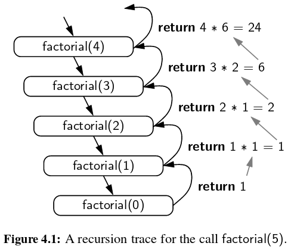
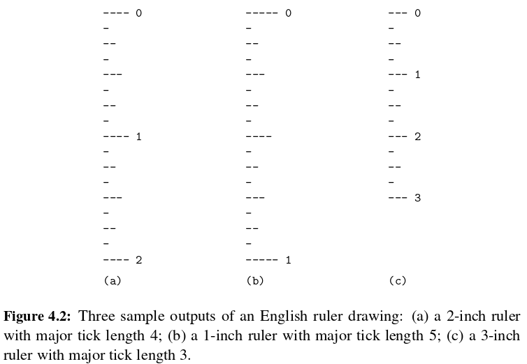
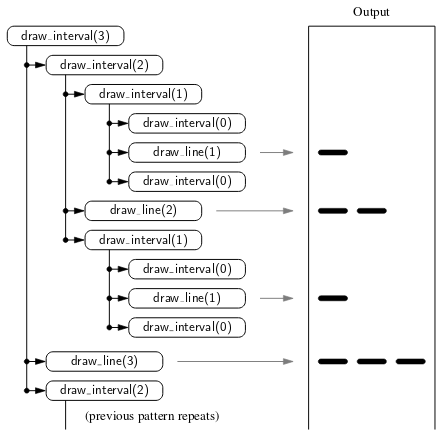
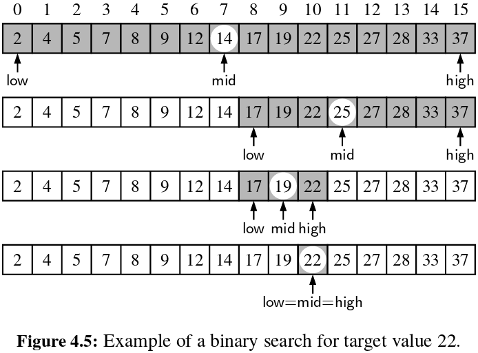
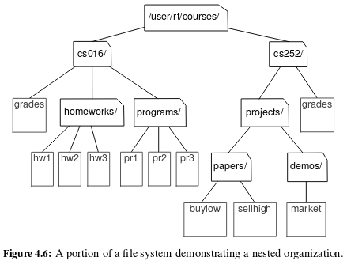
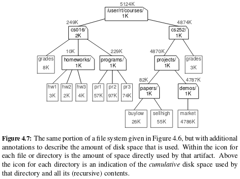
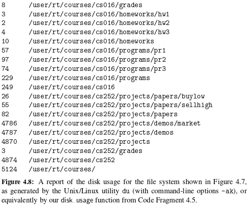
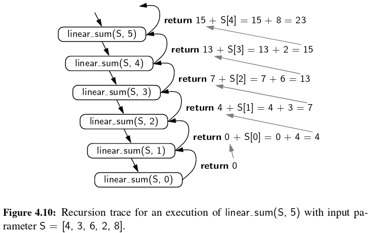
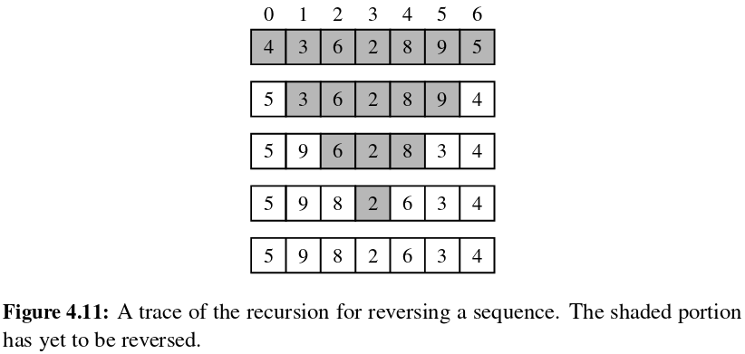

```{r setup, include=FALSE}
knitr::opts_chunk$set(echo = TRUE)
```

## Introduction

- One way to describe repetition within a computer program is the use of loops.
- An entirely different way to achieve repetition is through a process known as **recursion**.
- Recursion is a technique by which a function makes one or more calls to itself during execution, or by which a data structure relies upon smaller instances of the very same type of structure in its representation.
-  There are many examples of recursion in art and nature: fractal patterns, Russian Matryoshka dolls.
- In computing, recursion provides an elegant and powerful alternative for performing  repetitive  tasks.

## The Factorial Function [1/2]

- The factorial of a positive integer $n$, denoted $n!$, is defined as the product of the integers from $1$ to $n$.
- If $n=0$, then $n!$ is defined as $1$ by convention.

\[
n!= 
\begin{cases}
    1                     & \text{if } n = 0 \\
    n.(n-1).(n-2)...3.2.1 & \text{if } n \geq 1
\end{cases}
\]

- Example: $5!=5.(4.3.2.1.) = 120$

## The Factorial Function [2/2]

- There is a natural recursive definition for the factorial function.   
- To see this, observe that $5!=5.(4.3.2.1)=5.4!$
- More generally, for a positive integer $n$, we can define $n!$ to be $n.(n−1)!$. 
- This recursive definition can be formalized as:

\[
n!= 
\begin{cases}
    1         & \text{if } n = 0 \\
    n.(n-1)! & \text{if } n \geq 1
\end{cases}
\]

- **Base cases** are defined nonrecursively in terms of fixed quantities.
- **Recursive cases** are defined by appealing to the definition of the function being defined.

## A Recursive Implementation of the Factorial Function [1/3]

```{python, eval=TRUE}
def factorial(n):
  if n == 0:
    return 1
  else:
    return n * factorial(n-1)
```

- Repetition  is provided  by the repeated recursive invocations of the function. 
- There is no circularity in this definition, because each time the function is invoked, its argument is smaller by one, and when a base case is reached, no further recursive calls are made.

```{python, eval=FALSE}
print(factorial(5))
```

## A Recursive Implementation of the Factorial Function [2/3]

We illustrate the execution of a recursive function using a **recursion trace**.



## A Recursive Implementation of the Factorial Function [3/3]

- In Python, each time a function (recursive or otherwise) is called, a structure known as an **activation record** or frame is created to store information about the progress of that invocation  of the function.  
- This activation record includes a **namespace** for storing the function call’s parameters and local variables, and information about which command in the body of the function is currently executing.
- When the execution  of a function  leads to a **nested  function  call**,  the execution of the former call is **suspended** and its **activation record** stores the place in the source code at which the flow of control should continue upon return of the nested call.  

## Drawing an English Ruler



## A Recursive Approach to Ruler Drawing [1/3]

- The English ruler pattern is a simple example of a fractal, that is, a shape that has a self-recursive structure at various levels of magnification.
- In general, an interval with a central tick length $L \geq 1$ is composed of:
    + An interval with a central tick length $L−1$
    + A single tick of length $L$
    + An interval with a central tick length $L−1$

## A Recursive Approach to Ruler Drawing [2/3]

```{python, eval=TRUE}
def draw_line(tick_length, tick_label=''):
  line = '-' * tick_length
  if tick_label:
    line += ' ' + tick_label
  print(line)
```

```{python, eval=FALSE}
def draw_interval(center_length):
  if center_length > 0:               # stop when length drops to 0
    draw_interval(center_length - 1)  # recursively draw top ticks
    draw_line(center_length)          # draw center tick
    draw_interval(center_length - 1)  # recursively draw bottom ticks
```

## A Recursive Approach to Ruler Drawing [3/3]

```{python, eval=FALSE}
def draw_ruler(num_inches, major_length):
  draw_line(major_length, '0')
  for j in range(1, 1+num_inches):
    draw_interval(major_length-1)
    draw_line(major_length, str(j))
```

```{python, eval=FALSE}
draw_ruler(3, 3)
```

## Illustrating Ruler Drawing Using a Recursion Trace [1/2]

- The trace for ``draw_interval`` is more complicated than in the factorial example, however, because each instance makes two recursive calls.  
- To illustrate this, we will show the recursion trace in a form that is reminiscent of an outline for a document. 
- See Figure 4.3 on the textbook.

## Illustrating Ruler Drawing Using a Recursion Trace [2/2]



## Binary Search [1/3]

- **Binary search** is used to efficiently locate a target value within a sorted sequence of $n$ elements.  
- This is among the most important of computer algorithms, and it is the reason that we so often store data in sorted order.
- When the sequence is **unsorted**, the standard approach to search for a target value is to use a loop to examine every element, until either finding the target or exhausting the data set. This is known as the **sequential search** algorithm. 
- When the sequence is **sorted** and **indexable**, there is a much more efficient algorithm (e.g., **binary search**). 

## Binary Search [2/3]



## Binary Search [3/3]

```{python, eval=TRUE}
def binary_search(data, target, low, high):
  if low > high:    # interval is empty; no match
    return False
  else:
    mid = (low + high) // 2
    if target == data[mid]:   # found a match
      return True
    elif target < data[mid]:
      # recur on the portion left of the middle
      return binary_search(data, target, low, mid-1)
    else:
      # recur on the portion right of the middle
      return binary_search(data, target, mid+1, high)
```

```{python, eval=FALSE}
data = [2,5,6,9,13,16,26,38,42]
print(binary_search(data, 38, 0, len(data)-1))
```

## File Systems [1/2]

- Modern operating systems define file-system directories (which are also sometimes called “folders”) in a recursive way.  
- Namely, a file system consists of a top-level directory, and the contents of this directory consists of files and other directories, which in turn can contain files and other directories, and so on. 



## File Systems [2/2]


The cumulative disk space for an entry can be computed with a simple recursive algorithm. It is equal to the immediate disk space used by the entry plus the sum of the cumulative disk space usage of any entries that are stored directly within the entry.

## Python's os Module

Python’s os module provides robust tools for interacting with the operating system during the execution of a program. 

- ``os.path.getsize(path)`` return the immediate disk usage (measured in bytes) for the file or directory that is identified by the string path(e.g., /user/rt/courses).
- ``os.path.isdir(path)`` return ``True`` if entry designated by string pathis a directory; ``False`` otherwise.
- ``os.listdir(path)`` return a list of strings that are the names of all entries within a directory designated by string path. In our sample file system, if the parameter is ``/user/rt/courses``, this returns the ``list['cs016','cs252']``.
- ``os.path.join(path, filename)`` compose the path string and file name string using an appropriate operating system separator between the two.

## Python Implementation (File Systems)

```{python, eval=TRUE}
import os
def disk_usage(path):
  total = os.path.getsize(path)                 
  if os.path.isdir(path):                      
    for filename in os.listdir(path):           
      childpath = os.path.join(path, filename) 
      total += disk_usage(childpath)
  print('{0:<7}'.format(total), path)
  return total
```

## Recursion Trace

Because theprintstatement is madejust before returning from a recursive call, the output shown in Figure 4.8 reflectsthe order in which the recursive calls are completed. 



## Recursion Run Amok

- Although recursion is a very powerful tool, it can easily be misused in various ways.
- We examine several problems in which a poorly implemented recursion causes drastic inefficiency, and we discuss some strategies for recognizing and avoid such pitfalls.

## An Inefficient Recursion for Computing Fibonacci Numbers

```{python, eval=TRUE}
def bad_fibonacci(n):
  print('function called')
  if n<=1:
    return n
  else:
    return bad_fibonacci(n-2) + bad_fibonacci(n-1)
```

```{python, eval=FALSE}
print(bad_fibonacci(5))
```

## An Efficient Recursion for Computing Fibonacci Numbers

- Rather than having the function return a single value, which is the $n^{th}$ Fibonacci number, we define a recursive function that returns a pair of consecutive Fibonacci numbers ($F_n$, $F_{n-1}$).

```{python, eval=TRUE}
def good_fibonacci(n):
  print('function called')
  if n<=1:
    return (n,0)
  else:
    (a, b) = good_fibonacci(n-1)
    return (a+b, a)
```

```{python, eval=FALSE}
print(good_fibonacci(5))
```

## Maximum Recursive Depth in Python [1/3]

- Another danger in the misuse of recursion is known as infinite recursion.  
- If each recursive call makes another recursive call, without ever reaching a **base case**, then we have an infinite series of such calls. This is a fatal error. 
- An infinite recursion can quickly swamp computing resources, not only due to **rapid use of the CPU**, but because each successive call creates an **activation record** requiring **additional memory**. 

```{python, eval=TRUE}
def fib(n):
  fib(n)
```

## Maximum Recursive Depth in Python [2/3]

- A programmer should ensure that each recursive call is in some way progressing toward a **base case** (for example, by having a parameter value that decreases with each call). 
- To combat against infinite recursions, the designers of Python made an intentional decision to limit the overall number of function activations that can be simultaneously active. 
-  a typical default value is **1000**. If this limit is reached,  the Python interpreter  raises a ``RuntimeError`` with a message, ``maximum recursion depth exceeded``.

## Maximum Recursive Depth in Python [3/3]

- the Python interpreter can be dynamically reconfigured to change the default recursive limit. 
- This is done through use of a module named ``sys``, which supports a ``getrecursionlimit`` function and a ``setrecursionlimit``.

```{python, eval=FALSE}
import sys
print(sys.getrecursionlimit()) 
sys.setrecursionlimit(1000000)
print(sys.getrecursionlimit()) 
```

## Further Examples of Recursion

- **Linear recursion**: a recursive call which starts at most one other.
- **Binary recursion**: a recursive call which may start two others.
- **Multiple recursion**: a recursive call which may start three or more others.

## Linear Recursion

- If a recursive  function  is designed  so that each invocation  of the body  makes at most one new recursive call, this is know as **linear recursion**.
- A consequence of the definition of linear recursion is that any recursion trace will appear as a single sequence of calls.

## Summing the Elements of a Sequence Recursively [1/2]

- Linear recursion can be a useful tool for processing a data sequence, such as a Python list.
- For example, that we want to compute the sum of a sequence, $S$, of $n$ integers.

```{python, eval=TRUE}
def linear_sum(S, n):
  print('function called')
  if n==0:
    return 0
  else:
    return linear_sum(S, n-1) + S[n-1]
```

```{python, eval=FALSE}
S = [4,3,6,2,8]
linear_sum(S, len(S))
```

## Summing the Elements of a Sequence Recursively [2/2]



## Reversing a Sequence with Recursion [1/3]

- Let us consider the problem of reversing the $n$ elements of a sequence, $S$, so that the first element becomes the last, the second element becomes second to the last, and so on. 
- We can solve this problem using linear recursion, by observing that the reversal of a sequence can be achieved by swapping the first and last elements and then recursively reversing the remaining elements.

## Reversing a Sequence with Recursion [2/3]

```{python, eval=TRUE}
def reverse(S, start, stop):
  if start < stop-1:
    S[start], S[stop-1] = S[stop-1], S[start]
    reverse(S, start+1, stop-1)
```

```{python, eval=FALSE}
S = [4,3,6,2,8,9,5]
reverse(S, 0, len(S))
print(S)
```

- We are guaranteed to make progress towards a base case, asthe difference,stop−start, decreases by two with each call.
- If $n$ is **even**, we will eventually reach the ``start == stop`` case, and if $n$ is **odd**, we will eventually reach the ``start == stop−1`` case.

## Reversing a Sequence with Recursion [3/3]



## Recursive Algorithms for Computing Powers [1/4]

As another interesting example of the use of linear recursion, we consider the problem of raising a number $x$ to an arbitrary nonnegative integer, $n$. 

\[
power(x,n)= 
\begin{cases}
    1         & \text{if } n = 0 \\
    x.power(x,n-1) & \text{if } n \gt 0
\end{cases}
\]

## Recursive Algorithms for Computing Powers [2/4]

```{python, eval=TRUE}
def power(x, n):
  print('function called')
  if n==0:
    return 1
  else:
    return x * power(x, n-1)
```

```{python, eval=FALSE}
print(power(3,5))
```

## Recursive Algorithms for Computing Powers [3/4]

There is a much faster way to compute the power function using an alternative definition that employs a squaring technique. 

\[
power(x,n)= 
\begin{cases}
    1                             & \text{if } n = 0 \\
    x.(power(x,\frac{n}{2}))^{2}  & \text{if } n \gt 0 \& odd \\
    (power(x,\frac{n}{2}))^{2}    & \text{if } n \gt 0 \& even
\end{cases}
\]

## Recursive Algorithms for Computing Powers [4/4]

```{python, eval=TRUE}
def power(x, n):
  print('function called')
  if n == 0:
    return 1
  else:
    partial = power(x, n//2)
    result = partial * partial
    if n%2 == 1:  # if n odd, include extra factor of x
      result *= x
    return result
```

```{python, eval=FALSE}
print(power(3,5))
```

## Binary Recursion

- When a function makes two recursive calls, we say that it uses **binary recursion**.
- Let us revisit the problem of summing the $n$ elements of a sequence, $S$, of numbers. 
- We can recursively compute the sum of the first half, and the sum of the second half, and add these sums together. 

```{python, eval=TRUE}
def binary_sum(S, start, stop):
  print('function called')
  if start >= stop:
    return 0
  elif start == stop-1:
    return S[start]
  else:
    mid = (start + stop) // 2
    return binary_sum(S, start, mid) + binary_sum(S, mid, stop)
```

```{python, eval=FALSE}
S = [4,3,6,2,8]
binary_sum(S, 0, len(S))
```

## Multiple Recursion

- We define **multiple recursion** as a process in which a function may make more than two recursive calls.
- Our recursion for analyzing the disk space usage of a file system is an example of multiple recursion, because the number of recursive calls made during one invoction was equal to the number of entries within a given directory of the file system.

## Designing Recursive Algorithms

In general, an algorithm that uses recursion typically has the following form:

- **Test for base cases**. We begin by testing for a set of base cases (there should be at least one). These base cases should be defined so that every possible chain of recursive calls will eventually reach a base case, and the handling of each base case should not use recursion.
- **Recur**. This recursive step may involve a test that decides which of several possible recursive calls to make. We should define each possible recursive call so that it makes progress towards a base case.

## Eliminating Tail Recursion [1/3]

- A recursion is a tail recursion if any recursive call that is made from one context is the very last operation in that context, with the return value of the recursive call (if any) immediately returned by the enclosing recursion. 
- By necessity, a tail recursion must be a linear recursion (since there is no way to make a second recursive call if you must immediately return the result of the first).

```{python, eval=FALSE}
return n * factorial(n-1)
```

- This is not a tail recursion because an additional multiplication is performed after the recursive call is completed. 
- Any tail recursion can be reimplemented nonrecursively by enclosing the body in a loop for repetition, and replacing a recursive call with new parameters by a reassignment of the existing parameters to those values.

## Eliminating Tail Recursion [2/3]

A nonrecursive implementation of binary search.

```{python, eval=TRUE}
def binary_search_iterative(data, target):
  low = 0
  high = len(data)-1
  while low<=high:
    mid = (low+high) // 2
    if target == data[mid]:
      return True
    elif target<data[mid]:
      high = mid-1
    else:
      low = mid+1
  return False
```

## Eliminating Tail Recursion [3/3]

- Reversing the elements of a sequence using iteration.

```{python, eval=TRUE}
def reverse_iterative(S):
  start, stop = 0, len(S)
  while start < stop-1:
    S[start], S[stop-1] = S[stop-1], S[start] # swap first and last
    start, stop = start + 1, stop-1 # narrow the range
```

- Many other linear recursions can be expressed quite efficiently with iteration, even if they were not formally tail recursions. 

## Exercises

- There are three categories of exercises on the textbook:
  
    + Reinforcement
    + Creativity
    + Projects
  
- Hints for Chapter 04 exercises are available via this [link](http://bcs.wiley.com/he-bcs/Books?action=chapter&bcsId=8029&itemId=1118290275&chapterId=88998).

# End of Chapter 04


