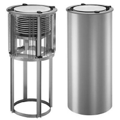
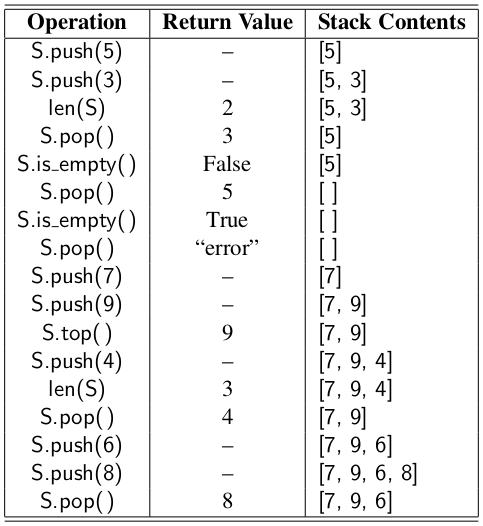
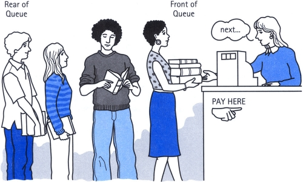
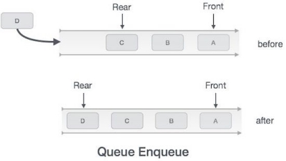
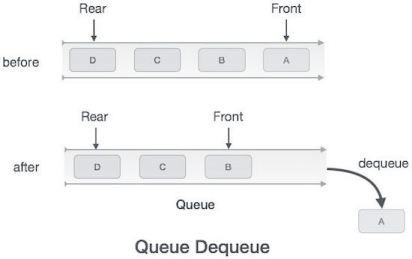
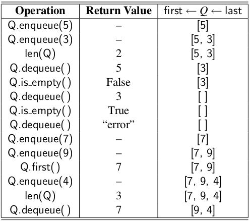
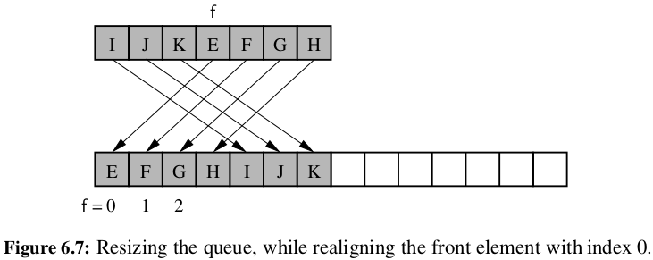
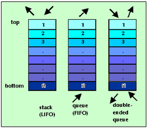
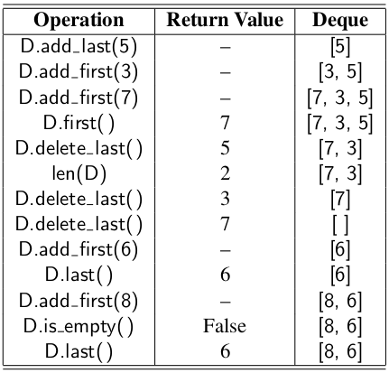

```{r setup, include=FALSE}
knitr::opts_chunk$set(echo = TRUE)
```

<style>
slides > slide { overflow: scroll; }
slides > slide:not(.nobackground):after {
  content: '';
}
</style>

## Stacks [1/3]

- A **stack** is a collection of objects that are inserted and removed according to the **last-in, first-out (LIFO)** principle.
- A user may insert objects into a stack at any time, but may only access or remove the most recently inserted object that remains (at the so-called “top” of the stack).
- Real implementation of stack:
    + Web browser history
    + Undo
    
## Stacks [2/3]


## Stacks [3/3]

- 
- 
- 
    
## The Stack Abstract Data Type [1/3]

- ``S.push(e)``: Add element ``e`` to the top of stack ``S``.
- ``S.pop()``: Remove and return the top element from the stack ``S``; an error occurs if the stack is empty.
- ``S.top()``: Return a reference to the top element of stack ``S``, without removing it; an error occurs if the stack is empty.
- ``S.is_empty()``: Return ``True`` if stack ``S`` does not contain any elements.
- ``len(S)``: Return the number of elements in stack ``S``; in Python, we implement this with the special method ``__len__``.
- By convention, we assume that a newly created stack is empty, and that there is no a priori bound on the capacity of the stack. 
- Elements added to the stack can have arbitrary type.

## The Stack Abstract Data Type [2/3]

- 
- 

## The Stack Abstract Data Type [3/3]



## Simple Array-Based Stack Implementation

- Although a programmer could directly use the list class in place of a formal stack class, lists also include behaviors (e.g., adding or removing elements from arbitrary positions) that would break the abstraction that the stack ADT represents.
- The terminology used by the list class does not precisely align with traditional nomenclature for a stack ADT, in particular the distinction between append and push. 
- Instead, we demonstrate how to use a list for internal storage while providing a public interface consistent with a stack.

## The Adapter Pattern [1/2]

- The **adapter design pattern** applies to any context where we effectively want to modify an existing class so that its methods match those of a related, but different, class or interface. 
- One general way to apply the adapter pattern is to define a new class in such a way that it contains an instance of the existing class as a hidden field, and then to implement each method of the new class using methods of this hidden instance variable. 
- By applying the adapter pattern in this way, we have created a new class that performs some of the same functions as an existing class, but **repackaged** in a more convenient way.

## The Adapter Pattern [2/2]


## Implementing a Stack Using a Python List [1/2]

- We use the adapter design pattern to define an ArrayStack class that uses an underlying Python list for storage.
- When pop is called on an empty Python list, it formally raises an IndexError, as lists are index-based sequences. 
- That choice does not seem appropriate for a stack, since there is no assumption of indices. 
- Instead, we can define a new exception class that is more appropriate.

```{python, eval=TRUE}
class Empty(Exception):
  '''Error attempting to access an element from an empty container.'''
  pass
```

## Implementing a Stack Using a Python List [2/2]

```{python, eval=FALSE}
class ArrayStack:
  def __init__(self):
    self._data = []
    
  def __len__(self):
    return len(self._data)
  
  def is_empty(self):
    return len(self._data) == 0
    
  def push(self, e):
    self._data.append(e)
    
  def top(self):
    if self.is_empty():
      raise Empty('Stack is empty')
    return self._data[-1]
  
  def pop(self):
    if self.is_empty():
      raise Empty('Stack is empty')
    return self._data.pop()
```

## Reversing Data Using a Stack

As a consequence of the LIFO protocol, a stack can be used as a general tool to reverse a data sequence.

```{python, eval=TRUE}
def reverse_file(filename):
  S = ArrayStack()
  
  original = open(filename)
  for line in original:
    S.push(line.rstrip( '\n' ))
  original.close()  
  
  output = open(filename, 'w')
  while not S.is_empty():
    output.write(S.pop() + '\n')
  output.close()
```

## Matching Parentheses and HTML Tags

- In this subsection, we explore two related applications of stacks, both of which involve testing for pairs of matching delimiters. 
- In our first application, we consider arithmetic expressions that may contain various pairs of grouping symbols.
    + Parentheses: ``(`` and ``)``
    + Braces: ``{`` and ``}``
    + Brackets: ``[`` and ``]``
- Each opening symbol must match its corresponding closing symbol.
    + Correct: ``( )(( )){([( )])}``
    + Correct: ``((( )(( )){([( )])}))``
    + Incorrect: ``)(( )){([( )])}``
    + Incorrect: ``({[ ])}``
    + Incorrect: ``(``
    
## An Algorithm for Matching Delimiters [1/2]

```{python, eval=FALSE}
def is_matched(expr):
  lefty = '({['       # opening delimiters
  righty = ')}]'      # respective closing delims
  S = ArrayStack()
  
  for c in expr:
    if c in lefty:
      S.push(c)       # push left delimiter on stack
    elif c in righty:
      if S.is_empty():
        return False  # nothing to match with
      if righty.index(c) != lefty.index(S.pop()):
        return False  # mismatched
        
  return S.is_empty() # were all symbols matched?
```

```{python, eval=FALSE}
expr = '[(5+x) - (y+z)]'
print(is_match(expr))
```

## An Algorithm for Matching Delimiters [2/2]

- We perform a left-to-right scan of the original sequence, using a stack ``S`` to facilitate the matching of grouping symbols. 
- Each time we encounter an opening symbol, we **push** that symbol onto ``S``, and each time we encounter a closing symbol, we **pop** a symbol from the stack ``S`` (assuming ``S`` is not empty), and check that these two symbols form a valid pair. 
- If we reach the end of the expression and the stack is empty, then the original expression was properly matched.
- Otherwise, there must be an opening delimiter on the stack without a matching symbol.

## Matching Tags in a Markup Language [1/2]

- Another application of matching delimiters is in the validation of markup languages such as HTML or XML.
- In an HTML document, portions of text are delimited by HTML tags. 
- A simple opening HTML tag has the form ``<name>`` and the corresponding closing tag has the form ``</name>``.

## Matching Tags in a Markup Language [2/2]

```{python, eval=FALSE}
def is_matched_html(raw):
  S = ArrayStack()
  j = raw.find('<')             # find first ’<’ character (if any)
  while j != -1:
    k = raw.find('>', j+1)      # find next ’>’ character
    if k == -1:
      return False              # invalid tag
    tag = raw[j+1:k]            # strip away < >
    if not tag.startswith('/'): # this is opening tag
      S.push(tag)
    else:                       # this is closing tag
      if S.is_empty():
        return False            # nothing to match with
      if tag[1:] != S.pop():
        return False            # mismatched delimiter
    j = raw.find( '<' , k+1)    # find next ’<’ character (if any)
  
  return S.is_empty()           # were all opening tags matched?
```


## Queues [1/2]

- A **queue** is a collection of objects that are inserted and removed according to the **first-in, first-out (FIFO)** principle.
- Elements can be inserted at any time, but only the element that has been in the queue the longest can be next removed.
- We usually say that elements enter a queue at the back and are removed from the front.


## Queues [2/2]

- 
- 

## The Queue Abstract Data Type [1/3]

- ``Q.enqueue(e)``: Add element ``e`` to the back of queue ``Q``.
- ``Q.dequeue()``: Remove and return the first element from queue ``Q``; an error occurs if the queue is empty.
- ``Q.first()``: Return a reference to the element at the front of queue ``Q``, without removing it; an error occurs if the queue is empty.
- ``Q.is_empty()``: Return ``True`` if queue ``Q`` does not contain any elements.
- ``len(Q)``: Return the number of elements in queue ``Q``; in Python, we implement this with the special method ``__len__``.

## The Queue Abstract Data Type [2/3]

- 
- 

## The Queue Abstract Data Type [3/3]



## A Python Queue Implementation [1/3]

- Internally, the queue class maintains the following three instance variables:
    + ``_data``: is a reference to a list instance with a fixed capacity.
    + ``_size``: is an integer representing the current number of elements stored in the queue (as opposed to the length of the data list).
    + ``_front``: is an integer that represents the index within data of the first element of the queue (assuming the queue is not empty).
- We initially reserve a list of moderate size for storing data, although the queue formally has size zero. 
- We initialize the front index to zero.
- When front or dequeue are called with no elements in the queue, we raise an instance of the ``Empty`` exception.

## A Python Queue Implementation [2/3]

```{python, eval=FALSE}
class ArrayQueue:
  DEFAULT_CAPACITY = 10 # moderate capacity for all new queues
  
  def __init__ (self):
    self._data = [None] * ArrayQueue.DEFAULT_CAPACITY
    self._size = 0
    self._front = 0
    
  def __len__(self):
    return self._size
    
  def is_empty(self):
    return self._size == 0
    
  def first(self):
    if self.is_empty():
      raise Empty('Queue is empty')
    
    return self._data[self._front]
  
  def dequeue(self):
    if self.is_empty():
      raise Empty('Queue is empty')
    
    answer = self._data[self._front]
    self._data[self._front] = None  # help garbage collection
    self._front = (self._front + 1) % len(self._data)
    self._size -= 1
    
    return answer
    
  def enqueue(self, e):
    if self._size == len(self._data):
      self._resize(2 * len(self._data)) # double the array size
    
    avail = (self._front + self._size) % len(self._data)
    self._data[avail] = e
    self._size += 1
 
  def _resize(self, cap):  # we assume cap >= len(self)
    old = self._data  # keep track of existing list
    self._data = [None] * cap # allocate list with new capacity
    walk = self._front
    
    for k in range(self._size): # only consider existing elements
      self._data[k] = old[walk] # intentionally shift indices
      walk = (1 + walk) % len(old) # use old size as modulus
      
    self. front = 0 # front has been realigned
```

## A Python Queue Implementation [3/3]

- The implementation of ``__len__`` and ``is_empty`` are trivial, given knowledge of the ``_size``. 
- The implementation of the ``first`` method is also simple, as the ``_front`` index tells us precisely where the desired element is located within the data list, assuming that list is not empty.


## Adding and Removing Elements [1/2]

- The goal of the ``enqueue`` method is to **add** a new element to the back of the queue.
- We need to determine the proper index at which to place the new element. 
- We compute the location of the next opening based on the formula: 

```{python, eval=FALSE}
avail = (self._front + self._size) % len(self._data)
```

## Adding and Removing Elements [2/2]

- When the ``dequeue`` method is called, the current value of ``self._front`` designates the index of the value that is to be **removed** and **returned**. 
- We keep a local reference to the element that will be returned just prior to removing the reference to that object from the list.

```{python, eval=FALSE}
answer = self. data[self._front]
self._data[self._front] = None
```

- The second significant responsibility of the dequeue method is to update the value of front to reflect the removal of the element, and the presumed promotion of the second element to become the new first. 
- In most cases, we simply want to increment the index by one, but because of the possibility of a wrap-around configuration, we rely on modular arithmetic.

```{python, eval=FALSE}
self._front = (self._front + 1) % len(self._data)
self._size -= 1
```

## Resizing the Queue

- When enqueue is called at a time when the size of the queue equals the size of the underlying list, we rely on a standard technique of doubling the storage capacity of the underlying list.
- After creating a temporary reference to the old list of values, we allocate a new list that is twice the size and copy references from the old list to the new list. 
- While transferring the contents, we intentionally realign the front of the queue with index 0 in the new array.



## Double-Ended Queues

- We next consider a queue-like data structure that supports insertion and deletion at both the front and the back of the queue. 
- Such a structure is called a **double-ended queue**, or **deque**, which is usually pronounced **“deck”**.



## The Deque Abstract Data Type [1/2]

- ``D.add_first(e)``: Add element ``e`` to the front of deque ``D``.
- ``D.add_last(e)``: Add element ``e`` to the back of deque ``D``.
- ``D.delete_first()``: Remove and return the first element from deque ``D``; an error occurs if the deque is empty.
- ``D.delete_last()``: Remove and return the last element from deque ``D``; an error occurs if the deque is empty.
- ``D.first()``: Return (but do not remove) the first element of deque ``D``; an error occurs if the deque is empty.
- ``D.last()``: Return (but do not remove) the last element of deque ``D``; an error occurs if the deque is empty.
- ``D.is_empty()``: Return True if deque D does not contain any elements.
- ``len(D)``: Return the number of elements in deque ``D``; in Python, we implement this with the special method ``__len__``.

## The Deque Abstract Data Type [2/2]



