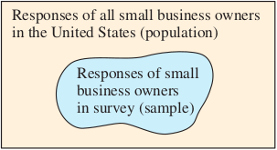
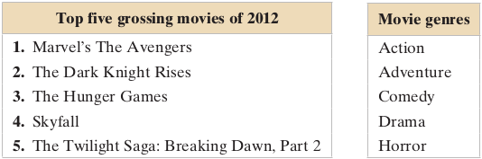
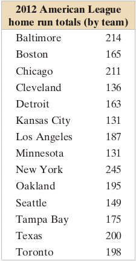
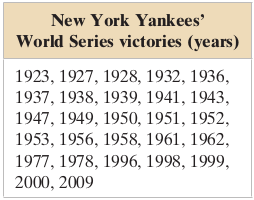
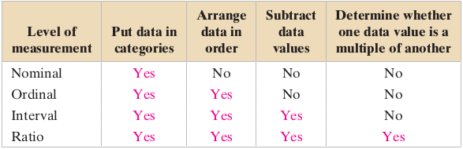
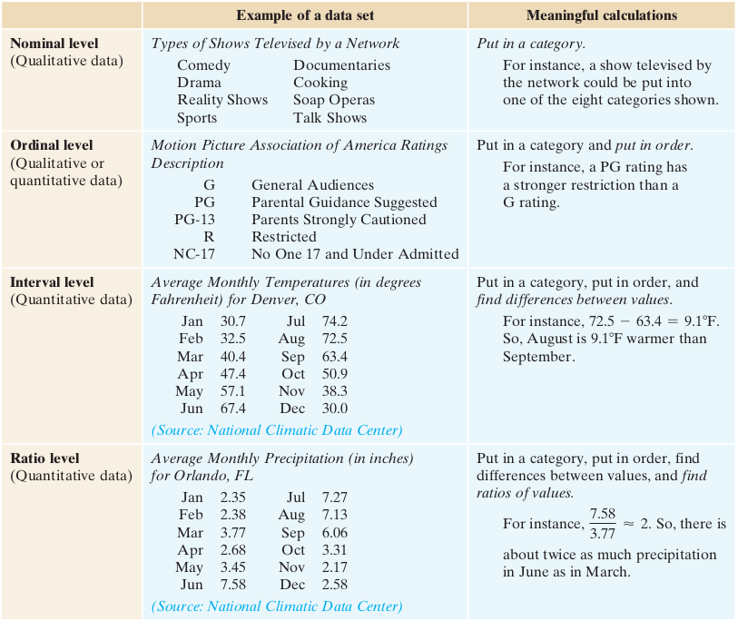
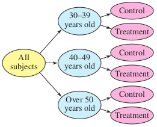
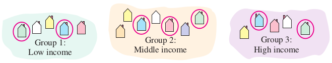
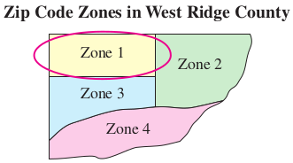
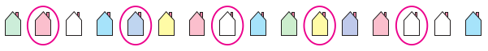

<style>
slides > slide { overflow: scroll; }
slides > slide:not(.nobackground):after {
  content: '';
}
</style>

```{r setup, include=FALSE}
knitr::opts_chunk$set(echo = FALSE)
```

## An Overview of Statistics
### A Definition of Statistics
- **Statistics** is the science of collecting, organizing, analyzing, and interpreting data in order to make decisions.
- **Data** consist of information coming from observations, counts, measurements, or responses.

## An Overview of Statistics
### Data Sets
- There are two types of data sets you will use when studying statistics. These data sets are called **populations** and **samples**.
- A **population** is the collection of all outcomes, responses, measurements, or counts that are of interest.
- A **sample** is a subset, or part, of a population.
- A sample should be **representative** of a population so that sample data can be used to draw conclusions about that population.
- Sample data must be collected using an **appropriate method**, such as **random sampling**.
- When sample data are collected using an **inappropriate method**, the data cannot be used to draw conclusions about the population.

## An Overview of Statistics
### Data Sets [Example]
In a recent survey, 614 small business owners in the United States were asked whether they thought their company’s Facebook presence was valuable. 258 of the 614 respondents said yes. Identify the population and the sample. Describe the sample data set.



## An Overview of Statistics
### Data Sets
Two important terms that are used throughout this course are parameter and statistic.

- A parameter is a numerical description of a **population characteristic**.
- A statistic is a numerical description of a **sample characteristic**.

It is important to note that a sample statistic can differ from sample to sample whereas a population parameter is constant for a population.

## An Overview of Statistics
### Data Sets [Example]
Determine whether the numerical value describes a population parameter or a sample statistic. Explain your reasoning.

- A recent survey of approximately 400,000 employers reported that the average starting salary for marketing majors is $53,400.
- The freshman class at a university has an average SAT math score of 514.
- In a random check of 400 retail stores, the Food and Drug Administration found that 34% of the stores were not storing fish at the proper temperature.

## An Overview of Statistics
### Brances of Statistics
The study of statistics has two major branches: **descriptive statistics** and **inferential statistics**.

- **Descriptive statistics** is the branch of statistics that involves the organization, summarization, and display of data.
- **Inferential statistics** is the branch of statistics that involves using a sample to draw conclusions about a population. A basic tool in the study of inferential statistics is probability.

## An Overview of Statistics
### Brances of Statistics [Example]
Determine which part of the study represents the descriptive branch of statistics. What conclusions might be drawn from the study using inferential statistics?

- A large sample of men, aged 48, was studied for 18 years. For unmarried men, approximately 70% were alive at age 65. For married men, 90% were alive at age 65.
- In a sample of Wall Street analysts, the percentage who incorrectly forecasted high-tech earnings in a recent year was 44%.

## An Overview of Statistics
### Exercises
Please refer to **page 6-8** of the textbook for exercises

## Data Classification
### Types of Data
Data sets can consist of two types of data: **qualitative data** and **quantitative data**.

- Qualitative data consist of attributes, labels, or nonnumerical entries.
- Quantitative data consist of numerical measurements or counts.

## Data Classification
### Types of Data [Example]
The suggested retail prices of several Honda vehicles are shown in the table. Which data are qualitative data and which are quantitative data? Explain your reasoning.


## Data Classification
### Levels of Measurement
The level of measurement determines which statistical calculations are meaningful. The four levels of measurement, in order from lowest to highest, are **nominal**, **ordinal**, **interval**, and **ratio**.

- Data at the **nominal** level of measurement are **qualitative** only. Data at this level are categorized using **names**, **labels**, or **qualities**. No mathematical computations can be made at this level.
- Data at the **ordinal** level of measurement are **qualitative** or **quantitative**. Data at this level can be arranged in **order**, or **ranked**, but differences between data entries are not meaningful.

When numbers are at the nominal level of measurement, they simply represent a label.

## Data Classification
### Levels of Measurement [Example]
Two data sets are shown. Which data set consists of data at the nominal level? Which data set consists of data at the ordinal level? Explain your reasoning.



## Data Classification
### Levels of Measurement
- Data at the **interval** level of measurement can be ordered, and meaningful differences between data entries can be calculated. At the interval level, a zero entry simply represents a position on a scale; the entry is **not an inherent zero**.
- Data at the **ratio** level of measurement are similar to data at the interval level, with the added property that a zero entry is **an inherent zero**. A ratio of two data entries can be formed so that one data entry can be meaningfully expressed as a multiple of another.

An inherent zero is a zero that implies “none.” For instance, the amount of money you have in a savings account could be zero dollars. In this case, the zero represents no money; it is an inherent zero. On the other hand, a temperature of 0°C does not represent a condition in which no heat is present. The 0°C temperature is simply a position on the Celsius scale; it is not an inherent zero.

## Data Classification
### Levels of Measurement [Example]
Two data sets are shown. Which data set consists of data at the interval level? Which data set consists of data at the ratio level? Explain your reasoning.

 

## Data Classification
### Levels of Measurement
The tables below summarize which operations are meaningful at each of the four levels of measurement. When identifying a data set’s level of measurement, use the highest level that applies.



## Data Classification
### Levels of Measurement


## Data Classification
### Exercises
Please refer to **page 13-16** of the textbook for exercises

## Data Collection and Experimental Design
### Design of a Statistical Study
Guidelines:

- Identify the variable(s) of interest (the focus) and the population of the study.
- Develop a detailed plan for collecting data. If you use a sample, make sure the sample is representative of the population.
- Collect the data.
- Describe the data, using descriptive statistics techniques.
- Interpret the data and make decisions about the population using inferential statistics.
- Identify any possible errors.

## Data Collection and Experimental Design
### Design of a Statistical Study
- A statistical study can usually be categorized as an **observational** study or an **experiment**.
- In an **observational** study, a researcher does not influence the responses.
- In an **experiment**, a researcher deliberately applies a treatment before observing the responses.

## Data Collection and Experimental Design
### Design of a Statistical Study
In an **observational** study, a researcher observes and measures characteristics of interest of part of a population but does not change existing conditions.

## Data Collection and Experimental Design
### Design of a Statistical Study
- In performing an experiment, a treatment is applied to part of a population, called a **treatment group**, and responses are observed.
- Another part of the population may be used as a **control group**, in which no treatment is applied.
- The subjects in the treatment and control groups are called **experimental units**.
- In many cases, subjects in the control group are given a placebo, which is a harmless, fake treatment, that is made to look like the real treatment.
- The responses of the treatment group and control group can then be compared and studied.
- In most cases, it is a good idea to use the same number of subjects for each group.

## Data Collection and Experimental Design
### Design of a Statistical Study [Example]
Determine whether the study is an observational study or an experiment.

- Researchers study the effect of vitamin D3 supplementation among patients with antibody deficiency or frequent respiratory tract infections. To perform the study, 70 patients receive 4000 IU of vitamin D3 daily for a year. Another group of 70 patients receive a placebo daily for one year.
- Researchers conduct a study to find the U.S. public approval rating of the U.S. president. To perform the study, researchers call 1500 U.S. residents and ask them whether they approve or disapprove of the job being done by the president.

## Data Collection and Experimental Design
### Experimental Design

- Three key elements of a well-designed experiment are **control**, **randomization**, and **replication**.
- Because experimental results can be ruined by a variety of factors, being able to **control** these influential factors is important. Some of the factors that can affect experimental results are **confounding variable**, **placebo effect**, and **Hawthorne effect**.
- A **confounding variable** occurs when an experimenter cannot tell the difference between the effects of different factors on the variable.
- The **placebo effect** occurs when a subject reacts favorably to a placebo when in fact the subject has been given a fake treatment.
- The **Hawthorne effect** occurs in an experiment when subjects change their behavior simply because they know they are participating in an experiment.

## Data Collection and Experimental Design
### Experimental Design [Control]

- To help control or minimize the placebo effect, a technique called **blinding** can be used.
- **Blinding** is a technique where the subjects do not know whether they are receiving a treatment or a placebo.
- In a **double-blind** experiment, neither the experimenter nor the subjects know if the subjects are receiving a treatment or a placebo. The experimenter is informed after all the data have been collected. This type of experimental design is preferred by researchers.

## Data Collection and Experimental Design
### Experimental Design [Randomization]
- Another element of a well-designed experiment is **randomization**.
- **Randomization** is a process of randomly assigning subjects to different treatment groups.
- In a **completely randomized design**, subjects are assigned to different treatment groups through random selection.

## Data Collection and Experimental Design
### Experimental Design [Randomization]
- In some experiments, it may be necessary for the experimenter to use **blocks**, which are groups of subjects with **similar characteristics**.
- A commonly used experimental design is a **randomized block design**. To use a **randomized block design**, the experimenter divides the subjects with similar characteristics into blocks, and then, within each block, randomly assign subjects to treatment groups.



## Data Collection and Experimental Design
### Experimental Design [Randomization]
- Another type of experimental design is a **matched-pairs design**, where subjects are paired up according to a similarity.
- One subject in each pair is randomly selected to receive one treatment while the other subject receives a different treatment.

## Data Collection and Experimental Design
### Experimental Design [Replication]
- **Sample size**, which is the number of subjects in a study, is another important part of experimental design.
- To improve the **validity** of experimental results, **replication** is required.
- **Replication** is the repetition of an experiment under the same or similar conditions.

## Data Collection and Experimental Design
### Experimental Design [Example]
A company wants to test the effectiveness of a new gum developed to help people quit smoking. Identify a potential problem with the given experimental design and suggest a way to improve it.

- The company identifies ten adults who are heavy smokers. Five of the subjects are given the new gum and the other five subjects are given a placebo. After two months, the subjects are evaluated and it is found that the five subjects using the new gum have quit smoking.
- The company identifies one thousand adults who are heavy smokers. The subjects are divided into blocks according to gender. Females are given the new gum and males are given the placebo. After two months, a significant number of the female subjects have quit smoking.

## Data Collection and Experimental Design
### Sampling Techniques
- A **census** is a count or measure of an **entire population**. Taking a census provides complete information, but it is often **costly** and **difficult** to perform.
- A **sampling** is a count or measure of **part of a population**, and is more commonly used in statistical studies.
- A **biased sample** is one that is **not representative of the population** from which it is drawn.
- To collect **unbiased data**, a researcher must ensure that the sample is **representative of the population**.
- Appropriate sampling techniques must be used to ensure that inferences about the population are valid.

## Data Collection and Experimental Design
### Sampling Techniques
- Even with the best methods of sampling, a **sampling error** may occur. A **sampling error** is **the difference** between the results of a **sample** and those of the **population**.
- A **simple random sample** is a sample in which every possible sample of the same size has the same chance of being selected (every member of the population has an equal chance of being selected).
- One way to collect a simple random sample is to assign a different number to each member of the population and then use a random number table (or a random number generator).

## Data Collection and Experimental Design
### Sampling Techniques [Example]
There are 731 students currently enrolled in a statistics course at your school. You wish to form a sample of eight students to answer some survey questions. Select the students who will belong to the simple random sample.

- Assign numbers 1 to 731 to the students in the course. In the table of random numbers, choose a starting place at random and read the digits in groups of three (because 731 is a three-digit number).

## Data Collection and Experimental Design
### Sampling Techniques
- When you choose members of a sample, you should decide whether it is acceptable to have the same population member selected more than once.
- If it is acceptable, then the sampling process is said to be **with replacement**.
- If it is not acceptable, then the sampling process is said to be **without replacement**.

## Data Collection and Experimental Design
### Sampling Techniques [Stratified Sample]
- When it is important for the sample to have members from each segment of the population, you should use a **stratified sample**.
- Depending on the focus of the study, members of the population are divided into two or more subsets, called strata, that share a similar characteristic such as age, gender, ethnicity, or even political preference.
- A sample is then randomly selected from each of the strata.
- Using a stratified sample ensures that each segment of the population is represented.
- In using a stratified sample, care must be taken to ensure that all strata are sampled in **proportion** to their actual percentages of occurrence in the population.



## Data Collection and Experimental Design
### Sampling Techniques [Cluster Sample]
- When the population falls into naturally occurring subgroups, each having similar characteristics, a cluster sample may be the most appropriate.
- To select a cluster sample, divide the population into groups, called clusters, and select all of the members in one or more (but not all) of the clusters.
- In using a cluster sample, care must be taken to ensure that all clusters have similar characteristics.



## Data Collection and Experimental Design
### Sampling Techniques [Stratified vs Cluster Sample]
- For **stratified** sampling, each of the strata contains members with a certain characteristic (for instance, a particular age group).
- In contrast, **clusters** consist of geographic groupings, and each cluster should contain members with all of the characteristics (for instance, all age groups).
- With **stratified** samples, some of the members of each group are used.
- In a **cluster** sampling, all of the members of one or more groups are used.

## Data Collection and Experimental Design
### Sampling Techniques [Systematic Sample]
- A **systematic sample** is a sample in which each member of the population is assigned a number.
- The members of the population are ordered in some way, a starting number is randomly selected, and then sample members are selected at regular intervals from the starting number. (For instance, every 3rd, 5th, or 100th member is selected.)
- An advantage of systematic sampling is that it is easy to use. In the case of any regularly occurring pattern in the data, however, this type of sampling should be avoided.



## Data Collection and Experimental Design
### Sampling Techniques [Convenience Sample]
A type of sample that often leads to biased studies (so it is not recommended)
is a **convenience sample**.
A convenience sample consists only of members of the population that are easy to get.

## Data Collection and Experimental Design
### Sampling Techniques [Example]
You are doing a study to determine the opinions of students at your school regarding stem cell research. Identify the sampling technique you are using when you select the samples listed. Discuss potential sources of bias (if any). Explain.

- You divide the student population with respect to majors and randomly select and question some students in each major.
- You assign each student a number and generate random numbers. You then question each student whose number is randomly selected.
- You select students who are in your biology class.

## Data Collection and Experimental Design
### Exercises
Please refer to **page 24-26** of the textbook for exercises

## Chapter Summary
### An overview of statistics
- How to distinguish between a **population** and a **sample**
- How to distinguish between a **parameter** and a **statistic**
- How to distinguish between **descriptive statistics** and **inferential statistics**

### Data classification
- How to distinguish between **qualitative data** and **quantitative data**
- How to classify data with respect to the four levels of measurement: **nominal**, **ordinal**, **interval**, and **ratio**

### Data Collection and Experimental Design
- How to design a statistical study and how to distinguish between an **observational study** and an **experiment**
- How to design an experiment
- How to create a sample using **random sampling**, **simple random sampling**, **stratified sampling**, **cluster sampling**, and **systematic sampling** and how to identify a **biased sample**

