<style>
slides > slide { overflow: scroll; }
slides > slide:not(.nobackground):after {
  content: '';
}
</style>

```{r setup, include=FALSE}
knitr::opts_chunk$set(echo = FALSE)
```

## Frequency Distributions and Their Graphs
### Frequency Distributions
- Important characteristics to look for when organizing and describing a data set are its **center**, its **variability** (or **spread**), and its **shape**.
- When a data set has many entries, it can be difficult to see patterns.
- In this section, you will learn how to organize data sets by grouping the data into **intervals** called **classes** and forming a **frequency distribution**.
- A **frequency distribution** is a table that shows **classes** or **intervals** of data entries with a count of the number of entries in each class.
- The frequency $f$ of a class is the number of data entries in the class.

## Frequency Distributions and Their Graphs
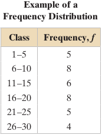

- The frequencies for each of the six classes are 5, 8, 6, 8, 5, and 4.
- Each class has a **lower class limit**, which is the least number that can belong to the class, and an **upper class limit**, which is the greatest number that can belong to the class.
- In the frequency distribution shown, the **lower class limits** are 1, 6, 11, 16, 21, and 26, and the **upper class limits** are 5, 10, 15, 20, 25, and 30.
- The **class width** is the distance between lower (or upper) limits of consecutive classes. For instance, the class width in the frequency distribution shown is 6 - 1 = 5.
- Notice that the **classes do not overlap**.

## Frequency Distributions and Their Graphs
### Frequency Distributions
- The difference between the maximum and minimum data entries is called the **range**.
- Suppose the maximum data entry is 29, and the minimum data entry is 1. The range then is $29 - 1 = 28$.

## Frequency Distributions and Their Graphs
### Frequency Distributions [Guidelines]
- Decide on the number of classes to include in the frequency distribution. The number of classes should be between 5 and 20; otherwise, it may be difficult to detect any patterns.
- Find the **class width** as follows. Determine the **range** of the data, divide the **range** by the **number of classes**, and round up to the next convenient number.
- Find the **class limits**. You can use the minimum data entry as the **lower limit** of the first class. To find the remaining lower limits, add the **class width** to the lower limit of the preceding class. Then find the upper limit of the first class. Remember that **classes cannot overlap**. Find the remaining upper class limits.
- Make a tally mark for each data entry in the row of the appropriate class.
- Count the tally marks to find the total frequency $f$ for each class.

## Frequency Distributions and Their Graphs
### Frequency Distributions [Example]
The data set lists the prices (in dollars) of 30 portable global positioning system (GPS) navigators. Construct a frequency distribution that has seven classes.

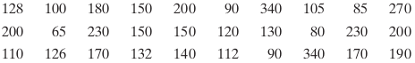

- $n\_classes = 7$
- $\begin{aligned} range &= max-min \\ &= 340-65 = 275 \end{aligned}$
- $\begin{aligned} class\_width &= \frac{range}{n\_classes} \\&= \frac{275}{7} \approx 40 \end{aligned}$

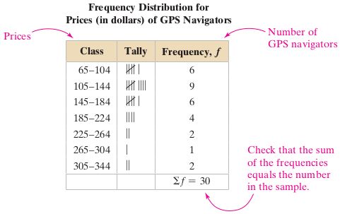

## Frequency Distributions and Their Graphs
### Frequency Distributions [Try It Yourself]
Construct a frequency distribution using the ages of the 50 most powerful women. Use seven classes.

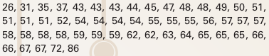 \

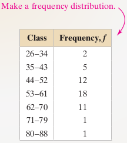

## Frequency Distributions and Their Graphs
### Frequency Distributions
- The **midpoint** of a class is the sum of the lower and upper limits of the class divided by two. The midpoint is sometimes called the **class mark**.
- $\begin{aligned} midpoint = \frac{lower\_limit + upper\_limit}{2} \end{aligned}$
- The **relative frequency** of a class is the portion, or percentage, of the data that falls in that class. To find the relative frequency of a class, divide the frequency $f$ by the sample size $n$.
- $\begin{aligned} relative\_frequency = \frac{class\_frequency}{sample\_size} = \frac{f}{n} \end{aligned}$
- The **cumulative frequency** of a class is the sum of the frequencies of that class and all previous classes. The cumulative frequency of the last class is equal to the sample size $n$.

## Frequency Distributions and Their Graphs
### Frequency Distributions [Example]
Using the frequency distribution constructed in the previous Example, find the midpoint, relative frequency, and cumulative frequency of each class. Describe any patterns.

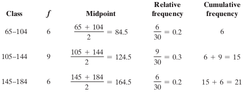 \


There are several patterns in the data set.

- The most common price range for GPS navigators is \$105 to \$144.
- Half of the GPS navigators cost less than \$145.

## Frequency Distributions and Their Graphs
### Graphs of Frequency Distributions
Sometimes it is easier to discover patterns of a data set by looking at a graph of the frequency distribution. One such graph is a **frequency histogram**.

## Frequency Distributions and Their Graphs
### Graphs of Frequency Distributions
A frequency histogram is a bar graph that represents the frequency distribution of a data set. A histogram has the following properties:

- The horizontal scale is quantitative and measures the data entries.
- The vertical scale measures the frequencies of the classes.
- Consecutive bars must touch.

Because consecutive bars of a histogram must touch, bars must begin and end at class boundaries instead of class limits. Class boundaries are the numbers that separate classes without forming gaps between them. For data that are integers, subtract 0.5 from each lower limit to find the lower class boundaries. To find the upper class boundaries, add 0.5 to each upper limit. The upper boundary of a class will equal the lower boundary of the next higher class.

## Frequency Distributions and Their Graphs
### Graphs of Frequency Distributions [Example]
Draw a frequency histogram for the frequency distribution in previous Example. Describe any patterns.

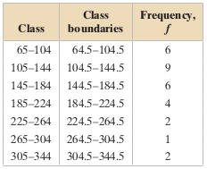 \

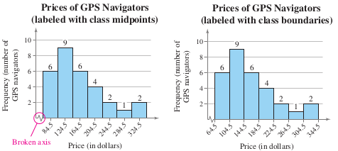

From either histogram, you can see that about two-thirds of the GPS navigators are priced below \$184.50.

## Frequency Distributions and Their Graphs
### Graphs of Frequency Distributions
- Another way to graph a frequency distribution is to use a **frequency polygon**.
- A **frequency polygon** is a line graph that emphasizes the continuous change in frequencies.
- A histogram and its corresponding frequency polygon are often drawn together.

## Frequency Distributions and Their Graphs
### Graphs of Frequency Distributions [Example]
Draw a frequency polygon for the frequency distribution in the previous Example. Describe any patterns.


- To construct the frequency polygon, use the same horizontal and vertical scales that were used in the histogram labeled with class midpoints.
- Then plot points that represent the midpoint and frequency of each class and connect the points in order from left to right with line segments.
- Because the graph should begin and end on the horizontal axis, extend the left side to one class width before the first class midpoint and extend the right side to one class width after the last class midpoint.

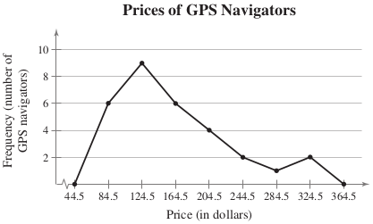

You can see that the frequency of GPS navigators increases up to a price of $124.50 and then decreases.

## Frequency Distributions and Their Graphs
### Graphs of Frequency Distributions
- A **relative frequency histogram** has the same shape and the same horizontal scale as the corresponding frequency histogram.
- The difference is that the vertical scale measures the **relative frequencies**, not frequencies.

## Frequency Distributions and Their Graphs
### Graphs of Frequency Distributions [Example]
Draw a relative frequency histogram for the frequency distribution in the previous Example.


- The relative frequency histogram is shown.
- Notice that the shape of the histogram is the same as the shape of the frequency histogram constructed in the previous Example.
- The only difference is that the vertical scale measures the relative frequencies.


From this graph, you can quickly see that 0.3 or 30% of the GPS navigators are priced between $104.50 and $144.50, which is not immediately obvious from the frequency histogram

## Frequency Distributions and Their Graphs
### Graphs of Frequency Distributions
- To describe the number of data entries that are less than or equal to a certain value, construct a **cumulative frequency graph**.
- A **cumulative frequency graph**, or **ogive**, is a line graph that displays the cumulative frequency of each class at its upper class boundary.
- The **upper boundaries** are marked on the **horizontal axis**, and the **cumulative frequencies** are marked on the **vertical axis**.

## Frequency Distributions and Their Graphs
### Graphs of Frequency Distributions [Example]
Draw an ogive for the frequency distribution in the previous Example.

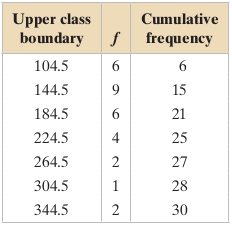

- Using the cumulative frequencies, you can construct the ogive shown.
- The upper class boundaries, frequencies, and cumulative frequencies are shown in the table.
- Notice that the graph starts at 64.5, where the cumulative frequency is 0, and the graph ends at 344.5, where the cumulative frequency is 30.

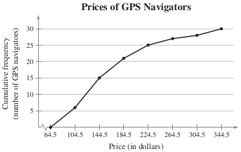

- From the ogive, you can see that 25 GPS navigators cost \$224.50 or less.
- Also, the greatest increase in cumulative frequency occurs between \$104.50 and \$144.50, because the line segment is steepest between these two class boundaries.

## Frequency Distributions and Their Graphs
### Exercises
Please refer to **page 49-54** of the textbook for exercises

## More Graphs and Displays
### Graphing Quantitative Data Sets
- In this section, you will learn a newer way to display quantitative data, called a **stem-and-leaf** plot.
- Stem-and-leaf plots are examples of **exploratory data analysis (EDA)**, which was developed by **John Tukey** in 1977.
- In a stem-and-leaf plot, each number is separated into a **stem** (for instance, the entry’s leftmost digits) and a **leaf** (for instance, the rightmost digit).
- A stem-and-leaf plot is similar to a histogram but has the advantage that the graph **still contains the original data**.
- Another advantage of a stem-and-leaf plot is that it provides an easy way to sort data.

## More Graphs and Displays
### Graphing Quantitative Data Sets [Example]
The data set lists the numbers of text messages sent last week by the cell phone users on one floor of a college dormitory. Display the data in a stem-and-leaf plot. Describe any patterns.

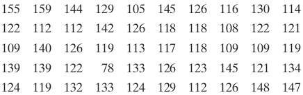

- Because the data entries go from a low of 78 to a high of 159, you should use stem values from 7 to 15.
- To construct the plot, list these stems to the left of a vertical line.
- For each data entry, list a leaf to the right of its stem.
- Make the plot with the leaves in increasing order from left to right.
- Be sure to include a key. This is done by showing an entry represented by a stem and one leaf.

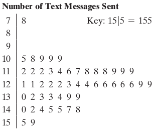

From the display, you can see that more than 50% of the cell phone users sent between 110 and 130 text messages.

## More Graphs and Displays
### Graphing Quantitative Data Sets [Example]
- Organize the data set in the previous Example using a stem-and-leaf plot that has two rows for each stem. Describe any patterns.
- Use the stem-and-leaf plot from the previous Example, except now list each stem twice.
- Use the leaves 0, 1, 2, 3, and 4 in the first stem row and the leaves 5, 6, 7, 8, and 9 in the second stem row.
- The revised stem-and-leaf plot is shown. Notice that by using two rows per stem, you obtain a more detailed picture of the data.

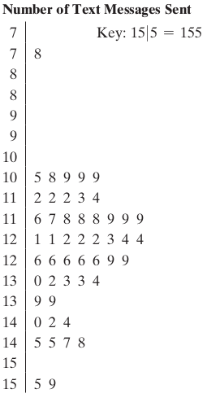

From the display, you can see that most of the cell phone users sent between 105 and 135 text messages.

## More Graphs and Displays
### Graphing Quantitative Data Sets
- You can also use a **dot plot** to graph quantitative data.
- In a **dot plot**, each data entry is plotted, using a point, above a horizontal axis.
- Like a stem-and-leaf plot, a dot plot allows you to see how data are distributed, to determine specific data entries, and to identify unusual data entries.

## More Graphs and Displays
### Graphing Quantitative Data Sets [Example]
Use a dot plot to organize the data set in the previous Example. Describe any patterns.


- So that each data entry is included in the dot plot, the horizontal axis should include numbers between 70 and 160.
- To represent a data entry, plot a point above the entry’s position on the axis.
- When an entry is repeated, plot another point above the previous point.

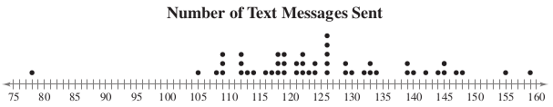

- From the dot plot, you can see that most entries cluster between 105 and 148 and the entry that occurs the most is 126.
- You can also see that 78 is an unusual data entry.

## More Graphs and Displays
### Graphing Qualitative Data Sets
- **Pie charts** provide a convenient way to present qualitative data graphically as percents of a whole.
- A **pie chart** is a circle that is divided into **sectors** that represent **categories**.
- The area of each sector is proportional to the frequency of each category.
- In most cases, you will be interpreting a pie chart or constructing one using technology.

## More Graphs and Displays
### Graphing Qualitative Data Sets [Examples]

The numbers of earned degrees conferred (in thousands) in 2011 are shown in the table. Use a pie chart to organize the data.

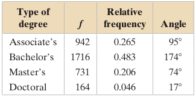

- Begin by finding the relative frequency, or percent, of each category.
- Then construct the pie chart using the central angle that corresponds to each category.
- To find the central angle, multiply 360° by the category’s relative frequency.

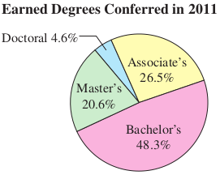

From the pie chart, you can see that almost one-half of the degrees conferred in 2011 were bachelor’s degrees.

## More Graphs and Displays
### Graphing Qualitative Data Sets
- Another way to graph qualitative data is to use a **Pareto chart**.
- A **Pareto chart** is a vertical bar graph in which the height of each bar represents **frequency** or **relative frequency**.
- The bars are positioned in order of decreasing height, with the tallest bar positioned at the left.
- Such positioning helps highlight important data and is used frequently in business.

## More Graphs and Displays
### Graphing Qualitative Data Sets [Example]
- In a recent year, the retail industry lost \$34.5 billion in inventory shrinkage.
- Inventory shrinkage is the loss of inventory through breakage, pilferage, shoplifting, and so on.
- The main causes of inventory shrinkage are administrative error (\$4.2 billion), employee theft (\$15.1 billion), shoplifting (\$12.3 billion), unknown (\$1.1 billion), and vendor fraud (\$1.7 billion).
- Use a Pareto chart to organize the data. Which causes of inventory shrinkage should retailers address first?

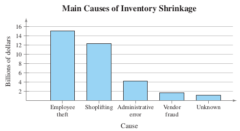

From the graph, it is easy to see that the causes of inventory shrinkage that should be addressed first are employee theft and shoplifting.

## More Graphs and Displays
### Graphing Paired Data Sets
- When each entry in one data set corresponds to one entry in a second data set, the sets are called **paired data sets**.
- For instance, a data set contains the costs of an item and a second data set contains sales amounts for the item at each cost.
- Because each cost corresponds to a sales amount, the data sets are paired.
- One way to graph **paired data sets** is to use a **scatter plot**, where the ordered pairs are graphed as points in a coordinate plane.
- A **scatter plot** is used to show the **relationship** between two **quantitative** variables.

## More Graphs and Displays
### Graphing Paired Data Sets [Example]
- The British statistician **Ronald Fisher** (see page 35) introduced a famous data set called Fisher’s **Iris data set**.
- This data set describes various physical characteristics, such as petal length and petal width (in millimeters), for three species of iris.
- In the scatter plot shown, the petal lengths form the first data set and the petal widths form the second data set.
- As the petal length increases, what tends to happen to the petal width?

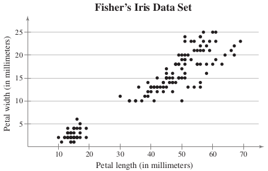

- The horizontal axis represents the petal length, and the vertical axis represents the petal width.
- Each point in the scatter plot represents the petal length and petal width of one flower.
- From the scatter plot, you can see that as the petal length increases, the petal width also tends to increase.

## More Graphs and Displays
### Graphing Paired Data Sets
- A data set that is composed of quantitative entries taken at **regular intervals** over a period of time is called a **time series**.
- You can use a time series chart to graph a time series.

## More Graphs and Displays
### Graphing Paired Data Sets [Example]
The table lists the number of cell phone subscribers (in millions) and subscribers’ average local monthly bills for service (in dollars) for the years 2002 through 2012. Construct a time series chart for the number of cellular subscribers. Describe any trends.

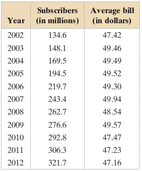

- Let the horizontal axis represent the years and let the vertical axis represent the number of subscribers (in millions).
- Then plot the paired data and connect them with line segments.

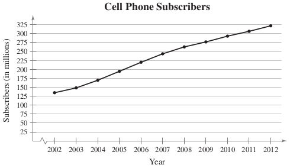

The graph shows that the number of subscribers has been increasing since 2002.

## More Graphs and Displays
### Exercises
Please refer to **page 62-66** of the textbook for exercises

## Measure of Central Tendency
### Mean, Median, and Mode
- A **measure of central tendency** is a value that represents a **typical**, or **central**, entry of a data set.
- The three most commonly used measures of central tendency are the **mean**, the **median**, and the **mode**.

## Measure of Central Tendency
### Mean, Median, and Mode
- The mean of a data set is the sum of the data entries divided by the number of entries.
- To find the mean of a data set, use one of these formulas:
- Population Mean: $\mu = \frac{\sum x}{N}$
- Sample Mean: $\bar{x} = \frac{\sum x}{n}$

## Measure of Central Tendency
### Mean, Median, and Mode [Example]
- The weights (in pounds) for a sample of adults before starting a weight-loss study are listed.
- What is the mean weight of the adults?
- $x = \{274,235,223,268,290,285,235\}$
- $\sum x = 274+235+223+268+290+285+235 = 1810$
- $\bar{x} = \frac{\sum x}{n} = \frac{1810}{7} \approx 258.6$

## Measure of Central Tendency
### Mean, Median, and Mode
- The **median** of a data set is the value that lies in the **middle** of the data when the data set is **ordered**.
- The **median** measures the **center of an ordered data** set by dividing it into two equal parts.
- When the data set has an **odd** number of entries, the median is the middle data entry. When the data set has an **even** number of entries, the median is the mean of the two middle data entries.

## Measure of Central Tendency
### Mean, Median, and Mode [Example]
- Find the median of the weights listed in the previous Example.
- $x = \{274,235,223,268,290,285,235\}$
- To find the median weight, first order the data.
- $x = \{223,235,235,268,274,285,290\}$
- Because there are seven entries (an **odd** number), the median is the middle, or fourth, entry. So, the median weight is 268 pounds.

## Measure of Central Tendency
### Mean, Median, and Mode [Example]
- In the previous Example, the adult weighting 285 pounds decides to not participate in the study. What is the median weight of the remaining adults?
- The remaining weights, in order, are:
- $x = \{223,235,235,268,274,290\}$
- Because there are six entries (an **even** number), the median is the mean of the two middle entries.
- $median = \frac{235 + 268}{2} = 251.5$
- So, the median weight of the remaining adults is 251.5 pounds.

## Measure of Central Tendency
### Mean, Median, and Mode
- The **mode** of a data set is the data entry that occurs with **the greatest frequency**.
- A data set can have one mode, more than one mode, or no mode.
- When no entry is repeated, the data set has no mode. When two entries occur with the same greatest frequency, each entry is a mode and the data set is called **bimodal**.

## Measure of Central Tendency
### Mean, Median, and Mode [Example]
- Find the mode of the weights listed below:
- $x = \{223,235,235,268,274,285,290\}$
- From the ordered data, you can see that the entry 235 occurs twice, whereas the other data entries occur only once. So, the mode of the weights is 235 pounds.

## Measure of Central Tendency
### Mean, Median, and Mode [Example]
At a political debate, a sample of audience members were asked to name the political party to which they belonged. Their responses are shown in the table. What is the mode of the responses?

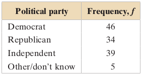

- The response occurring with the greatest frequency is Democrat. So, the mode is Democrat.
- In this sample, there were more Democrats than people of any other single affiliation.

## Measure of Central Tendency
### Mean, Median, and Mode
- Although the mean, the median, and the mode each describe a typical entry of a data set, there are advantages and disadvantages of using each.
- The mean is a reliable measure because it takes into account every entry of a data set.
- The mean can be greatly affected, however, when the data set contains **outliers**.
- While some outliers are valid data, other outliers may occur due to data-recording errors.
- A data set can have one or more outliers, causing gaps in a distribution.
- Conclusions that are drawn from a data set that contains outliers may be flawed.

## Measure of Central Tendency
### Mean, Median, and Mode [Example]
Find the mean, the median, and the mode of the sample ages of students in a class. Which measure of central tendency best describes a typical entry of this data set? Are there any outliers?

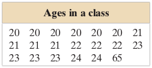

- Mean: $\bar{x} = \frac{\sum x}{n} = \frac{475}{20} \approx 23.8$
- Median: $median = \frac{21+22}{2} = 21.5$
- Mode: The entry occurring with the greatest frequency is 20 years.

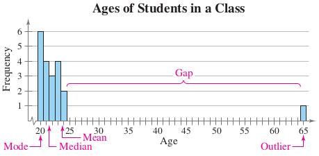

- The mean takes every entry into account but is influenced by the outlier of 65.
- The median also takes every entry into account, and it is not affected by the outlier.
- In this case the mode exists, but it does not appear to represent a typical entry.
- Sometimes a graphical comparison can help you decide which measure of central tendency best represents a data set.
- The histogram shows the distribution of the data and the locations of the mean, the median, and the mode. In this case, it appears that the median best describes the data set.

## Measure of Central Tendency
### Weighted Mean and Mean of Grouped Data
- Sometimes data sets contain entries that have a greater effect on the mean than do other entries.
- To find the mean of such a data set, you must find the **weighted mean**.
- A **weighted mean** is the mean of a data set whose entries have varying weights.
- The weighted mean: $\bar{x} = \frac{\sum (x . w)}{\sum w}$
- where $w$ is the weight of each entry $x$.

## Measure of Central Tendency
### Weighted Mean and Mean of Grouped Data [Example]
- You are taking a class in which your grade is determined from five sources: 50% from your test mean, 15% from your midterm, 20% from your final exam, 10% from your computer lab work, and 5% from your homework.
- Your scores are 86 (test mean), 96 (midterm), 82 (final exam), 98 (computer lab), and 100 (homework).
- What is the weighted mean of your scores? The minimum average for an A is 90. Did you get an A?

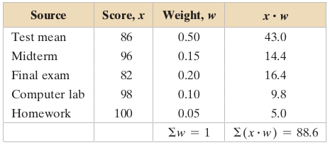

- $\bar{x} = \frac{\sum (x . w)}{\sum w} = \frac{88.6}{1} = 88.6$
- Your weighted mean for the course is 88.6.

## Measure of Central Tendency
### Weighted Mean and Mean of Grouped Data
- For data presented in a **frequency distribution**, you can approximate the mean as mean of a frequency distribution.
- The **mean of a frequency distribution** for a sample is approximated by:
- $\bar{x} = \frac{\sum (x . f)}{n}$
- note that $\sum f = n$
- where $x$ and $f$ are the **midpoint** and **frequency** of each class, respectively.
- midpoint of each class = $\frac{lower\_limit + upper\_limit}{2}$

## Measure of Central Tendency
### Weighted Mean and Mean of Grouped Data [Example]
Use the following frequency distribution to approximate the mean number of minutes that a sample of Internet subscribers spent online during their most recent session.

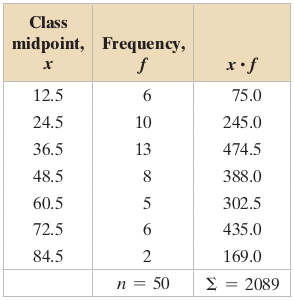

- $\bar{x} = \frac{\sum (x . f)}{n} = \frac{2089}{50} \approx 41.8$
- The mean time spent online was approximately 41.8 minutes.

## Measure of Central Tendency
### The Shapes of Distributions
A graph reveals several characteristics of a frequency distribution. One such characteristic is the shape of the distribution.

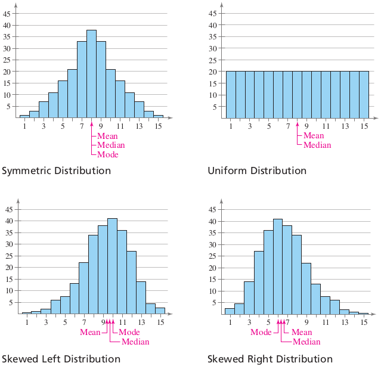

The mean will always fall in the direction in which the distribution is skewed. For instance, when a distribution is skewed left, the mean is to the left of the median.

## Measure of Central Tendency
### Exercises
Please refer to **page 74-80** of the textbook for exercises

## Measure of Variation
### Range
- The simplest measure of variation is the **range** of the data set.
- The **range** of a data set is the **difference** between the **maximum** and **minimum** data entries in the set.
- To find the range, the data must be **quantitative**.
- $range = max\_data\_entry - min\_data\_entry$

## Measure of Variation
### Range [Example]
Two corporations each hired 10 graduates. The starting salaries for each graduate are shown. Find the range of the starting salaries for Corporation A.

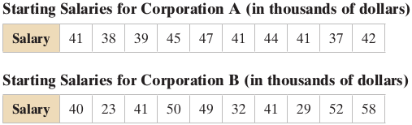

Ordering the data helps to find the least and greatest salaries.

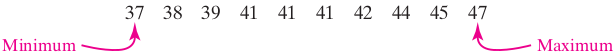

- $range = max\_salary - min\_salary = 47-37 = 10$
- So, the range of the starting salaries for Corporation A is 10, or \$10,000.

## Measure of Variation
### Variance and Standard Deviation
- As a measure of variation, the range has the advantage of being easy to compute. Its disadvantage, however, is that it uses only two entries from the data set.
- Two measures of variation that use all the entries in a data set are the **variance** and the **standard deviation**.
- The **deviation** of an entry $x$ in a population data set is the **difference** between the entry and the mean $\mu$ of the data set.
- Deviation of $x = x - \mu$

## Measure of Variation
### Variance and Standard Deviation
- Consider the starting salaries for Corporation A in the previous Example. The mean starting salary is $\mu = 415/10 = 41.5$, or \$41,500.
- The following table lists the **deviation** of each salary from the mean.

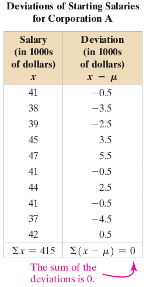

- Notice that the sum of the deviations is 0. In fact, the sum of the deviations for any data set is 0. So, it **does not make sense** to find the average of the deviations.

## Measure of Variation
### Variance and Standard Deviation
- To overcome this problem, take the square of each deviation. The sum of the squares of the deviations, or **sum of squares**, is denoted by $SS_x$.
In a **population data set**, the average of the squares of the deviations is the **population variance**.
- The **population variance** of a population data set of $N$ entries is:
- $\sigma^2 = \frac{\sum (x-\mu)^2}{N}$
- The symbol $\sigma$ is the lowercase Greek letter sigma.

## Measure of Variation
### Variance and Standard Deviation
- As a measure of variation, one disadvantage with the **variance** is that its **units are different** from the data set.
- To overcome this problem, take the square root of the variance to get the **standard deviation**.
- The **population standard deviation** of a population data set of $N$ entries is the square root of the **population variance**.
- $\sigma = \sqrt{\sigma^2} = \sqrt{\frac{\sum (x-\mu)^2}{N}}$

## Measure of Variation
### Variance and Standard Deviation
Here are some observations about the standard deviation.

- The standard deviation measures the variation of the data set about the mean and has the same units of measure as the data set.
- The standard deviation is always greater than or equal to 0. When $\sigma = 0$, the data set has no variation and all entries have the same value.
- As the entries get farther from the mean (that is, more spread out), the value of $\sigma$ increases.

## Measure of Variation
### Variance and Standard Deviation
Find the population variance and standard deviation of the starting salaries for Corporation A.

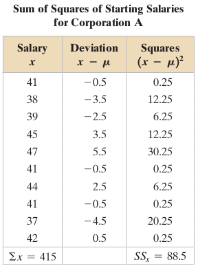

- For this data set,$N = 10$ and $\sum x = 415$.
- The mean is $\mu = \frac{415}{10} = 41.5$
- $\sigma^2 = \frac{88.5}{10} \approx 8.9$
- $\sigma = \sqrt{\frac{88.5}{10}} \approx 3.0$
- So, the population variance is about $8.9$, and the population standard deviation is about $3.0$, or \$3000.

## Measure of Variation
### Variance and Standard Deviation
- The **sample variance** and **sample standard deviation** of a sample data set of $n$ entries are listed below.
- Sample variance : $s^2 = \frac{\sum (x - \bar{x})^2}{n-1}$
- Sample standard deviation :  $s = \sqrt{s^2} = \sqrt{\frac{\sum (x - \bar{x})^2}{n-1}}$
- Why divide by one less than the number of entries?
- In many cases, a statistic is calculated to estimate the corresponding parameter, such as using $\bar{x}$ to estimate $\mu$.
Statistical theory has shown that the best estimates of $\sigma^2$ and $\sigma$ are obtained when dividing $SS_x$ by $n-1$ in the formulas for $s^2$ and $s$.

## Measure of Variation
### Variance and Standard Deviation
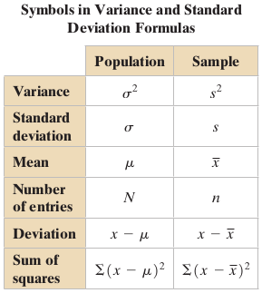

## Measure of Variation
### Variance and Standard Deviation [Example]
In a study of high school football players that suffered concussions, researchers placed the players in two groups. Players that recovered from their concussions in 14 days or less were placed in Group 1. Those that took more than 14 days were placed in Group 2. The recovery times (in days) for Group 1 are listed below. Find the **sample variance** and **standard deviation** of the recovery times.

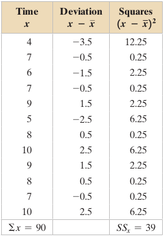

- For this data set, $n = 12$ and $\sum x = 90$.
- The mean is $\bar{x} = \frac{90}{12} = 7.5$.
- To calculate $s^2$ and $s$, note that $n - 1 = 12 - 1 = 11$.
- Sum of squares: $SS_x = 39$
- Sample variance: $s^2 = \frac{39}{11} \approx 3.5$
- Sample standard deviation: $s = \sqrt{\frac{39}{11}} \approx 1.9$
- So, the sample variance is about 3.5, and the sample standard deviation is about 1.9 days.

## Measure of Variation
### Interpreting Standard Deviation
- When interpreting the standard deviation, remember that it is a measure of the typical amount an entry deviates from the mean.
- The more the entries are spread out, the greater the standard deviation.

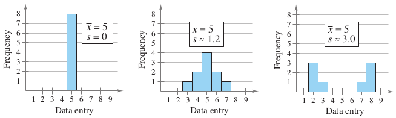

- You can use **standard deviation** to compare variation in data sets that use the same **units** of measure and have **means** that are about the same.

## Measure of Variation
### Interpreting Standard Deviation [Example]
Without calculating, estimate the population standard deviation of each data set.

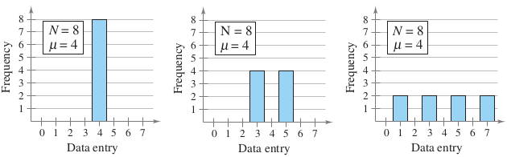

- Each of the eight entries is 4. The deviation of each entry is 0, so $\sigma=0$.
- Each of the eight entries has a deviation of $\pm 1$. So, the population standard deviation should be 1. By calculating, you can see that $\sigma=1$.
- Each of the eight entries has a deviation of $\pm 1$ or $\pm 3$. So, the population standard deviation should be about 2. By calculating, you can see that $\sigma$ is greater than 2, with $\sigma \approx 2.2$.

## Measure of Variation
### Interpreting Standard Deviation
- Data entries that lie more than two standard deviations from the mean are considered unusual, while those that lie more than three standard deviations from the mean are very unusual.
- Unusual and very unusual entries have a greater influence on the standard deviation than entries closer to the mean.
- This happens because the deviations are squared.
- Consider the following data entries:

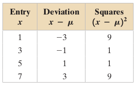

- The squares of the deviations of the entries farther from the mean (1 and 7) have a greater influence on the value of the standard deviation than those closer to mean (3 and 5).


## Measure of Variation
### Interpreting Standard Deviation
- Many real-life data sets have distributions that are approximately symmetric and bell-shaped.
- The **Empirical Rule** can help you see how valuable the standard deviation can be as a measure of variation.

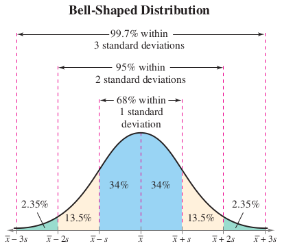

For data sets with distributions that are approximately symmetric and bell-shaped, the standard deviation has these characteristics:

- About 68% of the data lie within one standard deviation of the mean.
- About 95% of the data lie within two standard deviations of the mean.
- About 99.7% of the data lie within three standard deviations of the mean.

## Measure of Variation
### Interpreting Standard Deviation [Example]
In a survey conducted by the National Center for Health Statistics, the sample mean height of women in the United States (ages 20–29) was 64.2 inches, with a sample standard deviation of 2.9 inches. Estimate the percent of women whose heights are between 58.4 inches and 64.2 inches.

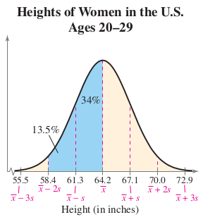

- Because the distribution is bell-shaped, you can use the **Empirical Rule**.
- The mean height is 64.2, so when you subtract two standard deviations from the mean height, you get:
- $\bar{x} - 2s = 64.2 - 2(2.9) = 58.4$
- Because 58.4 is two standard deviations below the mean height, the percent of the heights between 58.4 and 64.2 inches is about 13.5% + 34% = 47.5%.

## Measure of Variation
### Interpreting Standard Deviation
- The **Empirical Rule** applies only to (symmetric) **bell-shaped** distributions.
- What if the distribution is not bell-shaped, or what if the shape of the distribution is not known?
- The **Chebychev's theorem** gives an inequality statement that applies to
**all distributions**.
- It is named after the Russian statistician **Pafnuti Chebychev** (1821–1894).

## Measure of Variation
### Interpreting Standard Deviation
The **Chebychev's theorem** :

- The portion of any data set lying within $k$ standard deviations $(k > 1)$ of the mean is at least $1 - \frac{1}{k^2}$
- $k=2$: In any data set, at least $1 - \frac{1}{2^2} = \frac{3}{4}$, or 75%, of the data lie within 2 standard deviations of the mean.
- $k=3$: In any data set, at least $1 - \frac{1}{3^2} = \frac{8}{9}$, 88.9%, of the data lie within 3 standard deviations of the mean.

## Measure of Variation
### Interpreting Standard Deviation [Example]
The age distributions for New York and Alaska are shown in the histograms. Apply Chebychev’s Theorem to the data for New York using $k = 2$.

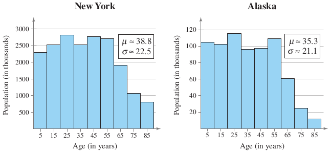

- The histogram on the left shows New York’s age distribution.
- Moving two standard deviations to the left of the mean puts you below 0, because $\mu - 2\sigma \approx 38.8 - 2(22.5) = -6.2$.
- Moving two standard deviations to the right of the mean puts you at $\mu + 2\sigma \approx 38.8 + 2(22.5) = 83.8$.
- By Chebychev’s Theorem, you can say that at least 75% of the population of New York is between 0 and 83.8 years old.
- In general, Chebychev’s Theorem gives the minimum percent of data entries that fall within the given number of standard deviations of the mean.
- Depending on the distribution, there is probably a higher percent of data falling in the given range.

## Measure of Variation
### Standard Deviation for Grouped Data
The formula for the sample standard deviation for a frequency distribution is:

- Sample standard deviation: $s = \sqrt{\frac{\sum (x-\bar{x})^2f}{n-1}}$
- where $n = \sum f$ is the number of entries in the data set.

## Measure of Variation
### Standard Deviation for Grouped Data [Example]
You collect a random sample of the number of children per household in a region. The results are shown in the following table.
Find the sample mean and the sample standard deviation of the data set.

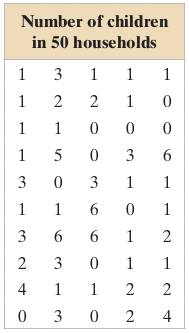

These data could be treated as 50 individual entries, and you could use the formulas for mean and standard deviation. Because there are so many repeated numbers, however, it is easier to use a frequency distribution.

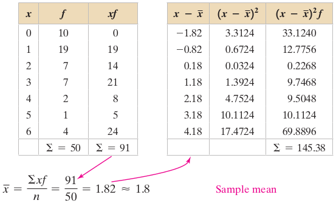

- Sample standard deviation: $s = \sqrt{\frac{\sum (x-\bar{x})^2f}{n-1}} = \sqrt{\frac{145.38}{49}} \approx 1.7$
- So, the sample mean is about 1.8 children, and the sample standard deviation is about 1.7 children.

## Measure of Variation
### Standard Deviation for Grouped Data
When a frequency distribution has classes, you can estimate the sample mean and the sample standard deviation by using the midpoint of each class.

## Measure of Variation
### Standard Deviation for Grouped Data [Example]
The following figure shows the results of a survey in which 1000 adults were asked how much they spend in preparation for personal travel each year.
Make a frequency distribution for the data. Then use the table to estimate the sample mean and the sample standard deviation of the data set.

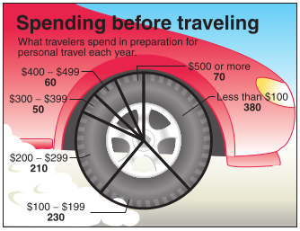

Begin by using a frequency distribution to organize the data.

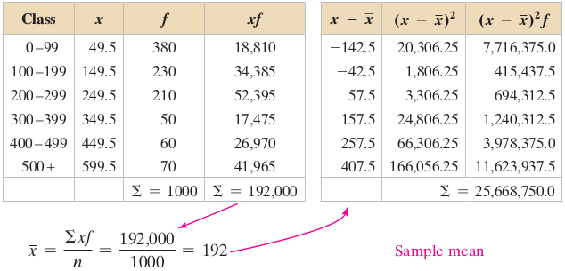)

- Sample standard deviation: $s=\sqrt{\frac{\sum (x-\bar{x})^2f}{n-1}} = \sqrt{\frac{25,668,750}{999}} \approx 160.3$
- So, the sample mean is $192 per year, and the sample standard deviation is about \$160.30 per year.

## Measure of Variation
### Coefficient of Variation
- To compare variation in different data sets, you can use standard deviation when the data sets use the same units of measure and have means that are about the
same.
- For data sets with **different units of measure** or **different means**, use the **coefficient of variation**.
- The **coefficient of variation (CV)** of a data set describes the standard deviation as a percent of the mean.
- Population: $CV = \frac{\sigma}{\mu}.100\%$
- Sample: $CV = \frac{s}{\bar{x}}.100\%$
- Note that the coefficient of variation measures the variation of a data set relative to the mean of the data.

## Measure of Variation
### Coefficient of Variation [Example]
The following table shows the population heights (in inches) and weights (in pounds) of the members of a basketball team. Find the coefficient of variation for the heights and the weights. Then compare the results.

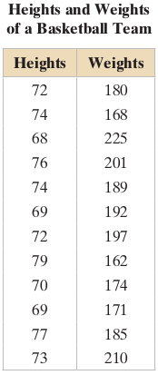

- The mean height is $\mu \approx 72.8$ inches with a standard deviation of $\sigma \approx 3.3$ inches. The coefficient of variation for the heights is:
- $CV_{height} = \frac{\sigma}{\mu}.100\% = \frac{3.3}{72.8}.100\% \approx 4.5\%$
- The mean weight is $\mu \approx 187.8$ pounds with a standard deviation of $\sigma \approx 17.7$ pounds. The coefficient of variation for the weights is:
- $CV_{weight} =  \frac{\sigma}{\mu}.100\% = \frac{17.7}{187.8}.100\% \approx 9.4\%$

## Measure of Variation
### Exercises
Please refer to **page 93-99** of the textbook for exercises

## Measure of Position
### Quartiles
- In this section, you will learn how to use **fractiles** to specify the position of a data entry within a data set.
- **Fractiles** are numbers that partition, or divide, an ordered data set into equal parts (each part has the same number of data entries).
- The three quartiles, $Q_1$ , $Q_2$ , and $Q_3$ , divide an ordered data set into four equal parts.
- About one-quarter of the data fall on or below the first quartile $Q_1$.
- About one-half of the data fall on or below the second quartile $Q_2$ (the second quartile is the same as the median of the data set).
- About three-quarters of the data fall on or below the third quartile $Q_3$.

## Measure of Position
### Quartiles [Example]
The number of nuclear power plants in the top 15 nuclear power-producing countries in the world are listed. Find the first, second, and third quartiles of the data set. What do you observe?

- 7, 20, 16, 6, 58, 9, 20, 50, 23, 33, 8, 10, 15, 16, 104
- First, order the data set and find the median $Q_2$.
- The first quartile $Q_1$ is the median of the data entries to the left of $Q_2$.
- The third quartile $Q_3$ is the median of the data entries to the right of $Q_2$.

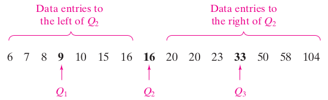

- About one-quarter of the countries have 9 or fewer nuclear power plants; about one-half have 16 or fewer; and about three-quarters have 33 or fewer.

## Measure of Position
### Quartiles
- The median (the second quartile) is a measure of central tendency based on position.
- A measure of variation that is based on position is the **interquartile range**.
- The **interquartile range** tells you the spread of the middle half of the data.
- The **interquartile range (IQR)** of a data set is a measure of variation that gives the range of the middle portion (about half) of the data.
- The IQR is the difference between the third and first quartiles.
- $IQR = Q_3 - Q_1$
- One way to identify outliers is to use the interquartile range.

## Measure of Position
### Quartiles
Using the Interquartile Range to Identify Outliers:

- Find the first ($Q_1$) and third ($Q_3$) quartiles of the data set.
- Find the interquartile range: $IQR = Q_3 - Q_1$
- Multiply $IQR$ by 1.5
- Substract $1.5(IQR)$ from $Q_1$. Any data entry less than $Q_1 - 1.5(IQR)$ is an outlier.
- Add $1.5(IQR)$ to $Q_3$. Any data entry greater than $Q_3 + 1.5(IQR)$ is an outlier.

## Measure of Position
### Quartiles [Example]
Find the interquartile range of the data set in the previous Example. Are there any outliers?


- $IQR = Q_3 - Q_1 = 33 - 9 = 24$
- $1.5(IQR) = 1.5(24) = 36$
- $Q_1 - 1.5(IQR) = 9-36 = -27$. A data entry less than -27 is an outlier.
- $Q_3 + 1.5(IQR) = 33+36 = 69$. A data entry greater than 69 is an outlier.
- So, 104 is an outlier.
- The number of power plants in the middle portion of the data set vary by at most 24. Notice that the outlier, 104, does not affect the IQR.

## Measure of Position
### Quartiles
- Another important application of quartiles is to represent data sets using **box-and-whisker** plots.
- A **box-and-whisker** plot (or **boxplot**) is an exploratory data analysis tool that highlights the important features of a data set.
- To graph a box-and-whisker plot, you must know these values:
  - The minimum entry
  - The median $Q_2$
  - The maximum entry
  - The first quartile $Q_1$
  - The third quartile $Q_3$
- These five numbers are called the **five-number summary** of the data set.

## Measure of Position
### Quartiles
Drawing a Box-and-Whisker Plot

- Find the five-number summary of the data set.
- Construct a horizontal scale that spans the range of the data.
- Plot the five numbers above the horizontal scale.
- Draw a box above the horizontal scale from $Q_1$ to $Q_3$ and draw a vertical line in the box at $Q_2$.
- Draw whiskers from the box to the minimum and maximum entries.

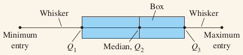

## Measure of Position
### Quartiles [Example]
Draw a box-and-whisker plot that represents the data set in the previous Example. What do you observe?


Here is the five-number summary of the data set.

- Minimum = 6
- $Q_1 = 9$
- $Q_2 = 16$
- $Q_3 = 33$
- $Maximum = 104$

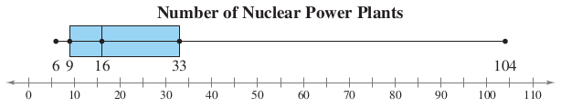

- The box represents about half of the data, which means about 50% of the data entries are between 9 and 33.
- The left whisker represents about one-quarter of the data, so about 25% of the data entries are less than 9.
- The right whisker represents about one-quarter of the data, so about 25% of the data entries are greater than 33.
- The length of the right whisker is much longer than the left one. This indicates that the data set has a possible outlier to the right.

## Measure of Position
### Percentiles and Other Fractiles
In addition to using quartiles to specify a measure of position, you can also use **percentiles** and **deciles**.

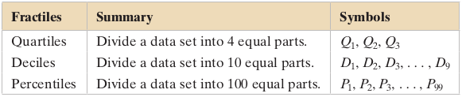

- Notice that the $25^{th}$ percentile is the same as $Q_1$ ; the $50^{th}$ percentile is the same as $Q_2$ , or the median; and the $75^{th}$ percentile is the same as $Q_3$.
- Percentiles are often used in education and health-related fields to indicate how one individual compares with others in a group.
- Percentiles can also be used to identify unusually high or unusually low values.
- Measurements in the $95^{th}$ percentile and above are unusually high, while those in the $5^{th}$ percentile and below are unusually low.

## Measure of Position
### Percentiles and Other Fractiles [Example]
The following ogive represents the cumulative frequency distribution for SAT scores of college-bound students in a recent year. What score represents the $62^{nd}$ percentile?

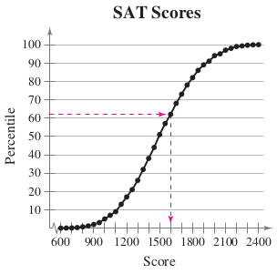

- From the ogive, you can see that the $62^{nd}$ percentile corresponds to a score of 1600.
- This means that approximately 62% of the students had an SAT score of 1600 or less.

## Measure of Position
### Percentiles and Other Fractiles
- In the previous Example, you used an ogive to approximate a data entry that corresponds to a percentile.
- You can also use an ogive to approximate a percentile that corresponds to a data entry.
- Another way to find a percentile is to use a formula.
- To find the **percentile that corresponds to a specific data entry $x$**, use the formula:
- $Percentile\_of\_x = \frac{number\_of\_data\_entries\_less\_than\_x}{total\_number\_of\_data\_entries}.100$

## Measure of Position
### Percentiles and Other Fractiles [Example]
For the data set in previous Example, find the percentile that corresponds to $30,000.

- Recall that the tuition costs are in thousands of dollars, so $30,000 is the data entry 30. Begin by ordering the data.

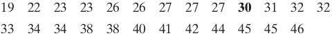

- There are 9 data entries less than 30 and the total number of data entries is 25.
- Percentile of 30 $= \frac{9}{25}.100 = 36$
- The tuition cost of $30,000 corresponds to the $36^{th}$ percentile.
- Interpretation: The tuition cost of $30,000 is greater than 36% of the other tuition costs.

## Measure of Position
### The Standard Score
- When you know the **mean** and **standard deviation** of a data set, you can measure the position of an entry in the data set with a **standard score**, or **z-score**.
- The **standard score**, or **z-score**, represents the number of standard deviations a value $x$ lies from the mean $\mu$. To find the **z-score** for a value, use the formula:
- $z = \frac{value - mean}{standard\_deviation} = \frac{x - \mu}{\sigma}$
- A z-score can be negative, positive, or zero.
- When $z$ is negative, the corresponding $x$-value is less than the mean.
- When $z$ is positive, the corresponding $x$-value is greater than the mean.
- For $z = 0$, the corresponding $x$-value is equal to the mean.
- A z-score can be used to identify an unusual value of a data set that is approximately bell-shaped.

## Measure of Position
### The Standard Score


- When a distribution is approximately **bell-shaped**, you know from the **Empirical Rule** that about 95% of the data lie within 2 standard deviations of the mean.
- When this distribution’s values are transformed to **z-scores**, about 95% of the **z-scores** should fall between -2 and 2.
- A **z-score** outside of this range will occur about 5% of the time and would be considered **unusual**.
- According to the **Empirical Rule**, a z-score less than -3 or greater than 3 would be **very unusual**, with such a score occurring about 0.3% of the time.

## Measure of Position
### The Standard Score [Example]
The mean speed of vehicles along a stretch of highway is 56 miles per hour with a standard deviation of 4 miles per hour. You measure the speeds of three cars traveling along this stretch of highway as 62 miles per hour, 47 miles per hour, and 56 miles per hour. Find the **z-score** that corresponds to each speed. Assume the distribution of the speeds is approximately **bell-shaped**.

- The z-score that corresponds to each speed is calculated below.


- From the z-scores, you can conclude that a speed of 62 miles per hour is 1.5 standard deviations above the mean;
- a speed of 47 miles per hour is 2.25 standard deviations below the mean;
- and a speed of 56 miles per hour is equal to the mean.
- The car traveling 47 miles per hour is said to be traveling unusually slow, because its speed corresponds to a z-score of -2.25.

## Measure of Position
### The Standard Score [Example]
The following table shows the mean heights and standard deviations for a population of men and a population of women. Compare the z-scores for a 6-foot-tall man and a 6-foot-tall woman. Assume the distributions of the heights are approximately bell-shaped. Note that 6 feet = 72 inches. Find the z-score for each height.

\


- The z-score for the 6-foot-tall man is within 1 standard deviation of the mean (69.9 inches). This is among the typical heights for a man.
- The z-score for the 6-foot-tall woman is about 3 standard deviations from the mean (64.3 inches). This is an unusual height for a woman.

## Measure of Position
### Exercises
Please refer to **page 109-113** of the textbook for exercises
