<style>
slides > slide { overflow: scroll; }
slides > slide:not(.nobackground):after {
  content: '';
}
</style>

```{r setup, include=FALSE}
knitr::opts_chunk$set(echo = FALSE)
```

## Basic Concepts of Probability and Counting
### Probability Experiments
- When weather forecasters say that there is a 90% chance of rain or a physician says there is a 35% chance for a successful surgery, they are stating the **likelihood**, or **probability**, that a specific event will occur.
- In the previous chapter, you learned about the role of the **descriptive** branch of statistics. The second branch, **inferential statistics**,
has **probability** as its foundation, so it is necessary to learn about probability before proceeding.
- A **probability experiment** is an action, or trial, through which specific results (counts, measurements, or responses) are obtained.
- The result of a single trial in a probability experiment is an **outcome**.
- The set of all possible outcomes of a probability experiment is the **sample space**.
- An **event** is a subset of the **sample space**. It may consist of one or more **outcomes**.

## Basic Concepts of Probability and Counting
### Probability Experiments [Example]
Here is a simple example of the use of the terms **probability experiment**, **sample space**, **event**, and **outcome**:

- Probability Experiment: Roll a six-sided die.
- Sample Space: {1, 2, 3, 4, 5, 6}
- Event: Roll an even number, {2, 4, 6}
- Outcome: Roll a 2, {2}

## Basic Concepts of Probability and Counting
### Probability Experiments [Example]
A **probability experiment** consists of tossing a coin and then rolling a six-sided die. Determine the number of **outcomes** and identify the **sample space**.

- There are two possible outcomes when tossing a coin: a head (H) or a tail (T).
- For each of these, there are six possible outcomes when rolling a die: 1, 2, 3, 4, 5, or 6.
- A **tree diagram** gives a visual display of the outcomes of a **probability experiment** by using branches that originate from a starting point.
- It can be used to find the number of **possible outcomes** in a **sample space** as well as **individual outcomes**.

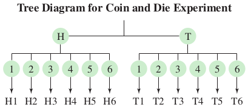

- From the tree diagram, you can see that the sample space has 12 outcomes.

## Basic Concepts of Probability and Counting
### Probability Experiments
- In the rest of this chapter, you will learn how to calculate the **probability** or **likelihood** of an event.
- **Events** are often represented by **uppercase letters**, such as A, B, and C.
- An event that consists of a **single outcome** is called a **simple event**.
- The event “tossing heads and rolling a 3” is a **simple event** and can be represented as A = {H3}.
- In contrast, the event “tossing heads and rolling an even number" is not simple because it consists of three possible outcomes and can be represented as B = {H2, H4, H6}.

## Basic Concepts of Probability and Counting
### Probability Experiments [Example]
Determine the number of **outcomes** in each **event**. Then decide whether each event is **simple** or not. Explain your reasoning.

- For quality control, you randomly select a machine part from a batch that has been manufactured that day. **Event A** is selecting a specific defective machine part.
- You roll a six-sided die. **Event B** is rolling at least a 4.

Solution

- **Event A** has only one outcome: choosing the specific defective machine part. So, the event is a **simple event**.
- **Event B** has three outcomes: rolling a 4, a 5, or a 6. Because the event has more than one outcome, it is **not simple**.

## Basic Concepts of Probability and Counting
### The Fundamental Counting Principle
- In some cases, an event can occur in so many different ways that it is **not practical** to write out all the outcomes.
- When this occurs, you can rely on the **Fundamental Counting Principle**.
- The **Fundamental Counting Principle** can be used to find the number of ways two or more events can occur in sequence.
- If one event can occur in $m$ ways and a second event can occur in $n$ ways, then the number of ways the two events can occur in sequence is $m.n$. This rule can be extended to any number of events occurring in sequence.

## Basic Concepts of Probability and Counting
### The Fundamental Counting Principle [Example]
You are purchasing a new car. The possible manufacturers, car sizes, and colors are listed:

- Manufacturer: Ford, GM, Honda
- Car size: compact, midsize
- Color: white (W), red (R), black (B), green (G)

How many different ways can you select one manufacturer, one car size, and one color? Use a tree diagram to check your result.

- There are three choices of manufacturers, two choices of car sizes, and four choices of colors.
- Using the **Fundamental Counting Principle**, you can determine that the number of ways to select one manufacturer, one car size, and one color is $3 \times 2 \times 4 = 24$ ways.

Using a tree diagram, you can see why there are 24 options.

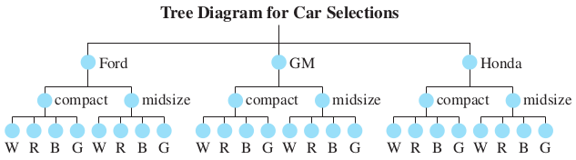

## Basic Concepts of Probability and Counting
### The Fundamental Counting Principle [Example]
The access code for a car’s security system consists of four digits. Each digit can be any number from 0 through 9.

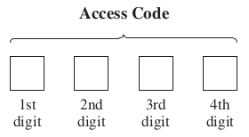

How many access codes are possible when

1. each digit can be used only once and not repeated?
2. each digit can be repeated?
3. each digit can be repeated but the first digit cannot be 0 or 1?

Solution

1. $10 \times 9 \times 8 \times 7 = 5040$
2. $10 \times 10 \times 10 \times 10 = 10^4 = 10000$
3. $8 \times 10 \times 10 \times 10 = 8000$

## Basic Concepts of Probability and Counting
### Types of Probability
- Probabilities can be written as fractions, decimals, or percents.
- The method you will use to calculate a probability depends on the type of probability.
- There are three types of probability: **classical probability**, **empirical probability**, and **subjective probability**.
- The probability that event **E** will occur is written as **P(E)** and is read as “the probability of event E.”
- **Classical** (or **theoretical**) probability is used when each outcome in a sample space is equally likely to occur. The classical probability for an event E is given by:

$P(E) = \frac{number\_of\_outcomes\_in\_event\_E}{total\_number\_of\_outcomes\_in\_sample\_space}$

## Basic Concepts of Probability and Counting
### Types of Probability [Example]
You roll a six-sided die. Find the probability of each event.

1. Event A: rolling a 3
2. Event B: rolling a 7
3. Event C: rolling a number less than 5

Solution:\
When a six-sided die is rolled, the sample space consists of six outcomes: $\{1, 2, 3, 4, 5, 6\}$.

1. $A = \{3\}$, so $P(A) = \frac{1}{6} \approx 0.167$
2. $B = \{\}$, so $P(B) = \frac{0}{6} = 0$
3. $C = \{1,2,3,4\}$, so $P(C) = \frac{4}{6} \approx 0.667$

## Basic Concepts of Probability and Counting
### Types of Probability
- When an experiment is repeated many times, regular patterns are formed.
- These patterns make it possible to find **empirical probability**.
- **Empirical probability** can be used even when each outcome of an event is not equally likely to occur.
- **Empirical** (or **statistical**) **probability** is based on observations obtained from **probability experiments**.
- The empirical probability of an event E is the **relative frequency** of event E.

$P(E) = \frac{frequency\_of\_event\_E}{total\_frequency} = \frac{f}{n}$

## Basic Concepts of Probability and Counting
### Types of Probability [Example]
A company is conducting an online survey of randomly selected individuals to determine how often they recycle. So far, 2451 people have been surveyed. The frequency distribution shows the results. What is the probability that the next person surveyed always recycles?

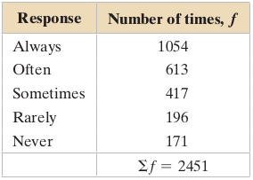

- The event is a response of “always.”
- The frequency of this event is 1054.
- Because the total of the frequencies is 2451, the empirical probability of the next person always recycling is:

$P(always) = \frac{1054}{2451} \approx 0.430$

## Basic Concepts of Probability and Counting
### Types of Probability [Example]
A company is conducting a phone survey of randomly selected individuals to determine the ages of social networking site users. So far, 975 social networking site users have been surveyed. The frequency distribution at the right shows the results. What is the probability that the next user surveyed is 23 to 35 years old?

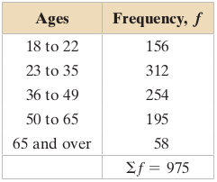

- The event is a response of “23 to 35 years old.”
- The frequency of this event is 312. Because the total of the frequencies is 975, the empirical probability that the next user is 23 to 35 years old is:

$P(age\_23\_to\_35) = \frac{312}{975} \approx 0.32$

## Basic Concepts of Probability and Counting
### Types of Probability

**Law of Large Number**: As an experiment is repeated over and over, the **empirical probability** of an event approaches the **theoretical** (**actual**) **probability** of the event.

- Suppose you want to determine the probability of tossing a head with a fair coin.
- You toss the coin 10 times and get 3 heads, so you obtain an empirical probability of $\frac{3}{10}$.
- Because you tossed the coin only a few times, your empirical probability is not representative of the **theoretical probability**, which is $\frac{1}{2}$.
- The **law of large numbers** tells you that the **empirical probability** after tossing the coin several thousand times will be very close to the **theoretical** or **actual probability**.

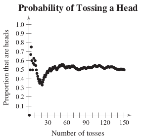

- The scatter plot at the left shows the results of simulating a coin toss 150 times.
- Notice that, as the number of tosses increases, the probability of tossing a head gets closer and closer to the **theoretical probability** of 0.5.

## Basic Concepts of Probability and Counting
### Types of Probability
- The third type of probability is **subjective probability**.
- **Subjective probabilities** result from **intuition**, **educated guesses**, and **estimates**.
- For instance, given a patient’s health and extent of injuries, a doctor may feel that the patient has a 90% chance of a full recovery. Or a business analyst may predict that the chance of the employees of a certain company going on strike is 0.25.

## Basic Concepts of Probability and Counting
### Types of Probability [Example]
Classify each statement as an example of classical probability, empirical
probability, or subjective probability. Explain your reasoning.

1. The probability that you will get an A on your next test is 0.9.
2. The probability that a voter chosen at random will be younger than 35 years
old is 0.3.
3. The probability of winning a 1000-ticket raffle with one ticket is $\frac{1}{1000}$.

Solution

1. This probability is most likely **based on an educated guess**. It is an example of **subjective probability**.
2. This statement is most likely **based on a survey of a sample of voters**, so it is an example of **empirical probability**.
3. Because you know the number of outcomes and each is equally likely, this is an example of **classical probability**.

## Basic Concepts of Probability and Counting
### Types of Probability
The probability of an event E is between 0 and 1, inclusive. That is:

$0 \leq P(E) \leq 1$

- When the probability of an event is 1, the event is certain to occur.
- When the probability of an event is 0, the event is impossible.
- A probability of 0.5 indicates that an event has an even chance of occurring or not occurring.

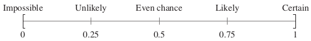

- An event that occurs with a probability of 0.05 or less is typically considered **unusual**.
- **Unusual events** are highly unlikely to occur.

## Basic Concepts of Probability and Counting
### Complementary Events
- The sum of the probabilities of all outcomes in a sample space is 1 or 100%.
- An important result of this fact is that when you know the probability of an event E, you can find the probability of the complement of event E.
- The **complement of event E** is the set of **all outcomes** in a **sample space** that are not included in event E.
- The **complement of event E** is denoted by **$E'$** and is read as “**E prime**.”


## Basic Concepts of Probability and Counting
### Complementary Events
- When you roll a die and let E be the event “the number is at least 5,” the complement of E is the event “the number is less than 5.”
- In symbols, $E = \{5, 6\}$ and $E' = \{1, 2, 3 ,4\}$.

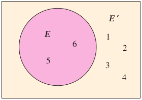

- The area of the rectangle represents the **total probability of the sample
space** (1 = 100%).
- The area of the circle represents the **probability of event E**,
- and the area outside the circle represents the **probability of the complement of event E**.

$P(E) + P(E') = 1$ \
$P(E) = 1 - P(E')$ \
$P(E') = 1 - P(E)$

## Basic Concepts of Probability and Counting
### Complementary Events [Example]
Use the frequency distribution in the previous Example to find the probability of randomly selecting a social networking site user who is not 23 to 35 years old.


$P(E) = \frac{312}{975} = 0.32$ \
$P(E') = 1-P(E) = 1-0.32 = 0.68$

## Basic Concepts of Probability and Counting
### Probability Applications [Example]
A **probability experiment** consists of **tossing a coin** and **spinning the spinner** shown below. The spinner is equally likely to land on each number. Use a **tree diagram** to find the probability of each event.


1. Event A: tossing a tail and spinning an odd number
2. Event B: tossing a head or spinning a number greater than 3

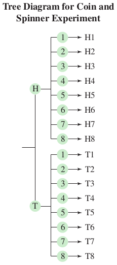

1. There are four outcomes in event $A = \{T1, T3, T5, T7\}$. So, $P(A) = \frac{4}{16} = 0.25$
2. There are 13 outcomes in event $B = \{H1, H2, H3, H4, H5, H6, H7, H8, T4, T5, T6, T7, T8\}$. SO, $P(B) = \frac{13}{16} \approx 0.813$

## Basic Concepts of Probability and Counting
### Probability Applications [Example]
Your college identification number consists of eight digits. Each digit can be 0 through 9 and each digit can be repeated. What is the probability of getting your college identification number when randomly generating eight digits?

- using the **Fundamental Counting Principle**, there are $10 \times 10 \times 10 \times 10 \times 10 \times 10 \times 10 \times 10 = 10^8 = 100,000,000$ possible identification numbers.
- But only one of those numbers corresponds to your college identification number.
- So, the probability of randomly generating 8 digits and getting your college identification number is $\frac{1}{10^8}$

## Basic Concepts of Probability and Counting
### Exercises
Please refer to **page 140-145** of the textbook for exercises

## Conditional Probability and the Multiplication Rule
### Conditional Probability
- A **conditional probability** is the probability of an event occurring, given that another event has already occurred.
- The conditional probability of event B occurring, given that event A has occurred, is denoted by $P(B|A)$ and is read as "probability of B given A".

## Conditional Probability and the Multiplication Rule
### Conditional Probability [Example]

Two cards are selected in sequence from a standard deck of 52 playing cards. Find the probability that the second card is a queen, given that the first card is a king. (Assume that the king is not replaced.)

- Because the first card is a king and is not replaced, the remaining deck has 51 cards, 4 of which are queens.
- $P(B|A) = \frac{4}{51} \approx 0.078$
- The probability that the second card is a queen, given that the first card is a king, is about 0.078.

## Conditional Probability and the Multiplication Rule
### Conditional Probability [Example]
The following table shows the results of a study in which researchers examined a child’s IQ and the presence of a specific gene in the child. Find the probability that a child has a high IQ, given that the child has the gene.

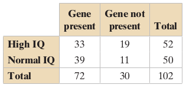

- There are 72 children who have the gene. So, the sample space consists of these 72 children, as shown at the left. Of these, 33 have a high IQ.
- $P(B|A) = \frac{33}{72} \approx 0.458$
- The probability that a child has a high IQ, given that the child has the gene, is about 0.458.

## Conditional Probability and the Multiplication Rule
### Independent and Dependent Events
- Two events are **independent** when the occurrence of one of the events does not affect the probability of the occurrence of the other event.
- Two events A and B are independent when:

$P(B|A) = P(B)$ or when $P(A|B) = P(A)$

- Events that are not independent are **dependent**.
- If $P(B) \ne P(B|A)$, then A and B are dependent events.

## Conditional Probability and the Multiplication Rule
### Independent and Dependent Events [Example]
Determine whether the events are independent or dependent.

1. Selecting a king (A) from a standard deck of 52 playing cards, not replacing it, and then selecting a queen (B) from the deck
2. Tossing a coin and getting a head (A), and then rolling a six-sided die and obtaining a 6 (B)
3. Driving over 85 miles (136.79 KM) per hour (A), and then getting in a car accident (B)

Solution

1. $P(B|A)=\frac{4}{51}$ and $P(B)=\frac{4}{52}$. The occurrence of A changes the probability of the occurrence of B, so the events are dependent.
2. $P(B|A)=\frac{1}{6}$ and $P(B)=\frac{1}{6}$. The occurrence of A does not change the probability of the occurrence of B, so the events are independent.
3. Driving over 85 miles per hour increases the chances of getting in an accident, so these events are dependent.

## Conditional Probability and the Multiplication Rule
### The Multiplication Rule
- To find the probability of two events occurring in sequence, you can use the **Multiplication Rule**.
- The probability that two events A and B will occur in sequence is $P(A\_and\_B) = P(A) . P(B|A)$
- If events A and B are independent, then the rule can be simplified to $P(A\_and\_B) = P(A).P(B)$. This simplified rule can be extended to any number of independent events.

## Conditional Probability and the Multiplication Rule
### The Multiplication Rule [Example]
Two cards are selected, without replacing the first card, from a standard deck of 52 playing cards. Find the probability of selecting a king and then selecting a queen.

- Because the first card is not replaced, the events are dependent.

$\begin{align} P(K\_and\_Q) &= P(K) . P(Q|K)\\
&= \frac{4}{52}.\frac{4}{51}\\
&= \frac{16}{2652} \approx 0.006 \end{align}$

- So, the probability of selecting a king and then a queen without replacement is about 0.006.

## Conditional Probability and the Multiplication Rule
### The Multiplication Rule [Example]
A coin is tossed and a die is rolled. Find the probability of tossing a head and then rolling a 6.

- The events are independent.

$\begin{align} P(H\_and\_6) &= P(H) . P(6)\\
&= \frac{1}{2}.\frac{1}{6}\\
&= \frac{1}{12} \approx 0.083 \end{align}$

- So, the probability of tossing a head and then rolling a 6 is about 0.083.
- Since 0.006 < 0.05, this means that selecting a king and then a queen (without replacement) from a standard deck is an unusual event.

## Conditional Probability and the Multiplication Rule
### The Multiplication Rule [Example]
For anterior cruciate ligament (ACL) reconstructive surgery, the probability that the surgery is successful, $P(S)$ is 0.95.

1. Find the probability that three ACL surgeries are successful.
2. Find the probability that none of the three ACL surgeries are successful.
3. Find the probability that at least one of the three ACL surgeries is successful.

 Solution

1. $P(S) = 0.95$\
  $\begin{align} P(three\_surgeries\_are\_successful) &= P(S).P(S).P(S)\\
  &=(0.95).(0.95).(0.95)\\
  &\approx 0.857 \end{align}$
2. $P(S') = 1-P(S) = 1-0.95 = 0.05$\
  $\begin{align} P(none\_of\_the\_three\_are\_successful) &= P(S').P(S').P(S')\\
  &=(0.05).(0.05).(0.05)\\
  &\approx 0.0001 \end{align}$
3. $P(none\_are\_successful) = 0.0001$\
  $\begin{align} P(at\_least\_one\_is\_successful) &= 1 - P(none\_are\_successful)\\
  &= 1-0.0001 = 0.9999 \end{align}$

## Conditional Probability and the Multiplication Rule
### The Multiplication Rule [Example]
About 16,500 U.S. medical school seniors applied to residency programs in 2012. Ninety-five percent of the seniors were matched with residency positions. Of those, 81.6% were matched with one of their top three choices. Medical students rank the residency programs in their order of preference, and program directors in the U.S. rank the students. The term “match” refers to the process whereby a student’s preference list and a program director’s preference list overlap, resulting in the placement of the student in a residency position.


1. Find the probability that a randomly selected senior was matched with a residency position and it was one of the senior’s top three choices.
2. Find the probability that a randomly selected senior who was matched with a residency position did not get matched with one of the senior’s top three choices.
3. Would it be unusual for a randomly selected senior to be matched with a residency position and that it was one of the senior’s top three choices?

Solution

- Let $A$ = {matched with residency position} and $B$ = {matched with one of top three choices}.
- $P(A)=0.95$ and $P(B|A)=0.816$

1. The events are dependent.\
  $P(A\_and\_B) = P(A).P(B|A) = (0.95).(0.816) \approx 0.775$
2. To find this probability, use the compliment. \
  $P(B'|A) = 1-P(B|A) = 1-0.816 = 0.184$
3. It is **not unusual** because the probability of a senior being matched with a residency position that was one of the senior’s top three choices is about 0.775, which is greater than 0.05. In fact, with a probability of 0.775, this event is **likely to happen**.

## Conditional Probability and the Multiplication Rule
### Exercises
Please refer to **page 152-156** of the textbook for exercises

## The Addition Rule
### Mutually Exclusive Events
Two events $A$ and $B$ are **mutually exclusive** when $A$ and $B$ cannot occur at the same time.

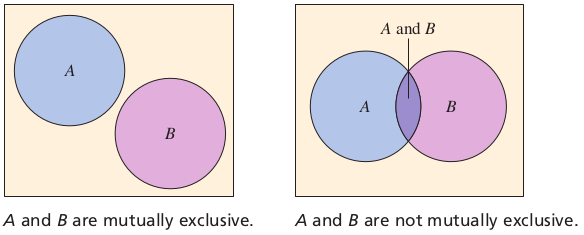

- The Venn diagrams show the relationship between events that are mutually exclusive and events that are not mutually exclusive.
- Note that when events $A$ and $B$ are mutually exclusive, they have no outcomes in common, so $P(A\_and\_B) = 0$.

## The Addition Rule
### Mutually Exclusive Events [Example]
Determine whether the events are mutually exclusive. Explain your reasoning.

1. Event $A$: Roll a 3 on a die.\
   Event $B$: Roll a 4 on a die.
2. Event $A$: Randomly select a male student.\
   Event $B$: Randomly select a nursing major.
3. Event $A$: Randomly select a blood donor with type O blood.\
   Event $B$: Randomly select a female blood donor.

Solution

1. The first event has one outcome, a 3. The second event also has one outcome, a 4. These outcomes cannot occur at the same time, so the events are mutually exclusive.
2. Because the student can be a male nursing major, the events are not mutually exclusive.
3. Because the donor can be a female with type O blood, the events are not mutually exclusive.

## The Addition Rule
### The Addition Rule
The probability that events $A$ or $B$ will occur, $P(A\_or\_B)$, is given by:

$P(A\_or\_B) = P(A)+P(B)-P(A\_and\_B)$

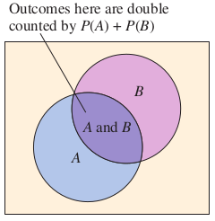

- If events $A$ and $B$ are **mutually exclusive**, then the rule can be simplified to $P(A\_or\_B) = P(A) + P(B)$.
- This simplified rule can be extended to any number of mutually exclusive events.

## The Addition Rule
### The Addition Rule [Example]
You select a card from a standard deck of 52 playing cards. Find the probability that the card is a 4 or an ace.


- If the card is a 4, it cannot be an ace. So, the events are mutually exclusive, as shown in the Venn diagram.
- The probability of selecting a 4 or an ace is:

$P(4\_or\_ace) = P(4)+P(ace) = \frac{4}{52}+\frac{4}{52} = \frac{8}{52} \approx 0.154$

## The Addition Rule
### The Addition Rule [Example]
You roll a die. Find the probability of rolling a number less than 3 or rolling an odd number.

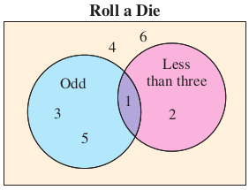

- The events are not mutually exclusive because 1 is an outcome of both events, as shown in the Venn diagram.
- So, the probability of rolling a number less than 3 or an odd number is:

$\begin{align}
P(less\_3\_or\_odd) &= P(less\_3) + P(odd) - P(less\_3\_and\_odd)\\
&= \frac{2}{6}+\frac{3}{6}-\frac{1}{6} \\
&= \frac{4}{6} \approx 0.667
\end{align}$

## The Addition Rule
### The Addition Rule [Example]
The frequency distribution shows volumes of sales (in dollars) and the number of months in which a sales representative reached each sales level during the past three years. Using this sales pattern, find the probability that the sales representative will sell between $75,000 and $124,999 next month.

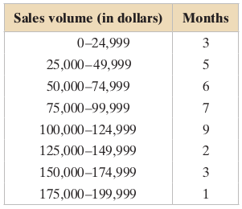

- $A$ = {monthly sales between \$75,000 and \$99,999}
- $B$ = {monthly sales between \$100,000 and \$124,999}
- Events $A$ and $B$ are mutually exclusive.

$P(A\_or\_B) = P(A)+P(B) = \frac{7}{36} + \frac{9}{36} = \frac{16}{36} \approx 0.444$

## The Addition Rule
### The Addition Rule [Example]
A blood bank catalogs the types of blood, including positive or negative Rh-factor, given by donors during the last five days. The number of donors who gave each blood type is shown in the table. A donor is selected at random.

1. Find the probability that the donor has type O or type A blood.
2. Find the probability that the donor has type B blood or is Rh-negative.

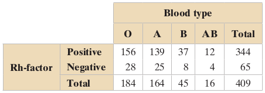

Solution

1. Because a donor cannot have type O blood and type A blood, these events are **mutually exclusive**. So, using the Addition Rule, the probability that a randomly chosen donor has type O or type A blood is:

$P(O\_or\_A) = P(O)+P(A) = \frac{184}{409} + \frac{164}{409} = \frac{348}{409} \approx 0.851$

2. Because a donor can have type B blood and be Rh-negative, these events are **not mutually exclusive**. So, using the Addition Rule, the probability that a randomly chosen donor has type B blood or is Rh-negative is:

$\begin{align}
P(B\_or\_Rneg) &= P(B) + P(Rneg) - P(B\_and\_Rneg)\\
&= \frac{45}{409} + \frac{65}{409} - \frac{8}{409}\\
&= \frac{102}{409} \approx 0.249
\end{align}$

## The Addition Rule
### A Summary of Probability
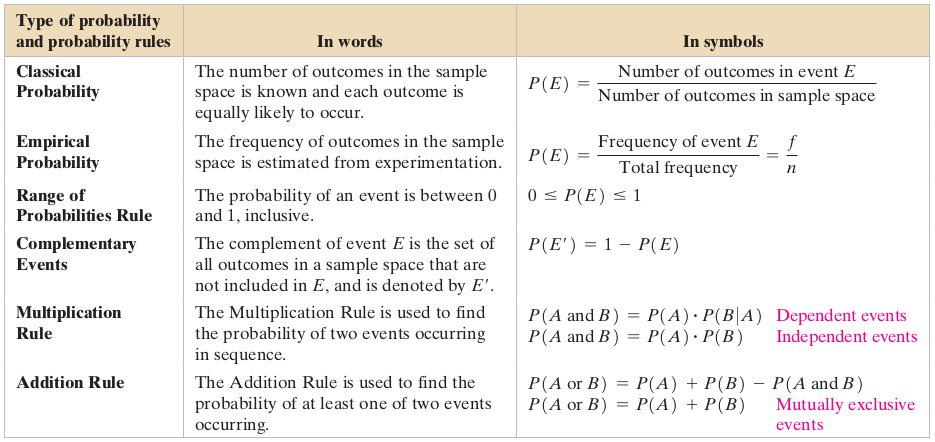

## The Addition Rule
### Exercises
Please refer to **page 162-167** of the textbook for exercises

## Additional Topics in Probability and Counting
### Permutations

- A **permutation** is an ordered arrangement of objects.
- The number of different permutations of $n$ distinct objects is $n!$.
- The expression $n!$ is read as **$n$ factorial**.
- If $n$ is a **positive integer**, then $n!$ is defined as follows:

$n! = n.(n-1).(n-2).(n-3)\dots 3.2.1$

- As a special case, $0!=1$.

## Additional Topics in Probability and Counting
### Permutations [Example]
The objective of a $9 \times 9$ Sudoku number puzzle is to fill the grid so that each row, each column, and each $3 \times 3$ grid contain the digits 1 to 9. How many different ways can the **first row** of a blank $9 \times 9$ Sudoku grid be filled?


- The number of permutations is $9!$
- $9! = 9 \times 8 \times 7 \times 6 \times 5 \times 4 \times 3 \times 2 \times 1 = 362,880$.
- So, there are 362,880 different ways the **first row** can be filled.

## Additional Topics in Probability and Counting
### Permutations
- You may want to choose some of the objects in a group and put them in order. Such an ordering is called a **permutation of $n$ objects taken $r$ at a time**.
- The number of permutations of $n$ distinct objects taken $r$ at a time is:

$_{n}P_{r} = \frac{n!}{(n-r)!}$ where $r \le n$.

## Additional Topics in Probability and Counting
### Permutations [Example]
Find the number of ways of forming four-digit codes in which no digit is repeated.

- To form a four-digit code with no repeating digits, you need to select 4 digits from a group of 10, so $n = 10$ and $r = 4$.

$\begin{align}
_{n}P_{r} &= \frac{n!}{(n-r)!}\\
 _{10}P_{4} &= \frac{10!}{(10-4)!}\\
 &= \frac{10!}{6!}\\
 &= \frac{10.9.8.7.6.5.4.3.2.1}{6.5.4.3.2.1}\\
 &= 5040
\end{align}$

## Additional Topics in Probability and Counting
### Permutations [Example]
Forty-three race cars started the 2013 Daytona 500. How many ways can the cars finish first, second, and third?

- You need to select three race cars from a group of 43, so $n = 43$ and $r = 3$.
- Because the order is important, the number of ways the cars can finish first, second, and third is:

$\begin{align}
_{n}P_{r} &= \frac{n!}{(n-r)!}\\
 _{43}P_{3} &= \frac{43!}{(43-3)!}\\
 &= \frac{43!}{40!}\\
 &= \frac{43.42.41.40!}{40!}\\
 &= 74,046
\end{align}$

- Notice that the **Fundamental Counting Principle** can be used to obtain the same result.
- There are 43 choices for first place, 42 choices for second place, and 41 choices for third place.
- So, there are $43 \times 42 \times 41 = 74,046$ ways the cars can finish first, second, and third.

## Additional Topics in Probability and Counting
### Permutations
- You may want to order a group of n objects in which some of the objects are the same.
- The number of **distinguishable permutations** of $n$ objects, where $n_1$ are of one type, $n_2$ are of another type, and so on, is:

$\frac{n!}{n_1!.n_2!.n_3! \dots n_k!}$ where $n_1+n_2+n_3+\dots +n_k = n$

## Additional Topics in Probability and Counting
### Permutations [Example]
Consider the group of letters AAAABBC.
This group has four A’s, two B’s, and one C.
How many ways can you order such a group?
Using the formula for $_{n}P_{r}$, you might conclude that there are $_{7}P_{7} = 7!$ possible orders.
However, because some of the objects are the same, not all of these permutations are **distinguishable**. How many **distinguishable permutations** are possible?

$\frac{7!}{4!.2!.1!} = \frac{7.6.5}{2} = 105$

## Additional Topics in Probability and Counting
### Permutations [Example]
A building contractor is planning to develop a subdivision. The subdivision is to consist of 6 one-story houses, 4 two-story houses, and 2 split-level houses. In how many distinguishable ways can the houses be arranged?

- There are to be 12 houses in the subdivision, 6 of which are of one type (one-story), 4 of another type (two-story), and 2 of a third type (split-level).

$\frac{12!}{6!.4!.2!} = \frac{12.11.10.9.8.7.6!}{6!.4!.2!} = 13,860$

- So, There are 13,860 distinguishable ways to arrange the houses in the subdivision.

## Additional Topics in Probability and Counting
### Combinations
- The number of ways to choose $r$ objects from $n$ objects without regard to order is called the number of **combinations of $n$ objects taken $r$ at a time**.
- The number of **combinations** of $r$ objects selected from a group of $n$ objects without regard to order is:

$_{n}C_{r} = \frac{n!}{(n-r)!.r!}$ where $r \le n$

## Additional Topics in Probability and Counting
### Combinations [Example]
- A state park manages five beaches labeled A, B, C, D, and E.
- Due to budget constraints, new restrooms will be built at only three beaches.
- There are **10** ways for the state to select the three beaches: ABC, ABD, ABE, ACD, ACE, ADE, BCD, BCE, BDE, CDE.
- In each selection, order does not matter (ABC is the same as BAC).

$_{5}C_{3} = \frac{5!}{(5-3)!.3!} = \frac{5.4.3!}{2!.3!} = \frac{20}{2} = 10$

## Additional Topics in Probability and Counting
### Combinations [Example]
A state’s department of transportation plans to develop a new section of interstate highway and receives 16 bids for the project. The state plans to hire four of the bidding companies. How many different combinations of four companies can be selected from the 16 bidding companies?

- The state is selecting four companies from a group of 16, so $n = 16$ and $r = 4$.
- Because order is not important, there are:

$\begin{align}
_{n}C_{r} &= \frac{n!}{(n-r)!.r!} \\
_{16}C_{4} &= \frac{16!}{(16-4)!.4!} \\
&= \frac{16!}{12!.4!} \\
&= \frac{16.15.14.13.12!}{12!.4!} = 1820
\end{align}$

- There are 1820 different combinations of four companies that can be selected from the 16 bidding companies.

## Additional Topics in Probability and Counting
### Applications of Counting Principles
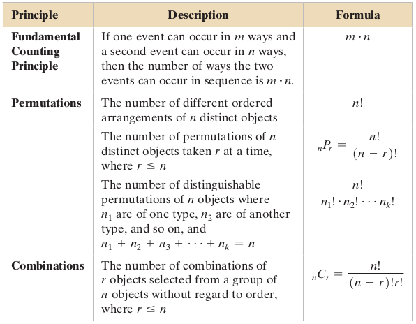

## Additional Topics in Probability and Counting
### Applications of Counting Principles [Example]
A student advisory board consists of 17 members. Three members serve as the board’s chair, secretary, and webmaster. Each member is equally likely to serve in any of the positions. What is the probability of selecting at random the three members who currently hold the three positions?

- Note that order is important because the positions (chair, secretary, and webmaster) are distinct objects.
- There is one favorable outcome and there are:

$_{17}P_{3} = \frac{17!}{(17-3)!} = \frac{17!}{14!} = \frac{17.16.15.14!}{14!} = 4080$

- So, the probability of correctly selecting the three members who hold each position is:

$P(selecting\_the\_three\_member) = \frac{1}{4080} \approx 0.0002$

## Additional Topics in Probability and Counting
### Applications of Counting Principles [Example]
Find the probability of being dealt 5 diamonds from a standard deck of 52 playing cards.

- In a standard deck of playing cards, 13 cards are diamonds.
- Note that it does not matter what order the cards are selected.
- The possible number of ways of choosing 5 diamonds out of 13 is $_{13}C_{5}$.
- The number of possible five-card hands is $_{52}C_{5}$.
- So, the probability of being dealt 5 diamonds is

$P(5\_diamonds) = \frac{_{13}C_{5}}{_{52}C_{5}} \approx 0.0005$

## Additional Topics in Probability and Counting
### Applications of Counting Principles [Example]
A food manufacturer is analyzing a sample of 400 corn kernels for the presence of a toxin. In this sample, three kernels have dangerously high levels of the toxin. Four kernels are randomly selected from the sample. What is the probability that exactly one kernel contains a dangerously high level of the toxin?

- Note that it does not matter what order the kernels are selected.
- The possible number of ways of choosing one toxic kernel out of three toxic kernels is $_{3}C_{1}$.
- The possible number of ways of choosing 3 nontoxic kernels from 397 nontoxic kernels is $_{397}C_{3}$.
- So, using the **Fundamental Counting Principle**, the number of
ways of choosing one toxic kernel and three nontoxic kernels is

$_{3}C_{1} \times _{397}C_{3} = 3 \times 10,349,790 = 31,049,370$,

- The number of possible ways of choosing 4 kernels from 400 kernels is $_{400}C_{4} = 1,050,739,900$.
- So, the probability of selecting exactly 1 toxic kernel is

$P(1\_toxic\_kernel) = \frac{_{3}C_{1} \times _{397}C_{3}}{_{400}C_{4}} = \frac{31,049,370}{1,050,739,900} \approx 0.030$

## Additional Topics in Probability and Counting
### Exercises
Please refer to **page 174-186** of the textbook for exercises
