<style>
slides > slide { overflow: scroll; }
slides > slide:not(.nobackground):after {
  content: '';
}
</style>

```{r setup, include=FALSE}
knitr::opts_chunk$set(echo = FALSE)
```

## Probability Distributions
### Random Variables
- A **random variable** $x$ represents a numerical value associated with each outcome of a probability experiment.
- The word **random** indicates that $x$ is determined by chance.
- There are two types of random variables: **discrete** and **continuous**.
- A random variable is **discrete** when it has a finite or countable number of possible outcomes that can be listed.
- A random variable is **continuous** when it has an uncountable number of possible outcomes, represented by an interval on a number line.
- When a random variable is **discrete**, you can list the possible values the variable can assume.
- However, it is impossible to list all values for a **continuous** random variable.

## Probability Distributions
### Random Variables [Example]
- Determine whether the random variable x is discrete or continuous. Explain
your reasoning.

1. Let $x$ represent the number of Fortune 500 companies that lost money in the previous year.
2. Let $x$ represent the volume of gasoline in a 21-gallon tank.

solution:

1. The number of companies that lost money in the previous year can be
counted: {0, 1, 2, 3, . . ., 500} So, $x$ is a discrete random variable.
2. The amount of gasoline in the tank can be any volume between 0 gallons and 21 gallons. So, $x$ is a continuous random variable.

## Probability Distributions
### Discrete Probability Distributions
- Each value of a discrete random variable can be assigned a probability.
- By listing each value of the random variable with its corresponding probability, you are forming a **discrete probability distribution**.
- A **discrete probability distribution** lists each possible value the random variable can assume, together with its probability.
- A discrete probability distribution must satisfy these conditions:
    - The probability of each value of the discrete random variable is between 0 and 1, inclusive. $0 \le P(x) \le 1$
    - The sum of all the probabilities is 1. $\sum P(x) = 1$
- Because probabilities represent relative frequencies, a discrete probability distribution can be graphed with a relative frequency histogram.

## Probability Distributions
### Discrete Probability Distributions
Let $x$ be a discrete random variable with possible outcomes $x_1, x_2,\dots, x_n$.

- Make a frequency distribution for the possible outcomes.
- Find the sum of the frequencies.
- Find the probability of each possible outcome by dividing its frequency by the sum of the frequencies.
- Check that each probability is between 0 and 1, inclusive, and that the sum of all the probabilities is 1.

## Probability Distributions
### Discrete Probability Distributions [Example]
An industrial psychologist administered a personality inventory test for passive-aggressive traits to 150 employees. Each individual was given a score from 1 to 5, where 1 is extremely passive and 5 is extremely aggressive. A score of 3 indicated neither trait. The results are shown at the left. Construct a probability distribution for the random variable x. Then graph the distribution using a histogram.

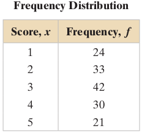

solution:

Divide the frequency of each score by the total number of individuals in the study to find the probability for each value of the random variable.

- $P(1)=\frac{24}{150}=0.16$ 
- $P(2)=\frac{33}{150}=0.22$  
- $P(3)=\frac{42}{150}=0.28$ 
- $P(4)=\frac{30}{150}=0.20$ 
- $P(5)=\frac{21}{150}=0.14$ 

The discrete probability distribution is shown in the table below.

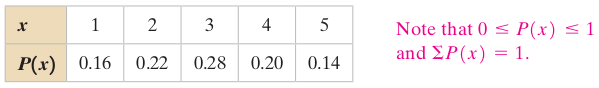\
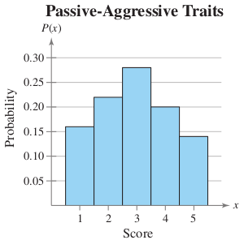

- Because the width of each bar is one, the area of each bar is equal to the probability of a particular outcome. 
- The probability of an event corresponds to the sum of the areas of the outcomes included in the event.
- the probability of the event “having a score of 2 or 3” is equal to the sum of the areas of the second and third bars: $0.22+0.28=0.50$

## Probability Distributions
### Discrete Probability Distributions [Example]
Verify that the distribution is a probability distribution.

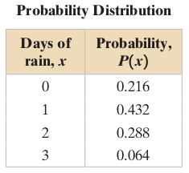

solution:

The distribution is a probability distribution:

- Each probability is between 0 and 1.
- $\sum P(x)=0.216+0.432+0.288+0.064=1$

## Probability Distributions
### Discrete Probability Distributions [Example]
Determine whether the distribution is a probability distribution. Explain your reasoning.

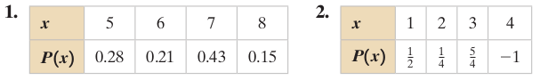

solution:

- Each probability is between 0 and 1, but the sum of all the probabilities is 1.07, which is greater than 1. So, it is not a probability distribution.
- The sum of all the probabilities is equal to 1, but $P(3)$ and $P(4)$ are not between 0 and 1. So, it is not a probability distribution. Probabilities can never be negative or greater than 1.

## Probability Distributions
### Mean, Variance, and Standard Deviation
- We can measure the center of a probability distribution with its mean and measure the variability with its variance and standard deviation.
- The mean of a discrete random variable is given by: 

$\mu = \sum xP(x)$

- Each value of x is multiplied by its corresponding probability and the products are added.
- The mean of a random variable represents the “theoretical average” of a probability experiment and sometimes is not a possible outcome. 
- The mean of the random variable of a probability distribution describes a typical outcome
- If the experiment were performed many thousands of times, then the mean of all the outcomes would be close to the mean of the random variable.

## Probability Distributions
### Mean, Variance, and Standard Deviation [Example]
The probability distribution for the personality inventory test for passive-aggressive traits discussed in the previous Example is shown. Find the mean score.

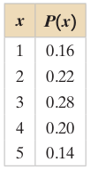\

solution:

Use a table to organize your work, as shown below. From the table, you can see that the mean score is $\mu = 2.94 \approx 2.9$. (Note that the mean is rounded to one more decimal place than the possible values of the random variable $x$.)

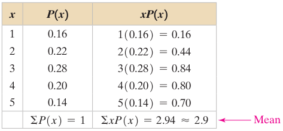\

interpretation:

Recall that a score of 3 represents an individual who exhibits neither passive nor aggressive traits and the mean is slightly less than 3. So, the mean personality trait is neither extremely passive nor extremely aggressive, but is slightly closer to passive.

## Probability Distributions
### Mean, Variance, and Standard Deviation
- To study the variation of the outcomes, you can use the variance and standard deviation of the random variable of a probability distribution.
- The variance of a discrete random variable is:

$\sigma^2 = \sum (x-\mu)^2 P(x)$

- The standard deviation is:

$\sigma = \sqrt{\sigma^2} = \sqrt{\sum(x-\mu)^2 P(x)}$

## Probability Distributions
### Mean, Variance, and Standard Deviation [Example]
The probability distribution for the personality inventory test for passive-aggressive traits discussed in the previoius example is shown. 
Find the variance and standard deviation of the probability distribution.


solution:

From the previous Example, you know that the mean of the distribution is $\mu = 2.94$. 
Use a table to organize your work, as shown below.

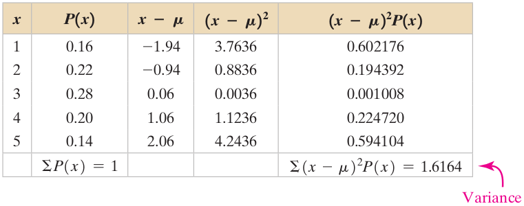

- So, the variance is $\sigma^2 = 1.6164 \approx 1.6$
- And the standard deviation is $\sigma = \sqrt{\sigma^2} = \sqrt{1.6164} \approx 1.3$

## Probability Distributions
### Expected Value
-The mean of a random variable represents what you would expect to happen over thousands of trials. It is also called the **expected value**.
- The expected value of a discrete random variable is equal to the mean of the random variable.

Expected Value = $E(x) = \mu = \sum xP(x)$

- Although probabilities can never be negative, the expected value of a random variable can be negative.
- In most applications, an expected value of 0 has a practical interpretation. For instance, in games of chance, an expected value of 0 implies that a game is fair. In a profit and loss analysis, an expected value of 0 represents the break-even point.

## Probability Distributions
### Expected Value [Example]

At a raffle, 1500 tickets are sold at \$2 each for four prizes of \$500, \$250, \$150, and \$75. You buy one ticket. What is the expected value of your gain?

solution:

- To find the gain for each prize, subtract the price of the ticket from the prize. For instance, your gain for the $500 prize is: \$500 - \$2 = \$498.
- and your gain for the \$250 prize is: \$250 - \$2 = \$248.
- Write a probability distribution for the possible gains (or outcomes). Note that a gain represented by a negative number is a loss.


- Then, using the probability distribution, you can find the expected value.

$$
\begin{aligned}
E(x) &= \sum xP(x) \\
     &= 498 . \frac{1}{1500} + 248 . \frac{1}{1500} + 148 . \frac{1}{1500} + 73 . \frac{1}{1500} + (-2) . \frac{1496}{1500} \\
     &= -1.35
\end{aligned}
$$

Interpretation:

Because the expected value is negative, you can expect to lose an average of \$1.35 for each ticket you buy.

## Probability Distributions
### Exercises
Please refer to **page 197-200** of the textbook for exercises

## Binomial Distribution
### Binomial Experiments
A binomial experiment is a probability experiment that satisfies these conditions:

- The experiment has a fixed number of trials, where each trial is independent of the other trials.
- There are only two possible outcomes of interest for each trial. Each outcome can be classified as a success (S) or as a failure (F).
- The probability of a success is the same for each trial.
- The random variable x counts the number of successful trials.

## Binomial Distribution
### Binomial Experiments

| Symbol |                                                Description                                               |                                                                               
|--------|----------------------------------------------------------------------------------------------------------|
| $n$      | The number of trials                                                                                     |
| $p$      | The probability of success in a single trial                                                             |
| $q$      | The probability of failure in a single trial $(q = 1 - p)$                                                 |
| $x$      | The random variable represents a count of the number of successes in n trials: $x = 0, 1, 2, 3, \dots , n$. |

## Binomial Distribution
### Binomial Experiments [Example]
- From a standard deck of cards, you pick a card, note whether it is a club or not, and replace the card. You repeat the experiment five times, so $n = 5$. 
- The outcomes of each trial can be classified in two categories: $S =$ selecting a club and $F =$ selecting another suit. 
- The probabilities of success and failure are: $p = \frac{1}{4}$ and $q = 1 - \frac{1}{4} = \frac{3}{4}$
- The random variable $x$ represents the number of clubs selected in the five trials. So, the possible values of the random variable are: 0, 1, 2, 3, 4, and 5.
- For instance, if $x = 2$, then exactly two of the five cards are clubs and the other three are not clubs. An example of an experiment with $x = 2$ is shown below. 
- Note that $x$ is a discrete random variable because its possible values can be counted.

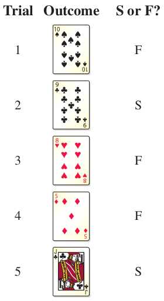

## Binomial Distribution
### Binomial Experiments [Example]
Determine whether the experiment is a binomial experiment. If it is, specify the values of $n$, $p$, and $q$, and list the possible values of the random variable $x$. If it is not, explain why.

- A certain surgical procedure has an 85% chance of success. A doctor performs the procedure on eight patients. The random variable represents the number of successful surgeries.
- A jar contains five red marbles, nine blue marbles, and six green marbles. You randomly select three marbles from the jar, without replacement. The random variable represents the number of red marbles.

solution:

- The experiment is a binomial experiment because it satisfies the four conditions of a binomial experiment. In the experiment, each surgery represents one trial. There are eight surgeries, and each surgery is independent of the others. There are only two possible outcomes for each surgery; either the surgery is a success or it is a failure. Also, the probability of success for each surgery is $0.85$. Finally, the random variable x represents the number of successful surgeries.

$n = 8$\
$p = 0.85$\
$q = 1-0.85 = 0.15$\
$x = 0, 1, 2, 3, 4, 5, 6, 7, 8$

- The experiment is not a binomial experiment because it does not satisfy all four conditions of a binomial experiment. In the experiment, each marble selection represents one trial, and selecting a red marble is a success. When the first marble is selected, the probability of success is $5/20$. However, because the marble is not replaced, the probability of success for subsequent trials is no longer $5/20$. So, the trials are not independent, and the probability of a success is not the same for each trial.

## Binomial Distribution
### Binomial Probability Formula
There are several ways to find the probability of $x$ successes in $n$ trials of a binomial experiment. One way is to use a tree diagram and the **Multiplication Rule**. Another way is to use the **binomial probability formula**.

$$
\begin{aligned}
P(x) &= C(n,x) p^{x} q^{n-x} \\
     &= \frac{n!}{(n-x)!x!} p^{x} q^{n-x}
\end{aligned}
$$
Note that the number of failures is $n-x$

## Binomial Distribution
### Binomial Probability Formula [Example]

Rotator cuff surgery has a 90% chance of success. The surgery is performed on three patients. Find the probability of the surgery being successful on exactly two patients.

solution:

**Method 1: Using tree diagram**

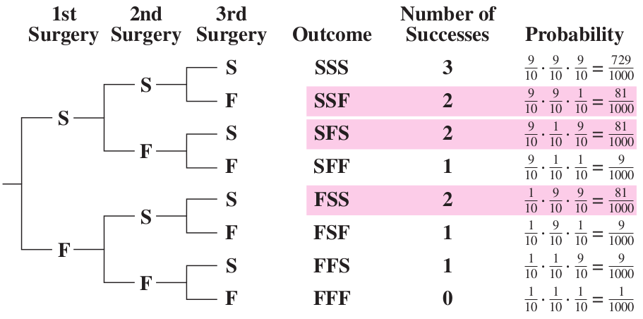

There are three outcomes that have exactly two successes, and each has a probability of $\frac{81}{1000}$. So, the probability of a successful surgery on exactly two patients is $3 \times \frac{81}{1000} = 0.243$.

**Method 2: Using binomial probability formula**

In this binomial experiment, the values of $n$, $p$, $q$, and $x$ are: 

$n = 3$\
$p = \frac{9}{10}$\
$q = \frac{1}{10}$\
$x = 2$\ 

The probability of exactly two successful surgeries is: 

$$
\begin{aligned}
P(x) &= C(n,x) p^{x} q^{n-x} \\
     &= \frac{n!}{(n-x)!x!} p^{x} q^{n-x}\\
     &= \frac{3!}{(3-2)!2!} \times \left( \frac{9}{10} \right) ^{2} \times \left( \frac{1}{10} \right) ^{(3-2)}\\
     &= 3 \times \left( \frac{81}{100} \right) \times \left( \frac{1}{10} \right)\\
     &= 0.243
\end{aligned}
$$

## Binomial Distribution
### Binomial Probability Formula [Example]
- In a survey, U.S. adults were asked to identify what devices they use to access social media. The results are shown in the figure. 
- Seven adults who participated in the survey are randomly selected and asked whether they use a cell phone to access social media. 
- Construct a binomial probability distribution for the number of adults who respond yes.


solution:

From the figure, you can see that 46% of adults use a cell phone to access social media. So, $p = 0.46$ and $q = 0.54$. Because $n = 7$, the possible values of $x$ are 0, 1, 2, 3, 4, 5, 6, and 7.

$P(0) = C(7,0) \times 0.46^0 \times 0.54^7 \approx 0.0134$\
$P(1) = C(7,1) \times 0.46^1 \times 0.54^6 \approx 0.0798$\
$P(2) = C(7,2) \times 0.46^2 \times 0.54^5 \approx 0.2040$\
$P(3) = C(7,3) \times 0.46^3 \times 0.54^4 \approx 0.2897$\
$P(4) = C(7,4) \times 0.46^4 \times 0.54^3 \approx 0.2468$\
$P(5) = C(7,5) \times 0.46^5 \times 0.54^2 \approx 0.1261$\
$P(6) = C(7,6) \times 0.46^6 \times 0.54^1 \approx 0.0358$\
$P(7) = C(7,7) \times 0.46^7 \times 0.54^0 \approx 0.0044$\

Notice in the table at the left that all the probabilities are between 0 and 1 and that the sum of the probabilities is 1.

## Binomial Distribution
### Finding Binomial Probabilities [Example]
A survey of U.S. adults found that 62% of women believe that there is a link between playing violent video games and teens exhibiting violent behavior. You randomly select four U.S. women and ask them whether they believe that there is a link between playing violent video games and teens exhibiting violent behavior. Find the probability that:

- exactly two of them respond yes 
- at least two of them respond yes 
- fewer than two of them respond yes

solution:

- $n=4$, $p=0.62$, $q=0.38$, and $x=2$, the probability that exactly two women will respond yes is: 

$P(2) = C(4,2) \times 0.62^2 \times 0.38^2 = 6 \times \times 0.62^2 \times 0.38^2 \approx 0.333$

- To find the probability that at least two women will respond yes, find the sum of $P(2)$, $P(3)$, and $P(4)$.

$P(2) = C(4,2) \times 0.62^2 \times 0.38^2 = 6 \times \times 0.62^2 \times 0.38^2 \approx 0.333044$
$P(3) = C(4,3) \times 0.62^3 \times 0.38^1 = 4 \times \times 0.62^3 \times 0.38^1 \approx 0.362259$
$P(4) = C(4,4) \times 0.62^4 \times 0.38^0 = 1 \times \times 0.62^4 \times 0.38^0 \approx 0.147763$

So, the probability that at least two will respond yes is:

$P(x \ge 2) = P(2)+P(3)+P(4) \approx 0.843$

- To find the probability that fewer than two women will respond yes, find the sum of $P(0)$ and $P(1)$.

$P(0) = C(4,0) \times 0.62^0 \times 0.38^4 = 1 \times \times 0.62^0 \times 0.38^4 \approx 0.020851$
$P(1) = C(4,1) \times 0.62^1 \times 0.38^3 = 4 \times \times 0.62^1 \times 0.38^3 \approx 0.136083$

So, the probability that fewer than two will respond yes is:

$P(x \lt 2) = P(0)+P(1) \approx 0.157$

## Binomial Distribution
### Graphing Binomial Distribution [Example]
About 60% of cancer survivors are ages 65 years and older. You randomly select six cancer survivors and ask them whether they are 65 years of age and older. Construct a probability distribution for the random variable $x$. Then graph the distribution.

solution:

To construct the binomial distribution, find the probability for each value of $x$.
Using $n = 6$, $p = 0.6$, and $q = 0.4$, you can obtain the following:

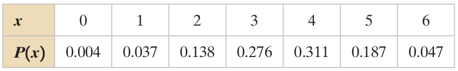

You can graph the probability distribution using a histogram as shown below.

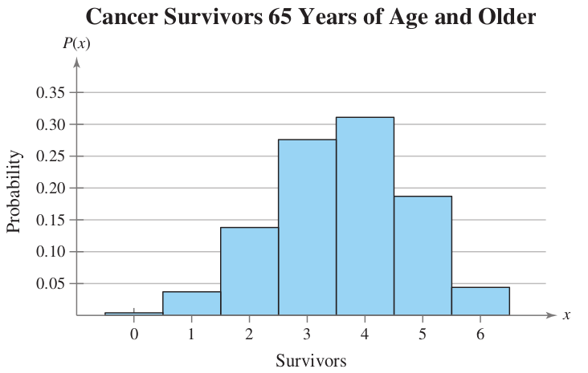

interpretation:

From the histogram, you can see that it would be unusual for none, only one, or all six of the survivors to be ages 65 years and older because of the low probabilities.

## Binomial Distribution
### Mean, Variance, and Standard Deviation
Population parameter of a Binomial Distribution can be formulated as:

- Mean: $\mu = np$
- Variation: $\sigma^{2} = npq$
- Standard Deviation: $\sigma = \sqrt{npq}$

## Binomial Distribution
### Mean, Variance, and Standard Deviation [Example]
In Pittsburgh, Pennsylvania, about 56% of the days in a year are cloudy. Find the mean, variance, and standard deviation for the number of cloudy days during the month of June. Interpret the results and determine any unusual values.

solution:

There are 30 days in June. Using $n = 30$, $p = 0.56$, and $q = 0.44$, you can find the mean, variance, and standard deviation as shown below.

- Mean: $\mu = np = 30 \times 0.56 = 16.8$
- Variation: $\sigma^{2} = npq = 30 \times 0.56 \times 0.44 \approx 7.4$
- Standard Deviation: $\sigma = \sqrt{npq} = \sqrt{30 \times 0.56 \times 0.44} \approx 2.7$

interpretation:

On average, there are $16.8$ cloudy days during the month of June. The standard deviation is about $2.7$ days. Values that are more than two standard deviations from the mean are considered unusual. Because $16.8 - 2(2.7) = 11.4$, a June with $11$ cloudy days or less would be unusual. Similarly, because $16.8 + 2(2.7) = 22.2$, a June with $23$ cloudy days or more would also be unusual.

## Binomial Distribution
### Exercises
Please refer to **page 210-215** of the textbook for exercises

## More Discrete Probability Distributions
### The Geometric Distribution
Many actions in life are repeated until a success occurs. For instance, you might have to send an e-mail several times before it is successfully sent. A situation such as this can be represented by a **geometric distribution**.

A geometric distribution is a discrete probability distribution of a random variable $x$ that satisfies these conditions:

- A trial is repeated until a success occurs.
- The repeated trials are independent of each other.
- The probability of success $p$ is the same for each trial.
- The random variable $x$ represents the number of the trial in which the first success occurs.

The probability that the first success will occur on trial number $x$ is:

$P(x) = pq^{x - 1}$ ,where $q = 1 - p$

## More Discrete Probability Distributions
### The Geometric Distribution [Example]
Basketball player LeBron James makes a free throw shot about 75% of the time. Find the probability that the first free throw shot he makes occurs on the third or fourth attempt.

solution:

To find the probability that he makes his first free throw shot on the third or fourth attempt, first find the probability that the first shot he makes will occur on the third attempt and the probability that the first shot he makes will occur on the fourth attempt. Then, find the sum of the resulting probabilities. 

Using $p = 0.75$, $q = 0.25$, and $x = 3$, you have:

$P(3) = 0.75(0.25)^{3 - 1} = 0.75(0.25)^{2} = 0.046875$

Using $p = 0.75$, $q = 0.25$, and $x = 4$, you have:

$P(4) = 0.75(0.25)^{4 - 1} = 0.75(0.25)^{3} \approx 0.011719$

So, the probability that he makes his first free throw shot on the third or fourth attempt is:

$P(shot\_made\_on\_third\_or\_fourth\_attempt) = P(3) + P(4) \approx 0.046875 + 0.011719 \approx 0.059$

## More Discrete Probability Distributions
### The Poisson Distribution
The Poisson distribution is a discrete probability distribution of a random variable $x$ that satisfies these conditions:

- The experiment consists of counting the number of times x an event occurs in a given interval. The interval can be an interval of time, area, or volume.
- The probability of the event occurring is the same for each interval.
- The number of occurrences in one interval is independent of the number of occurrences in other intervals.

The probability of exactly x occurrences in an interval is:

$P(x) = \frac{\mu^{x}e^{-\mu}}{x!}$

where $e$ is an irrational number approximately equal to $2.71828$ and $\mu$ is the mean number of occurrences per interval unit.

## More Discrete Probability Distributions
### The Poisson Distribution [Example]
The mean number of accidents per month at a certain intersection is three. What is the probability that in any given month four accidents will occur at this intersection?

solution:

Using $x = 4$ and $\mu = 3$, the probability that $4$ accidents will occur in any givenmonth at the intersection is:

$P(4) \approx \frac{3^{4}(2.71828)^{-3}}{4!} \approx 0.168$

## More Discrete Probability Distributions
### Summary of Discrete Probability Distributions
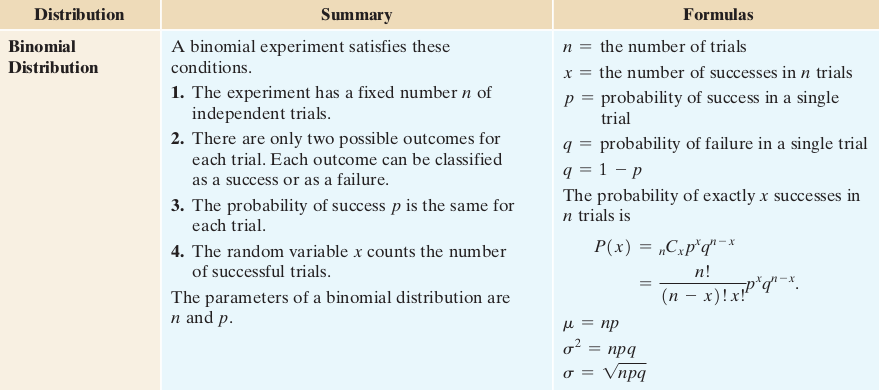

## More Discrete Probability Distributions
### Summary of Discrete Probability Distributions
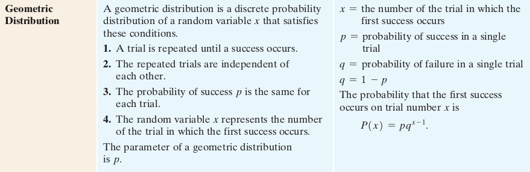

## More Discrete Probability Distributions
### Summary of Discrete Probability Distributions
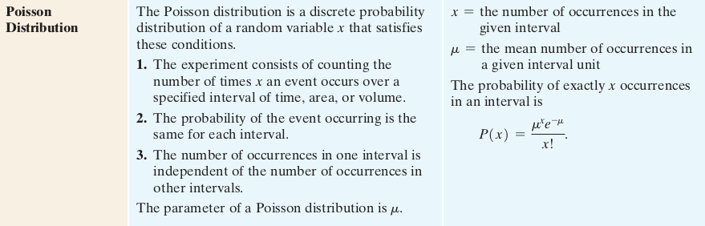

## More Discrete Probability Distributions
### Exercises
Please refer to **page 220-229** of the textbook for exercises